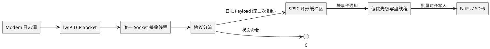
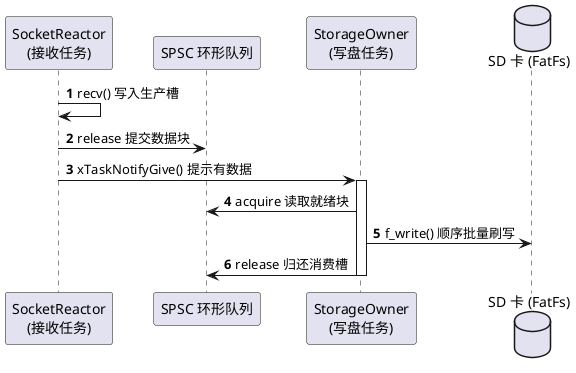
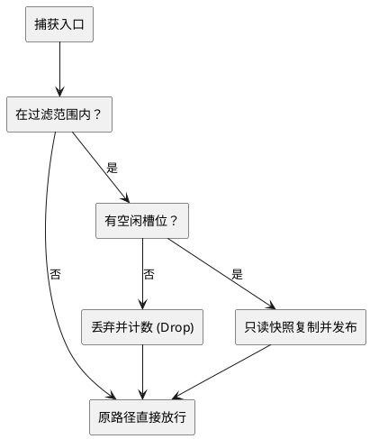

# Embedded Diagram & Code Highlighting Specification

本规范定义了知识库中技术文档、嵌入式系统与架构文档的 **PlantUML 流程图 / 架构图** 与 **代码高亮块 (Code Highlighting)** 的标准编写格式与工程约定。后续新增或维护任何文档时，必须遵循本规范。

---

## 1. PlantUML 流程图规范

### 1.1 触发与代码块标记

文档渲染引擎通过 Markdown 代码块语法提取与渲染 PlantUML 图表：

- **首选语言标签**:
  ````markdown
  ```plantuml
  @startuml
  ...
  @enduml
  ```
  ````
- **兼容标签**: 也支持 ```` ```puml ```` 或 ```` ```uml ````。
- **自动探测机制**: 即使未指定语言标签或为纯代码块，若内容首行包含 `@startuml`、`@startmindmap`、`@startwbs`、`@startgantt`、`@startjson`、`@startyaml`，系统亦会自动识别并交由 PlantUML 引擎渲染。

### 1.2 必备声明与全局样式

为保证嵌入式架构图在前端呈现出清晰、扁平、无多余拟物杂色及支持中英文排版的渲染效果，所有 PlantUML 块必须在 `@startuml` 后声明以下基准样式：

```plantuml
@startuml
hide stereotype
skinparam shadowing false
...
@enduml
```



- **`hide stereotype`**: 隐藏默认的 `<>` 或圆圈图标标记，保持简洁工程风格。
- **`skinparam shadowing false`**: 关闭默认发散阴影，保证 SVG 干净、边缘清晰。
- **中文字体支持**: 构建脚本会在预处理阶段自动注入 `skinparam defaultFontName "Noto Sans CJK SC"`，作者编写时无需硬编码本地字体路径。

### 1.3 典型图表范式

#### 范式 A: 模块拓扑与分层架构图 (Component / Architecture Diagram)

用于描述分层结构、核间通信通道、任务间数据流动：



#### 范式 B: 交互时序图 (Sequence Diagram)

用于任务间通知、网络握手、异常回退、生命周期转换：



#### 范式 C: 处理流水线与决策流 (State / Activity Flow)

描述接收报文过滤、配额校验及快照分支：



### 1.4 本地渲染验证与 CI 集成

- 图形预渲染脚本为 `scripts/render-plantuml.mjs`。
- 本地生成静态 SVG 缓存命令：
  ```bash
  npm run render:plantuml
  ```
- 产物存放于 `public/plantuml/<hash>.svg`，并生成 `public/plantuml/render-log.json`。

---

## 2. 代码高亮 (Code Highlighting) 规范

### 2.1 支持的语言体系与标准标签

前端渲染采用基于 `highlight.js` 的 `HighlightedCode` 组件，针对系统与嵌入式工程重点优化。所有代码块**必须**使用小写标准语言标识符：

| 语言 | 标注标签 | 适用场景 |
|---|---|---|
| **C** | ```` ```c ```` | 固件代码、驱动实现、lwIP 回调、FreeRTOS 任务函数、寄存器操作 |
| **C++** | ```` ```cpp ```` (或 ```` ```c++ ````) | 现代 C++ 诊断架构、RAII 封装、模板元编程、状态机设计 |
| **Rust** | ```` ```rust ```` | 嵌入式 Rust、安全内存管理模型 |
| **Go** | ```` ```go ```` | 后端服务、中间件、网关代理 |
| **Python** | ```` ```python ```` (或 ```` ```py ````) | 诊断脚本、数据分析工具、自动化测试用例 |
| **Shell / Bash** | ```` ```bash ```` (或 ```` ```sh ````) | 部署脚本、串口调试命令、编译指令 |
| **JSON** | ```` ```json ```` | 配置契约、API 响应载荷 |
| **YAML** | ```` ```yaml ```` | 部署配置、工作流、网关规则 |

> **禁止行为**:
> - 禁止使用无语言标记的裸代码块（```` ``` ````），这会导致语法高亮退化为纯文本且无法进行语言标签提示。
> - 禁止混合缩进（Tab 与 Space 混用），统一使用 4 格或 2 格空格缩进。

### 2.2 嵌入式 C / C++ 示例标准

#### C 代码块编写约定

- 包含标准原子头文件与固定宽度整型头文件（`<stdatomic.h>`, `<stdint.h>`, `<stdbool.h>`）。
- 明确标注内存对齐与内存屏障/并发语义。
- 注释精炼，使用中英文清晰标记生产者/消费者职责。

````markdown
```c
#include <stdatomic.h>
#include <stdint.h>
#include <stdbool.h>

#define LOG_RING_SIZE  (64U * 1024U)   /* 必须为 2 的幂 */
#define LOG_RING_MASK  (LOG_RING_SIZE - 1U)

typedef struct {
    _Alignas(32) uint8_t data[LOG_RING_SIZE];
    _Atomic uint32_t write_seq;  /* 仅生产者写 */
    _Atomic uint32_t read_seq;   /* 仅消费者写 */
} log_ring_t;

static log_ring_t g_log_ring;
```
````

#### C++ 代码块编写约定

- 显式声明 `noexcept`、`final`、`explicit`。
- 遵循单一职责与强类型语义，禁止裸指针悬空传递生命周期。

````markdown
```cpp
#include <cstdint>
#include <string_view>
#include <optional>

class DiagnosticApi final {
public:
    explicit DiagnosticApi(DiagnosticSystem& system) noexcept;
    ~DiagnosticApi() = default;

    DiagnosticApi(const DiagnosticApi&) = delete;
    DiagnosticApi& operator=(const DiagnosticApi&) = delete;

    SubmitResult try_submit(const CommandSpec& spec) noexcept;
    ResultStatus try_get_result(RequestId req_id, Result& out) noexcept;
};
```
````

---

## 3. 双语文档对齐与同步规范

针对任何嵌入式文档或系统设计章节：
1. **中英文对应**:
   - 中文文档命名: `index.zh.md` 或 `<title>.md`
   - 英文文档命名: `index.en.md` 或 `<title>.en.md`
2. **结构对称**:
   - 中英双语版本的章节序号、Section 划分（`§1`, `§2` 等）必须严格一一对应。
   - 包含的 PlantUML 图表与代码块在结构上须保持完全一致。
3. **内容有效性校验**:
   - 新增文档后必须运行 `npm run validate:content` 验证 Front-matter 与资源引用完整性。
