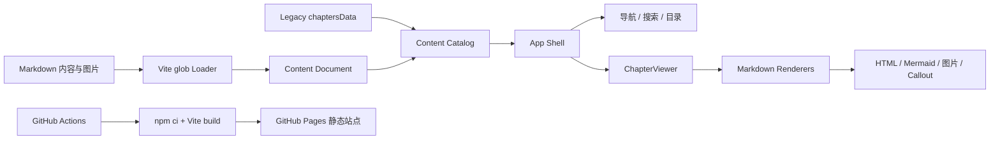

# System Design Notes

基于《System Design Interview — An Insider's Guide》Vol. 1、Vol. 2 的系统设计学习笔记与可视化阅读站点。

- 在线站点：[GitHub Pages](https://luckyJimLu.github.io/system-design-notes/)
- 原书课程：[ByteByteGo System Design Interview](https://bytebytego.com/courses/system-design-interview)
- 参考来源：[System Design Interview — Vol. 1 & Vol. 2](https://www.goodreads.com/book/show/54109255-system-design-interview-an-insider-s-guide)

项目采用 React + TypeScript + Vite 构建。内容以 Markdown 为主，WebUI 负责导航、搜索、目录、阅读状态和统一渲染。新增内容通常不需要修改 React 页面代码。

## 1. 整体架构



### 1.1 分层职责

| 层 | 主要目录 | 职责 |
| --- | --- | --- |
| 内容层 | `content/` | Markdown、front matter、图片和专题资料 |
| 内容适配层 | `src/content/` | 扫描、解析、校验、语言配对和目录聚合 |
| 兼容数据层 | `src/data/chaptersData.ts` | 保留尚未迁移的旧章节数据 |
| 应用壳层 | `src/App.tsx`、`src/components/` | hash 路由、导航、搜索、书签、阅读状态和布局 |
| 渲染层 | `src/renderers/`、`ChapterViewer.tsx` | Markdown 节点、Callout、文本流程图和 Mermaid 渲染 |
| 构建发布层 | `vite.config.ts`、`.github/workflows/` | 类型检查、内容校验、静态构建和 GitHub Pages 部署 |

应用壳层通过 `contentCatalog` 消费文档，不应直接依赖某个 Markdown 文件或手写章节标题。

```text
content/ + chaptersData.ts
        ↓
loader / parser / validator
        ↓
Content Catalog
        ↓
App Shell
        ↓
navigation / search / TOC / viewer
```

## 2. 内容加载机制

### 2.1 新内容：Front Matter 文档

自动加载器位于 `src/content/loader.ts`，当前匹配的文件模式是：

```text
content/**/index.zh.md
content/**/index.en.md
```

每个专题建议使用以下结构：

```text
content/
└── 40-your-topic/
    ├── index.zh.md
    ├── index.en.md
    └── images/
        └── architecture.png
```

文档应包含 front matter：

```md
---
id: your-topic
title: 中文标题
titleEn: English Title
order: 40
description: 文档摘要
tags: [分布式系统, 数据库]
---

# 正文标题

这里编写 Markdown 内容。
```

字段约定：

- `id`：稳定的逻辑标识，用于配对、路由和后续兼容；
- `title`：中文标题；`titleEn`：英文标题；
- `order`：导航排序值；
- `description`：摘要；
- `tags`：搜索和分类标签。

中文与英文文件使用相同的 `id` 配对。缺少某一语言时，站点仍可加载，但内容校验会给出 warning。

### 2.2 旧内容：兼容数据源

当前仓库仍有大量历史文件，例如：

```text
content/01. Scaling/Readme.md
content/01. Scaling/Readme.zh.md
```

这些文件不会被当前 `index*.md` Loader 自动发现，而是通过 `src/data/chaptersData.ts` 进入站点。迁移旧专题时，应转换为 `index.zh.md` / `index.en.md` 并补充 front matter；迁移完成后再从旧数据源移除对应条目。

## 3. 渲染与扩展边界

`ChapterViewer` 使用以下能力渲染正文：

- CommonMark / GFM Markdown；
- 标题、列表、表格、引用、代码块和行内代码；
- 相对路径图片与图片灯箱；
- Mermaid 图表；
- PlantUML 图表（代码块语言可使用 `plantuml`、`puml` 或 `uml`）；
- 受控的 `callout` 语义块；
- 文本流程图和内置 renderer registry。

PlantUML 图表默认通过 `https://www.plantuml.com/plantuml` 生成 SVG，并在浏览器中保留原始尺寸和横向滚动。部署到受限网络环境时，可通过 `VITE_PLANTUML_SERVER` 指向自建 PlantUML Server；服务不可用时页面会回退到可复制的源码视图。

内容文件只描述知识，不直接写 React/JSX。需要增加新的语义块时，应在 `src/renderers/` 中实现受控 renderer，再由注册表或 Markdown 映射接入。

`src/content/catalog.ts` 是应用层的统一内容边界：

```ts
contentCatalog.documents
contentCatalog.getById(id)
contentDiagnostics
```

它目前合并两类来源：

1. `src/data/chaptersData.ts` 中的 legacy documents；
2. `src/content/loader.ts` 导入的 front-matter documents。

这样可以在不破坏既有 hash 路由、书签和阅读进度的前提下逐步迁移内容。

## 4. 新增内容工作流

1. 在 `content/` 下创建专题目录。
2. 添加 `index.zh.md`，需要英文时再添加 `index.en.md`。
3. 写入稳定 `id`、`order` 和标题元数据。
4. 图片放在当前专题目录的 `images/` 下，并使用相对路径引用。
5. 运行内容校验和 TypeScript 检查。
6. 在开发服务器中刷新页面确认导航、搜索、目录和正文渲染。

图片示例：

```md

```

Callout 示例：

````md
```callout
type=warning title="注意"
这里是需要重点关注的内容。
```
````

可用类型包括 `info`、`warning`、`danger` 和 `success`。

## 5. 开发、校验与发布

### 本地开发

```bash
npm ci
npm run dev
```

开发服务器默认监听 `0.0.0.0:3000`。Vite 会在开发过程中处理匹配的 Markdown 模块；新增或修改内容后，若文件未被热更新识别，刷新页面或重启开发服务器即可。

### 发布前检查

```bash
npm run validate:content
npm run lint
npm run build
```

- `validate:content`：检查 front matter、ID、语言配对、排序和本地图片引用；
- `lint`：执行 `tsc --noEmit`；
- `build`：先校验内容，再生成 `dist/` 静态资源。

### CI/CD

`.github/workflows/deploy-pages.yml` 在 `main` 分支变更或手动触发时执行：

```text
Checkout
  → Setup Node 24
  → Ensure lockfile
  → npm ci
  → npm run build
  → Upload Pages artifact
  → Deploy GitHub Pages
```

正常情况下应提交 `package-lock.json`，以保证 CI 的确定性安装。如果工作树缺少锁文件，CI 会先生成锁文件，再执行 `npm ci`。

## 6. 仓库结构

```text
.
├── content/                  # Markdown 内容、图片和专题资料
├── src/
│   ├── App.tsx               # 应用壳层与页面状态
│   ├── components/           # 导航、搜索、阅读器等 UI
│   ├── content/              # 内容加载、解析、目录和诊断
│   ├── data/                 # legacy 数据和静态资源数据
│   ├── renderers/            # 语义块和特殊内容 renderer
│   └── utils/                # 通用工具
├── scripts/
│   └── validate-content.mjs  # 内容质量检查
├── docs/                     # 架构设计和演进说明
├── public/                   # 静态入口和 GitHub Pages 回退页
├── package.json              # 脚本与依赖
├── package-lock.json         # npm 可复现安装锁文件
└── vite.config.ts            # Vite 与 GitHub Pages 配置
```

## 7. 架构演进方向

当前系统处于“legacy 数据源 + front matter 内容源”的迁移阶段。后续可沿以下方向演进：

- 将 `chaptersData.ts` 中的章节逐步迁移到 `content/`；
- 将目录、搜索和 headings 索引从统一 `ContentDocument` 模型生成；
- 扩展受控语义块，例如 comparison、checklist 和 diagram；
- 在需要用户上传内容时，再增加服务端或 Worker 导入层；
- 保持内容层不依赖 React，避免把文档变成不可移植的可执行代码。

详细设计见：[内容驱动渲染架构](./docs/content-driven-rendering-architecture.md)。

## 8. 相关资料

- [shiji-kb](https://github.com/baojie/shiji-kb)
- [嵌入式系统总目录](./content/29.%20embedded-systems/README.md)
- [RTOS 研究报告](./content/29.%20embedded-systems/rtos/resource-constrained-embedded-rtos-architecture.md)
- [lwIP TCP/IP 协议栈](./content/29.%20embedded-systems/networking/lwip-tcpip-deepwiki.md)
- [Modem / 网络诊断](./content/29.%20embedded-systems/modemlog/README.md)
- [速率限制器补充资料](https://martinfowler.com/bliki/CircuitBreaker.html)
- [一致性哈希补充资料](https://tom-e-white.com/2007/11/consistent-hashing.html)

> 本项目是个人学习笔记，内容持续整理中。涉及原书内容时请以原书和官方资料为准。
