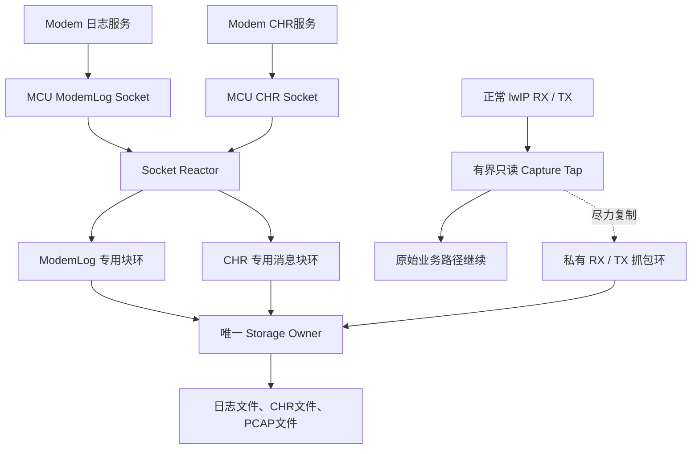
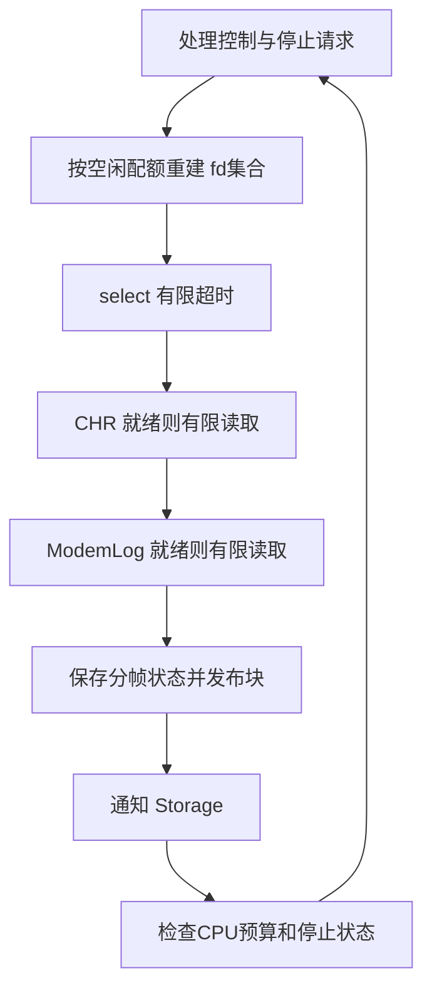
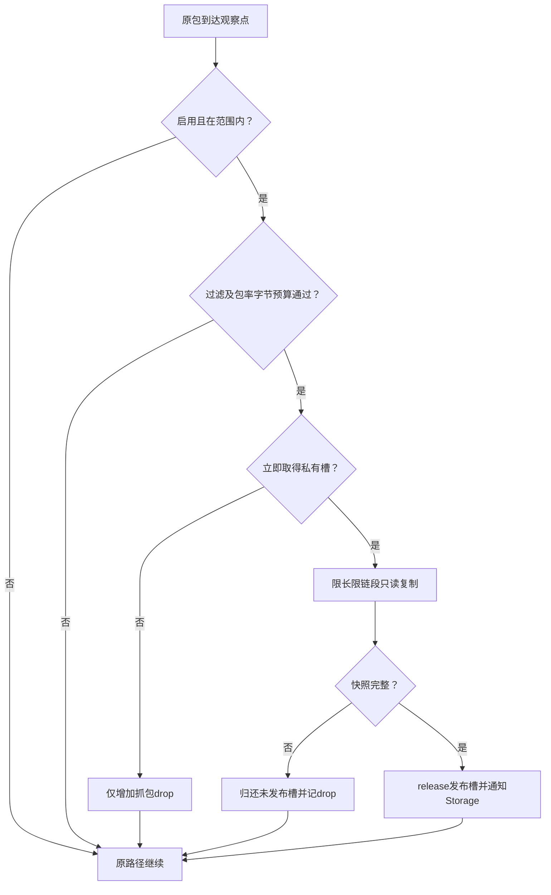
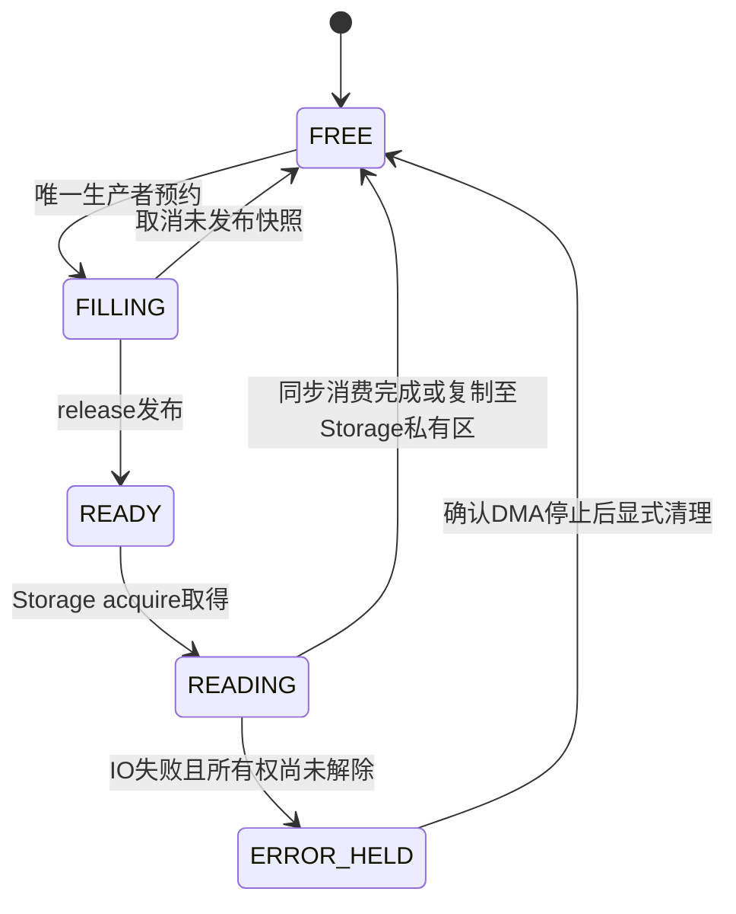
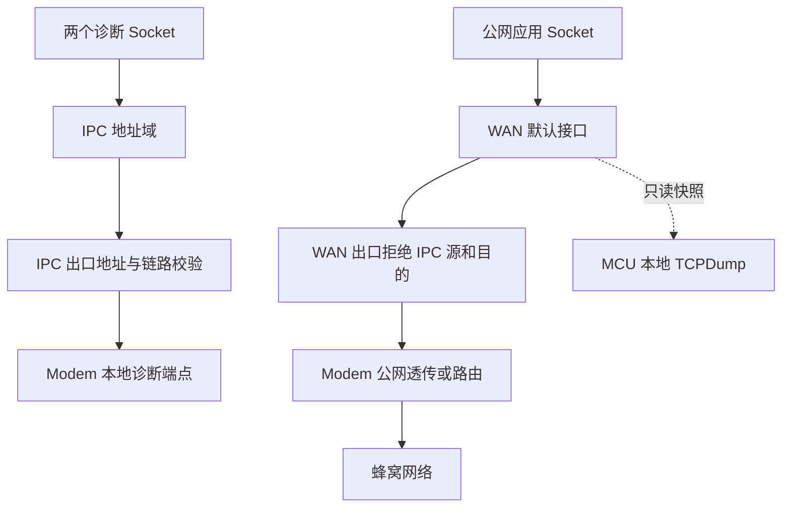
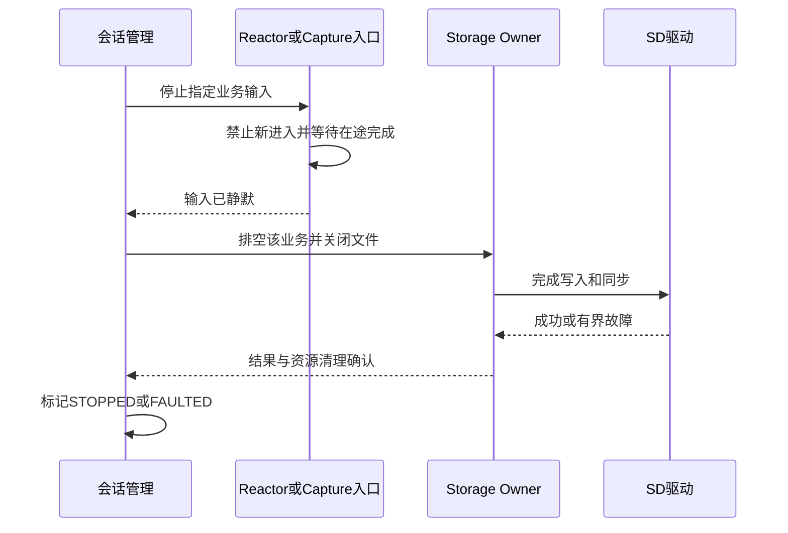

# Unified design of STM32 ModemLog, CHR and local packet capture

## 1. Conclusion and scope of application

The current baseline is: **ModemLog is a Socket, CHR is an independent Socket, and TCPDump performs read-only bypass packet capture on the lwIP network card transceiver path of the MCU**. TCPDump is the third diagnostic data channel, not the third inter-core Socket that must be provided by Modem. Momlog/modemlog in this article all refer to ModemLog; the protocol meaning, event importance and loss tolerance of CHR still need to be defined by the product side.

The recommended implementation is two application execution tasks: a Socket Reactor manages two non-blocking Sockets, and a Storage Owner processes three types of files serially. TCPDump uses a short capture tap in the network path to copy the limited-length snapshot to an independent static packet capture pool; when there is no space, insufficient budget, or packet capture exception, only the captured packet copy is discarded, without blocking or changing the processing results of the original packet. There is no need for a general dynamic thread pool, and there is no need to add Core Workers or packet capture and reception tasks by default.

"Does not affect normal business" must be defined as bounded and verifiable interference, not zero CPU, zero memory bandwidth, and zero latency. Software packet capture must have inspection, copying and caching overhead. What this solution ensures is that: packet capture does not introduce network dependencies waiting for storage, does not occupy normal network buffers for a long time, and does not actively discard original service packets due to failed packet capture; the remaining additional delay must be constrained by budget and actual machine testing.

This article is a design baseline, not a completed STM32 driver implementation or performance proof. FreeRTOS and FatFs are implementation assumptions that continue the existing solution; the specific STM32 model, lwIP vendor fork, RTOS version, IPC driver and storage device have not yet been provided. The conclusion is based on the official API/source code, and the parameters are marked as suggestions or calculation examples. The official source code comes from the upstream default branch visible at the time of research and cannot replace the target firmware version review.

## 2. Design corrections in the overall session

| original hypothesis or example | revised engineering rules |
|---|---|
| All three services are inter-core channel inputs. | Two-way inter-core Socket; TCPDump is the MCU local network mirror channel |
| Use driver callbacks instead of Socket reception | TCP packets must be processed by lwIP first; the application byte stream is still obtained by calling recv by the only Socket Owner |
| The captured packets are saved through pbuf_ref until asynchronously downloaded to disk. | Disabled by default; the captured packets are copied to a private pool, and the network pbuf does not survive for a long time due to packet captures. |
| Ordinary raw Socket is equivalent to tcpdump | Not true; it does not promise to see all RX/TX, ARP, L2 or all protocols |
| The same ring is read by Core and Storage advances the read pointer. | No longer called simple SPSC; this baseline is read and returned by a single Storage consumer |
| Every business needs a thread | Business context is independent and execution tasks are shared; two sockets can be used with one Reactor |
| Idle tasks must be deleted to save CPU | Blocking tasks will not run; static deletion will not automatically give up stack RAM to other uses [^7] |
| Release static stack slot before self-deletion | Disabled; the current task is still using the stack |
| Task Notification can wake up select | Not true; the two are different waiting mechanisms, use limited select timeout or implement another wake-up source |
| Successful file writing equals data persistence | Distinguish between application buffer reusability, file writing progress and the latest successful synchronization position [^8][^9][^10] |
| disk_write must always wait for the media to be dropped. | You can delay writing after internal copying; but you can no longer access the caller's original buffer after returning [^8] |
| 32-bit serial numbers can always be compared using the ordinary less than sign | Use unsigned differences and bounded occupancy for ring indexes; use wide sequence numbers or define a wraparound protocol for session records |
| IPC will not leak the public network without a gateway | Insufficient; an exit rule that rejects failure is also needed. You cannot just rely on routing Hook to return NULL [^6] |

Historical documents are retained for tracing, but this article shall prevail for conflicting parts; old code snippets cannot be directly implemented as production.

For C++ implementation, please combine [C++ overall architecture and interaction contract] (02-cpp-architecture-and-interactions.md): use static combination, Coordinator is merged into Reactor, no new management tasks are added; reliable control slots, non-copyable buffer leases, C callback adaptation and explicit stop protocols are clearly defined. There is no one-to-one correspondence between classes, business sessions, and tasks.

## 3. End-to-end architecture





The solid line represents the data processing path; the dotted line in the packet capture only copies an independent copy and does not transfer the ownership of the original packet. Network reception must continue to use the original netif input/tcpip_input, and TCP packets cannot be directly used as Socket log bytes to be written to disk. lwIP has its own core thread and API thread constraints under operating system configuration. [^1][^5]

| module | only write/manager | Allow blocking | Scope of impact of failure |
|---|---|---|---|
| ModemLog, CHR fd and protocol analysis status | Socket Reactor | Allow select to wait; actual recv/send is non-blocking | Corresponding diagnostic session |
| Production index of Log/CHR ring | Socket Reactor | No space unequal lock, suspend reading of this business | independent |
| capture slot production end | Corresponds to RX/TX tap; try-guard during concurrency | If you don’t wait, the copy will be lost due to conflict. | Packet capture copy |
| Consumption index of each ring | Storage Owner | Writing files can block, the driver must be bounded | diagnostic file |
| FIL, rotation, f_sync, SD DMA wait | Storage Owner | Allow bounded waiting | Diagnostic services on the same storage device |
| netif, routing status | lwIP core context or supported core-lock/API | Disable slow storage operations | Network configuration |

The two tasks are **application layer incremental model**, excluding existing tcpip_thread, RX driver tasks, Idle, software timers, etc. If the existing network management tasks can be taken over by Reactor, you only need to add a Storage Owner. The task stack is determined according to the actual call depth and stack level, and there is no guarantee that 1 to 2 KiB will be enough.

## 4. How two Sockets share the receiving thread

### 4.1 Reception strategy

Use lwIP select plus non-blocking recv/send. "Blocking recv(log), then blocking recv(chr)" cannot be executed sequentially; when the former path is idle, the latter path will be blocked. Reactor is the only caller of both Sockets, and other tasks use a small command queue to request sending, closing, or reconnection. The lwIP Socket API is core thread safe and does not mean that the same control block can be called concurrently across tasks at will. [^1][^2]

It is recommended that a loop first processes stop/control commands, and then gives CHR and ModemLog a limited read budget respectively. CHR priority is only the default policy, which does not mean that CHR has been confirmed to be the highest level of importance. Set the maximum total number of bytes, maximum number of cycles and CPU time in each round; actively block a tick if necessary. On a single core, taskYIELD does not guarantee that lower priority tasks will get the CPU.





The interface sketch is as follows. The auxiliary functions need to be implemented and verified in the project; it is not a complete program that can be directly compiled.


```c
for (;;) {
    service_commands_nonblocking();
    rebuild_read_set_only_for_channels_with_space();
    rebuild_write_set_only_for_pending_commands();

    /* 初始10ms仅为例子；同时决定满环恢复/停止命令的最大探测延迟。 */
    int rc = wait_select_with_deadline(10);
    if (rc < 0) {
        handle_select_error_and_rebuild_sets();
        continue;
    }

    service_ready_socket(CHR, chr_byte_budget, loop_budget);
    service_ready_socket(MODEMLOG, log_byte_budget, loop_budget);
    flush_pending_sends_nonblocking();
    check_session_deadlines();
    enforce_reactor_cpu_budget();
}
```


`service_ready_socket` needs to be distinguished: a positive number means data is received; `recv==0` means the peer is closed; EAGAIN/EWOULDBLOCK means the reading is completed this time; EINTR retry according to the port agreement; other errors are restored. You cannot use the same return value 0 to indicate "ring full" and "TCP closed" at the same time. send may be sent in a short time, save the command offset and wait for writing; when there is no data to be sent, the write set will not be added to avoid continuous wake-up.

When the Log ring is full, only the read interest of the Log is removed, and the CHR continues to serve. After the space is released, the collection is rebuilt at the next limited select timeout. Task Notification cannot wake up tasks that have entered lwIP select; if you need a shorter response, you can add a controlled internal wake-up Socket or transplant dedicated event integration, but the cost of fd, PCB and memory must be included. When both fds are not monitored, limited event waiting should be performed and no busy loop on an empty collection should be performed.

Confirm the configuration of NO_SYS=0, LWIP_SOCKET, LWIP_NETCONN and LWIP_SOCKET_SELECT; when reading the timeout option, check LWIP_SO_RCVTIMEO and LWIP_SO_SNDRCVTIMEO_NONSTANDARD. It cannot be assumed that each vendor fork receives timeval. Reactor uses non-blocking mode and does not rely on SO_RCVTIMEO to achieve fair scheduling. [^2][^3]

### 4.2 Frame boundaries and continuity

Both TCP channels are byte streams. Log/CHR each maintains the length header, remaining payload, protocol sequence number and reconnection status; one recv may be half or more messages. If the CHR exceeds the size of a single slot, a segment descriptor with an upper limit is used to save the message_id, offset and final segment flag. It cannot wait indefinitely for an unaccommodating large message.

The log output records rx_seq, storage accepted_bytes and the most recent sync_checkpoint; these have different meanings than TCP ACK. TCP ACK is not "written to file". If CHR requires reliable post-placement confirmation, the application ACK must be sent after the corresponding synchronization strategy is completed, and successful reception cannot be regarded as persistence success.

If ModemLog's pause command response also returns to the same Log Socket that has stopped reading, the response will be blocked by the previous log bytes. It cannot be claimed that two business Sockets solve this same-connection head-of-line blocking: the pause protocol should allow one-way effect, or reserve bounded tail reception space; otherwise, an explicit lossy mode of "continue parsing and losing logs but retaining control frames" needs to be adopted, or another control channel should be set up. It is not allowed to stop the CHR service by pausing ACK during synchronization in Reactor.

## 5. TCPDump packet capture point: bypass instead of the third Socket

TCPDump here refers to the lightweight PCAP/PCAPNG recorder, which does not require porting the complete Linux tcpdump/libpcap operating environment to STM32. Regular IP raw Socket is not a passive packet capture interface for all interfaces, directions and link protocols; a read-only observation point should be added to the existing driver/netif boundary.

### 5.1 Select one-time observation points based on actual links

| link | RX observation position | TX observation position | FileLinkType |
|---|---|---|---|
| Ethernet | DMA is completed, CPU can read, before handing over to netif input | before linkoutput submits the underlying layer | ETHERNET=1, record the complete L2 header |
| raw-IP IPC virtual network card | IPC complete IP packet after reassembly and before input | netif output/output_ip6 entry | RAW=101, or IPv4=228/IPv6=229 respectively |
| PPP | Recommended IP delivery point after PPP decapsulation | Recommended IP before entering PPP encapsulation | RAW=101; PPP serial bytes cannot be disguised as IP |

LinkType should come from the file format definition, do not write the platform DLT_RAW value 12 directly into the PCAP file; libpcap clearly distinguishes the DLT value from the file LINKTYPE_RAW=101. [^11]

By default, only one observation point is selected for the same interface and direction to prevent the input and driver from recording the same packet at the same time. TX entrance observation indicates "software submission attempt", which does not mean that the wireless transmission is successful, nor is it received by the peer; the return code of the original driver is counted separately. If accurate hardware TX completion information is required, driver-level related IDs should be established instead of long-term preservation of the original pbuf pointer. Retransmissions will occur again at appropriate TX observation points and are a real phenomenon that should be preserved.

The MCU side cannot observe the details of the cellular air interface, the traffic dropped within the Modem or bypassing the MCU. Checksum offload may cause the TX observation packet checksum to not be filled in; PCAP metadata needs to record the observation layer and offload status, and it is prohibited to modify the original packet in order to "correct the packet capture".

### 5.2 Packet capture does not return the error that determines the original business


```c
/* 在任务/已审核上下文调用，且调用时p的内容稳定。 */
static err_t rx_with_capture(struct pbuf *p, struct netif *n)
{
    capture_try_snapshot(p, n, DIR_RX); /* void：失败只记抓包drop */
    return saved_input(p, n);          /* 返回原input结果，保留原所有权约定 */
}

static err_t tx_with_capture(struct netif *n, struct pbuf *p)
{
    capture_try_snapshot(p, n, DIR_TX); /* 在原驱动可能消费p之前快照 */
    return saved_linkoutput(n, p);     /* 返回原驱动结果 */
}
```


Save each netif original function pointer, and cannot save the wrapper as the original function again to cause recursion. Runtime installation/teardown of wrappers is performed via the lwIP supported core context. When RX returns an error, whoever releases p follows the original netif input contract; tap neither releases the original packet nor changes its payload, len, tot_len or header offset. [^4][^5]

It is prohibited to call Socket, FatFs or any non-ISR security API within a hard interrupt. Prioritize the capture at the location where the original RX task delivers the complete package. The ISR only records the time/descriptor and notifies the original RX path without adding additional blocks. The use of FromISR and ordinary notifications across contexts must be correctly differentiated and the NVIC priority and RTOS callable interrupt levels must be checked.

## 6. Bounded snapshots and independent memory pools

### 6.1 Do not reference normal network pbuf for a long time

The lwIP source code clearly indicates that exhaustion of the RX pool may result in failure to receive TCP ACK. Keeping the RX pbuf or its bound DMA descriptor until the SD card is written will cause disk pauses to be transmitted to network packet collection resources; pbuf_ref solves the reference life, not resource isolation, and does not guarantee that the protocol stack will not adjust the pbuf view later. [^4]

By default, a bounded copy is performed: caplen=min(original_length,snaplen), which only copies to the exclusive slot of the packet capture. If there is no empty slot, the snapshot will be lost. Packet capture is not allowed to borrow capacity from the lwIP normal PBUF_POOL and normal RX descriptor pool, and the original business is not allowed to wait for the packet capture pool to be released. If future hardware provides a truly independent mirrored DMA buffer, zero-copy can be evaluated separately, but it must be proven that there is no shared retention dependency with normal RX resources.

### 6.2 Hot path sequence





Packet rate budget and byte budget are indispensable. Initially, short filtering such as interface/direction/protocol is performed; when parsing IPv4 variable headers, IPv6 extension headers, fragments and VLANs, there are length checks and upper layer limits. Unable to determine the port's fragmentation/extra-long header, snapshots are clearly received or lost according to the configuration, without out-of-bounds guessing. The full promiscuous mode is turned off by default to avoid expanding the normal RX load for diagnosis.

snaplen can start from 256 bytes, which is not a guaranteed value to cover all headers. Limit the number of pbuf nodes involved in replication, such as the upper limit of 8; if it exceeds the limit, the packet capture copy will be lost, so the scanning cost of the even fragmented chain has an upper bound. Ordinary pbuf_copy_partial supports cross-chain copying, but you still need to confirm the chain structure, length and stability according to the actual port before calling. [^4]

### 6.3 Concurrency model

The Log ring and the CHR ring are each produced by a Reactor and consumed by a Storage, meeting SPSC. Packet capture cannot simply assume that RX+TX is also a single producer: RX tasks, tcpip_thread, core-lock callers and even multiple interfaces may enter the tap concurrently.

The first version configures an independent ring for each packet capture direction; a non-spin try-guard is added to each ring, and the copy will be lost immediately if it cannot be obtained. guard protects a reserve/copy/publish, so that there is only one actual producer among multiple potential producers; interrupts are not turned off during copying, and no locks are waited for. It's not a "completely lock-free" ring, but the acquisition time is bounded. If it is proven that a lane has only a single production context, the guard can be removed. Multi-core requires additional verification of atomic operations, shared cache and memory domains.


```c
void capture_try_snapshot(const struct pbuf *p,
                          const struct netif *n, unsigned direction)
{
    capture_visit_t visit;
    /* 和stop原子协调：取得稳定配置引用并增加inflight；失败即返回。 */
    if (!capture_try_enter(n, direction, &visit)) return;

    cap_lane_t *lane = visit.lane;
    if (!lane_try_guard(lane)) { count_contention_drop(lane); goto leave; }
    if (!bounded_filter_and_admit(p, visit.config, lane)) goto unlock;

    cap_slot_t *slot = cap_reserve_nonblocking(lane);
    if (slot == NULL) { count_pool_drop(lane); goto unlock; }
    /* 元数据含generation、timestamp、iface、direction、orig_len、caplen。 */
    if (!bounded_snapshot_copy(slot, p, &visit)) {
        cap_cancel_reservation(lane, slot);
        count_copy_drop(lane);
        goto unlock;
    }
    cap_publish_release(lane, slot);
    signal_storage_without_wait();
unlock:
    lane_release_guard(lane);
leave:
    capture_leave(&visit);
}
```


The above auxiliary function is a synchronization contract that must be implemented, and it is not an empty shell to obtain security guarantees. capture_try_enter and STOP use the same short critical section or the correct reference protocol, first prohibit new entry and then wait for inflight to return to zero; you cannot just "read enabled, and then add the count in another step". Statistics use per-context counts or protected snapshots, uint64_t on 32-bit MCUs cannot assume atomic reads and writes.

## 7. Storage, SPSC and Buffer Ownership

### 7.1 Do not add an extra layer of transfer to the baseline

Reactor directly writes Log/CHR into the corresponding production slot; tap directly fills the capture slot; Storage is consumed fairly according to business. The ring head slot remains occupied during f_write and will be returned after successful consumption or explicit error cleaning. There is no third owner where Core first takes away the slot, Storage and then asynchronously advances the same read pointer.

Storage can batch serialize packet capture records into its own exclusive 8 KiB staging area. The capture slot can be returned after being copied to staging, but staging cannot be reused until the write request is completed. If it fails, you can still clearly distinguish between "the original slot has been returned and the record is still staging" and "the record has been discarded" to avoid double release; there is no need to configure independent large staging for each file.





State diagrams express ownership and do not require each slot to store a set of redundant state fields. SPSC can use monotonic unsigned indexing, N is a power of 2, used=write_seq-read_seq, keep 0<=used<=N and N is much less than 2^31. The half-filled block is not visible to consumers when it is not released; a filling deadline needs to be set for a small amount of logs and cannot be delayed indefinitely just to collect 4KiB.

### 7.2 f_write, DMA and persistence are not the same event

FatFs allows disk_write to use delayed writing internally, but the caller buff is no longer valid after returning. Therefore, a direct DMA driver with zero extra copies must stop reading the caller buffer before returning; the media can be flushed asynchronously if copied to the driver's own independent persistent buffer first. The abort/quiesce must also be completed before the timeout returns. You cannot just clear a software flag and then return the buffer. [^8]

Check FRESULT and bw after f_write returns. bw is still valid even if an error is returned; you cannot ignore a written prefix and then replay the entire block at an already advanced file offset. The simplest first version strategy is to mark the file as FAULTED after a short write/disk full/IO error, save the request length, bw, file location and record boundary, stop automatic retries and perform a controlled shutdown. Only complete records are retained or new files are created when restoring PCAP. [^9]

f_sync successfully corresponds to the file system synchronization checkpoint and is not an absolute physical guarantee of the power-off behavior of all cheap SD cards. f_close has its own synchronization process, and there is no need to mechanically repeat f_sync and then f_close when stopping; if you need to send a "checkpoint complete" ACK to the application, you can explicitly synchronize and check the return. [^10]

### 7.3 Fairness and Impossibility Guarantees

Storage selects services based on byte budget or deficit round-robin, combined with CHR deadline and waiting for aging; only low-priority remaining throughput is used for packet capture. The batch size of 4 to 16 KiB is used as the first round test value, and it is not fixed to claim that 64KiB is always better. Larger batch sizes are generally more efficient, but the longer the wait for the next business is.

An f_write in the same SD card cannot be preempted by the business scheduler. Even if the CHR has the highest weight, it must wait for the end of the current uninterruptible write; if the CHR requirement is strictly less than the persistence time limit of the SD's worst pause, a separate FRAM/internal Flash log area or other independent media is required, which cannot be solved by adding threads.

Storage does not hold the lwIP core lock, and the SD driver should block tasks when waiting for DMA rather than busy waiting/long-off interrupts. Shared AHB/AXI bus, DMA priority and Cache contention will still affect the normal network and must be measured on the actual machine.

## 8. PCAP output format and collection semantics

The first version can generate classic PCAP files separately by interface and direction, reducing memory and format implementation complexity. The file header is 24 bytes, and each record header is 16 bytes, saving timestamp, incl_len and orig_len; only the captured caplen bytes are included in a record, and the original length is still retained as it is. PCAP version 2.4, byte order, time unit and LinkType must be consistent, and you cannot directly fwrite a C structure with undefined padding. [^11][^12]

A classic PCAP file can only use one LinkType; packets with Ethernet headers and raw-IP packets cannot be mixed. Direction There is no universal per-packet direction field in classic PCAP, sub-file or using accompanying metadata. Capture packet loss statistics and write independent manifest/statistics files, without inserting any text into the PCAP packet stream. When the requirements for multiple interfaces, directions, truncation, and statistics are stronger, use PCAPNG's SHB, IDB, EPB, and ISB; the relevant reference is a working draft and is not claimed to have become a final RFC. [^13]

The timestamp is obtained at the collection point and is not generated when the SD card is placed. Use monotonic timing that scales across wraparounds, recording the UTC sync anchor point and whether it is valid; when not synchronized, it is clear that this is the post-start time. Different lanes perform limited merging based on time but do not block indefinitely waiting for earlier packets, save per-lane serial numbers, and do not promise absolute total ordering in multiple contexts.

Packet capture only observes the WAN interface by default; enable IPC individually as needed to avoid the log/CHR stream itself from inflating the packet capture volume. If you export PCAP over the network, exclude the export stream and the diagnostic transport itself to prevent recursive collection. Save the minimum necessary payload, set file quotas and retention periods; the encryption protocol captures the ciphertext on the corresponding observation layer and cannot claim to have the ability to decrypt plaintext.

## 9. Isolation and revision of data between public network and core

Socket, business channel, netif and physical IPC lane are four different objects and cannot be equated one by one. ModemLog and CHR can share the ipc0 IP interface, distinguished by two TCP connections/ports, and each has its own application ring. If hard isolation of the driver layer is required, IPC mux needs to support independent lane/credit or add dedicated netif mapping. Just changing the port will not automatically get independent pbuf budget or physical queue.

MCU usually reuses an lwIP stack: WAN is the default interface, and IPC is an independent non-conflicting subnet. Cross-core Socket requires the peer to be compatible with the protocol stack and IP bearer; netif itself does not require a real Ethernet MAC and can bear raw-IP in shared memory/SPI, etc. Modem public network implementation may be routing/NAT, or IP transparent transmission/PPP. The original wan-lan0 plus NAT is only an optional topology; the upstream lwIP should not be assumed to have provided product-level NAT.





Security baseline: fixed and independent of the IPC address range of netif's current IP; IPC services at both ends are bound to specify local addresses; WAN send/receive boundaries prohibit IPC sources or destinations; IPC boundaries only allow legal peers and local addresses; IP_FORWARD is turned off when the MCU is not responsible for forwarding. There must be corresponding policies when IPv6 is enabled. You cannot just fix IPv4 and claim that isolation is complete.

If the lwIP source route Hook returns NULL, the default search will continue, which does not mean explicit discarding; the Hook position of the destination route cannot be assumed to be before all direct matches. The old "returning a blackhole netif without complete initialization" snippet is not available as a production solution. The first version relies on a clear export guard to ensure that it will never be sent to the public network; if the business requires connect to get ERR_RTE immediately, the explicit rejection routing mechanism needs to be implemented and tested according to the actual version. Static protection ranges are also used when IPC is down or reinitialized, and safe network segments cannot be calculated from cleared netif masks. [^6]

The two diagnostic Sockets and the public network still share tcpip_thread, memory pool and CPU; the diagnostic TCP window, out-of-order cache, each inbox and IPC queue occupation need to be restricted, and the public network/CHR control resources need to be reserved. Each restriction is subject to actual lwIP version support. You cannot just set SO_RCVBUF and assume strict isolation of TCP memory. [^3]

## 10. RAM, throughput, and worst-case pause budgets

### 10.1 You cannot estimate all services based on 1Mbps

ModemLog 1Mbit/s is equal to 125000B/s, not 1MB/s. If it lasts for one hour, the original log will be about 450MB, excluding encapsulation and packet capture files. Capacity quota, rotation and low-water mark policies must be in place.

For business i, buffer estimation uses:


```text
B_i >= 突发字节 + 输入速率_i × 最大未获服务时间_i + 安全余量
最大未获服务时间 = SD停顿 + 排队/轮转/同步等待 + 任务调度延迟
```


Loss-free also requires that the continuous storage service rate is greater than the sum of all accepted data. If the input is permanently higher than the write disk or the pause is unlimited, the limited RAM cannot ensure that the log, CHR and packet capture are complete at the same time; by default, the integrity of the packet capture is sacrificed without sacrificing the normal network path. TCP backpressure only delays the pressure to the sender, and the Modem cache is also limited.

Packet capture is estimated based on packet rate: classic PCAP writes about accepted_pps×(average caplen+16) per second, and the memory slot budget is calculated based on allocated_slot_size rather than average caplen. Packet rates in both directions are added together, and ACK and small packet storms are also included.

### 10.2 A truncated memory example

| project | Example configuration | Static data budget |
|---|---|---:|
| ModemLog block ring | 16×4KiB | 64KiB |
| CHR block ring | 8×1KiB | 8KiB |
| Capture RX | 32 slots × 288B, including 256B snapshot + 32B metadata | 9kiB |
| Capture TX | Same as above | 9kiB |
| Storage staging | Share 8KiB | 8KiB |
| total | Does not include the following additional parts | 98KiB |

Still need to be additionally included: Log/CHR block metadata, two task stacks and TCB, FIL/FatFs cache, PCB/receiving mailbox/TCP window/pbuf, IPC ring, DMA alignment and bounce area, configuration and statistics. This example is not "the total system only uses 98KiB", nor does it apply to all STM32; when RAM is insufficient, you can reduce snaplen, the number of slots, turn off a certain direction, or enable packet capture only in short-term diagnosis.

For example, the packet capture allows 500pps and the average caplen256B, the classic PCAP writes about 136000B/s; this is already higher than the 125000B/s of 1Mbps ModemLog. Therefore, "packet capture only has a small piece of code" cannot be understood as low bandwidth overhead. After increasing to 5000pps, the packet capture output is about 1.36MB/s, which must be limited by filtering/budget.

### 10.3 CPU and latency model


```text
抓包CPU时间/秒 ≈ 全部观察pps × 快速拒绝成本
                + 接受pps × 限长复制及发布成本
                + 序列化和写盘调度成本
```


Even if the snapshot ends up being lost, there is still a cost to fast rejection. Set dual token buckets for packet rate and byte rate. The token consumption includes the record overhead to be written; scheduled replenishment cannot rely on Storage that will be stuck on the disk, otherwise the parameter behavior will be difficult to interpret. The maximum snaplen, maximum check header length, maximum number of pbuf nodes are locked, and the audit generated assembly ensures that atomic operations are lock-free/ISR safe.

## 11. Overload and failure strategies

| event | TCPDump | ModemLog | CHR | normal network |
|---|---|---|---|---|
| Capture pool full/try-guard conflict | Drop copies and count | unchanged | unchanged | Continue the original path |
| SD slows down briefly | Limit current flow, shorten snapshots or stop capturing | High water level pause corresponds to reading/source end deceleration | Reserve quota and flow control according to agreement | No waiting for SD |
| SD failed or disk is full | Close capture admission immediately | Notify the origin of a stop or explicit record loss | Report errors according to business reliability policy | Network service continues |
| ModemLog fd failed | unchanged | Only this session is reconnected | keep running | keep running |
| High packet rates drain CPU budget | Quickly turn off or increase the sampling interval | Subject to independent budget | Protection response time limit | Prioritize CPU retention |
| Stop waiting for timeout | Disable new snapshots and retain isolation slots until safe to clean | Single session failure | Single session failure | Do not forcefully delete driver tasks |

Each drop reason is counted separately: filtered, rate_limited, pool_full, producer_busy, copy_invalid, shutdown_rejected, storage_discarded. Normal filters cannot be regarded as system packet loss. Any "CHR will never be lost" commitment requires bounded maximum events, source-end ACK/retransmission and sufficient storage, which cannot be inferred from the business name.

When capturing packets and degrading them, do not reversely restrict the normal public network through TCP zero window; TCPDump is a bypass observer, not the receiving application of the captured connection. Packet capture and adaptation must have hysteresis and recovery cooling to avoid repeated starts and stops near high and low water levels.

## 12. Life cycle and thread strategy

It is recommended that the two main tasks be created statically and block idle; the business status, Socket, parser and ring are in the persistent context and are not saved across sessions in thread local variables. Deleting a static task will not automatically reclaim the static array that has been linked into RAM. Short CPU tasks such as compression can be added to the shared worker later and do not hold Socket/FIL/DMA. The completion order must be submitted according to the record sequence number. [^7]

Start: Storage prepares files and resources; initializes independent session generation, counting and configuration; registers a stable capture entry; only allows the source to send data or set capture enabled after publishing READY. You cannot open the input first and then initialize the ring. The open/connect/close of the two Sockets is executed by Reactor; the business controller sends commands and directly closes the active fd without crossing tasks.

Stop has two paths: the Socket service stops the source and continues to read the tail/ACK within the deadline, and then is closed by the Owner; Capture only closes the snapshot admission, **does not close WAN netif**, waits for the entered tap to exit, and then empties the private slot. Generation is used to identify the session and does not replace the callback to exit synchronization; the old generation objects are still returned to the original owner, and the buffer cannot be leaked because of "generation mismatch".





There are upper limits for waiting for close-ack, queue emptying, DMA abort and sync; when it times out, it enters FAULTED and does not occupy the global management lock indefinitely. Stopping the business does not mean that the execution task has been deleted, and the rest of the business continues to run.

## 13. Verification plan and “no impact” acceptance definition

A/B must be done under the same firmware, the same load and temperature/power supply conditions: packet capture is turned off, filtering is turned on but no copying is performed, packet capture is normal, the pool is full and copies are lost, and SD failure occurs. There are currently no equipment test results. The following table is the proposed test and the threshold that needs to be confirmed, not the achieved indicators.

| test | Results that must be observed |
|---|---|
| Deterministic replay of the same RX/TX input, forcing all snapshots to fail | The number of original input and output calls, return code, and payload hash will not change due to capture failure. |
| 1Mbps Log + CHR + WAN large packet/small packet bidirectional flow | Record WAN throughput, P99/P99.9 delay, CHR response, Reactor occupation and capture drop |
| High pps for small packets such as 64B, long pbuf chain, fragmentation/IPv6/VLAN | The hook's time consumption is kept within the budget, and the rejected path does not cross the boundary or take a long time to traverse. |
| Storage stalls 100/300/500ms vs longer tail latencies reported by the device | There is no network thread waiting for SD; the packet is captured and yielded first, and the Log/CHR water level complies with the formula |
| SD permanently blocks simulation, abort late interrupt | After timeout, the original buffer will not be read by active DMA and will be released without double. |
| Log ring is full and CHR is ready | Reactor is not blocked by Log; CHR delay is bounded |
| Producer preemption, RX/TX concurrency, notification and null check race conditions | No slots are destroyed, no permanent wake-ups are lost; production conflicts only result in the loss of countable snapshots |
| Send STOP and Storage return space during select | Processed within a limited timeout, it can be woken up directly without mistaking the name Task Notification. |
| Continuous rapid start/stop, generation wraparound drills | No floating configuration, in-transit callback leakage, and old-generation buffer leakage |
| PCAP gold sample | The desktop Wireshark/tcpdump correctly identifies the LinkType, length, and timestamp; does not contain forged original messages. |
| IPC interface is down and WAN is normal, including IPv6 | IPC packets are not sent from the WAN, and the normal public network continues |
| Long-term stress testing and disk rotation | There is no continued deterioration in stack water level, allocation count, file space, and normal RX descriptor usage. |

The project starting threshold can be proposed as "WAN throughput reduction shall not exceed 3%, additional P99 delay shall not exceed 1ms, and additional capture CPU shall not exceed 5%", but it must be confirmed by the business SLA. For hard real-time control, it is not enough to only look at P99, but also need to review the worst hook/critical section time, DMA contention and deadline leakage. If the test exceeds the threshold, reduce the snaplen, limit the pps/byte rate, shorten the collection time window, and disable packet capture; the normal network cannot be sacrificed to meet the packet capture integrity rate.

## 14. Implementation tasks and conditions for entering the next stage

1. Fixed STM32/RTOS/lwIP version and topology, confirmed whether WAN is Ethernet, PPP or raw-IP; listed RX/TX actual call context and DMA memory area.
2. Implement dual Socket Reactor without packet capture; verify independent backpressure, framing, stop and reconnection.
3. Implement independent rings and storage, verify short writes, synchronization, DMA abort and file rotation.
4. Add a tap with almost only one condition check in the closed state; ensure that the original business return value and payload remain unchanged.
5. Implement private snapshot pool, try-guard and packet rate/byte rate budget; the default is only WAN interface, 256B snapshot, and the capacity is adjusted according to the board.
6. Implement PCAP minimum writer and desktop read gold tests; upgrade PCAPNG when necessary.
7. Perform A/B, fault injection, and long-term stress testing, record the results, and then claim to meet the low-disruption SLA.
8. Only add optional workers when the CPU transformation becomes the measured bottleneck, and do not treat thread expansion as storage throughput optimization.

Before implementation, it is necessary to determine: total available RAM, SD worst-case pause, WAN peak pps, CHR maximum record and reliability level, Modem application-level suspension capability, and whether existing Socket threads can be reused. These unknowns do not prevent the architecture from being given, but they prevent specific performance guarantees from being made.

## Appendix: Source code verification fingerprint

The following SHA is the Git blob SHA of the read file this time, not the whole warehouse submission number; it is convenient for verification and is not used to forge the submission fixed link.

| File | Git blob SHA |
|---|---|
| lwIP sockets.c | b97bdd7e0be1c248141f47f594e05bff50217592 |
| lwIPpbuf.h | 5a4fc88b37da8e89497dc0b8450bed25ddc8fdfe |
| lwIPpbuf.c | 54a6e0e49c7673091456aa0bbac40b06649c90ae |
| lwIP netif.h | 0cde2c2ad2c02224e43f92fb0332f42f7839c1e9 |
| lwIPip4.c | b382e8085ad066aa143998a08130341240160664 |
| FreeRTOS task.h | 193d242f52fc64a917ad0fb20537aaaa3370d877 |
| libpcap pcap-common.c | 200926400b49edbb50d093396e4b292c731933d4 |

## 15. Reference basis

The following is the original data; research date 2026-09-10. The GitHub path refers to the upstream visible source code, and differences in version migration must be reviewed. The working draft is for formatting purposes only, production compatibility is subject to target libpcap/Wireshark verification.

[^1]: lwIP maintainer, [Threading and API context description] (https://github.com/lwip-tcpip/lwip/blob/master/doc/doxygen/main_page.h), source code documentation. Socket concurrency constraints, core threads.
[^2]: lwIP maintainer, [sockets.c](https://github.com/lwip-tcpip/lwip/blob/master/src/api/sockets.c), select, non-blocking reception and timeout implementation.
[^3]: lwIP maintainer, [opt.h](https://github.com/lwip-tcpip/lwip/blob/master/src/include/lwip/opt.h), multi-threading, Socket options, memory and reorganization configuration.
[^4]: lwIP maintainer, [pbuf.h](https://github.com/lwip-tcpip/lwip/blob/master/src/include/lwip/pbuf.h) and [pbuf.c](https://github.com/lwip-tcpip/lwip/blob/master/src/core/pbuf.c), RX pool exhaustion warning, pbuf chain and replication.
[^5]: lwIP maintainer, [netif.h](https://github.com/lwip-tcpip/lwip/blob/master/src/include/lwip/netif.h) and [tcpip.c](https://github.com/lwip-tcpip/lwip/blob/master/src/api/tcpip.c), input/output ownership and ETH/raw-IP input shunt.
[^6]: lwIP maintainer, [ip4.c](https://github.com/lwip-tcpip/lwip/blob/master/src/core/ipv4/ip4.c), source routing Hook, direct connection matching and default routing order.
[^7]: FreeRTOS maintainer, [task.h](https://github.com/FreeRTOS/FreeRTOS-Kernel/blob/main/include/task.h), static task creation, blocking notification, deletion and application resource management.
[^8]: ChaN, [FatFs disk_write](https://elm-chan.org/fsw/ff/doc/dwrite.html), buffer validity, delayed write and CTRL_SYNC.
[^9]: ChaN, [FatFs f_write](https://elm-chan.org/fsw/ff/doc/write.html), actual write length, short write, file offset.
[^10]: ChaN, [FatFs f_sync](https://elm-chan.org/fsw/ff/doc/sync.html), checkpoint and f_close relationship.
[^11]: The Tcpdump Group, [pcap-common.c](https://github.com/the-tcpdump-group/libpcap/blob/master/pcap-common.c) and [dlt.h](https://github.com/the-tcpdump-group/libpcap/blob/master/pcap/dlt.h), LINKTYPE and DLT mapping.
[^12]: G. Harris, M. Richardson, [PCAP Capture File Format, draft-ietf-opsawg-pcap-06] (https://www.ietf.org/archive/id/draft-ietf-opsawg-pcap-06.html), 2025-09-03; this version has expired, as a historical description of the classic format, and is not considered the current final standard; also check libpcap's [sf-pcap.c] (https://github.com/the-tcpdump-group/libpcap/blob/master/sf-pcap.c).
[^13]: M. Tuexen et al., [PCAPNG, draft-ietf-opsawg-pcapng-05] (https://www.ietf.org/archive/id/draft-ietf-opsawg-pcapng-05.html), 2026-03-17, working draft; multiple interfaces, packet records and statistics blocks.
