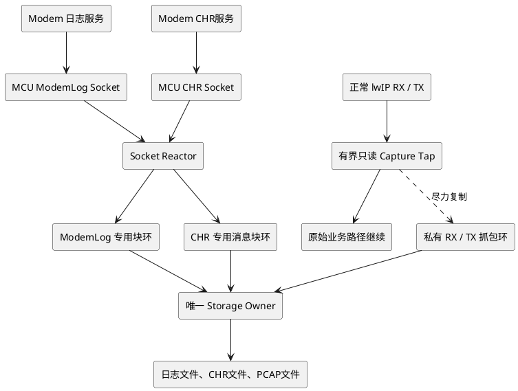
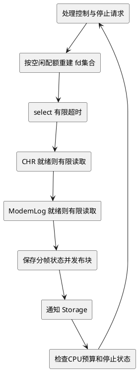
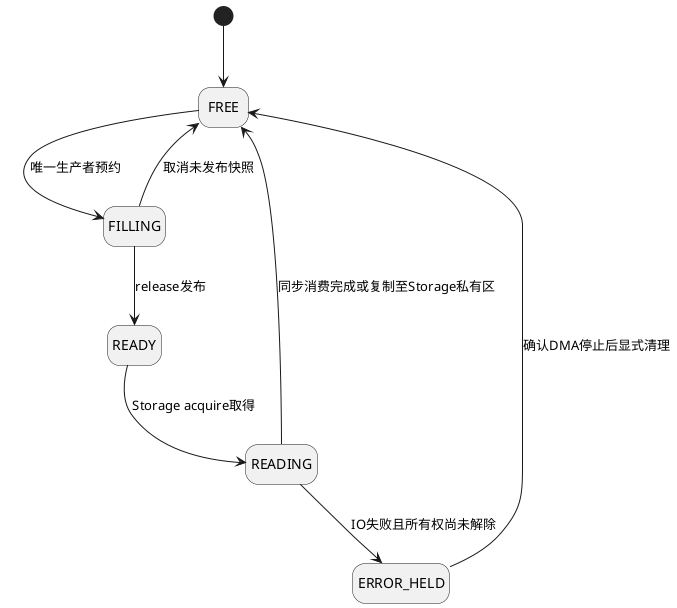
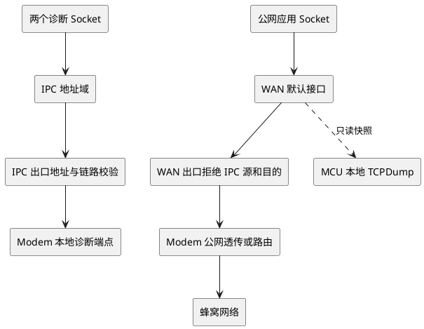
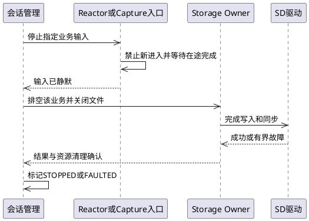

# STM32 ModemLog、CHR 与本地抓包统一设计

## 1. 结论与适用范围

当前基线为：**ModemLog 一个 Socket，CHR 一个独立 Socket，TCPDump 在 MCU 的 lwIP 网卡收发路径做只读旁路抓包**。TCPDump 是第三条诊断数据通道，不是第三个必须由 Modem 提供的核间 Socket。本文中的 momlog/modemlog 均指 ModemLog；CHR 的协议含义、事件重要性和丢失容忍度仍需产品方定义。

推荐实现是两个应用执行任务：一个 Socket Reactor 管理两路非阻塞 Socket，一个 Storage Owner 串行处理三类文件。TCPDump 使用网络路径中的短小 capture tap，把限长快照复制到独立静态抓包池；没有空间、预算不足或抓包异常时，仅丢弃抓包副本，不阻塞、不改变原始报文的处理结果。无需通用动态线程池，也无需默认增加 Core Worker 或抓包接收任务。

“不影响正常业务”必须定义为有界、可验证的干扰，而非零 CPU、零内存带宽、零时延。软件抓包必然有检查、复制和缓存开销。本方案保证的是：抓包不引入等待存储的网络依赖，不长期占有正常网络缓冲，不因抓包失败主动丢弃原始业务报文；剩余附加时延要通过预算与实机测试约束。

本文是设计基线，不是已完成的 STM32 驱动实现或性能证明。FreeRTOS、FatFs 是延续现有方案的实现假设；具体 STM32 型号、lwIP vendor fork、RTOS版本、IPC驱动和存储设备尚未提供。结论以官方 API/源码为依据，参数均标注为建议或计算示例。官方源码来自研究时可见的上游默认分支，不能代替目标固件版本审查。

## 2. 整体会话中的设计修正

| 原有假设或示例 | 修正后的工程规则 |
|---|---|
| 三种业务都是核间通道输入 | 两路核间 Socket；TCPDump 是 MCU 本地网络镜像通道 |
| 用驱动回调替代 Socket 接收 | TCP 包必须先由 lwIP 处理；应用字节流仍由唯一 Socket Owner 调用 recv 获取 |
| 抓包通过 pbuf_ref 留到异步落盘 | 默认禁止；抓包拷贝到私有池，网络 pbuf 不因抓包长期存活 |
| 普通 raw Socket 等价于 tcpdump | 不成立；不能据此承诺看见全部 RX/TX、ARP、L2或所有协议 |
| 同一环由 Core 读、Storage 推进读指针 | 不再称作简单 SPSC；本基线由唯一 Storage 消费者读取并归还 |
| 每业务都需要一个线程 | 业务上下文独立，执行任务共享；两路 Socket 可用一个 Reactor |
| 空闲任务必须删除才省 CPU | 阻塞任务不运行；静态删除也不会自动把栈 RAM 让给其他用途 [^7] |
| 在自删除前释放静态栈槽 | 禁止；当前任务仍在使用该栈 |
| Task Notification 可以唤醒 select | 不成立；两者是不同等待机制，使用有限 select 超时或另行实现唤醒源 |
| 文件写成功等于数据持久化 | 区分应用缓冲可复用、文件写入进度和最近成功同步位置 [^8][^9][^10] |
| disk_write 一律必须等待介质落盘 | 可内部复制后延迟写；但返回后不能再访问调用者原缓冲 [^8] |
| 32位序号可以一直用普通小于号比较 | 环形索引用无符号差值和有界占用；会话记录用宽序号或定义回绕协议 |
| IPC没有网关就不会泄漏公网 | 不充分；还需失败即拒绝的出口规则，不能只依赖路由Hook返回NULL [^6] |

历史文档保留用于追溯，但冲突部分以本文为准；旧代码片段不能直接作为生产实现。

C++落地请结合[C++整体架构与交互契约](02-cpp-architecture-and-interactions.md)：采用静态组合，Coordinator并入Reactor，不新增管理任务；明确可靠控制槽、不可复制缓冲lease、C回调适配和显式停止协议。类、业务会话和任务不是一一对应关系。

## 3. 端到端架构



实线表示数据处理路径；抓包虚线只复制独立副本，不转移原包所有权。网络接收必须继续走原来的 netif input/tcpip_input，不能把 TCP 包直接当作 Socket 日志字节写盘。lwIP 在有操作系统配置下有自己的核心线程和 API 线程约束。[^1][^5]

| 模块 | 唯一写入/管理者 | 允许阻塞 | 故障影响范围 |
|---|---|---|---|
| ModemLog、CHR fd及协议解析状态 | Socket Reactor | 允许 select 等待；实际 recv/send 非阻塞 | 对应诊断会话 |
| Log/CHR环的生产索引 | Socket Reactor | 无空间不等锁，暂停该业务读取 | 各自独立 |
| capture槽位生产端 | 对应 RX/TX tap；并发时 try-guard | 不等待，冲突丢副本 | 抓包副本 |
| 各环消费索引 | Storage Owner | 写文件可阻塞，驱动必须有界 | 诊断文件 |
| FIL、轮转、f_sync、SD DMA等待 | Storage Owner | 允许有界等待 | 同一存储设备上的诊断业务 |
| netif、路由状态 | lwIP核心上下文或受支持的core-lock/API | 禁止慢存储操作 | 网络配置 |

两个任务是**应用层增量模型**，不包括已存在的 tcpip_thread、RX驱动任务、Idle、软件定时器等。若现有网络管理任务可承接 Reactor，只需要增加一个 Storage Owner。任务栈按实际调用深度和栈水位定，不承诺1～2 KiB一定足够。

## 4. 两个 Socket 如何共享接收线程

### 4.1 接收策略

使用 lwIP select 加非阻塞 recv/send。不能顺序执行“阻塞 recv(log)，再阻塞 recv(chr)”；前一路空闲时会挡住后一路。Reactor 是两个 Socket 的唯一调用者，其他任务用小型命令队列请求发送、关闭或重连。lwIP Socket API对核心线程安全，不代表同一个控制块可随意跨任务并发调用。[^1][^2]

推荐一次循环先处理停止/控制命令，再给CHR和ModemLog分别一个有限读取预算。CHR优先只是默认策略，不等于CHR已被确认是最高重要级别。每轮设置最大总字节数、最大循环次数和CPU时间；必要时主动阻塞一个tick。单核上 taskYIELD 不能保证更低优先级任务获得CPU。



接口草图如下，辅助函数需在工程中实现并验证；不是可直接编译的完整程序。

```c
for (;;) {
    service_commands_nonblocking();
    rebuild_read_set_only_for_channels_with_space();
    rebuild_write_set_only_for_pending_commands();

    /* 初始10ms仅为例子；同时决定满环恢复/停止命令的最大探测延迟。 */
    int rc = wait_select_with_deadline(10);
    if (rc < 0) {
        handle_select_error_and_rebuild_sets();
        continue;
    }

    service_ready_socket(CHR, chr_byte_budget, loop_budget);
    service_ready_socket(MODEMLOG, log_byte_budget, loop_budget);
    flush_pending_sends_nonblocking();
    check_session_deadlines();
    enforce_reactor_cpu_budget();
}
```

`service_ready_socket`需区分：正数为收到数据；`recv==0`为对端关闭；EAGAIN/EWOULDBLOCK为本次读完；EINTR按端口约定重试；其他错误转恢复。不能用同一个返回值0同时表示“环已满”和“TCP关闭”。send可能短发送，保存命令偏移后等待可写；没有待发送数据时不加入write set，避免持续唤醒。

Log环满时只移除Log的read interest，CHR继续服务。空间释放后，在下一次有限select超时重建集合。Task Notification不能唤醒已经进入lwIP select的任务；如需更短反应，可以增加受控的内部唤醒Socket或移植专用事件集成，但要计入fd、PCB和内存成本。两个fd都不监控时应走有限事件等待，不对空集合忙循环。

确认配置NO_SYS=0、LWIP_SOCKET、LWIP_NETCONN和LWIP_SOCKET_SELECT；读取超时选项要核对LWIP_SO_RCVTIMEO及LWIP_SO_SNDRCVTIMEO_NONSTANDARD，不能假设每个vendor fork都接收timeval。Reactor用非阻塞模式不依赖SO_RCVTIMEO实现公平调度。[^2][^3]

### 4.2 帧边界和连续性

两路TCP均是字节流。Log/CHR各自维护长度头、剩余payload、协议序号和重连状态；一次recv可能是半条或多条消息。CHR若超过单槽大小，采用有上限的分段描述符，保存message_id、offset和终段标志，不能无限等待一个不可容纳的大消息。

日志输出记录rx_seq、存储accepted_bytes和最近sync_checkpoint；这些含义不同于TCP ACK。TCP ACK不是“已写入文件”。如CHR要求可靠落盘后确认，应用ACK必须在相应同步策略完成之后发送，不能把接收成功作为持久化成功。

如果ModemLog的暂停命令响应也回到同一个已经停止读取的Log Socket，响应会被前面的日志字节挡住。不能声称两个业务Socket就解决了这种同连接队头阻塞：暂停协议应允许单向生效，或预留有界尾部接收空间；否则需采用“继续解析并丢日志但保留控制帧”的显式有损模式，或另设控制通道。不得在Reactor中同步等暂停ACK而停掉CHR服务。

## 5. TCPDump抓包点：旁路而非第三个Socket

这里的TCPDump指轻量PCAP/PCAPNG记录器，不要求把完整Linux tcpdump/libpcap运行环境移植到STM32。常规IP raw Socket不是对所有接口、方向和链路协议的被动抓包接口；应在已有驱动/netif边界增加只读观察点。

### 5.1 按实际链路选择一次性观察点

| 链路 | RX观察位置 | TX观察位置 | 文件LinkType |
|---|---|---|---|
| 以太网 | DMA完成、CPU可读，交给netif input之前 | linkoutput提交底层之前 | ETHERNET=1，记录完整L2头 |
| raw-IP IPC虚拟网卡 | IPC完整IP包重组后、input之前 | netif output/output_ip6入口 | RAW=101，或分别IPv4=228/IPv6=229 |
| PPP | 推荐PPP解封装后的IP交付点 | 推荐IP进入PPP封装之前 | RAW=101；不能把PPP串行字节伪装成IP |

LinkType应来自文件格式定义，不要直接把平台DLT_RAW值12写进PCAP文件；libpcap明确区分DLT值与文件LINKTYPE_RAW=101。[^11]

同一接口同一方向默认只选一个观察点，避免input和驱动同时记录同一包。TX入口观察表示“软件提交尝试”，不是无线发送成功，也不是对端收到；原始驱动的返回码另作统计。若需要准确硬件TX完成信息，应建立驱动级相关ID，而不是长期保存原pbuf指针。重传在适当TX观察点会再次出现，是应保留的真实现象。

MCU侧无法观察蜂窝空口细节、Modem内部丢弃或绕过MCU的流量。Checksum offload可能导致TX观察包校验和尚未填充；PCAP元数据需记录观察层和offload状态，禁止为了“修正抓包”修改原包。

### 5.2 抓包不返回决定原始业务的错误

```c
/* 在任务/已审核上下文调用，且调用时p的内容稳定。 */
static err_t rx_with_capture(struct pbuf *p, struct netif *n)
{
    capture_try_snapshot(p, n, DIR_RX); /* void：失败只记抓包drop */
    return saved_input(p, n);          /* 返回原input结果，保留原所有权约定 */
}

static err_t tx_with_capture(struct netif *n, struct pbuf *p)
{
    capture_try_snapshot(p, n, DIR_TX); /* 在原驱动可能消费p之前快照 */
    return saved_linkoutput(n, p);     /* 返回原驱动结果 */
}
```

保存每个netif原始函数指针，不能把wrapper再次保存为原始函数造成递归。运行时安装/拆除wrapper通过lwIP受支持的核心上下文执行。RX返回错误时，谁释放p遵循原netif input契约；tap既不释放原包，也不改变其payload、len、tot_len或头偏移。[^4][^5]

禁止在硬中断内调用Socket、FatFs或任意非ISR安全API。优先在原有RX任务交付完整包的位置抓取，ISR只记录时间/描述符并通知原有RX路径，不另添阻塞。跨上下文使用FromISR和普通通知必须正确区分，核对NVIC优先级和RTOS可调用中断级别。

## 6. 有界快照与独立内存池

### 6.1 不长期引用正常网络pbuf

lwIP源码明确提示，RX池耗尽可导致TCP ACK收不到。把RX pbuf或其绑定DMA描述符保留到SD卡写完，会将磁盘停顿传导到网络收包资源；pbuf_ref解决的是引用寿命，不是资源隔离，也不保证协议栈后续不会调整pbuf视图。[^4]

默认进行一次有界复制：caplen=min(original_length,snaplen)，只复制到抓包独占槽。没有空槽就丢快照。抓包不得从lwIP正常PBUF_POOL、正常RX描述符池借容量，不让原业务等待抓包池释放。若未来硬件提供真正独立的镜像DMA缓冲，可单独评估零拷贝，但必须证明与正常RX资源无共用保留依赖。

### 6.2 热路径顺序

```plantuml
@startuml
hide stereotype
skinparam shadowing false

rectangle "原包到达观察点" as packet
diamond "启用且在范围内？" as enabled
rectangle "原路径继续" as pass
diamond "过滤及包率字节预算通过？" as budget
diamond "立即取得私有槽？" as slot
rectangle "仅增加抓包drop" as drop
rectangle "限长限链段只读复制" as copy
diamond "快照完整？" as valid
rectangle "归还未发布槽并记drop" as discard
rectangle "release发布槽并通知Storage" as publish

packet --> enabled
enabled --> pass : 否
enabled --> budget : 是
budget --> pass : 否
budget --> slot : 是
slot --> drop : 否
slot --> copy : 是
copy --> valid
valid --> discard : 否
valid --> publish : 是
drop --> pass
discard --> pass
publish --> pass
@enduml
```

包率预算和字节预算缺一不可。初始先做接口/方向/协议等短过滤；解析IPv4可变头、IPv6扩展头、分片和VLAN时都有长度检查与层数上限。无法确定端口的分片/超长头按配置明确收或丢快照，不越界猜测。默认关闭全量promiscuous mode，避免为了诊断扩大正常RX负载。

snaplen可从256字节起步，这不是保证覆盖所有头部的数值。限制复制涉及的pbuf节点数，例如上限8；超过即丢抓包副本，从而连极碎片化链的扫描成本也有上界。普通pbuf_copy_partial支持跨链复制，但调用前仍需按实际端口确认链结构、长度和稳定性。[^4]

### 6.3 并发模型

Log环和CHR环各为一个Reactor生产、一个Storage消费，满足SPSC。抓包不能简单假设RX+TX也是单生产者：RX任务、tcpip_thread、core-lock调用者乃至多个接口可能并发进入tap。

首版每个抓包方向配置独立环；对每个环增加非自旋try-guard，拿不到立即丢副本。guard保护一次reserve/copy/publish，使多个潜在生产者只存在一个实际生产者；复制时不关中断，不等锁。它不是“完全无锁”的环，但获取时间有界。若已证明某个lane只有单一生产上下文，可以去掉guard。多核需额外验证原子操作、共享Cache和内存域。

```c
void capture_try_snapshot(const struct pbuf *p,
                          const struct netif *n, unsigned direction)
{
    capture_visit_t visit;
    /* 和stop原子协调：取得稳定配置引用并增加inflight；失败即返回。 */
    if (!capture_try_enter(n, direction, &visit)) return;

    cap_lane_t *lane = visit.lane;
    if (!lane_try_guard(lane)) { count_contention_drop(lane); goto leave; }
    if (!bounded_filter_and_admit(p, visit.config, lane)) goto unlock;

    cap_slot_t *slot = cap_reserve_nonblocking(lane);
    if (slot == NULL) { count_pool_drop(lane); goto unlock; }
    /* 元数据含generation、timestamp、iface、direction、orig_len、caplen。 */
    if (!bounded_snapshot_copy(slot, p, &visit)) {
        cap_cancel_reservation(lane, slot);
        count_copy_drop(lane);
        goto unlock;
    }
    cap_publish_release(lane, slot);
    signal_storage_without_wait();
unlock:
    lane_release_guard(lane);
leave:
    capture_leave(&visit);
}
```

上面的辅助函数是必须实现的同步契约，不是空壳即可获得安全保证。capture_try_enter与STOP使用同一短临界区或正确的引用协议，先禁止新进入再等inflight归零；不能只“读enabled，然后另一步加计数”。统计用每上下文计数或受保护快照，32位MCU上的uint64_t不能假设原子读写。

## 7. 存储、SPSC和缓冲所有权

### 7.1 基线不要多加一层转交

Reactor直接把Log/CHR写进对应生产槽；tap直接填capture槽；Storage按业务公平消费。环头槽在f_write期间保持占用，成功消费或显式错误清理后才归还。没有Core先取走槽、Storage再异步推进同一读指针的第三种所有者。

Storage可以把抓包记录批量序列化到自己独占的8 KiB staging区。复制到staging后即可归还capture槽，但staging在写请求结束前不能复用。如果失败，仍能明确区分“原槽已经归还、记录还在staging”和“记录已经丢弃”，避免双释放；无需为每个文件配置独立大staging。



State图表达所有权，不要求每槽都存一套冗余状态字段。SPSC可使用单调无符号索引，N为2的幂，used=write_seq-read_seq，保持0<=used<=N且N远小于2^31。半填块未发布时消费者不可见；小量日志需设置填充截止时间，不能为了凑4KiB无限延迟。

### 7.2 f_write、DMA和持久化不是同一事件

FatFs允许disk_write内部采用延迟写，但调用者buff在返回后不再有效。因此，零额外复制的直接DMA驱动必须在返回前停止读取调用者缓冲；若先复制到驱动自己的独立持久缓冲，可以异步刷介质。超时返回前同样必须完成abort/quiesce，不能只清一个软件标志后把缓冲归还。[^8]

f_write返回后检查FRESULT和bw。即使返回错误bw仍有效；不能忽略已写前缀然后在已经前移的文件偏移上重放整个块。最简单的首版策略是短写/磁盘满/IO错误后将该文件标记FAULTED，保存请求长度、bw、文件位置和记录边界，停止自动重试并受控关闭。恢复PCAP时只保留完整记录或创建新文件。[^9]

f_sync成功对应文件系统同步检查点，不是对所有廉价SD卡断电行为的绝对物理保证。f_close自带同步过程，停止时不必机械重复f_sync再f_close；若需要给应用发送“检查点完成”ACK，可显式同步并检查返回。[^10]

### 7.3 公平性与不可能保证

Storage按字节预算或deficit round-robin选择业务，结合CHR截止时间和等待老化；抓包只使用低优先级剩余吞吐。批量4～16 KiB作为首轮测试值，不固定宣称64KiB总是更优。批量越大通常效率越高，但下一业务等待越长。

同一SD卡中的一次f_write无法被业务调度器中途抢占。即使CHR权重最高，它也必须等待当前不可中断写入结束；如果CHR要求严格小于SD最坏停顿的持久化时限，需要单独FRAM/内部Flash日志区或其他独立介质，增加线程不能解决。

Storage不持有lwIP core lock，SD驱动等待DMA应阻塞任务而非忙等/长关中断。共享AHB/AXI总线、DMA优先级和Cache争用仍会影响正常网络，必须实机测量。

## 8. PCAP输出格式和采集语义

首版可按接口和方向分别生成经典PCAP文件，降低内存与格式实现复杂度。文件头24字节、每条记录头16字节，保存timestamp、incl_len和orig_len；一次记录只有捕获的caplen字节，原长度仍如实保留。PCAP版本2.4、字节序、时间单位和LinkType必须一致，不能直接fwrite未定义padding的C结构体。[^11][^12]

一个经典PCAP文件只能采用一个LinkType；不能将带以太网头的包和raw-IP包混写。方向在经典PCAP中没有通用逐包方向字段，分文件或使用伴随元数据。抓包丢失统计写独立manifest/统计文件，不向PCAP包流插入任意文本。多接口、方向、截断、统计需求更强时，用PCAPNG的SHB、IDB、EPB及ISB；相关参考为工作草案，不宣称已成为最终RFC。[^13]

时间戳在采集点取得，不在SD卡落盘时生成。使用可跨回绕扩展的单调计时，记录UTC同步锚点和是否有效；未同步时明确这是启动后时间。不同lane按时间做有限归并但不为等待更早包而无限阻塞，保存per-lane序号，不承诺多上下文中的绝对全序。

抓包默认只观察WAN接口；按需单独启用IPC，避免日志/CHR流本身令抓包量膨胀。如果通过网络导出PCAP，要排除导出流和诊断传输自身，防止递归采集。保存最少必要payload、设置文件配额与保留期；加密协议抓到的是相应观察层上的密文，不能宣称有明文解密能力。

## 9. 公网与核间数据的隔离修订

Socket、业务通道、netif和物理IPC lane是四种不同对象，不能一一等同。ModemLog和CHR可以共用ipc0 IP接口，通过两个TCP连接/端口区分，同时各有应用环；若要求驱动层硬隔离，需要IPC mux支持独立lane/credit或增加专用netif映射。只改端口不会自动得到独立pbuf预算或物理队列。

MCU通常复用一个lwIP栈：WAN为默认接口，IPC为独立不冲突子网。跨核Socket需要对端兼容协议栈和IP承载；netif本身不要求真实以太网MAC，可在共享内存/SPI等承载raw-IP。Modem公网实现可能是路由/NAT，也可能是IP透传/PPP，原文的wan-lan0加NAT仅是一个可选拓扑；上游lwIP不应被假定已经提供产品级NAT。



安全基线：固定且独立于netif当前IP的IPC地址范围；两端IPC服务绑定指定本地地址；WAN发送/接收边界禁止IPC源或目的；IPC边界仅允许合法peer与本地地址；MCU不承担转发时关闭IP_FORWARD。IPv6启用时必须有对应策略，不能只修IPv4便声称隔离完成。

lwIP源路由Hook返回NULL会继续默认查找，并不表示显式丢弃；目的路由的Hook位置也不能假设在所有直连匹配之前。旧“返回一个未经完整初始化的黑洞netif”的片段不作为生产方案。首版靠明确出口guard保证绝不发到公网；如业务要求connect立即得到ERR_RTE，还需按实际版本实现并测试显式拒绝路由机制。IPC down或重新初始化时也使用静态保护范围，不能从已清零的netif掩码计算安全网段。[^6]

两个诊断Socket和公网仍共享tcpip_thread、内存池和CPU；需限制诊断TCP窗口、out-of-order缓存、各收件箱与IPC队列占用，保留公网/CHR控制资源。每项限制以实际lwIP版本支持为准，不能只设置SO_RCVBUF就假定TCP内存严格隔离。[^3]

## 10. RAM、吞吐和最坏停顿预算

### 10.1 不能只按1Mbps给全部业务估算

ModemLog 1Mbit/s等于125000B/s，不是1MB/s。若持续一小时，原始日志约450MB，不包含封装和抓包文件，必须有容量配额、轮转和低水位策略。

对业务i，缓冲估算使用：

```text
B_i >= 突发字节 + 输入速率_i × 最大未获服务时间_i + 安全余量
最大未获服务时间 = SD停顿 + 排队/轮转/同步等待 + 任务调度延迟
```

无丢失还要求持续存储服务率大于所有被接受数据的总和。若输入永久高于写盘或停顿无上限，有限RAM不可能保证日志、CHR和抓包同时完整；默认牺牲抓包完整性，不牺牲正常网络路径。TCP背压只推迟压力到发送端，Modem缓存也有限。

抓包按包率估算：经典PCAP每秒写入约accepted_pps×(平均caplen+16)，内存槽预算按allocated_slot_size而非平均caplen计算。两方向包率相加，ACK和小包风暴也计入。

### 10.2 一个可裁剪的内存例子

| 项目 | 示例配置 | 静态数据预算 |
|---|---|---:|
| ModemLog块环 | 16×4KiB | 64KiB |
| CHR块环 | 8×1KiB | 8KiB |
| Capture RX | 32槽×288B，含256B快照+32B元数据 | 9KiB |
| Capture TX | 同上 | 9KiB |
| Storage staging | 共享8KiB | 8KiB |
| 合计 | 不含以下额外部分 | 98KiB |

仍需额外计入：Log/CHR块元数据、两任务栈与TCB、FIL/FatFs缓存、PCB/接收邮箱/TCP窗口/pbuf、IPC环、DMA对齐及bounce区、配置和统计。此例不是“总系统只用98KiB”，更不适用于所有STM32；RAM不足时可减snaplen、slot数、关闭某方向或抓包只在短时诊断中启用。

例如抓包允许500pps且平均caplen256B，经典PCAP写入约136000B/s；这已经高于1Mbps ModemLog的125000B/s。因此不能把“抓包只有一小段代码”理解为带宽开销小。增加到5000pps后抓包输出约1.36MB/s，必须靠过滤/预算限制。

### 10.3 CPU与延迟模型

```text
抓包CPU时间/秒 ≈ 全部观察pps × 快速拒绝成本
                + 接受pps × 限长复制及发布成本
                + 序列化和写盘调度成本
```

即使最终丢快照，快速拒绝仍有成本。设置包率和字节率双token bucket，token消耗包括将要写入的记录开销；定时补充不能依赖会被磁盘卡住的Storage，否则参数行为难解释。锁定最大snaplen、最大检查头长、最大pbuf节点数，审计生成汇编确保原子操作无锁/ISR安全。

## 11. 过载与故障策略

| 事件 | TCPDump | ModemLog | CHR | 正常网络 |
|---|---|---|---|---|
| 抓包池满/try-guard冲突 | 丢副本并计数 | 不变 | 不变 | 原路径继续 |
| SD短暂变慢 | 限流、缩短快照或停抓 | 高水位暂停对应读取/源端减速 | 保留配额并按协议流控 | 不等待SD |
| SD失败或磁盘满 | 立即关闭capture admission | 通知源端停止或显式记录丢失 | 按业务可靠性策略报错 | 网络服务继续 |
| ModemLog fd失败 | 不变 | 仅该会话重连 | 保持运行 | 保持运行 |
| 高包率耗尽CPU预算 | 快速关闭或提高采样间隔 | 受独立预算约束 | 保护响应时限 | 优先保留CPU |
| 停止等待超时 | 禁止新快照并保留隔离槽直至安全清理 | 单会话故障 | 单会话故障 | 不强删驱动任务 |

每个drop原因单独计数：filtered、rate_limited、pool_full、producer_busy、copy_invalid、shutdown_rejected、storage_discarded，不能把正常filter当作系统丢包。任何“CHR绝不丢”的承诺都需要有界最大事件、源端ACK/重传与足够存储，不从业务名称推断。

抓包降级不要反向通过TCP零窗口限制正常公网；TCPDump是旁路观察者，不是被抓连接的接收应用。抓包自适应必须有滞回和恢复冷却，避免高低水位附近反复启停。

## 12. 生命周期与线程策略

两个主任务建议静态创建并阻塞空闲；业务状态、Socket、parser和ring在持久上下文，不在线程局部变量中跨会话保存。删除静态任务不会自动回收已链接进RAM的静态数组。可选压缩等短CPU任务以后再加入共享worker，且不持有Socket/FIL/DMA，完成顺序必须按记录序号提交。[^7]

Start：Storage准备文件和资源；初始化独立会话generation、计数和配置；注册稳定的capture入口；发布READY后才允许源端送数据或设置capture enabled。不能先开输入再初始化环。两个Socket的open/connect/close由Reactor执行；业务控制器发送命令，不跨任务直接close活动fd。

Stop分两条路径：Socket业务停止源端并在截止时间内继续读尾部/ACK，再由Owner关闭；Capture仅关闭快照admission，**不关闭WAN netif**，等待已经进入的tap退出，然后排空私有槽。generation用于识别会话，不替代回调退出同步；旧代对象仍按原owner归还，不能因为“generation不匹配”就泄漏缓冲。



等待close-ack、队列排空、DMA abort和sync各有上限；超时进入FAULTED，不无限占着全局管理锁。业务停止不等于已删除执行任务，其余业务继续运行。

## 13. 验证计划与“不影响”的验收定义

必须在同一个固件、同样负载和温度/供电条件下做A/B：抓包关闭、开启过滤但不复制、正常抓包、池满丢副本、SD故障。当前没有设备测试结果，下表是拟定测试与需确认门限，不是已达成指标。

| 测试 | 必须观察的结果 |
|---|---|
| 确定性重放相同RX/TX输入，强制所有快照失败 | 原始输入输出调用次数、返回码、payload哈希不因capture失败改变 |
| 1Mbps Log + CHR + WAN大包/小包双向流 | 记录WAN吞吐、P99/P99.9时延、CHR响应、Reactor占用和capture drop |
| 64B等小包高pps、长pbuf链、分片/IPv6/VLAN | hook耗时保持预算内，拒绝路径不越界、不长遍历 |
| 存储停顿100/300/500ms与设备报告的更长尾延迟 | 无网络线程等待SD；抓包先退让，Log/CHR水位符合公式 |
| SD永久阻塞模拟、abort迟到中断 | 超时后原缓冲不被活跃DMA继续读取，无双释放 |
| Log环满且CHR就绪 | Reactor不被Log阻塞；CHR延迟有界 |
| 生产者抢占、RX/TX并发、通知与空检查竞态 | 不破坏槽、不丢永久唤醒；生产冲突只导致可计数快照丢失 |
| select期间发STOP与Storage归还空间 | 有限超时内处理，不误称Task Notification可直接唤醒 |
| 连续快速start/stop、generation回绕演练 | 无悬空配置、在途回调漏计、旧代缓冲泄漏 |
| PCAP黄金样本 | 在桌面Wireshark/tcpdump正确识别LinkType、长度、时间戳；不含伪造原始报文 |
| IPC接口down且WAN正常，含IPv6 | IPC报文不从WAN发出，正常公网继续 |
| 长时间压测及磁盘轮转 | 栈水位、分配计数、文件空间、正常RX描述符占用无持续恶化 |

工程起始门限可提议为“WAN吞吐下降不超过3%、额外P99时延不超过1ms、capture额外CPU不超过5%”，但必须由业务SLA确认。硬实时控制只看P99不够，还需审核最坏hook/临界区时间、DMA争用及截止期漏失。若测试超门限，依次降低snaplen、限制pps/字节率、缩短采集时窗、停用抓包；不能为满足抓包完整率牺牲正常网络。

## 14. 落地任务与进入下一阶段条件

1. 固定STM32/RTOS/lwIP版本和拓扑，确认WAN是Ethernet、PPP还是raw-IP；列出RX/TX实际调用上下文及DMA内存区。
2. 实现双Socket Reactor，不加抓包；验证独立背压、分帧、停止和重连。
3. 实现独立环和Storage，验证短写、同步、DMA abort和文件轮转。
4. 加入关闭状态几乎只有一次条件检查的tap；确保原业务返回值与payload不变。
5. 实现私有snapshot池、try-guard和包率/字节率预算；默认仅WAN接口、256B快照，容量按板卡调整。
6. 实现PCAP最小写入器和桌面读取黄金测试；必要时升级PCAPNG。
7. 执行A/B、故障注入和长时间压力测试，记录结果后再宣称满足低干扰SLA。
8. 仅当CPU变换成为实测瓶颈时再加入可选worker，不把扩线程当作存储吞吐优化。

实施前还需确定：总可用RAM、SD最坏停顿、WAN峰值pps、CHR最大记录和可靠性等级、Modem应用级暂停能力、现有Socket线程可否复用。这些未知不阻碍给出架构，但阻止对具体性能作保证。

## 附录：源码核查指纹

以下SHA是本次读取文件的Git blob SHA，不是整仓提交号；便于核对依据，不用于伪造提交固定链接。

| 文件 | Git blob SHA |
|---|---|
| lwIP sockets.c | b97bdd7e0be1c248141f47f594e05bff50217592 |
| lwIP pbuf.h | 5a4fc88b37da8e89497dc0b8450bed25ddc8fdfe |
| lwIP pbuf.c | 54a6e0e49c7673091456aa0bbac40b06649c90ae |
| lwIP netif.h | 0cde2c2ad2c02224e43f92fb0332f42f7839c1e9 |
| lwIP ip4.c | b382e8085ad066aa143998a08130341240160664 |
| FreeRTOS task.h | 193d242f52fc64a917ad0fb20537aaaa3370d877 |
| libpcap pcap-common.c | 200926400b49edbb50d093396e4b292c731933d4 |

## 15. 参考依据

以下为原始资料；研究日期2026-09-10。GitHub路径引用上游可见源码，版本移植差异须复核。工作草案仅用作格式说明，生产兼容性以目标libpcap/Wireshark验证为准。

[^1]: lwIP维护者，[Threading及API上下文说明](https://github.com/lwip-tcpip/lwip/blob/master/doc/doxygen/main_page.h)，源码文档。Socket并发约束、核心线程。
[^2]: lwIP维护者，[sockets.c](https://github.com/lwip-tcpip/lwip/blob/master/src/api/sockets.c)，select、非阻塞接收和超时实现。
[^3]: lwIP维护者，[opt.h](https://github.com/lwip-tcpip/lwip/blob/master/src/include/lwip/opt.h)，多线程、Socket选项、内存与重组配置。
[^4]: lwIP维护者，[pbuf.h](https://github.com/lwip-tcpip/lwip/blob/master/src/include/lwip/pbuf.h)及[pbuf.c](https://github.com/lwip-tcpip/lwip/blob/master/src/core/pbuf.c)，RX池耗尽警告、pbuf链与复制。
[^5]: lwIP维护者，[netif.h](https://github.com/lwip-tcpip/lwip/blob/master/src/include/lwip/netif.h)及[tcpip.c](https://github.com/lwip-tcpip/lwip/blob/master/src/api/tcpip.c)，input/output所有权与ETH/raw-IP输入分流。
[^6]: lwIP维护者，[ip4.c](https://github.com/lwip-tcpip/lwip/blob/master/src/core/ipv4/ip4.c)，源路由Hook、直连匹配与默认路由顺序。
[^7]: FreeRTOS维护者，[task.h](https://github.com/FreeRTOS/FreeRTOS-Kernel/blob/main/include/task.h)，静态任务创建、阻塞通知、删除与应用资源管理。
[^8]: ChaN，[FatFs disk_write](https://elm-chan.org/fsw/ff/doc/dwrite.html)，缓冲有效期、延迟写和CTRL_SYNC。
[^9]: ChaN，[FatFs f_write](https://elm-chan.org/fsw/ff/doc/write.html)，实际写入长度、短写、文件偏移。
[^10]: ChaN，[FatFs f_sync](https://elm-chan.org/fsw/ff/doc/sync.html)，检查点和f_close关系。
[^11]: The Tcpdump Group，[pcap-common.c](https://github.com/the-tcpdump-group/libpcap/blob/master/pcap-common.c)及[dlt.h](https://github.com/the-tcpdump-group/libpcap/blob/master/pcap/dlt.h)，LINKTYPE与DLT映射。
[^12]: G. Harris、M. Richardson，[PCAP Capture File Format，draft-ietf-opsawg-pcap-06](https://www.ietf.org/archive/id/draft-ietf-opsawg-pcap-06.html)，2025-09-03；该版本已过期，作为经典格式历史说明，不视为现行最终标准；同时核对libpcap的[sf-pcap.c](https://github.com/the-tcpdump-group/libpcap/blob/master/sf-pcap.c)。
[^13]: M. Tuexen等，[PCAPNG，draft-ietf-opsawg-pcapng-05](https://www.ietf.org/archive/id/draft-ietf-opsawg-pcapng-05.html)，2026-03-17，工作草案；多接口、包记录及统计块。
