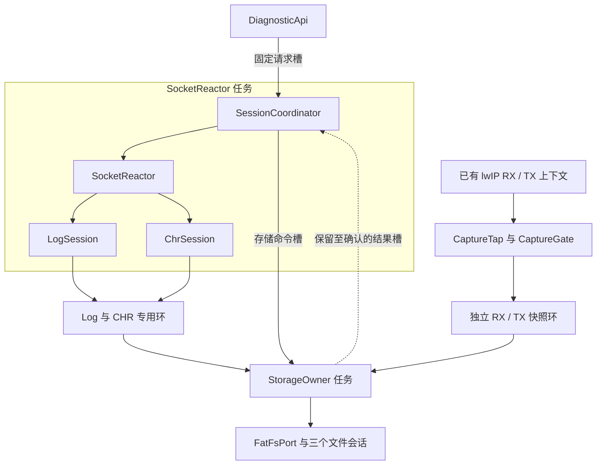
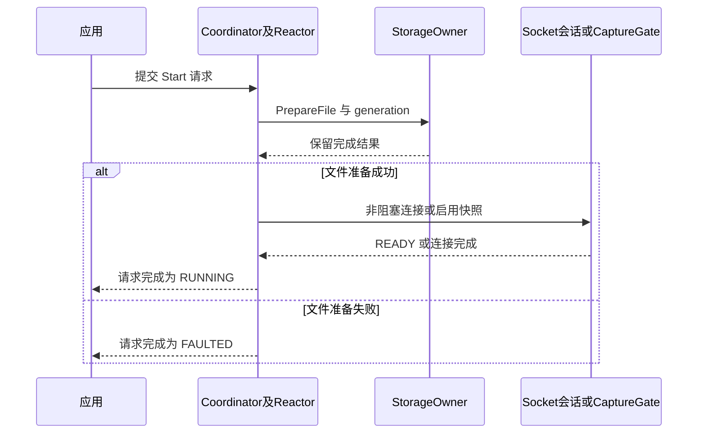
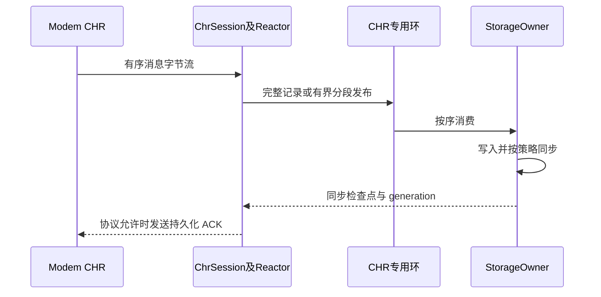

# C++ implementation architecture: dual Socket and local TCPDump

This article is a C++ implementation design of [Unified Design Baseline] (01-diagnostics-unified-design.md), continuing the assumptions of STM32, lwIP, FreeRTOS, and FatFs. The focus is on class responsibilities, execution context, message contracts, ownership and life cycle, not compiled and verified firmware. The interface fragment is a design sketch, omitting platform adaptation implementation.

## 1. Overall selection

Using **C++17 static composition, two application tasks, and three persistent business sessions**:

- `SocketReactor` task: uniquely operate ModemLog and CHR Sockets, and simultaneously promote the lightweight `SessionCoordinator` state machine.
- `StorageOwner` task: unique operation of three types of diagnostic files, PCAP serialization, rotation, synchronization and storage recovery.
- `CaptureTap`: Execute a bounded read-only snapshot in the existing RX/TX context, without creating a third receiving thread or a third Socket.
- `DiagnosticSystem`: statically holds the above objects, fixed rings, command slots, task stacks and configurations; the object life span covers all tasks and callbacks.

**The class is not a thread, the session is not a thread, and calling the method will not automatically switch threads. ** "Asynchronous" is implemented explicitly by message slots and event loops, without using `std::async`, thread pools or coroutines to hide execution context. The two tasks are only application increments and do not include lwIP, driver and system original tasks.

This design uses C++ types and access control to express boundaries, and does not simulate the Java service framework with inheritance hierarchies. Static resources and RAII can be used together; limiting dynamic allocation to hard real-time environments is a project constraint and not a C++ language requirement. [^cpp-guidelines]

## 2. Module and task mapping





| C++ types | Responsibilities and Status | calling context | Prohibited matters |
|---|---|---|---|
| `DiagnosticSystem` | Combining resources, initialization sequence, task startup | startup phase | Moved, destroyed or restructured during the event |
| `DiagnosticApi` | Verify parameters, submit value type commands, query request results | Already have application tasks | Directly read and write fd, FIL, business parser |
| `SessionCoordinator` | Three business control status, timeout, request ID and generation | Within Reactor | Waiting for file completion, synchronization, etc. remote ACK |
| `SocketReactor` | select, connection/read/write/close of two FDs, budget for each round | Reactor | Block recv, f_write, close fd for others |
| `LogSession` | Log fd, framing, half packet, send offset, back pressure and sequence number | Reactor | Put the state in a short task stack |
| `ChrSession` | CHR fd, message segmentation, reliability protocol, pending ACK | Reactor | Assume recv boundaries are message boundaries |
| `CaptureGate` | Enable configuration, entry permission, inflight, generation switching | Control terminal and tap, short synchronization protection | Recycle configuration or clear the loop without quiescence |
| `CaptureTap` | Filtering, rate limiting, private snapshot publishing | There is already a network task | Block, call the file system, retain the original pbuf |
| `DataRings` | Three services independent capacity, capture is divided into RX/TX | Specify Producer and Storage | Multiple consumers advance the same consumption index |
| `StorageOwner` | Fair consumption, FIL, staging, accepted/sync progress | Storage | Hold network lock waiting for SD |
| `PcapEncoder` | Encoding classic PCAP by field | Storage | Directly write the structure with padding to the file |
| `LwipSocketPort` / `FatFsPort` | Encapsulates C API, error codes and platform contracts | respective Owner | Pretend that the underlying blocking call is naturally cancelable |

`SessionCoordinator` manages the **control state**; Socket's fd/parser still only belongs to Reactor, and `FileSession`'s FIL/offset/synchronization point only belongs to Storage. Do not design a shared large object that contains FIL, fd, and variable parser at the same time and then lock all threads.

The three businesses can share `SessionId`, result format and life cycle concepts, but are not required to unify the `read()` interface: TCPDump is a production callback and has no readable fd. Log and CHR can reuse a small amount of compile-time logic of `SocketSession<Parser>`, and the business strategies are still clearly distinguished; avoid adding false threads or Sockets for a unified interface.

## 3. Resource combination and directory suggestions

All pools, TCBs, and stacks are statically reserved per link map visibility. The constructor only establishes memory relationships; `initialize()` explicitly initializes the lwIP/RTOS adapter, ring, and command slot; `start_tasks()` finally creates the task. The global construction phase must not open files or start an RTOS that is not yet ready.


```cpp
// 示意：各成员类型、构造注入和硬件适配另行实现。
class DiagnosticSystem final {
public:
    DiagnosticSystem() noexcept;
    DiagnosticSystem(const DiagnosticSystem&) = delete;
    DiagnosticSystem& operator=(const DiagnosticSystem&) = delete;
    DiagnosticSystem(DiagnosticSystem&&) = delete;
    DiagnosticSystem& operator=(DiagnosticSystem&&) = delete;

    Status initialize() noexcept;       // 调度器状态符合平台约定
    Status start_tasks() noexcept;      // 失败时回滚已启动部分
    DiagnosticApi& api() noexcept;

private:
    DataRings rings_;                   // 不把大数组放启动任务栈上
    ControlTransport control_;
    CaptureGate capture_gate_;
    CaptureTap capture_;
    SocketReactor reactor_;             // 内含 coordinator、Log/CHR状态
    StorageOwner storage_;              // 内含3个 FileSession 和 staging
    StaticTaskStorage reactor_task_;    // TCB + 经测量确定的栈
    StaticTaskStorage storage_task_;
};
```


| Suggested path | content |
|---|---|
| `diag/api/` | Command, result, business ID, read-only status snapshot |
| `diag/control/` | Handshake between session state machine, request slot and owner |
| `diag/socket/` | Reactor, Log/CHR parser, limited send queue |
| `diag/capture/` | Tap, Gate, Filter, Snapshot Metadata |
| `diag/buffer/` | Static ring, production/consumption lease, capacity invariant |
| `diag/storage/` | File sessions, scheduling, PCAP encoding, checkpoints |
| `ports/` | lwIP, FreeRTOS, FatFs, clock and DMA adaptation |
| `tests/host/` | parser, ring, protocol state machine, PCAP golden sample |
| `tests/target/` | Stack, hook cycle, concurrency and storage fault injection |

This is a directory suggestion only, this submission does not claim to have created a complete firmware project.

## 4. Three interaction methods, do not mix them

### 4.1 Same as Owner: ordinary method call

Reactor calls `LogSession::on_readable()`, `ChrSession::on_writable()` and `coordinator.step()` directly. These methods are short steps and cannot wait for another task simultaneously. Storage calls `PcapEncoder` and `FatFsPort` directly; bounded storage waits are allowed here.

### 4.2 Cross-owner control: small commands and clear results

The control plane uses static, fixed-capacity transport and does not move large payloads into the control queue. Indicative type:


```cpp
enum class Service : std::uint8_t { ModemLog, Chr, Capture };
enum class Op : std::uint8_t { Start, Stop, Checkpoint, Query };
enum class SubmitStatus : std::uint8_t { Accepted, Busy, Invalid };

struct RequestId {
    std::uint16_t slot;
    std::uint32_t epoch;  // 槽复用代际；回绕必须有设计约束
};

struct Command {
    RequestId request;
    Service service;
    Op operation;
    std::uint32_t session_generation;
    std::uint32_t deadline_tick;
    ConfigId config;      // 已提交的固定配置槽，不是临时指针
};

struct SubmitResult {
    SubmitStatus status;
    RequestId request;    // 仅 Accepted 时有效
};

class DiagnosticApi final {
public:
    SubmitResult try_submit(const CommandSpec&) noexcept;
    ResultStatus try_get_result(RequestId, Result&) noexcept;
    Status release_result(RequestId) noexcept;
};
```


The contract is as follows:

1. `Accepted` only means that the request has been reliably received, not that it has been started/stopped/persistent. The final result is queried by request ID.
2. API copies small parameters to fixed slots. Configure copy by value or use frozen `ConfigId`; prohibit the queue from holding temporary views such as `Command*`, `string_view`, callback capture references, etc. on the caller stack.
3. The multi-caller portal uses a FreeRTOS static queue/request pool protected by a short critical section, not to be misnamed SPSC. If the submission fails, `Busy` is returned, and the control request is not quietly lost.
4. There is a maximum of one ongoing lifecycle transition per business. Corresponds to the Reactor→Storage command slot and Storage→Reactor completion slot reservation, and does not compete with packet capture notifications to grab capacity.
5. The completion record is not reused until confirmation is received; the notification only prompts "there may be work" and is not the only completion certificate. New requests are rejected when the request pool is full; a client's timeout does not mean that it has the right to release slots that are still executing early.
6. User request results and internal storage completion slots are managed separately. Even if the user fails to obtain the result, Reactor can still consume internal completion and continue normal service; the result slot filled by the user only affects new control requests.
7. Do not wait synchronously for `DiagnosticApi` results from Reactor, tap, or Storage; they may be the exact executors needed to complete the request. When user callback is required, the results are consumed by existing application tasks, and calling any user code on the network hot path is prohibited.
8. Reserves the control capacity needed to clean up before accepting Start. If the normal command queue is full, it cannot prevent storage failure from shutting down: reserve sticky fault/stop status for each business, use correct synchronization, and clear it after final confirmation. Repeating the Stop merge cannot overwrite the unfinished Start and discard the original request result.

If the larger command content of Socket send exceeds the small command slot, use **independent bounded control block pool** and handle to pass; it is held by Reactor during sending, and the offset is saved for short sending, and returned after sending or canceling. The incoming pointer must not be retained until the next select cycle.

### 4.3 Data plane: Static ring transfers ownership

Log/CHR: Reactor directly `recv` to its own production slot and cannot be changed after release. Storage reads the corresponding slot and returns it after completion of consumption or copying to private staging.

Capture: tap only borrows `const pbuf*` within the current call, copies the limited-length snapshot to a private slot and publishes it. The original package continues on the original path regardless of whether the snapshot is successful; there is no reference transfer from the network pbuf to Storage.

Task Notification is used to wake up Storage; it is not responsible for carrying data, sequence numbers and completion results, nor can it directly wake up lwIP `select()`. Reactor rechecks commands/free space with a bounded timeout, the initial 10ms is just a value to be measured. Storage uses the persistent notification protocol of "publish first and then notify; check whether there is work before waiting". It cannot unconditionally clear new notifications after checking for empty loops. [^rtos][^lwip-sockets]

## 5. C++ Ownership Model for Data Buffers

### 5.1 Wrapping reservations with non-copiable leases

Avoid passing naked `void*` around. The production side can use `ProducerLease` to represent an unreleased slot; destruction only cancels unreleased reservations and does not perform I/O. Consumer leases exist only in Storage; destruction only returns slots for which underlying access dependencies have been explicitly released.


```cpp
// 接口草图：不是跨线程队列元素，不可直接 memcpy 进 RTOS 队列。
class ProducerLease final {
public:
    ProducerLease(const ProducerLease&) = delete;
    ProducerLease& operator=(const ProducerLease&) = delete;
    ProducerLease(ProducerLease&&) noexcept;
    ~ProducerLease() noexcept;          // 未发布则取消；发布后为空

    MutableBytes bytes() noexcept;     // 只在 lease 有效期间可写
    Status publish(const BlockMeta&, std::size_t used) noexcept;
};
```


`publish()` must check that used does not exceed the slot capacity; invalidate the lease if successful. If the C API queue copies elements by bytes, only pass trivially-copyable slot ID, generation and length; do not deliver lease/`unique_ptr` with destructor as a byte array.

The slot is owned by the ring during READY and is owned by the consumer after Storage acquire. `ConsumerLease` cannot leave the synchronous consumption boundary of Storage; if the DMA is actually submitted asynchronously in the future, it must be moved to explicit `InFlightWrite`, and the buffer cannot be returned in advance by normal scope destruction. The FatFs adaptation of the main scenario requires that the driver no longer uses the caller buffer when the call returns. [^fatfs-dwrite]

### 5.2 Atomic release and return

Each Log/CHR ring has a producer and a consumer; the slot payload itself can be non-atomic, and the index must provide two-way synchronization:

| action | Order and Constraints |
|---|---|
| Producer writes to slot | First acquire, observe the consumption index, confirm that the slot has been returned, and then write payload/meta |
| Release new slot | release store of write index |
| consumer read slot | acquire load write index and then read the corresponding payload/meta |
| Consumer return slot | After the last read, the release store of read index |

release/acquire should be applied to matching release variables; `volatile`, a normal bool write, or just adding a fence on the writer side cannot replace a fully synchronous design. C++ memory ordering is responsible for the visibility relationship between CPUs and does not automatically complete DMA Cache clean/invalidate. [^cpp-order]

Verify lock-free properties, alignment and assembly on selected compilers and boards when using `std::atomic<std::uint32_t>`. The standard does not promise that all atomic types will be lock-free; 64-bit counters on 32-bit MCUs do not default to doing atomic RMW in the hot path.

### 5.3 Multi-producer capture lane

The RX/TX split still does not automatically mean that there is only one call context each. You can use the try-guard of `atomic_flag::test_and_set` once: if it is busy, the current snapshot will be lost, and the C++ layer will not spin repeatedly. `atomic_flag` operation has lock-free requirement, but **lock-free is not equal to fixed period/unbounded wait does not exist**; the target implementation may have internal exclusive instruction retries, the worst case must be reviewed, and standard properties cannot be used to directly prove hook WCET. [^cpp-flag]

If the target requires a stricter upper bound, priority is given to splitting it into a real SPSC lane according to the known production context; or the platform provides an audited very short try-admission critical section, which only protects the occupied bits and does not turn off interrupts during copying. The mutual exclusion here only captures the relationship between producers, and normal message processing will never wait for it to be released.

Busy-drop statistics must also be synchronized: the failed path has not obtained lane guard and cannot directly access the same ordinary counter `++`. Select either per known context count or audited atomic count; statistics aggregation must not introduce new network locks.

## 6. How to connect C ABI to existing lwIP/FreeRTOS

Does not rewrite the entire C protocol stack. C++ classes are accessed through a small amount of C-linkage trampoline; according to the actual header file processing, there is `extern "C"` protection, and the entire C++ header containing templates cannot be inserted into C linkage.


```cpp
// 示意：由平台启动代码把稳定对象地址作为 task parameter 传入。
extern "C" void diag_socket_task_entry(void* context)
{
    static_cast<SocketReactor*>(context)->run_forever();
    platform_task_entry_returned(); // 致命配置错误；必须 noreturn
}

extern "C" err_t diag_rx_input(struct pbuf* p, struct netif* n)
{
    // 稳定静态注册表，返回前已建立合法原 input，不能递归注册自身。
    auto& binding = capture_binding_for(n);
    binding.tap->observe(p, binding.interface_id, Direction::Rx);
    return binding.original_input(p, n);
}
```


`observe()` is a `noexcept`, read-only, non-escaping pbuf pointer. It internally obtains stable configuration and in-transit permissions through Gate, performs filtering/budgeting/snapshots, and releases permissions before leaving. Invalid snapshots only affect capture statistics and do not change the `original_input` return value and its existing release contract.

The original driver may already occupy `netif->state`; it must not be directly overwritten to C++ `this`. Use a per-netif binding table with compile-time capacity, or an explicitly allocated client-data slot supported by the target lwIP. Registration changes follow lwIP core/API constraints; the independent RX driver context also needs to deactivate/quiet the protocol. You cannot just take the core lock and assume that all RX callbacks have exited. [^lwip-main][^lwip-netif]

The first version of wrapper and binding is recommended to be permanent, and Start/Stop only switches CaptureGate; there is no need to replace the function pointer every time it is started and stopped. The hardware network driver uses a resident object and does not allow its callbacks to reference a temporary `CaptureSession`.

Network hooks are placed in a task context that can reliably read packets. If the actual port is delivered directly in the ISR, review the driver structure first; do not move ordinary notifications, C++ implicit allocations, or file operations into the ISR.

## 7. Startup and normal interaction

### 7.1 Prepare documents first before allowing production





The Coordinator and Reactor in the figure are in the same task; the interaction with the SocketSession is a short method call, not an additional thread. `connect` must also use a non-blocking state machine: only register writable events and deadlines in progress, and check for Socket errors when completed; it cannot block for several seconds in Start. Use a fixed IPC address to avoid extra DNS waits.

When Capture starts, the file header is prepared successfully, and then the immutable configuration, generation and enabled are released. Log/CHR starts sending according to the actual protocol after the connection is successful; if the peer sends data immediately after connecting, the file and receiving ring are ready. If the rollback fails, the resource will still be closed by the original owner and cannot be released by the API caller without permission.

### 7.2 ModemLog: Byte stream persistence

Reactor handles arbitrary shards using the long-lived parser, padding offset, and record sequence number in the LogSession. It is released when the slot is full or the filling deadline expires; CHR is served after each round of read budget is exhausted, and the next round continues from the same object state. **Continuity comes from state preservation and sequential consumption, not from a thread running all the time. **

Log high water level only stops the read interest of the fd; stopping reading will increase the pressure on the peer, and the source cache and pause protocol must be matched. LogSession cannot be allowed to wait for ACK synchronously after sending a pause, blocking CHR in the same Reactor.

### 7.3 CHR: Return results by confirmation level





This is an optional protocol when "CHR requires persistent confirmation" and is not assumed to be the case for all CHRs. Storage does not call send and only returns synchronization progress; Reactor generates ACK and uses a limited send queue to handle short sends.

If the protocol supports cumulative ACKs, synchronized consecutive record ID watermarks may be used and must not span missing/failed records. If the semantics of each ACK are different, use bounding to complete the ledger one by one; backpressure the CHR when full, and cannot use the mailbox of "the latest result overwrites the old result" to lose the ACK that must be returned.

### 7.4 TCPDump: If it fails, only the copy will be lost.

After obtaining the license, `observe()` performs interface range checking, fast filtering of shared-nothing writes, try-guard, protected pps/byte budget, reserved private slots, limited pbuf chain replication, and release. The shared token status must also be updated in the guard, and the slot cannot only be protected without missing the data competition of the rate limiter. All failed paths release the license/reservation obtained this time; the original package is delivered as usual, and no capture error is returned to the original business.

Storage consumes Capture RX/TX with low priority budget and writes standalone files via `PcapEncoder`. The default interface/direction file is divided into files. The raw-IP file LINKTYPE is 101, and the Ethernet is 1; TX means that the software submits the observation, which does not mean that the cellular transmission is successful. The format and throughput details follow the same scheme.

## 8. Stops and Failures: Asynchronous State Machines, Not Destructors to the Rescue

### 8.1 Capture stops

1. The Coordinator requests the Gate to close admission; the admission and closing actions are linearized through the same synchronization protocol to avoid the race condition of "read enabled first, then add inflight".
2. The entered tap completes limited replication using the old generation stable configuration and exits. Coordinator checks the completion status in each round, **does not wait in a loop in Reactor**, and CHR continues to run.
3. After inflight is reset to zero, record the RX/TX production end point; issue `DrainAndClose(generation, end_positions)` to Storage. You still need to consume before reaching the end. You cannot rely on the ring being empty at a certain moment to close the file in advance.
4. Storage completes the remaining data, synchronizes/shuts down, and returns a reliable completion record; only then does the Coordinator declare STOPPED and allow reuse of the current generation configuration and slots.

Stop only turns off capture, but does not turn off WAN netif. generation is used to identify old events and is not a replacement for in-flight exit proofs. Timeout enters FAULTED, retaining memory that may still be accessed; must not clear the loop, destroy objects, or force release of active DMA buffers.

### 8.2 Socket business stopped

The Reactor originator stops the request and reads the tail according to the deadline, closes the corresponding fd after processing the control response, and releases the residual block and final production serial number. After receiving the production endpoint, Storage empties and closes the corresponding files, and other services are scheduled as usual. Socket's close/linger/unsent data discarding policy must be reviewed based on the target lwIP, and it cannot be claimed that close must return immediately based on "fd non-blocking"; if necessary, set a limited closing policy and report tail loss.

### 8.3 Resource destruction rules

RAII is suitable for ensuring paired release of short-term guards, unreleased reservations, etc.; persistent resources must also meet execution context and error reporting requirements.

| Resources | release method |
|---|---|
| producer lease/try-guard | Destruction of current scope, no wait, no I/O |
| Activity Socket | Reactor explicit state transition is turned off; Owner destruction is only allowed to occur when it has been silenced and fd is invalid |
| FIL | Storage explicitly closes and records the result; cannot f_close when API calls thread destruction |
| DMA memory in use | It can only be returned after the driver is completed or abort is confirmed. |
| Static tasks and stacks | Resident blocking, no need to call vTaskDelete on business object destruction |
| Diagnostic System | No destruction occurs during normal firmware operation; testing teardown must first quiesce/join |

FreeRTOS task functions do not return to implement safe shutdown like normal C++ subroutines; `vTaskDelete()` cannot be expected to automatically unwind all C++ local objects on the task stack. Necessary cleanup is completed by explicit protocols, and long-term tasks can return to blocking and waiting. [^rtos]

When SD fails, Storage retains the error status and closes capture admission as soon as possible; if the notification is late, only copies will be lost if the capture pool is full. If `f_write` itself is permanently hung up by a bad driver, the C++ deadline cannot forcibly cancel it. There must be a timeout and DMA stop contract at the driver layer. Log/CHR sharing SD cannot obtain independent persistence worst-case latency. [^fatfs-dwrite][^fatfs-write]

## 9. C++ runtime tailoring principles

| mechanism | first edition selection | Reason/Boundary |
|---|---|---|
| memory | `std::array`, static pool, fixed capacity tank | No heap allocation for hot path; Socket/lwIP internal memory is budgeted separately |
| abstract | Concrete classes and few templates | Clarify objects and tasks; control the number of template instances and check code size |
| Polymorphism | Fixed port reference or finite function table | Virtual functions themselves do not require heap allocation; only measured benefits are clipped |
| Error | Explicit `Status/Result` and `noexcept` | noexcept is not automatic error handling; prohibits potentially throwing calls from crossing C boundaries |
| Exceptions and RTTI | Can be closed according to the entire tool chain strategy | Not mandatory; library ABI and compilation options must be verified consistently, and incompatible builds must not be mixed. |
| Ownership | Static composition and non-copyable lease | Hot paths do not use the shared recycling semantics of shared_ptr |
| callback | C trampoline + stable context | No reliance on generic callback wrappers that may be dynamically allocated |
| string | Fixed array or view with explicit call period | Copy before saving asynchronously, with a clear upper limit on length |
| Scheduling | FreeRTOS static tasks and bounded state machines | No stacking of std::thread/std::async runtimes |
| Log | Limit length counting and low frequency diagnostic output | Do not print or recursively record itself in the packet capture hook |

This is not a "C++ doesn't use heap so the whole system doesn't use heap" promise: lwIP PCB, pbuf, netconn, FatFs configuration and existing BSP may still allocate memory. Audit application allocation times, protocol stack pool peaks, link graphs and stack water levels respectively.

The data budget of 98KiB for dual tasks and main files will not be automatically reduced by switching to C++. The polymorphic table pointer, ring metadata, control slot, alignment and stack in the object must be measured using the target `sizeof`/map file and cannot be directly estimated using the number of source code lines.

## 10. C++ special testing and implementation sequence

First make the pure logic that can be run on the host, then connect the ports, and finally put it on the board to prove the timing:

1. `LogParser/ChrParser`: All fragment boundaries, ultra-long messages, disconnection residual frames, reconnection generation, short transmission.
2. Ring and lease: full/empty, index wraparound, reservation cancellation, invalidation after move, write prohibition after release, and error path is returned only once.
3. Control transport: multiple callers, queue full, result retention, late results after timeout, Start/Stop interleaving, no lost critical completion.
4. Gate: enter/close competition, producer preemption, configuration replacement, reset is prohibited before inflight is reset to zero, and busy statistics have no data competition.
5. Storage: Partial writing, f_sync failure, DMA abort late, file header/package recording golden bytes; write success cannot be regarded as persistence success.
6. On the board: Confirm atomic instructions, worst-case hook time, stack water level, longest closing/connecting steps, notification and select response upper bounds.
7. Combined pressure: Log 1Mbps + CHR + WAN high pps + SD long tail; packet capture turns off/on A/B, and forced pool full verification only loses copies.

The host's sanitizer or unit test cannot replace the target ISR, Cache, DMA and lwIP version verification; conversely, "the board is not temporarily crashed" does not mean that the C++ memory model is correct.

If a compression worker is indeed added later, it can only obtain bounded immutable input handles and return results with generation and sequence numbers, which are submitted in order by the fixed owner; it cannot hold fd, FIL, original network pbuf or decide DMA buffer recycling. Before the thread exits, all job ownership must be released, and the business status continues to remain in the persistent Session. There is currently no basis for adding workers for this purpose.

## 11. Basis and design nature

The following basis supports the language/platform contract; class splitting, dual-task orchestration, mailbox and budget are the design choices of this project, not the framework provided by the upstream library. Research date 2026-09-10; The C++ working draft is only used for memory model description. It does not mean that this plan requires the use of the latest draft language features. The actual target is C++17 verified by the tool chain.

[^cpp-guidelines]: [C++ Core Guidelines: R.1 Resource Management and Project Constraints] (https://isocpp.github.io/CppCoreGuidelines/CppCoreGuidelines#Rr-raii). This solution uses resource handles to express ownership, but uses explicit protocols for thread ownership and shutdown operations that require returning errors.
[^cpp-order]: [C++ working draft: atoms.order](https://eel.is/c++draft/atomics.order), release/acquire synchronization relationship.
[^cpp-flag]: [C++ working draft: atomics.flag](https://eel.is/c++draft/atomics.flag), lock-free requirement of atomic_flag; does not derive the target hard real-time upper bound based on this.
[^rtos]: [FreeRTOS-Kernel task.h](https://github.com/FreeRTOS/FreeRTOS-Kernel/blob/main/include/task.h), task entry, static creation, deletion and notification contract.
[^lwip-main]: [lwIP official source code: thread model] (https://github.com/lwip-tcpip/lwip/blob/master/doc/doxygen/main_page.h), Socket control block and core thread constraints.
[^lwip-sockets]: [lwIP official source code: sockets.c] (https://github.com/lwip-tcpip/lwip/blob/master/src/api/sockets.c), select, non-blocking Socket and closing implementation must be reviewed according to the actual version.
[^lwip-netif]: [lwIP official source code: netif.h] (https://github.com/lwip-tcpip/lwip/blob/master/src/include/lwip/netif.h), callback type, state/client data and interface contract.
[^fatfs-dwrite]: [FatFs disk_write](https://elm-chan.org/fsw/ff/doc/dwrite.html), caller buffer lifetime and delayed write boundary.
[^fatfs-write]: [FatFs f_write](https://elm-chan.org/fsw/ff/doc/write.html), error return and partial write; combined with [Synchronization Contract](https://elm-chan.org/fsw/ff/doc/sync.html) to handle checkpoints.
