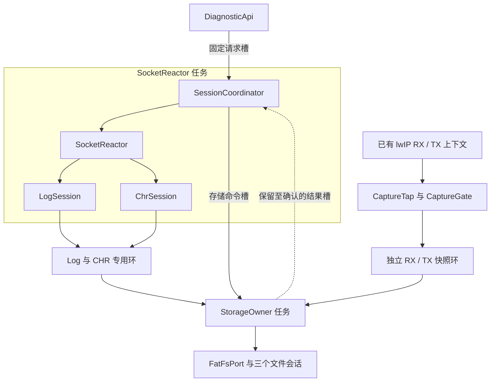
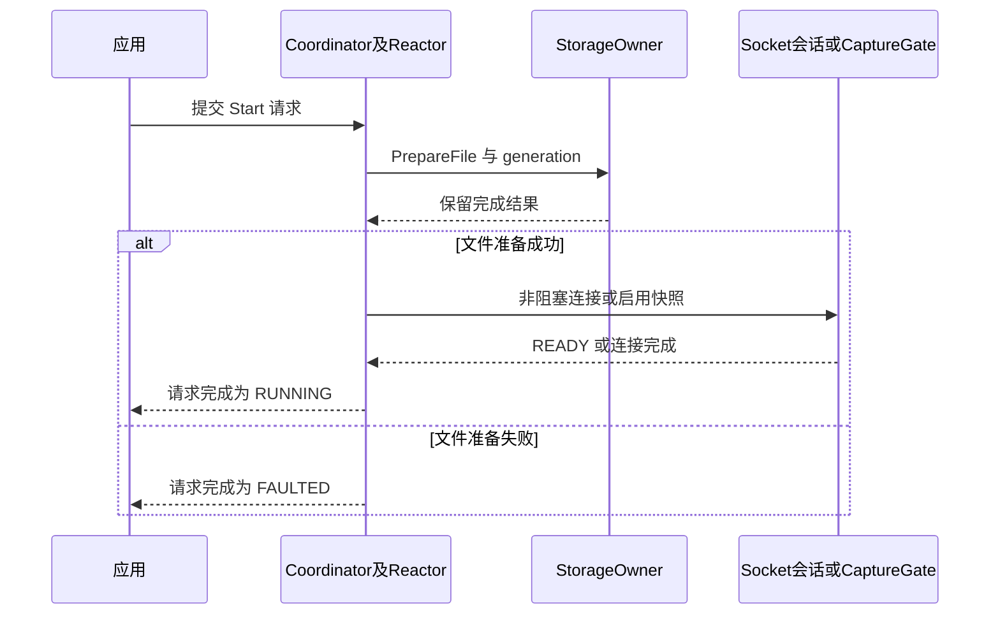
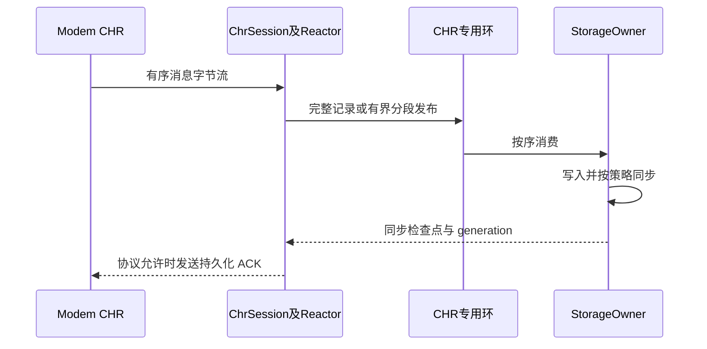

# C++ 实现架构：双 Socket 与本地 TCPDump

本文是[统一设计基线](01-diagnostics-unified-design.md)的 C++ 落地设计，延续 STM32、lwIP、FreeRTOS、FatFs 假设。重点是类职责、执行上下文、消息契约、所有权与生命周期，不是已经编译验证的固件。接口片段是设计草图，省略平台适配实现。

## 1. 总体选择

采用 **C++17 静态组合、两个应用任务、三个持久业务会话**：

- `SocketReactor` 任务：唯一操作 ModemLog、CHR 两个 Socket，同时推进轻量 `SessionCoordinator` 状态机。
- `StorageOwner` 任务：唯一操作三类诊断文件、PCAP 序列化、轮转、同步与存储恢复。
- `CaptureTap`：在已有 RX/TX 上下文执行有界只读快照，不创建第三个接收线程，也不创建第三个 Socket。
- `DiagnosticSystem`：静态持有上述对象、固定环、命令槽、任务栈和配置；对象寿命覆盖所有任务及回调。

**类不是线程，会话不是线程，调用方法也不会自动切换线程。** “异步”明确由消息槽和事件循环实现，不用 `std::async`、线程池或协程隐藏执行上下文。两个任务只是应用增量，不包含 lwIP、驱动和系统原有任务。

本设计用 C++ 的类型与访问控制表达边界，不以继承层次模拟 Java 服务框架。静态资源和 RAII 可结合使用；对硬实时环境限制动态分配属于项目约束，不是 C++ 语言要求。[^cpp-guidelines]

## 2. 模块与任务映射



| C++ 类型 | 责任与状态 | 调用上下文 | 禁止事项 |
|---|---|---|---|
| `DiagnosticSystem` | 组合资源、初始化顺序、任务启动 | 启动阶段 | 活动期间搬移、析构或重新构造 |
| `DiagnosticApi` | 校验参数、提交值类型命令、查询请求结果 | 已有应用任务 | 直接读写 fd、FIL、业务解析器 |
| `SessionCoordinator` | 三业务控制状态、超时、request ID 与 generation | Reactor 内 | 等待文件完成、同步等远端 ACK |
| `SocketReactor` | select、两 fd 的连接/读/写/关闭、每轮预算 | Reactor | 阻塞 recv、f_write、替别人关闭 fd |
| `LogSession` | Log fd、分帧、半包、发送偏移、背压与序号 | Reactor | 把状态放在短任务栈里 |
| `ChrSession` | CHR fd、消息分段、可靠性协议、待发送 ACK | Reactor | 假定 recv 边界就是消息边界 |
| `CaptureGate` | 启用配置、进入许可、inflight、代际切换 | 控制端与 tap，短同步保护 | 未静默就回收配置或清环 |
| `CaptureTap` | 过滤、限速、私有快照发布 | 已有网络任务 | 阻塞、调用文件系统、保留原 pbuf |
| `DataRings` | 三业务独立容量，capture 分 RX/TX | 指定生产者与 Storage | 多个消费者推进同一消费索引 |
| `StorageOwner` | 公平消费、FIL、staging、accepted/sync 进度 | Storage | 持有网络锁等待 SD |
| `PcapEncoder` | 按字段编码经典 PCAP | Storage | 直接把有 padding 的结构体写文件 |
| `LwipSocketPort` / `FatFsPort` | 封装 C API、错误码及平台契约 | 各自 Owner | 假装底层阻塞调用天然可取消 |

`SessionCoordinator` 管的是**控制状态**；Socket 的 fd/parser 仍只归 Reactor，`FileSession` 的 FIL/偏移/同步点只归 Storage。不要设计一个同时含 FIL、fd、可变 parser 的共享大对象再给所有线程加锁。

三个业务可共用 `SessionId`、结果格式和生命周期概念，但不强求统一 `read()` 接口：TCPDump 是生产回调，没有可读 fd。Log 和 CHR 可复用 `SocketSession<Parser>` 的少量编译期逻辑，业务策略仍显式区分；避免为了统一接口加虚假的线程或 Socket。

## 3. 资源组合与目录建议

所有池、TCB 和栈按链接映射可见地静态预留。构造函数只建立内存关系；`initialize()` 显式初始化 lwIP/RTOS 适配、环和命令槽；`start_tasks()` 最后创建任务。全局构造阶段不得打开文件或启动尚未就绪的 RTOS。

```cpp
// 示意：各成员类型、构造注入和硬件适配另行实现。
class DiagnosticSystem final {
public:
    DiagnosticSystem() noexcept;
    DiagnosticSystem(const DiagnosticSystem&) = delete;
    DiagnosticSystem& operator=(const DiagnosticSystem&) = delete;
    DiagnosticSystem(DiagnosticSystem&&) = delete;
    DiagnosticSystem& operator=(DiagnosticSystem&&) = delete;

    Status initialize() noexcept;       // 调度器状态符合平台约定
    Status start_tasks() noexcept;      // 失败时回滚已启动部分
    DiagnosticApi& api() noexcept;

private:
    DataRings rings_;                   // 不把大数组放启动任务栈上
    ControlTransport control_;
    CaptureGate capture_gate_;
    CaptureTap capture_;
    SocketReactor reactor_;             // 内含 coordinator、Log/CHR状态
    StorageOwner storage_;              // 内含3个 FileSession 和 staging
    StaticTaskStorage reactor_task_;    // TCB + 经测量确定的栈
    StaticTaskStorage storage_task_;
};
```

| 建议路径 | 内容 |
|---|---|
| `diag/api/` | 命令、结果、业务 ID、只读状态快照 |
| `diag/control/` | 会话状态机、request 槽与 owner 间握手 |
| `diag/socket/` | Reactor、Log/CHR parser、有限发送队列 |
| `diag/capture/` | Tap、Gate、过滤器、快照元数据 |
| `diag/buffer/` | 静态环、生产/消费 lease、容量不变量 |
| `diag/storage/` | 文件会话、调度、PCAP 编码、检查点 |
| `ports/` | lwIP、FreeRTOS、FatFs、时钟与 DMA 适配 |
| `tests/host/` | parser、环、协议状态机、PCAP 黄金样本 |
| `tests/target/` | 栈、hook 周期、并发与存储故障注入 |

这只是目录建议，本次提交不声称已创建完整固件工程。

## 4. 三种交互方式，不混用

### 4.1 同 Owner：普通方法调用

Reactor 直接调用 `LogSession::on_readable()`、`ChrSession::on_writable()` 和 `coordinator.step()`。这些方法都是短步骤，不能同步等待另一个任务。Storage 直接调用 `PcapEncoder` 和 `FatFsPort`；这里允许有界存储等待。

### 4.2 跨 Owner 控制：小命令与明确结果

控制面用静态、固定容量 transport，不把大 payload 搬进控制队列。示意类型：

```cpp
enum class Service : std::uint8_t { ModemLog, Chr, Capture };
enum class Op : std::uint8_t { Start, Stop, Checkpoint, Query };
enum class SubmitStatus : std::uint8_t { Accepted, Busy, Invalid };

struct RequestId {
    std::uint16_t slot;
    std::uint32_t epoch;  // 槽复用代际；回绕必须有设计约束
};

struct Command {
    RequestId request;
    Service service;
    Op operation;
    std::uint32_t session_generation;
    std::uint32_t deadline_tick;
    ConfigId config;      // 已提交的固定配置槽，不是临时指针
};

struct SubmitResult {
    SubmitStatus status;
    RequestId request;    // 仅 Accepted 时有效
};

class DiagnosticApi final {
public:
    SubmitResult try_submit(const CommandSpec&) noexcept;
    ResultStatus try_get_result(RequestId, Result&) noexcept;
    Status release_result(RequestId) noexcept;
};
```

契约如下：

1. `Accepted` 只表示请求被可靠接收，不表示已启动/停止/持久化。最终结果由 request ID 查询。
2. API 将小参数复制到固定槽。配置按值复制或用已冻结的 `ConfigId`；禁止队列持有调用者栈上的 `Command*`、`string_view`、回调捕获引用等临时视图。
3. 多调用者入口使用 FreeRTOS 静态队列/受短临界区保护的请求池，不能误称 SPSC。提交失败返回 `Busy`，不悄悄丢控制请求。
4. 每业务最多一个进行中的生命周期转换。对应 Reactor→Storage 命令槽和 Storage→Reactor 完成槽预留，不与抓包通知抢容量。
5. 完成记录直到收到确认才复用；通知只提示“可能有工作”，不是唯一的完成存证。请求池满时拒绝新请求；客户端超时不代表它有权提前释放仍在执行的槽。
6. 用户请求结果和内部存储完成槽分别管理。即便用户迟迟未取结果，Reactor 仍可消费内部完成并继续正常服务；用户占满的结果槽只影响新控制请求。
7. 不从 Reactor、tap 或 Storage 同步等待 `DiagnosticApi` 结果；它们可能正是完成该请求所需的执行者。需要用户回调时由已有应用任务消费结果，禁止在网络热路径调用任意用户代码。
8. 接受 Start 前保留其清理所需控制容量。普通命令队列满不能阻止存储故障关停：预留每业务 sticky fault/stop 状态，使用正确同步、最终确认后清除。重复 Stop 合并，不能覆盖未完成 Start 而丢掉原请求结果。

Socket send 的较大命令内容若超出小命令槽，用**独立有界控制块池**和句柄传递；发送期间 Reactor 持有，短发送保存 offset，发送完或取消后归还。不得把传入指针保留到下个 select 周期。

### 4.3 数据面：静态环传递所有权

Log/CHR：Reactor 直接 `recv` 到自己的生产槽，发布后不可再改。Storage 读对应槽，完成消费或复制到私有 staging 后归还。

Capture：tap 只在当次调用内借用 `const pbuf*`，复制限长快照到私有槽后发布。原包无论快照成功与否都继续原路径；没有从网络 pbuf 到 Storage 的引用传递。

Task Notification 用于唤醒 Storage；它不负责承载数据、序号和完成结果，也不能直接唤醒 lwIP `select()`。Reactor 用有限超时重新检查命令/空闲空间，初始 10ms 只是待测值。Storage 使用“先发布再通知；检查有无工作后才等待”的持久通知协议，不能在检查空环之后无条件清掉新来的通知。[^rtos][^lwip-sockets]

## 5. 数据缓冲的 C++ 所有权模型

### 5.1 用不可复制的 lease 包装预约

避免裸 `void*` 四处传递。生产端可用 `ProducerLease` 表示一个尚未发布的槽；析构只取消尚未发布的预约，不做 I/O。消费者 lease 仅在 Storage 中存在；析构只归还已明确解除底层访问依赖的槽。

```cpp
// 接口草图：不是跨线程队列元素，不可直接 memcpy 进 RTOS 队列。
class ProducerLease final {
public:
    ProducerLease(const ProducerLease&) = delete;
    ProducerLease& operator=(const ProducerLease&) = delete;
    ProducerLease(ProducerLease&&) noexcept;
    ~ProducerLease() noexcept;          // 未发布则取消；发布后为空

    MutableBytes bytes() noexcept;     // 只在 lease 有效期间可写
    Status publish(const BlockMeta&, std::size_t used) noexcept;
};
```

`publish()` 必须检查 used 不超过槽容量；成功后使 lease 失效。若 C API 队列按字节复制元素，只传 trivially-copyable 的 slot ID、generation 和长度；不要把带析构函数的 lease/`unique_ptr` 当作字节数组投递。

槽在 READY 时由环拥有，Storage acquire 取得后由消费者拥有。`ConsumerLease` 不可离开 Storage 的同步消费边界；若以后真正异步提交 DMA，必须移动到显式 `InFlightWrite` 中，不能让普通作用域析构提前归还缓冲。主方案的 FatFs 适配要求调用返回时驱动不再使用调用者缓冲。[^fatfs-dwrite]

### 5.2 原子发布与归还

每个 Log/CHR 环有一个生产者与一个消费者；槽 payload 本身可非原子，索引要提供两向同步：

| 动作 | 顺序与约束 |
|---|---|
| 生产者写入槽 | 先 acquire 观察消费索引，确认槽已归还，再写 payload/meta |
| 发布新槽 | write index 的 release store |
| 消费者读取槽 | acquire load write index 后读取对应 payload/meta |
| 消费者归还槽 | 最后一次读取结束后，read index 的 release store |

release/acquire 要作用于相匹配的发布变量；`volatile`、一次普通 bool 写或只在写者侧加 fence 不能代替完整同步设计。C++ 内存序负责 CPU 间可见性关系，不自动完成 DMA Cache clean/invalidate。[^cpp-order]

使用 `std::atomic<std::uint32_t>` 时，在选定编译器与板卡上验证 lock-free 属性、对齐与汇编。标准并不承诺所有原子类型都无锁；32位MCU上的64位计数不要默认在热路径做原子 RMW。

### 5.3 多生产者 capture lane

RX/TX 分环仍不自动意味着各只有一个调用上下文。可用一次 `atomic_flag::test_and_set` 的 try-guard：忙则丢当前快照，不在 C++ 层反复自旋。`atomic_flag` 操作有 lock-free 要求，但 **lock-free 不等于固定周期/等待无界不存在**；目标端实现可能有内部独占指令重试，必须审核最坏情况，不能用标准性质直接证明 hook WCET。[^cpp-flag]

若目标要求更严格上界，优先按已知生产上下文拆成真正 SPSC lane；或由平台提供经审核的极短 try-admission 临界区，仅保护占用位，复制期间不关中断。这里的互斥只是捕获生产者之间，正常报文处理绝不等它释放。

busy-drop 统计也要同步：失败路径未取得 lane guard，不能直接对同一个普通计数器 `++`。选择每已知上下文计数或经审核的原子计数；统计汇总不得引入新的网络锁。

## 6. C ABI 与已有 lwIP/FreeRTOS 的接法

不改写整个 C 协议栈。C++ 类通过少量 C-linkage trampoline 接入；按实际头文件处理已有 `extern "C"` 保护，不能把含模板的 C++ 头整段套进 C linkage。

```cpp
// 示意：由平台启动代码把稳定对象地址作为 task parameter 传入。
extern "C" void diag_socket_task_entry(void* context)
{
    static_cast<SocketReactor*>(context)->run_forever();
    platform_task_entry_returned(); // 致命配置错误；必须 noreturn
}

extern "C" err_t diag_rx_input(struct pbuf* p, struct netif* n)
{
    // 稳定静态注册表，返回前已建立合法原 input，不能递归注册自身。
    auto& binding = capture_binding_for(n);
    binding.tap->observe(p, binding.interface_id, Direction::Rx);
    return binding.original_input(p, n);
}
```

`observe()` 是 `noexcept`、只读、不逃逸 pbuf 指针。它内部通过 Gate 取得稳定配置和在途许可，执行过滤/预算/快照，离开前释放许可。无效快照只影响 capture 统计，不改变 `original_input` 返回值及其既有释放约定。

原驱动可能已占用 `netif->state`；不得直接覆盖为 C++ `this`。用编译期容量的 per-netif 绑定表，或目标 lwIP 支持且明确分配的 client-data 槽。注册变更遵循 lwIP core/API 约束；独立 RX 驱动上下文还需停用/静默协议，不能仅拿 core lock 就认定所有 RX 回调都退出。[^lwip-main][^lwip-netif]

首版 wrapper 和 binding 建议常驻，Start/Stop 只切换 CaptureGate；无需每次启停替换函数指针。硬件网络驱动使用常驻对象，不让其回调引用一个临时 `CaptureSession`。

网络 hook 放在能稳定读取包的任务上下文。若实际端口直接在 ISR 交付，先审查驱动结构；不要把普通通知、C++ 隐式分配或文件操作搬进 ISR。

## 7. 启动与正常交互

### 7.1 先准备文件，再允许生产



图中的 Coordinator 和 Reactor 在同一个任务；与 SocketSession 的交互是短方法调用，不是额外线程。`connect` 也必须采用非阻塞状态机：进行中只登记可写事件和截止时间，完成时查 Socket 错误；不能在 Start 内阻塞数秒。用固定 IPC 地址可避免额外 DNS 等待。

Capture 启动时文件头先准备成功，再发布不可变配置、generation 和 enabled。Log/CHR 连接成功后按实际协议启动发送；若对端连接后立即送数据，文件和接收环已经准备好。失败回滚仍由原 Owner 关闭资源，不能由 API 调用方越权释放。

### 7.2 ModemLog：字节流持续性

Reactor 用 LogSession 中长期存在的 parser、填充偏移和记录序号处理任意分片。槽满或填充截止时间到便发布；每轮读预算耗尽后服务 CHR，下一轮从相同对象状态继续。**连续性来自状态保存和顺序消费，不来自某个线程一直运行。**

Log 高水位仅停止该 fd 的 read interest；停止读会增加对端压力，源端缓存与暂停协议必须配套。不能让 LogSession 在发送暂停后同步等 ACK，阻断同一 Reactor 内的 CHR。

### 7.3 CHR：按确认等级返回结果



这是“CHR需要持久化确认”时的可选协议，不是假定所有CHR都如此。Storage 不调用 send，只返回同步进度；Reactor 生成 ACK 并用有限发送队列处理短发送。

若协议支持累计 ACK，可用已同步的连续 record ID 水位，不得跨过缺失/失败记录。若每条 ACK 语义不同，就使用有界逐条完成账本；满时背压 CHR，不能用“最新结果覆盖旧结果”的邮箱丢掉必须返回的 ACK。

### 7.4 TCPDump：失败只丢副本

`observe()` 取得许可后依次进行接口范围检查、无共享写入的快速过滤、try-guard、受保护的pps/字节预算、预约私有槽、有限 pbuf 链复制、发布。共享token状态也必须在guard内更新，不能只保护槽而遗漏限速器的数据竞争。所有失败路径释放本次取得的许可/预约；原包照常交付，不向原业务返回 capture error。

Storage 用低优先级预算消费 Capture RX/TX，通过 `PcapEncoder` 写独立文件。默认接口/方向分文件，raw-IP 的文件 LINKTYPE 为101，以太网为1；TX 表示软件提交观察，不等于蜂窝发送成功。格式与吞吐细节沿用统一方案。

## 8. 停止与故障：异步状态机，而非析构救场

### 8.1 Capture 停止

1. Coordinator 请求 Gate 关闭 admission；进入许可和关闭动作通过同一同步协议线性化，避免“先读 enabled，后加 inflight”的竞态。
2. 已进入的 tap 使用旧代稳定配置完成有限复制并退出。Coordinator 每轮检查完成状态，**不在 Reactor 中循环等待**，CHR仍继续运行。
3. inflight 归零后记录 RX/TX 生产终点；给 Storage 下达 `DrainAndClose(generation, end_positions)`。到终点前仍需消费，不能靠某一瞬间 ring empty 就提前关文件。
4. Storage 完成剩余数据、同步/关闭，返回可靠完成记录；Coordinator 才宣布 STOPPED，并允许复用本代配置和槽。

停止只关 capture，不关闭 WAN netif。generation 用于识别旧事件，不能替代 in-flight 退出证明。超时进入 FAULTED，保留仍可能被访问的内存；不得清环、析构对象或强制释放活跃 DMA 缓冲。

### 8.2 Socket 业务停止

Reactor 发源端停止请求并按截止时间读尾部，处理控制响应后关闭对应 fd，发布残留块与最终生产序号。Storage 收到生产结束终点后排空并关闭对应文件，其他业务照常调度。Socket 的 close/linger/未发数据丢弃策略必须按目标 lwIP 审核，不能仅凭“fd 非阻塞”宣称 close 必然即时返回；需要的话设有限关闭策略并报告尾部丢失。

### 8.3 资源析构规则

RAII适合保证短期 guard、未发布预约等成对释放；持久资源还要满足执行上下文和错误报告要求。

| 资源 | 释放方法 |
|---|---|
| producer lease / try-guard | 当前作用域析构，无等待，无 I/O |
| 活动 Socket | Reactor 显式状态转换关闭；Owner 析构只允许在已静默且 fd 无效时发生 |
| FIL | Storage 显式 close 并记录结果；不能在 API 调用线程析构时 f_close |
| DMA 使用中的内存 | 驱动完成或确认 abort 后才可归还 |
| 静态任务与栈 | 常驻阻塞，不用业务对象析构调用 vTaskDelete |
| DiagnosticSystem | 正常固件运行期间不析构；测试 teardown 必须先 quiesce/join |

FreeRTOS 任务函数不会像普通 C++ 子程序那样通过返回来实现安全停机；也不能指望 `vTaskDelete()` 自动展开任务栈上的所有 C++ 局部对象。必要清理由显式协议完成，长期任务回到阻塞等待即可。[^rtos]

SD故障时 Storage 保留错误状态并使 capture admission 尽快关闭；若通知迟到，抓包池满也只丢副本。`f_write` 自身若被坏驱动永久挂住，C++ deadline 不能把它强行取消，必须在驱动层有超时和 DMA 停止契约。Log/CHR共用SD也不能获得互相独立的持久化最坏时延。[^fatfs-dwrite][^fatfs-write]

## 9. C++ 运行时裁剪原则

| 机制 | 首版选择 | 原因/边界 |
|---|---|---|
| 内存 | `std::array`、静态池、固定容量槽 | 热路径无堆分配；Socket/lwIP内部内存另行预算 |
| 抽象 | 具体类和少量模板 | 明确对象与任务；模板实例数量受控，检查代码体积 |
| 多态 | 固定 port 引用或有限函数表 | 虚函数本身不必堆分配；只有实测收益才裁剪 |
| 错误 | 显式 `Status/Result` 与 `noexcept` | noexcept不是自动错误处理；禁止可能抛出的调用穿越C边界 |
| 异常与RTTI | 可按整套工具链策略关闭 | 非强制；库ABI与编译选项要一致验证，不混用不兼容构建 |
| 所有权 | 静态组合与不可复制 lease | 热路径不使用 shared_ptr 的共享回收语义 |
| 回调 | C trampoline + 稳定 context | 不依赖可能动态分配的通用回调包装 |
| 字符串 | 固定数组或有明确调用期的视图 | 异步保存前复制，长度上限明确 |
| 调度 | FreeRTOS 静态任务与有界状态机 | 不叠加 std::thread/std::async 运行时 |
| 日志 | 限长计数与低频诊断输出 | 不在抓包 hook 内打印或递归记录自身 |

这不是“C++不用堆所以整个系统不用堆”的承诺：lwIP PCB、pbuf、netconn、FatFs配置和现有BSP可能仍分配内存。分别审计应用分配次数、协议栈池峰值、链接图和栈水位。

双任务及主文档98KiB的数据预算不因换C++自动减少。对象中的多态表指针、环元数据、控制槽、对齐和栈都要用目标 `sizeof`/map 文件实测，不能直接用源码行数估算。

## 10. C++ 专项测试与实施顺序

先做可在主机跑的纯逻辑，再接端口，最后上板证明时序：

1. `LogParser/ChrParser`：所有分片边界、超长消息、断线残帧、重连代际、短发送。
2. 环与 lease：满/空、索引回绕、取消预约、移动后失效、发布后禁止写、错误路径只归还一次。
3. 控制 transport：多调用者、队列满、结果保留、超时后迟到结果、Start/Stop交错、无丢失关键完成。
4. Gate：enter/close竞争、producer被抢占、配置替换、inflight归零前禁止reset、busy统计无数据竞争。
5. Storage：部分写入、f_sync失败、DMA abort迟到、文件头/包记录黄金字节；不能把写成功当持久化成功。
6. 上板：确认原子指令、hook最坏耗时、栈水位、关闭/连接最长步骤、通知与select响应上界。
7. 联合压力：Log 1Mbps + CHR + WAN高pps + SD长尾；抓包关闭/开启A/B，并强制池满验证只丢副本。

主机的 sanitizer 或单元测试不能替代目标ISR、Cache、DMA与lwIP版本验证；反过来“板上暂时没崩”也不等于C++内存模型正确。

如果后续确实加入压缩worker，它只能获得有界不可变输入句柄，返回带generation和序号的结果，由固定Owner按序提交；不得持有fd、FIL、原网络pbuf或决定DMA缓冲回收。线程退出前必须解除其全部job所有权，业务状态继续留在持久Session中。当前未发现必须为此增加worker的依据。

## 11. 依据与设计性质

以下依据支撑语言/平台契约；类拆分、双任务编排、邮箱及预算是本项目的设计选择，不是上游库现成提供的框架。研究日期2026-09-10；C++工作草案仅用于内存模型说明，不代表本方案要求使用最新草案语言特性，实际目标为经工具链验证的C++17。

[^cpp-guidelines]: [C++ Core Guidelines：R.1资源管理及项目约束](https://isocpp.github.io/CppCoreGuidelines/CppCoreGuidelines#Rr-raii)。本方案借助资源句柄表达所有权，但对线程归属和需要返回错误的关闭操作采用显式协议。
[^cpp-order]: [C++工作草案：atomics.order](https://eel.is/c++draft/atomics.order)，release/acquire同步关系。
[^cpp-flag]: [C++工作草案：atomics.flag](https://eel.is/c++draft/atomics.flag)，atomic_flag的lock-free要求；不据此推导目标硬实时上界。
[^rtos]: [FreeRTOS-Kernel task.h](https://github.com/FreeRTOS/FreeRTOS-Kernel/blob/main/include/task.h)，任务入口、静态创建、删除及通知契约。
[^lwip-main]: [lwIP官方源码：线程模型](https://github.com/lwip-tcpip/lwip/blob/master/doc/doxygen/main_page.h)，Socket控制块与core线程约束。
[^lwip-sockets]: [lwIP官方源码：sockets.c](https://github.com/lwip-tcpip/lwip/blob/master/src/api/sockets.c)，select、非阻塞Socket与关闭实现须按实际版本复核。
[^lwip-netif]: [lwIP官方源码：netif.h](https://github.com/lwip-tcpip/lwip/blob/master/src/include/lwip/netif.h)，回调类型、state/client data及接口契约。
[^fatfs-dwrite]: [FatFs disk_write](https://elm-chan.org/fsw/ff/doc/dwrite.html)，调用者缓冲寿命与延迟写边界。
[^fatfs-write]: [FatFs f_write](https://elm-chan.org/fsw/ff/doc/write.html)，错误返回和部分写入；结合[同步契约](https://elm-chan.org/fsw/ff/doc/sync.html)处理检查点。
