# Modem Diagnostic System Mermaid Flowcharts

This page is consistent with [Unified Design Baseline](01-diagnostics-unified-design.md) and [C++ Implementation Architecture](02-cpp-architecture-and-interactions.md): ModemLog and CHR each utilize a dedicated TCP Socket; TCPDump captures packets via a local bypass on the MCU and is no longer modeled as a third Modem socket. The illustrations convey the recommended design rather than driver-level implementation guarantees. Figures 10 through 12 detail C++ modules and their runtime interactions.

## 1. Overall Data Path: Dual Sockets and Local Snapshot

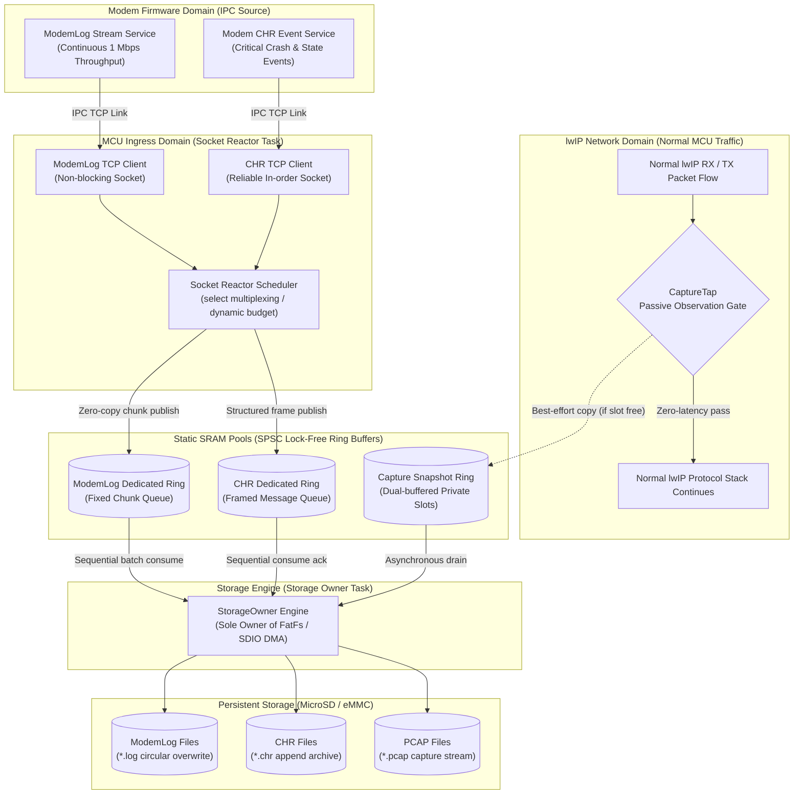

## 2. Socket Reactor Fair Scheduling

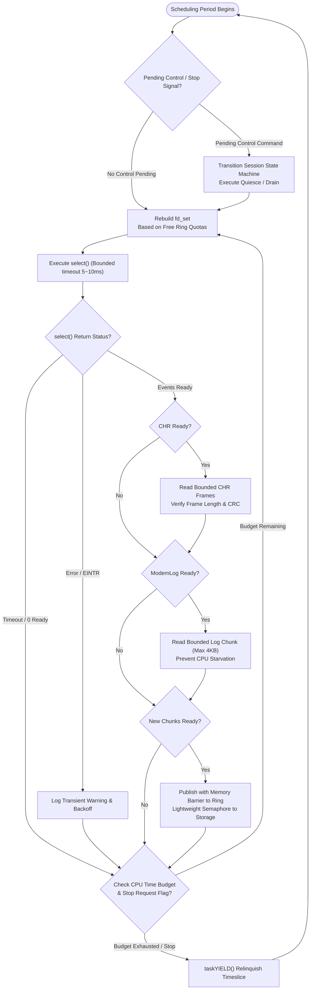

## 3. Capture Tap Failure Pass-Through Flow

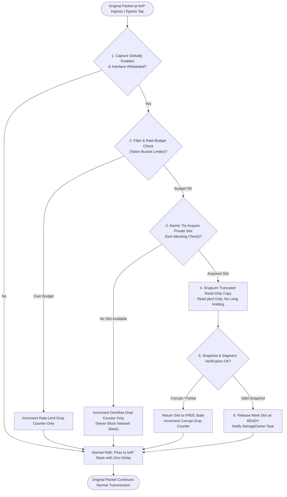

## 4. Slot Ownership State Machine

```mermaid
stateDiagram-v2
    [*] --> FREE: Cold Boot Static Pool Allocation

    state "FREE (Idle / Available)" as FREE
    state "FILLING (Producer Reserved & Writing)" as FILLING
    state "READY (Published / Awaiting Drain)" as READY
    state "READING (Storage Exclusive In-flight)" as READING
    state "ERROR_HELD (Fault Retained for Recovery)" as ERROR_HELD

    FREE --> FILLING: Producer Atomic Try-Reserve Success\n[Producer Try-Acquire]
    FILLING --> READY: Verification Pass & Memory Barrier\n[Release Publish]
    FILLING --> FREE: Verification Failed / Rollback Discard\n[Rollback Discard]

    READY --> READING: Storage Engine Atomic Acquire\n[Storage Acquire]
    READING --> FREE: DMA Flush & Sector Sync Complete\n[Storage Release]
    READING --> ERROR_HELD: SDIO/DMA Bus Fault; Preserve Context\n[IO Failure]

    ERROR_HELD --> FREE: DMA Abort Confirmed & Channel Cleaned\n[Fault Recovery Clean]
```

## 5. Public Network and IPC Routing Boundary

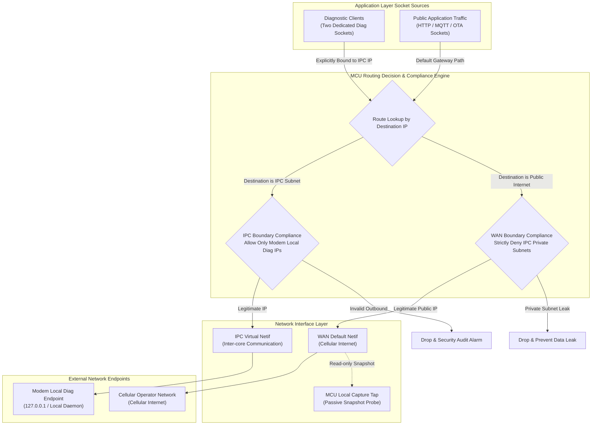

## 6. Safe Business Quiescence and Stop Protocol

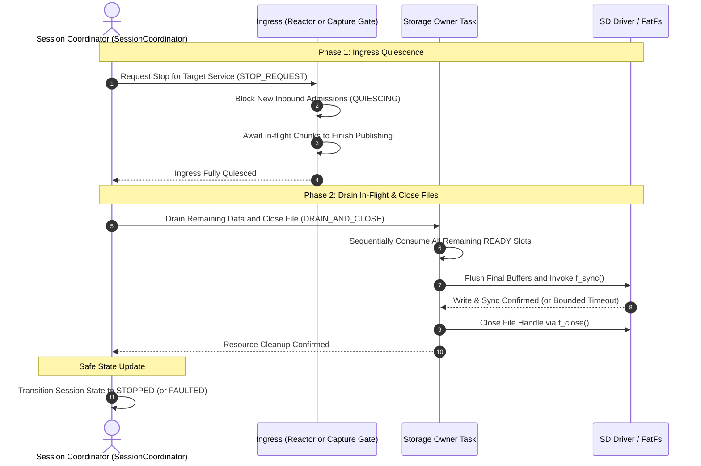

## 7. Packet RX/TX and Snapshot Copy Sequence

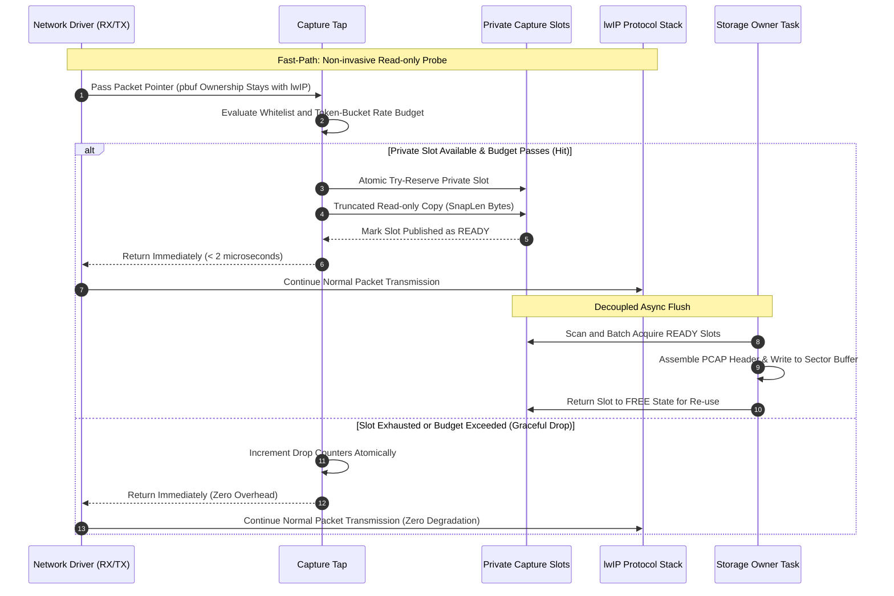

## 8. Tiered Backoff Under Storage Overload

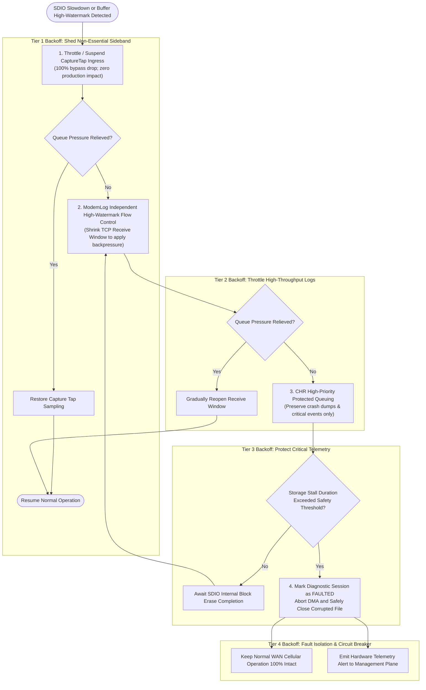

## 9. Session State Machine (Not Thread Lifecycle)

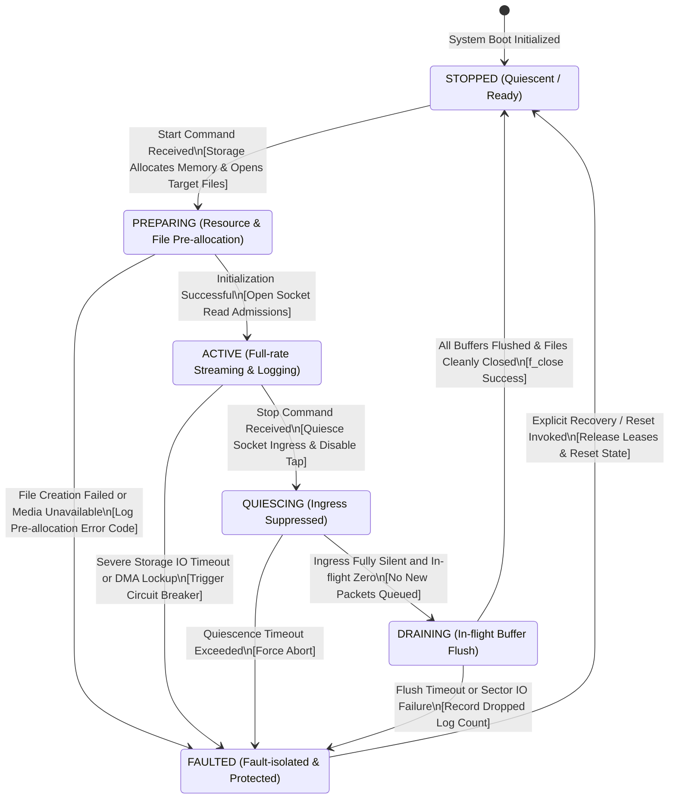

## Critical Reading Constraints

- Capture failure drops only the copy; the original packet continues unaffected. This is not a zero-CPU guarantee.
- The two application tasks are Socket Reactor and Storage Owner, distinct from existing lwIP/driver/RTOS tasks.
- Capture RX/TX may execute concurrently; private slots and non-spinning try-guards prevent prolonged holds on lwIP pbufs.
- Storage is the single consumer managing FIL handles; buffer recycling and filesystem persistence are decoupled events.
- Interface layers, offload semantics, PCAP LinkType, and invocation contexts align strictly with the [Baseline Design](01-diagnostics-unified-design.md).

## 10. C++ Modules and Execution Context

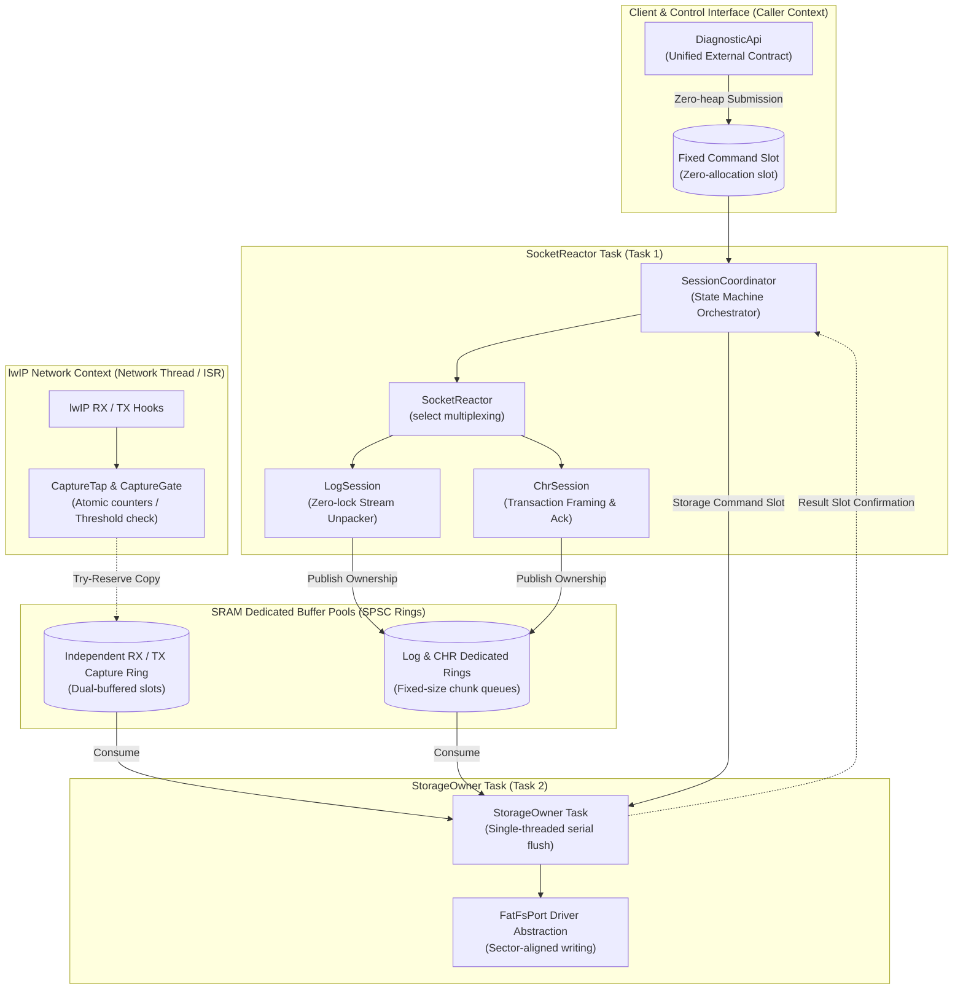

## 11. C++ Asynchronous Start Sequence

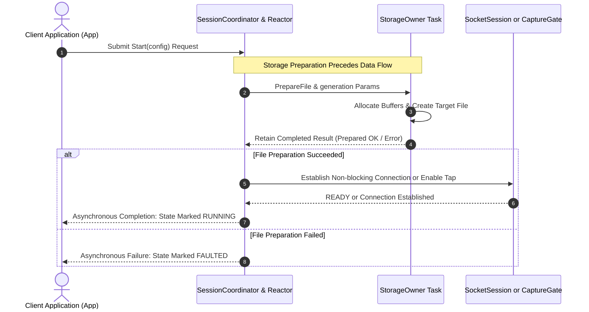

## 12. CHR Reliable Persistence Ack Flow

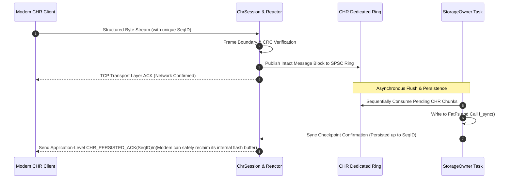
