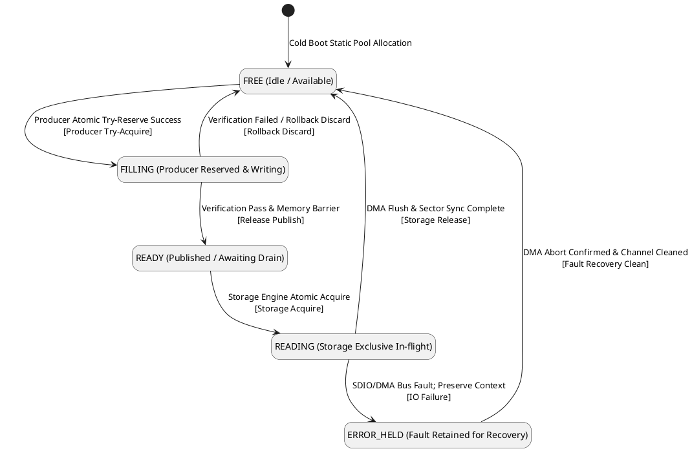
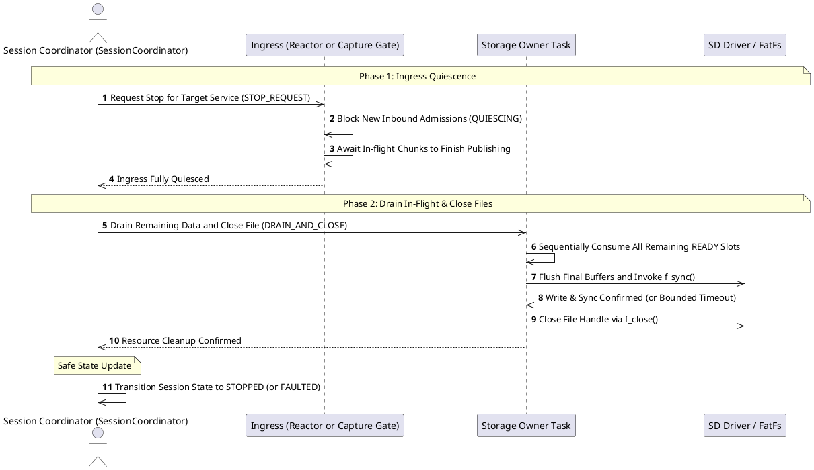
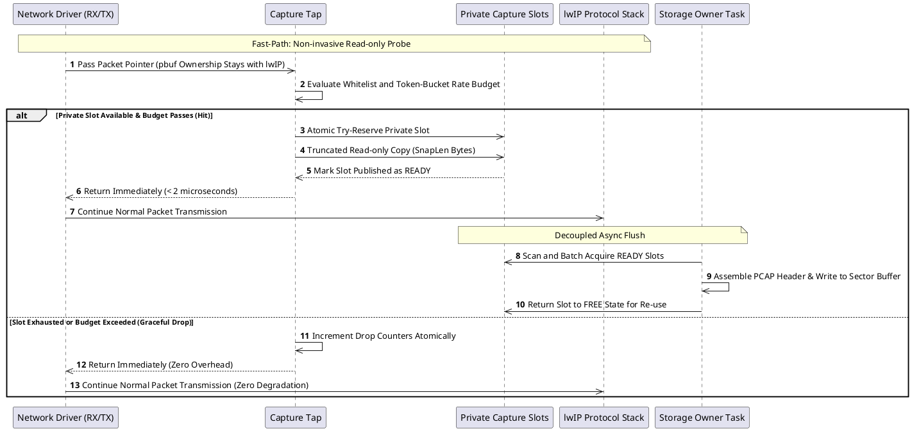
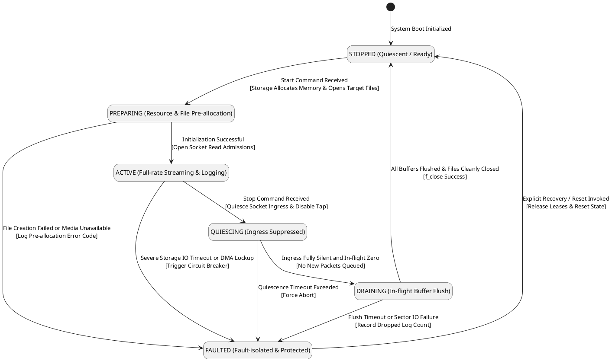
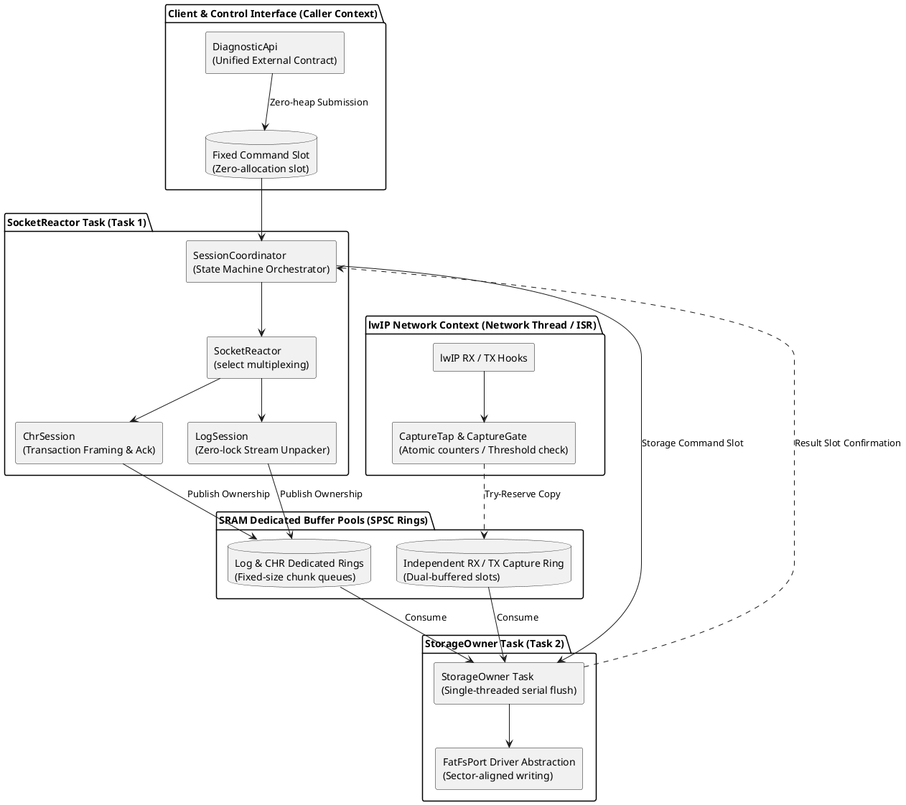
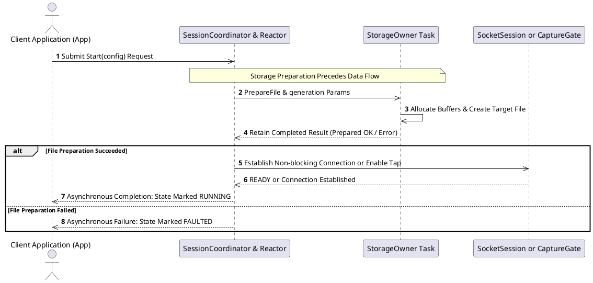
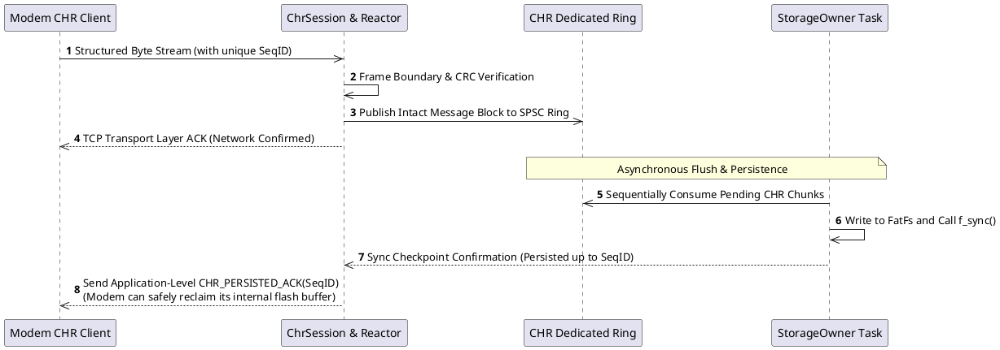

# Modem Diagnostic System PlantUML Diagrams

This page is consistent with [Unified Design Baseline](01-diagnostics-unified-design.md) and [C++ Implementation Architecture](02-cpp-architecture-and-interactions.md): ModemLog and CHR each utilize a dedicated TCP Socket; TCPDump captures packets via a local bypass on the MCU and is no longer modeled as a third Modem socket. The illustrations convey the recommended design rather than driver-level implementation guarantees. Figures 10 through 12 detail C++ modules and their runtime interactions.

## 1. Overall Data Path: Dual Sockets and Local Snapshot

```plantuml
@startuml
hide stereotype
skinparam shadowing false

package "Modem Firmware Domain (IPC Source)" as MODEM {
  rectangle "ModemLog Stream Service\n(Continuous 1 Mbps Throughput)" as modemLog
  rectangle "Modem CHR Event Service\n(Critical Crash & State Events)" as modemChr
}
package "MCU Ingress Domain (Socket Reactor Task)" as INGRESS {
  rectangle "ModemLog TCP Client\n(Non-blocking Socket)" as logSock
  rectangle "CHR TCP Client\n(Reliable In-order Socket)" as chrSock
  rectangle "Socket Reactor Scheduler\n(select multiplexing / dynamic budget)" as reactor
}
package "lwIP Network Domain (Normal MCU Traffic)" as NETIF {
  rectangle "Normal lwIP RX / TX Packet Flow" as netTraffic
  diamond "CaptureTap\nPassive Observation Gate" as tap
  rectangle "Normal lwIP Protocol Stack Continues" as netStack
}
package "Static SRAM Pools (SPSC Lock-Free Ring Buffers)" as SRAM_POOLS {
  database "ModemLog Dedicated Ring\n(Fixed Chunk Queue)" as logRing
  database "CHR Dedicated Ring\n(Framed Message Queue)" as chrRing
  database "Capture Snapshot Ring\n(Dual-buffered Private Slots)" as capRing
}
package "Storage Engine (Storage Owner Task)" as STORAGE_DOMAIN {
  rectangle "StorageOwner Engine\n(Sole Owner of FatFs / SDIO DMA)" as storageExec
}
package "Persistent Storage (MicroSD / eMMC)" as MEDIA_FS {
  database "ModemLog Files\n(*.log circular overwrite)" as fileLog
  database "CHR Files\n(*.chr append archive)" as fileChr
  database "PCAP Files\n(*.pcap capture stream)" as filePcap
}

logSock --> reactor
chrSock --> reactor
netTraffic --> tap
tap --> netStack : Zero-latency pass
modemLog --> logSock : IPC TCP Link
modemChr --> chrSock : IPC TCP Link
reactor --> logRing : Zero-copy chunk publish
reactor --> chrRing : Structured frame publish
tap ..> capRing : Best-effort copy (if slot free)
logRing --> storageExec : Sequential batch consume
chrRing --> storageExec : Sequential consume ack
capRing --> storageExec : Asynchronous drain
storageExec --> fileLog
storageExec --> fileChr
storageExec --> filePcap
@enduml
```

## 2. Socket Reactor Fair Scheduling

```plantuml
@startuml
hide stereotype
skinparam shadowing false

rectangle "Scheduling Period Begins" as start
diamond "Pending Control / Stop Signal?" as checkCtl
rectangle "Transition Session State Machine\nExecute Quiesce / Drain" as handleCtl
rectangle "Rebuild fd_set\nBased on Free Ring Quotas" as buildFds
rectangle "Execute select() (Bounded timeout 5~10ms)" as doSelect
diamond "select() Return Status?" as selResult
diamond "Check CPU Time Budget\n& Stop Request Flag?" as checkBudget
rectangle "Log Transient Warning & Backoff" as logErr
diamond "CHR Ready?" as checkChr
rectangle "Read Bounded CHR Frames\nVerify Frame Length & CRC" as readChr
diamond "ModemLog Ready?" as checkLog
rectangle "Read Bounded Log Chunk (Max 4KB)\nPrevent CPU Starvation" as readLog
diamond "New Chunks Ready?" as checkPublish
rectangle "Publish with Memory Barrier to Ring\nLightweight Semaphore to Storage" as publish
rectangle "taskYIELD() Relinquish Timeslice" as yield

start --> checkCtl
checkCtl --> handleCtl : Pending Control Command
checkCtl --> buildFds : No Control Pending
handleCtl --> buildFds
buildFds --> doSelect
doSelect --> selResult
selResult --> checkBudget : Timeout / 0 Ready
selResult --> logErr : Error / EINTR
logErr --> checkBudget
selResult --> checkChr : Events Ready
checkChr --> readChr : Yes
checkChr --> checkLog : No
readChr --> checkLog
checkLog --> readLog : Yes
checkLog --> checkPublish : No
readLog --> checkPublish
checkPublish --> publish : Yes
checkPublish --> checkBudget : No
publish --> checkBudget
checkBudget --> buildFds : Budget Remaining
checkBudget --> yield : Budget Exhausted / Stop
yield --> start
@enduml
```

## 3. Capture Tap Failure Pass-Through Flow

```plantuml
@startuml
hide stereotype
skinparam shadowing false

rectangle "Original Packet at lwIP Ingress / Egress Tap" as pktIn
diamond "1. Capture Globally Enabled\n& Interface Whitelisted?" as checkEn
rectangle "Normal Path: Pass to lwIP Stack with Zero Delay" as passOriginal
diamond "2. Filter & Rate-Budget Check\n(Token Bucket Limiter)?" as checkBudget
rectangle "Increment Rate-Limit Drop Counter Only" as dropCount1
diamond "3. Atomic Try-Acquire Private Slot\n(Non-blocking Check)?" as acquireSlot
rectangle "Increment Overflow Drop Counter Only\n(Never Block Network Stack)" as dropCount2
rectangle "4. SnapLen Truncated Read-Only Copy\nRead pbuf Only; No Long Holding" as copyPkt
diamond "5. Snapshot & Segment Verification OK?" as checkValid
rectangle "Return Slot to FREE State\nIncrement Corrupt Drop Counter" as discardSlot
rectangle "6. Release Mark Slot as READY\nNotify StorageOwner Task" as publishSlot
rectangle "Original Packet Continues Normal Transmission" as pktOut

pktIn --> checkEn
checkEn --> passOriginal : No
checkEn --> checkBudget : Yes
checkBudget --> dropCount1 : Over Budget
dropCount1 --> passOriginal
checkBudget --> acquireSlot : Budget OK
acquireSlot --> dropCount2 : No Slot Available
dropCount2 --> passOriginal
acquireSlot --> copyPkt : Acquired Slot
copyPkt --> checkValid
checkValid --> discardSlot : Corrupt / Partial
discardSlot --> passOriginal
checkValid --> publishSlot : Valid Snapshot
publishSlot --> passOriginal
passOriginal --> pktOut
@enduml
```

## 4. Slot Ownership State Machine



## 5. Public Network and IPC Routing Boundary

```plantuml
@startuml
hide stereotype
skinparam shadowing false

package "Application Layer Socket Sources" as APPS {
  rectangle "Diagnostic Clients\n(Two Dedicated Diag Sockets)" as diagSockets
  rectangle "Public Application Traffic\n(HTTP / MQTT / OTA Sockets)" as wanApps
}
package "MCU Routing Decision & Compliance Engine" as ROUTING {
  diamond "Route Lookup by Destination IP" as routeTable
  diamond "IPC Boundary Compliance\nAllow Only Modem Local Diag IPs" as guardIPC
  diamond "WAN Boundary Compliance\nStrictly Deny IPC Private Subnets" as guardWAN
}
package "Network Interface Layer" as NETIFS {
  rectangle "IPC Virtual Netif\n(Inter-core Communication)" as netifIPC
  rectangle "WAN Default Netif\n(Cellular Internet)" as netifWAN
  rectangle "MCU Local Capture Tap\n(Passive Snapshot Probe)" as tap
}
package "External Network Endpoints" as EXTERNALS {
  rectangle "Modem Local Diag Endpoint\n(127.0.0.1 / Local Daemon)" as modemLocal
  rectangle "Cellular Operator Network\n(Cellular Internet)" as modemCell
}
rectangle "Drop & Security Audit Alarm" as dropIPC
rectangle "Drop & Prevent Data Leak" as dropWAN

diagSockets --> routeTable : Explicitly Bound to IPC IP
wanApps --> routeTable : Default Gateway Path
routeTable --> guardIPC : Destination is IPC Subnet
routeTable --> guardWAN : Destination is Public Internet
guardIPC --> netifIPC : Legitimate IP
guardIPC --> dropIPC : Invalid Outbound
guardWAN --> netifWAN : Legitimate Public IP
guardWAN --> dropWAN : Private Subnet Leak
netifIPC --> modemLocal
netifWAN --> modemCell
netifWAN ..> tap : Read-only Snapshot
@enduml
```

## 6. Safe Business Quiescence and Stop Protocol



## 7. Packet RX/TX and Snapshot Copy Sequence



## 8. Tiered Backoff Under Storage Overload

```plantuml
@startuml
hide stereotype
skinparam shadowing false

rectangle "SDIO Slowdown or Buffer High-Watermark Detected" as start
package "Tier 1 Backoff: Shed Non-Essential Sideband" as T1 {
  rectangle "1. Throttle / Suspend CaptureTap Ingress\n(100% bypass drop; zero production impact)" as tier1
  diamond "Queue Pressure Relieved?" as checkT1
  rectangle "Restore Capture Tap Sampling" as recoverT1
  rectangle "Resume Normal Operation" as normalState
  rectangle "2. ModemLog Independent High-Watermark Flow Control\n(Shrink TCP Receive Window to apply backpressure)" as tier2
}
package "Tier 2 Backoff: Throttle High-Throughput Logs" as T2 {
  diamond "Queue Pressure Relieved?" as checkT2
  rectangle "Gradually Reopen Receive Window" as recoverT2
  rectangle "3. CHR High-Priority Protected Queuing\n(Preserve crash dumps & critical events only)" as tier3
}
package "Tier 3 Backoff: Protect Critical Telemetry" as T3 {
  diamond "Storage Stall Duration\nExceeded Safety Threshold?" as checkTimeout
  rectangle "Await SDIO Internal Block Erase Completion" as waitRecovery
  rectangle "4. Mark Diagnostic Session as FAULTED\nAbort DMA and Safely Close Corrupted File" as tier4
}
package "Tier 4 Backoff: Fault Isolation & Circuit Breaker" as T4 {
  rectangle "Keep Normal WAN Cellular Operation 100% Intact" as keepWAN
  rectangle "Emit Hardware Telemetry Alert to Management Plane" as alertOps
}

start --> tier1
tier1 --> checkT1
checkT1 --> recoverT1 : Yes
recoverT1 --> normalState
checkT1 --> tier2 : No
tier2 --> checkT2
checkT2 --> recoverT2 : Yes
recoverT2 --> normalState
checkT2 --> tier3 : No
tier3 --> checkTimeout
checkTimeout --> waitRecovery : No
waitRecovery --> tier2
checkTimeout --> tier4 : Yes
tier4 --> keepWAN
tier4 --> alertOps
@enduml
```

## 9. Session State Machine (Not Thread Lifecycle)



## Critical Reading Constraints

- Capture failure drops only the copy; the original packet continues unaffected. This is not a zero-CPU guarantee.
- The two application tasks are Socket Reactor and Storage Owner, distinct from existing lwIP/driver/RTOS tasks.
- Capture RX/TX may execute concurrently; private slots and non-spinning try-guards prevent prolonged holds on lwIP pbufs.
- Storage is the single consumer managing FIL handles; buffer recycling and filesystem persistence are decoupled events.
- Interface layers, offload semantics, PCAP LinkType, and invocation contexts align strictly with the [Baseline Design](01-diagnostics-unified-design.md).

## 10. C++ Modules and Execution Context



## 11. C++ Asynchronous Start Sequence



## 12. CHR Reliable Persistence Ack Flow


