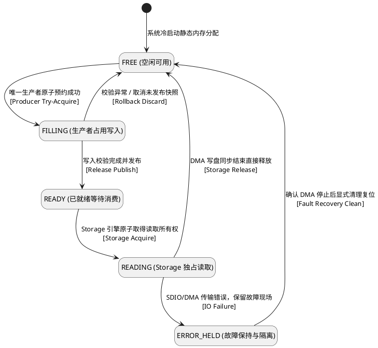
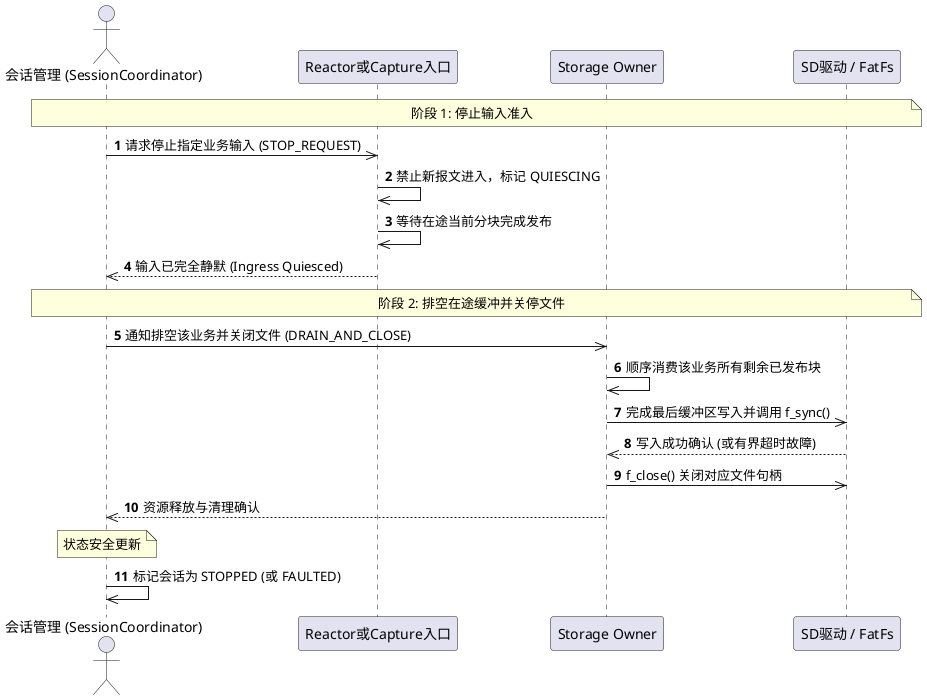
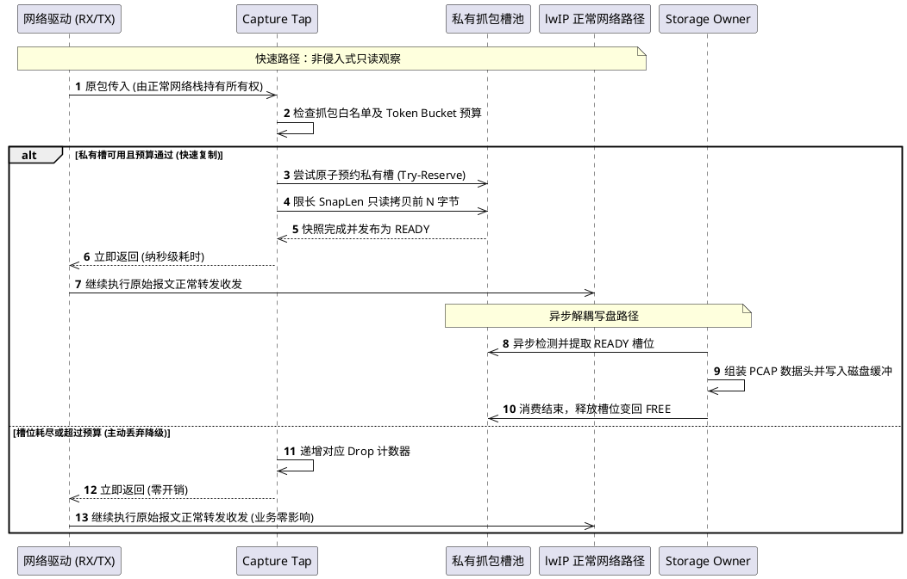
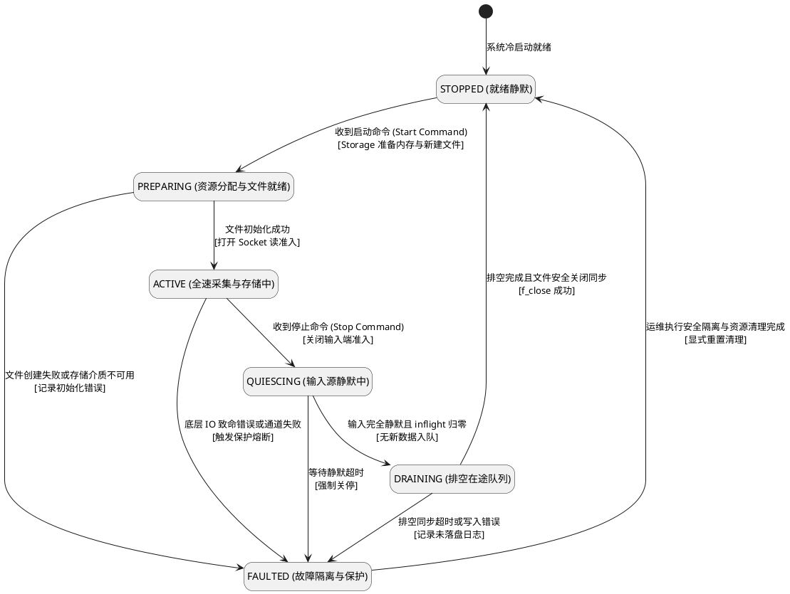
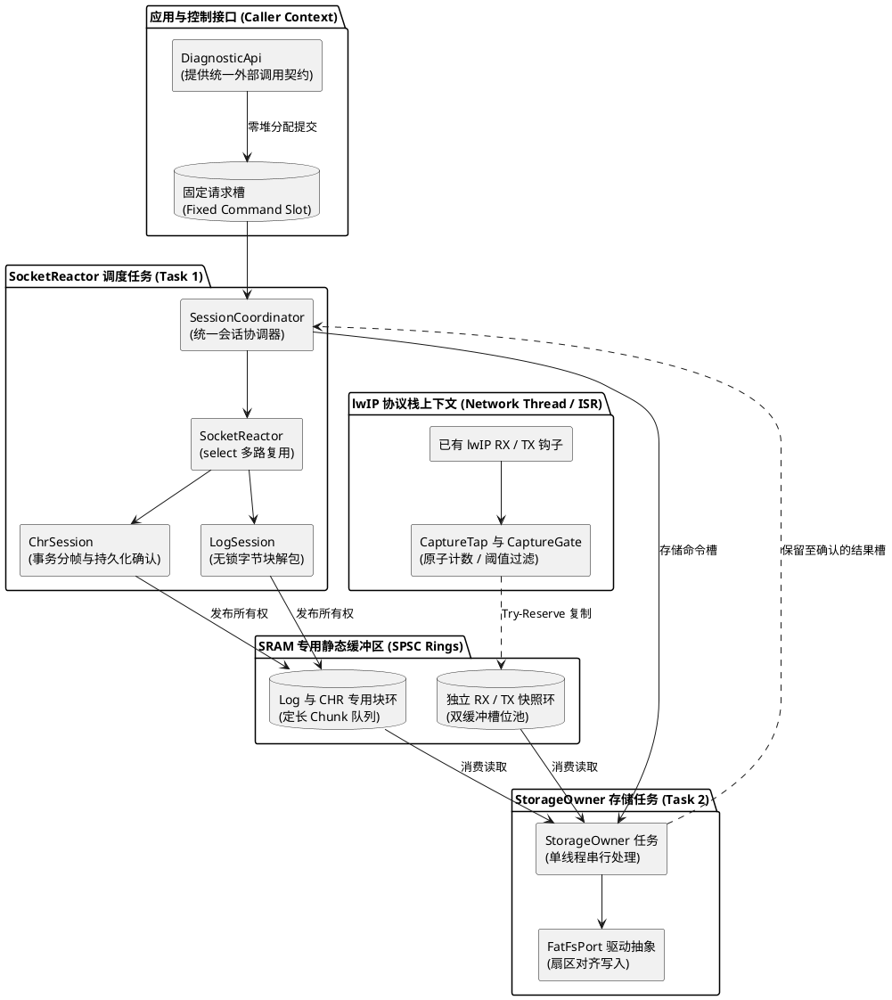
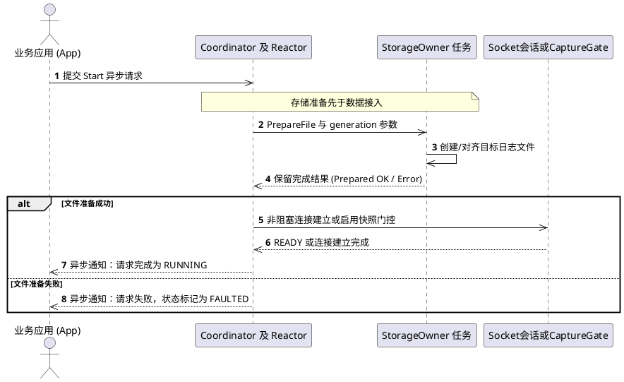
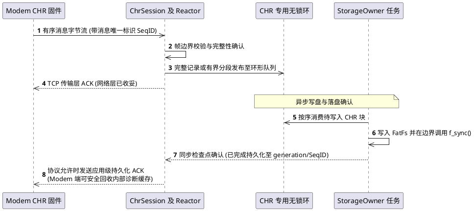

# Modem 诊断系统 PlantUML 流程图

本页与[统一设计基线](01-diagnostics-unified-design.md)及[C++实现架构](02-cpp-architecture-and-interactions.md)一致：ModemLog、CHR各自一个Socket；TCPDump在MCU本地旁路抓包，不再作为Modem第三个Socket。图示表达推荐设计，不代表驱动实现已验证。第10至12图补充C++模块和交互。

## 1. 整体数据路径：双Socket与本地快照

```plantuml
@startuml
hide stereotype
skinparam shadowing false

package "Modem 固件域 (IPC 诊断源)" as MODEM {
  rectangle "Modem 日志流服务\n(持续高吞吐 1 Mbps)" as modemLog
  rectangle "Modem CHR 事件服务\n(关键状态与崩溃信令)" as modemChr
}
package "MCU 接入调度域 (Socket Reactor Task)" as INGRESS {
  rectangle "ModemLog TCP 客户端\n(非阻塞套接字)" as logSock
  rectangle "CHR TCP 客户端\n(按序可靠套接字)" as chrSock
  rectangle "Socket Reactor 事件调度器\n(select 多路复用 / 动态配额)" as reactor
}
package "lwIP 网络业务域 (MCU 正常业务流量)" as NETIF {
  rectangle "正常 lwIP RX / TX 报文流" as netTraffic
  diamond "CaptureTap\n旁路观察门" as tap
  rectangle "原始业务协议栈正常流转" as netStack
}
package "静态内存池 (SPSC 无锁环形缓冲区)" as SRAM_POOLS {
  database "ModemLog 专用块环\n(定长 Chunk 队列)" as logRing
  database "CHR 专用消息环\n(边界保全队列)" as chrRing
  database "Capture 独立快照环\n(私有槽位双缓冲)" as capRing
}
package "存储引擎任务 (Storage Owner Task)" as STORAGE_DOMAIN {
  rectangle "唯一 Storage Owner 引擎\n(独占 FatFs / SDIO DMA 控制权)" as storageExec
}
package "持久化介质 (SD卡 / eMMC)" as MEDIA_FS {
  database "ModemLog 文件\n(*.log 循环覆盖)" as fileLog
  database "CHR 文件\n(*.chr 追加归档)" as fileChr
  database "PCAP 文件\n(*.pcap 抓包存储)" as filePcap
}

logSock --> reactor
chrSock --> reactor
netTraffic --> tap
tap --> netStack : 零延迟放行
modemLog --> logSock : IPC 诊断链路
modemChr --> chrSock : IPC 诊断链路
reactor --> logRing : 零拷贝发布块
reactor --> chrRing : 结构化分帧发布
tap ..> capRing : 尽力复制 (若槽位可用)
logRing --> storageExec : 按序批量消费
chrRing --> storageExec : 按序消费确认
capRing --> storageExec : 异步排空
storageExec --> fileLog
storageExec --> fileChr
storageExec --> filePcap
@enduml
```

## 2. Socket Reactor 公平接收

```plantuml
@startuml
hide stereotype
skinparam shadowing false

rectangle "调度周期开始" as start
diamond "处理控制与停机信号?" as checkCtl
rectangle "更新会话状态机\n执行局部静默/排空" as handleCtl
rectangle "根据环空闲配额\n重构 fd_set 集合" as buildFds
rectangle "执行 select() (有限超时 5~10ms)" as doSelect
diamond "select 返回结果?" as selResult
diamond "检查 CPU 时间片配额\n与停机终止标志?" as checkBudget
rectangle "记录瞬态告警并退避" as logErr
diamond "CHR 就绪?" as checkChr
rectangle "限额读取 CHR 帧 (防饥饿)\n校验帧长与头部 CRC" as readChr
diamond "ModemLog 就绪?" as checkLog
rectangle "限额读取 Log 块 (防独占 CPU)\n写入预分配固定内存块" as readLog
diamond "是否有新数据块就绪?" as checkPublish
rectangle "内存屏障发布至环形队列\n轻量信号量通知 Storage" as publish
rectangle "taskYIELD() 让出时间片" as yield

start --> checkCtl
checkCtl --> handleCtl : 有挂起控制命令
checkCtl --> buildFds : 无挂起控制命令
handleCtl --> buildFds
buildFds --> doSelect
doSelect --> selResult
selResult --> checkBudget : 超时 0 就绪
selResult --> logErr : 错误 EINTR
logErr --> checkBudget
selResult --> checkChr : 事件就绪
checkChr --> readChr : 是
checkChr --> checkLog : 否
readChr --> checkLog
checkLog --> readLog : 是
checkLog --> checkPublish : 否
readLog --> checkPublish
checkPublish --> publish : 是
checkPublish --> checkBudget : 否
publish --> checkBudget
checkBudget --> buildFds : 未超额且未停机
checkBudget --> yield : 超额或需让渡
yield --> start
@enduml
```

## 3. Capture Tap 失败放行流程

```plantuml
@startuml
hide stereotype
skinparam shadowing false

rectangle "原始报文到达网络观察点 lwIP Ingress / Egress" as pktIn
diamond "1. 抓包功能是否启用\n且匹配网卡监听白名单?" as checkEn
rectangle "原路径继续：无延迟无损耗送入 lwIP" as passOriginal
diamond "2. 过滤及包率字节预算检查\n(Token Bucket 速率限制)?" as checkBudget
rectangle "仅递增预算 Drop 计数器" as dropCount1
diamond "3. 尝试原子预约私有抓包槽位\n(非阻塞 Try-Acquire)?" as acquireSlot
rectangle "仅递增溢出 Drop 计数器\n(不阻塞正常业务通信)" as dropCount2
rectangle "4. 限长只读复制 (SnapLen 截断)\n只读持有 pbuf，杜绝长周期引用" as copyPkt
diamond "5. 快照与分段校验完整?" as checkValid
rectangle "归还槽位至 FREE 状态\n递增快照损坏 Drop 计数" as discardSlot
rectangle "6. Release 标记槽位为 READY\n异步通知 StorageOwner 消费" as publishSlot
rectangle "原始报文继续正常收发处理" as pktOut

pktIn --> checkEn
checkEn --> passOriginal : 否
checkEn --> checkBudget : 是
checkBudget --> dropCount1 : 预算超限
dropCount1 --> passOriginal
checkBudget --> acquireSlot : 预算合格
acquireSlot --> dropCount2 : 无可用空闲槽
dropCount2 --> passOriginal
acquireSlot --> copyPkt : 成功取得槽位
copyPkt --> checkValid
checkValid --> discardSlot : 校验失败
discardSlot --> passOriginal
checkValid --> publishSlot : 校验合格
publishSlot --> passOriginal
passOriginal --> pktOut
@enduml
```

## 4. 槽位所有权状态



## 5. 公网与核间路由边界

```plantuml
@startuml
hide stereotype
skinparam shadowing false

package "应用层套接字发起来源" as APPS {
  rectangle "诊断通信客户端\n(两个专用诊断 Socket)" as diagSockets
  rectangle "公网业务应用\n(HTTP / MQTT / OTA Socket)" as wanApps
}
package "MCU 路由裁决与合规引擎" as ROUTING {
  diamond "根据目的 IP 查路由表" as routeTable
  diamond "IPC 边界校验规则\n仅放行 Modem 本地诊断地址" as guardIPC
  diamond "WAN 边界校验规则\n严禁泄漏任何 IPC 内部私网地址" as guardWAN
}
package "网络物理/虚拟接口" as NETIFS {
  rectangle "IPC 虚拟网卡接口\n(核间专属通信)" as netifIPC
  rectangle "WAN 默认网卡接口\n(4G 蜂窝公网通信)" as netifWAN
  rectangle "MCU 本地 Capture Tap\n(只读旁路镜像探针)" as tap
}
package "外部网络实体" as EXTERNALS {
  rectangle "Modem 本地诊断端点\n(127.0.0.1 / 本地控制口)" as modemLocal
  rectangle "蜂窝运营商公网\n(Cellular Internet)" as modemCell
}
rectangle "丢弃并安全审计告警" as dropIPC
rectangle "丢弃阻断内部数据泄漏" as dropWAN

diagSockets --> routeTable : 指定绑定 IPC IP
wanApps --> routeTable : 默认走缺省网关
routeTable --> guardIPC : 目标为 IPC 内部网
routeTable --> guardWAN : 目标为外部公网
guardIPC --> netifIPC : 地址合法
guardIPC --> dropIPC : 越界外发
guardWAN --> netifWAN : 地址合法
guardWAN --> dropWAN : 私网泄漏
netifIPC --> modemLocal
netifWAN --> modemCell
netifWAN ..> tap : 只读快照
@enduml
```

## 6. 指定业务安全停止



## 7. RX与TX正常报文和抓包副本时序



## 8. 存储过载时的业务退让

```plantuml
@startuml
hide stereotype
skinparam shadowing false

rectangle "检测到 SDIO 变慢或环形缓冲积压达到高水位" as start
package "第一级退让：削减非关键旁路" as T1 {
  rectangle "1. 立即停止或缩减 CaptureTap 准入\n(降级为 100% 旁路丢弃，业务完全不受损)" as tier1
  diamond "积压是否缓解?" as checkT1
  rectangle "恢复 Capture 抓包采样" as recoverT1
  rectangle "恢复常态运行" as normalState
  rectangle "2. ModemLog 独立高水位流控\n(收缩 TCP 接收窗口，依靠协议栈自然背压)" as tier2
}
package "第二级退让：流控高吞吐日志" as T2 {
  diamond "积压是否缓解?" as checkT2
  rectangle "缓慢恢复正常接收窗口" as recoverT2
  rectangle "3. CHR 维持高优先级排队\n(仅在超限时按可靠性协议拒绝低优事件)" as tier3
}
package "第三级退让：信令可靠性保护" as T3 {
  diamond "存储写入停滞\n是否超过故障截止时间?" as checkTimeout
  rectangle "按低水位及冷却条件等待恢复" as waitRecovery
  rectangle "4. 诊断文件标记为 FAULTED\n安全中止 DMA 传输并关闭诊断文件" as tier4
}
package "第四级退让：故障隔离熔断" as T4 {
  rectangle "正常 WAN 蜂窝业务继续 100% 运行不受拖累" as keepWAN
  rectangle "上报存储硬件故障遥测日志" as alertOps
}

start --> tier1
tier1 --> checkT1
checkT1 --> recoverT1 : 是
recoverT1 --> normalState
checkT1 --> tier2 : 否
tier2 --> checkT2
checkT2 --> recoverT2 : 是
recoverT2 --> normalState
checkT2 --> tier3 : 否
tier3 --> checkTimeout
checkTimeout --> waitRecovery : 否
waitRecovery --> tier2
checkTimeout --> tier4 : 是
tier4 --> keepWAN
tier4 --> alertOps
@enduml
```

## 9. 会话状态而非线程生命周期



## 关键阅读约束

- 抓包失败只丢副本，原始报文继续；这不是零CPU开销保证。
- 两个应用任务为Socket Reactor和Storage Owner，不包含现有lwIP/驱动/RTOS任务。
- Capture RX/TX可能并发；使用独立私有槽与非自旋try-guard，不长期持有正常网络pbuf。
- Storage单一消费并管理FIL，原缓冲何时可复用和何时持久化是不同事件。
- RX/TX接口层、offload、PCAP LinkType和实际调用上下文以[主方案](01-diagnostics-unified-design.md)为准。

## 10. C++模块与执行上下文



## 11. C++异步启动交互



## 12. CHR持久化确认交互


