# Modem 诊断系统 PlantUML 流程图

本页与[统一设计基线](01-diagnostics-unified-design.md)及[C++实现架构](02-cpp-architecture-and-interactions.md)一致：ModemLog、CHR各自一个Socket；TCPDump在MCU本地旁路抓包，不再作为Modem第三个Socket。图示表达推荐设计，不代表驱动实现已验证。第10至12图补充C++模块和交互。

## 1. 整体数据路径：双Socket与本地快照

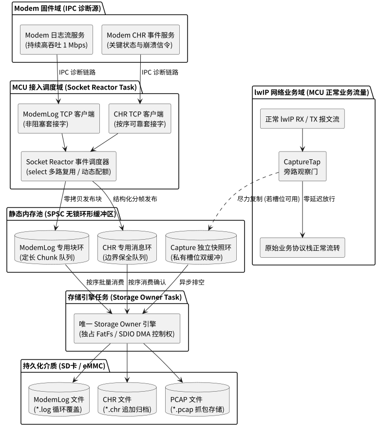

## 2. Socket Reactor 公平接收

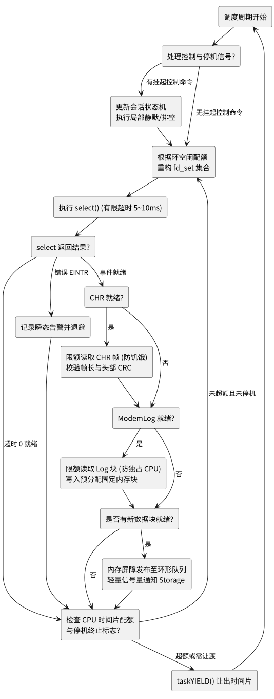

## 3. Capture Tap 失败放行流程

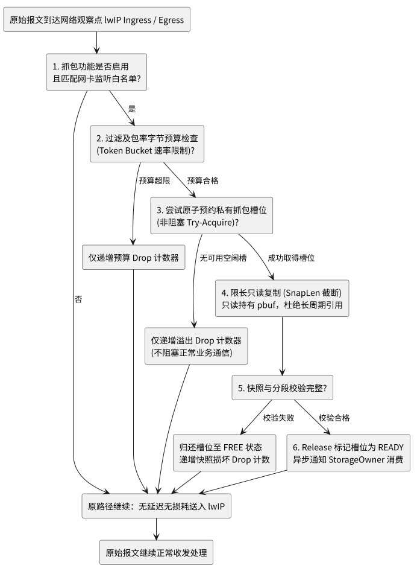

## 4. 槽位所有权状态

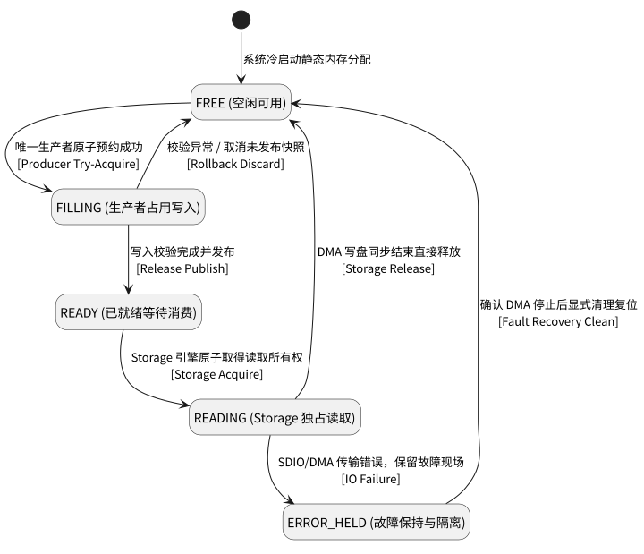

## 5. 公网与核间路由边界

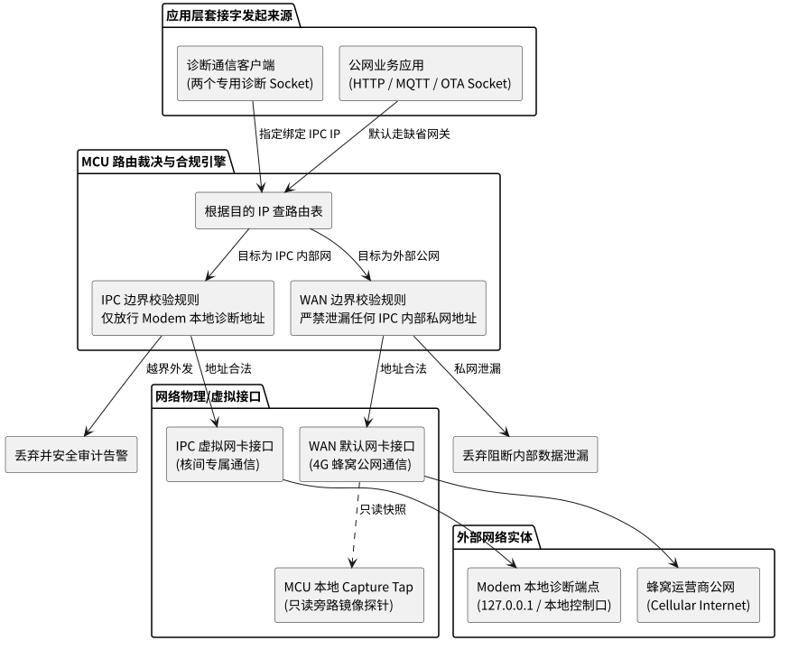

## 6. 指定业务安全停止

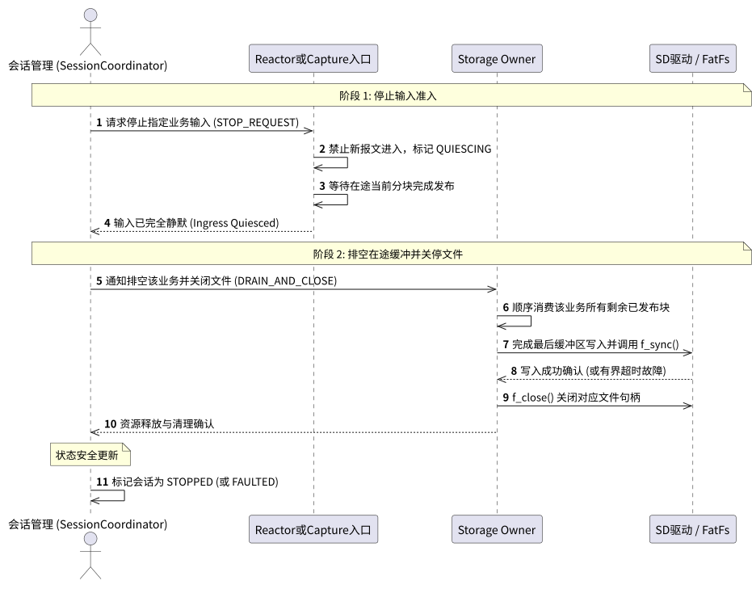

## 7. RX与TX正常报文和抓包副本时序

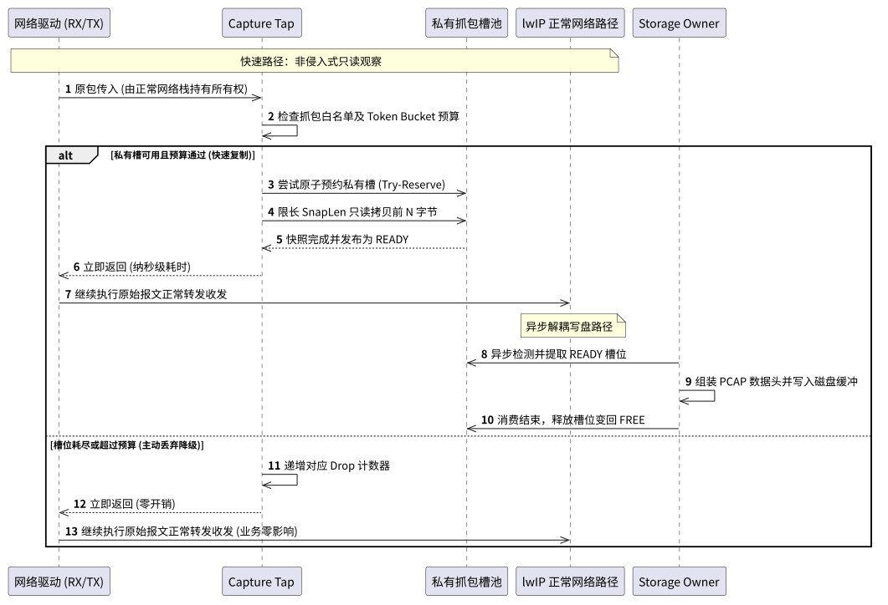

## 8. 存储过载时的业务退让

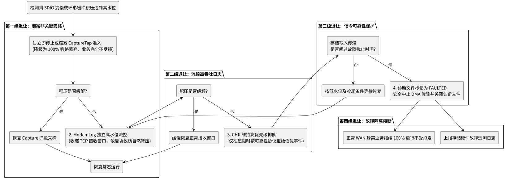

## 9. 会话状态而非线程生命周期

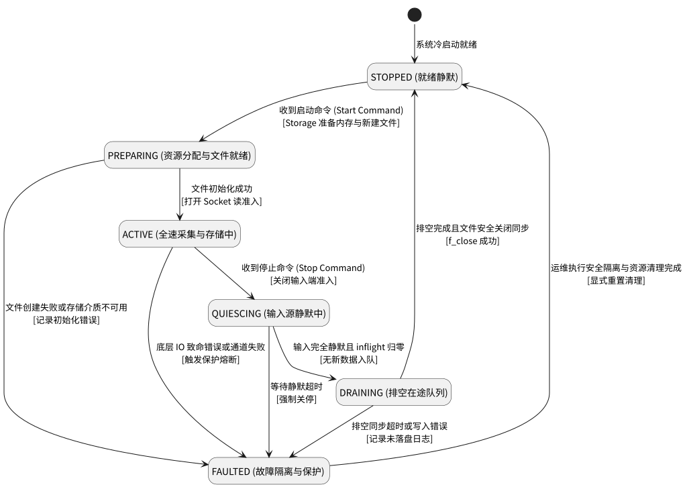

## 关键阅读约束

- 抓包失败只丢副本，原始报文继续；这不是零CPU开销保证。
- 两个应用任务为Socket Reactor和Storage Owner，不包含现有lwIP/驱动/RTOS任务。
- Capture RX/TX可能并发；使用独立私有槽与非自旋try-guard，不长期持有正常网络pbuf。
- Storage单一消费并管理FIL，原缓冲何时可复用和何时持久化是不同事件。
- RX/TX接口层、offload、PCAP LinkType和实际调用上下文以[主方案](01-diagnostics-unified-design.md)为准。

## 10. C++模块与执行上下文

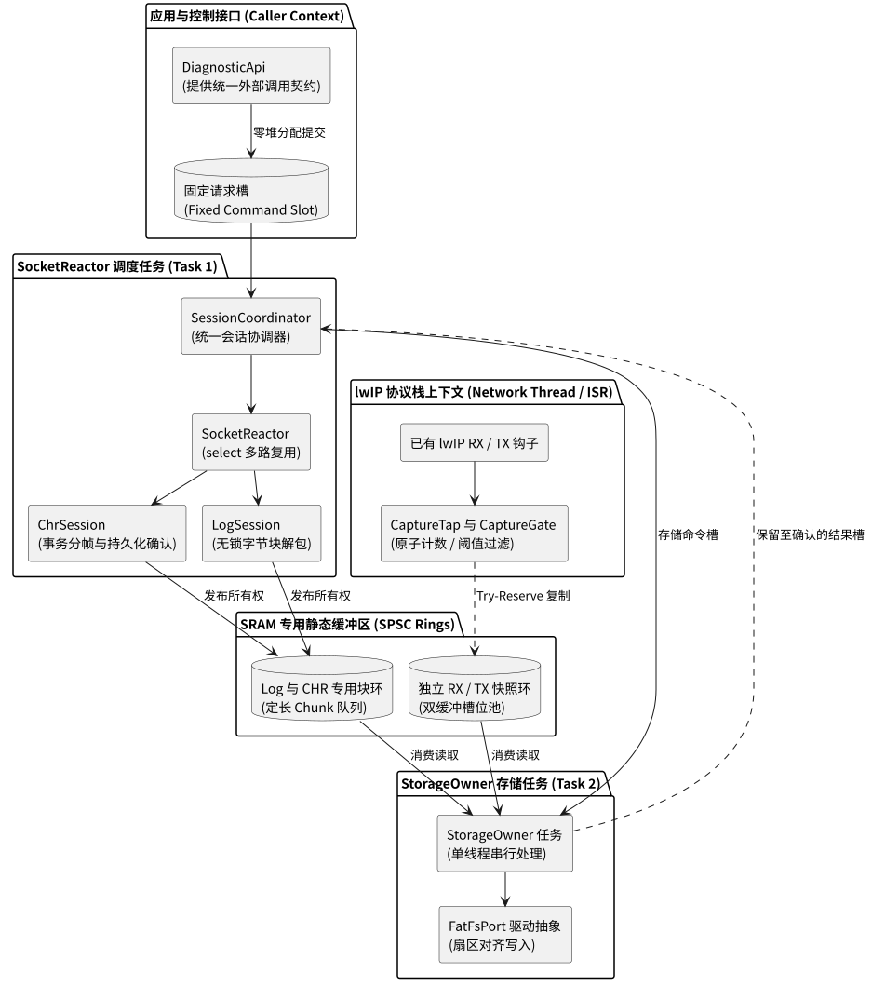

## 11. C++异步启动交互

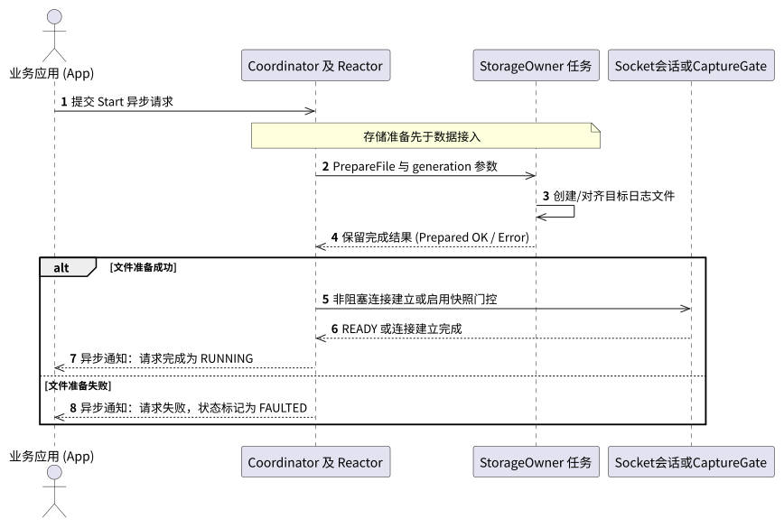

## 12. CHR持久化确认交互

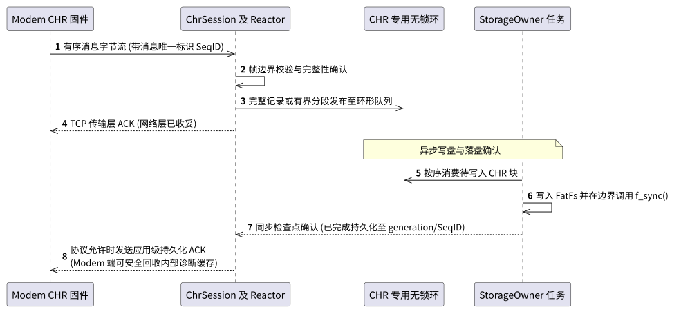
