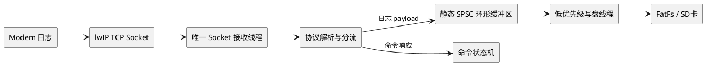
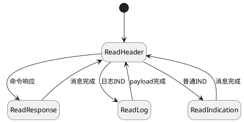
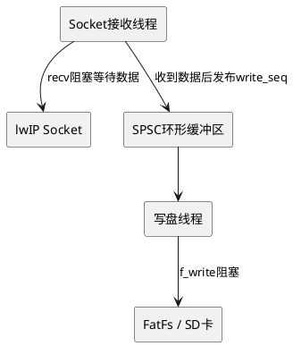

# STM32 + lwIP Modem high-speed log low resource writing disk design

> **Historical design, not current implementation baseline. ** Please read the [Unified Plan] (01-diagnostics-unified-design.md) and [Revised Flowchart] (03-modem-complete-mermaid-flows.md) first.
>
> This page only covers the early single-Socket model. volatile/DMB is not a general C concurrency solution; ring full cannot be confused with recv returning 0; f_write, DMA buffer reuse and f_sync persistence checkpoint are not the same event. The following code is for historical purposes only.


## 1. Problem background

The system runs on STM32, and the application communicates with the Modem through lwIP Socket. In addition to normal command responses, the Modem will actively send log IND at a sustained rate of approximately **1 Mbps**. This data needs to be written to files reliably on a system with limited RAM, threads, and CPU resources.

> The unit must be confirmed first:
>
> - **1 Mbps（Mbit/s）≈ 125 KB/s**
> - **1 MB/s ≈ 8 Mbps**
>
> The difference in buffer required between the two is about 8 times.

## 2. Design goals

- The Socket receive path cannot be blocked by the file system for a long time.
- Do not dynamically allocate and release memory for data blocks.
- No locks, semaphores, or state machines are created for each buffer block.
- There is always only one thread calling `recv()` for the same Socket.
- Try to use continuous and aligned large blocks of writes to the disk.
- Buffer fulls, storage exceptions, and log losses must be observable.
- Strike the minimum feasible balance between thread count and reliability.

## 3. Recommended architecture

Adopt:

1. **Unique Socket receiving thread**: Reuse the existing communication receiving thread.
2. **A low-priority disk writing thread**: You can also reuse the existing storage worker thread of the system.
3. **Static SPSC Ring Buffer**: Single producer, single consumer, no dynamic memory.
4. **Task Notification**: Only notifies "data is available" and does not copy logs through the message queue.
5. **Batch Write to Disk**: Use FatFs to write continuous data directly to storage.





This only requires an additional execution context. If the system already has a unified storage thread, there is no need to add a new thread.

## 4. Why is it not recommended to write files directly in the Socket thread?

The following single-threaded implementation uses the least resources, but is not reliable enough:


```c
recv(sock, buffer, sizeof(buffer), 0);
f_write(&file, buffer, size, &written);
```


`f_write()` may block for tens to hundreds of milliseconds for the following reasons:

- SD card internal erasure or garbage collection;
- FAT table update;
- File expansion and cross-cluster writing;
- Store DMA wait;
- `f_sync()` brushes the disk.

`recv()` cannot be called further while disk writing is blocked. TCP will eventually form back pressure through the receive window, but the buffers of lwIP and Modem are limited, and long pauses may cause timeouts, Modem side overflows, or log interruptions.

Therefore, a **bounded static buffer** needs to be used to decouple receiving and writing to disk.

## 5. The most resource-saving data structure

### 5.1 Preferred: SPSC Byte Ring Buffer

If the log uses an independent Socket, or the protocol parses and enters the continuous log payload stage, it is recommended to use a byte ring buffer. It does not require a length field for each block. `recv()` can directly write to the free area, and `f_write()` can directly read the continuous area without secondary copying.


```c
#include <stdatomic.h>
#include <stdint.h>

#define LOG_RING_SIZE  (64U * 1024U)   /* 必须是2的幂 */
#define LOG_RING_MASK  (LOG_RING_SIZE - 1U)

typedef struct {
    _Alignas(32) uint8_t data[LOG_RING_SIZE];
    _Atomic uint32_t write_seq;  /* 仅生产者写 */
    _Atomic uint32_t read_seq;   /* 仅消费者写 */
} log_ring_t;

static log_ring_t g_log_ring;
```


The index uses a monotonically increasing sequence number, and the modulus is only taken when accessing the array:


```c
used = write_seq - read_seq;
free = LOG_RING_SIZE - used;

write_pos = write_seq & LOG_RING_MASK;
read_pos  = read_seq  & LOG_RING_MASK;
```


No need to maintain block state such as `READING/WRITING/DONE`:

- After the producer finishes writing the data, it updates `write_seq` with release semantics;
- Consumers use acquire semantics when reading `write_seq`;
- After the consumer writes to the disk, `read_seq` is updated with release semantics;
- The producer uses acquire semantics when reading `read_seq`.

### 5.2 Alternative: Fixed block ring buffer

If the log message must maintain frame boundaries, or the protocol parsing results need to carry the actual length, fixed blocks can be used:


```c
#define LOG_BLOCK_SIZE   4096U
#define LOG_BLOCK_COUNT  16U

typedef struct {
    uint16_t len;
    uint8_t data[LOG_BLOCK_SIZE];
} log_block_t;

typedef struct {
    log_block_t blocks[LOG_BLOCK_COUNT];
    _Atomic uint32_t write_seq;
    _Atomic uint32_t read_seq;
} log_block_ring_t;
```


The fixed block scheme is easier to implement, but has one more length field per block, and batch writes across blocks typically require multiple `f_write()`s.

## 6. Byte ring buffer core code

### 6.1 Producer: Socket receiving thread


```c
static int log_ring_recv(int sock, log_ring_t *ring)
{
    uint32_t write_seq =
        atomic_load_explicit(&ring->write_seq, memory_order_relaxed);
    uint32_t read_seq =
        atomic_load_explicit(&ring->read_seq, memory_order_acquire);

    uint32_t used = write_seq - read_seq;
    uint32_t free_size = LOG_RING_SIZE - used;

    if (free_size == 0U) {
        return 0;
    }

    uint32_t pos = write_seq & LOG_RING_MASK;
    uint32_t contiguous = LOG_RING_SIZE - pos;

    if (contiguous > free_size) {
        contiguous = free_size;
    }

    int received = recv(sock, &ring->data[pos], contiguous, 0);

    if (received > 0) {
        atomic_store_explicit(
            &ring->write_seq,
            write_seq + (uint32_t)received,
            memory_order_release);

        xTaskNotifyGive(log_writer_task_handle);
    }

    return received;
}
```


### 6.2 Consumer: disk writing thread


```c
static FRESULT log_ring_flush_once(FIL *file, log_ring_t *ring)
{
    uint32_t read_seq =
        atomic_load_explicit(&ring->read_seq, memory_order_relaxed);
    uint32_t write_seq =
        atomic_load_explicit(&ring->write_seq, memory_order_acquire);

    uint32_t used = write_seq - read_seq;

    if (used == 0U) {
        return FR_OK;
    }

    uint32_t pos = read_seq & LOG_RING_MASK;
    uint32_t contiguous = LOG_RING_SIZE - pos;

    if (contiguous > used) {
        contiguous = used;
    }

    UINT written = 0;
    FRESULT result =
        f_write(file, &ring->data[pos], contiguous, &written);

    if ((result == FR_OK) && (written > 0U)) {
        atomic_store_explicit(
            &ring->read_seq,
            read_seq + written,
            memory_order_release);
    }

    if ((result == FR_OK) && (written != contiguous)) {
        return FR_DISK_ERR;
    }

    return result;
}
```


### 6.3 Disk writing thread


```c
void log_writer_task(void *argument)
{
    TickType_t last_sync = xTaskGetTickCount();

    while (logging_enabled ||
           atomic_load(&g_log_ring.read_seq) !=
           atomic_load(&g_log_ring.write_seq)) {

        ulTaskNotifyTake(pdTRUE, pdMS_TO_TICKS(100));

        while (atomic_load(&g_log_ring.read_seq) !=
               atomic_load(&g_log_ring.write_seq)) {

            FRESULT result =
                log_ring_flush_once(&log_file, &g_log_ring);

            if (result != FR_OK) {
                log_storage_error_count++;
                handle_storage_error(result);
                break;
            }
        }

        if ((xTaskGetTickCount() - last_sync) >=
            pdMS_TO_TICKS(2000)) {
            f_sync(&log_file);
            last_sync = xTaskGetTickCount();
        }
    }

    f_sync(&log_file);
}
```


## 7. Atomic operations and locks

In the strict SPSC model, no mutex is required, nor does the entire buffer need to be locked:

- `write_seq` is only modified by the receiving thread;
- `read_seq` is only modified by the disk writing thread;
- Both sides only read the serial number issued by the other party.

Prefer using C11 acquire/release atomic operations. For single-core STM32 that is not convenient to use C11 atomic:

- Ensure that the sequence number is 32-bit aligned access;
- Execute `__DMB()` before publishing the index;
- Or use very short critical sections to protect index reading and writing;
- Do not call `recv()` or `f_write()` within a critical section.

Memory ordering across threads cannot be fully expressed using `volatile` alone.

## 8. Protocol offloading of the same Socket

The same Socket cannot be called `recv()` by two threads at the same time:

- A thread waits for a command response;
- Another thread reads the log IND.

Otherwise, the two threads may grab each other's data, and TCP is a byte stream, and one `recv()` does not correspond to a complete message.

A unique receiving thread and an incremental parsing state machine must be used:





Must be processed when parsing:

- Half a protocol header;
- A `recv()` contains multiple messages;
- Message spans multiple `recv()`;
- Log payload spans ring buffer tail;
- Command responses are interleaved with log INDs.

If the Modem can provide an independent log Socket, priority should be given to separating control and logs.

## 9. Buffer capacity calculation

Basic formula:

[
BufferSize \ge DataRate \times MaxStorageStall + BurstMargin
]

It is recommended to select capacity based on the actual measured "storage maximum pause time" instead of just looking at the average write rate.

| input rate | Maximum disk write pause | theoretical minimum buffer | Recommended capacity |
|---|---:|---:|---:|
| 1 Mbit/s ≈ 125 KB/s | 100 ms | 12.5 KB | 32 KB |
| 1 Mbit/s ≈ 125 KB/s | 300ms | 37.5 KB | 64 KB |
| 1 Mbit/s ≈ 125 KB/s | 500ms | 62.5 KB | 128 KB |
| 1MB/s | 100 ms | 100 KB | 128 KB |
| 1MB/s | 300ms | 300 KB | 512 KB |

If RAM is very tight, measure worst-case SD card latency first and consider lowering the Modem log level rather than blindly compressing buffers.

## 10. Strategy when buffer is full

### TCP

Priority from high to low:

1. Use the PAUSE/RESUME flow control provided by the Modem protocol;
2. Pause reading when the ring buffer is close to full, allowing back pressure on the TCP receive window;
3. Set the maximum waiting time, and record the loss count after timeout;
4. Reduce the log level or stop crawling if necessary.

Note: Pausing `recv()` can only shift the pressure to lwIP and Modem, but cannot create infinite cache.

### UDP

UDP does not have reliable backpressure. An explicit selection must be made when the buffer is full:

- Discard new data and log `dropped_bytes`;
- Or overwrite the oldest data to keep the latest logs.

The default recommendation is to discard new data and write gap records in the file to facilitate offline analysis to find gaps.

## 11. FatFs and storage optimization

- All log buffers are allocated statically;
- The write address is aligned according to DMA/Cache requirements;
- The write granularity is at least 4 KB, and 16~64 KB is recommended;
- Create files before crawling starts and pre-allocate contiguous space if possible;
- If `FF_USE_EXPAND` is enabled, `f_expand()` can be used;
- Do not call `f_sync()` for each data block;
- It is recommended to synchronize every 1 to 5 seconds or when stopping the log;
- Files roll by 32 MB, 64 MB or 128 MB;
- File system operations are performed by only one thread to avoid FatFs reentrant locks;
- When using SDMMC + DMA, pay attention to D-Cache clean/invalidate;
- Statistics on short writes, disk write errors, maximum write latency, and buffer high water level.

## 12. Recommended initial configuration

For real **1 Mbit/s (125 KB/s)**:


```text
环形缓冲区：64 KB
Socket接收线程：复用现有线程
写盘线程：1个，低优先级
写盘线程栈：1～2 KB，按实际栈水位校准
通知：FreeRTOS Task Notification
写入粒度：尽可能连续写入，目标16～32 KB
f_sync周期：2秒
文件滚动：64 MB
满缓冲策略：优先Modem流控，其次TCP背压
```


If there is a measured storage pause of more than 500 ms, increase the buffer to 128 KB, or replace the storage medium with a more stable delay.

## 13. Indicators that must be monitored


```c
typedef struct {
    uint64_t received_bytes;
    uint64_t written_bytes;
    uint64_t dropped_bytes;
    uint32_t overflow_count;
    uint32_t socket_error_count;
    uint32_t storage_error_count;
    uint32_t short_write_count;
    uint32_t max_ring_used;
    uint32_t max_write_latency_ms;
} modem_log_stats_t;
```


It is recommended to periodically output through debugging commands:

- Current/maximum buffer occupancy;
- Total number of bytes received and written;
- Number of bytes lost;
- Maximum single disk write delay;
- Socket, file system and SD card errors;
- The minimum remaining stack space of the disk writing thread.

## 14. Verification scheme

Do at least the following tests:

1. Continuous crawling for 30 minutes, 2 hours and 24 hours;
2. Manually create 100 ms, 300 ms, 500 ms disk write pauses;
3. Check whether the Modem can recover normally after the TCP window shrinks;
4. Making file system short and disk full;
5. Logs and command responses are frequently interleaved;
6. Ring buffer pointer spans tail;
7. Log input continues during file rolling;
8. Check the recoverable range of files after power outage and restart;
9. Verify the number of bytes received, the number of bytes written and the file length;
10. Monitor CPU usage, thread stack high water mark, and ring buffer high water mark.

## 15. Processing that may block Socket and file writing at the same time

### 15.1 Core Principles

Both Socket's `recv()` and FatFs' `f_write()` may block. The design goal is not to forcefully eliminate all blocking, but to:

> **Let the two blocking occur in different threads, and set timeout, statistics and recovery strategies for each path that may wait forever. **

| thread | Where blocking is allowed | Another thread blocks during |
|---|---|---|
| Socket receiving thread | `recv()`, waiting for buffer space | The disk writing thread continues to clear the buffer |
| write disk thread | Waiting for task notification, `f_write()`, `f_sync()` | The Socket thread continues to receive data |





Two threads cannot hold a common large lock, and the file system driver cannot turn off interrupts for a long time during disk writing.

### 15.2 Socket uses blocking mode, but sets a receive timeout

When there is no data, blocking `recv()` will make the task sleep, saving more CPU than non-blocking polling. It is recommended to use blocking Socket with limited receive timeout:


```c
struct timeval timeout = {
    .tv_sec  = 0,
    .tv_usec = 200 * 1000,
};

setsockopt(sock,
           SOL_SOCKET,
           SO_RCVTIMEO,
           &timeout,
           sizeof(timeout));
```


Receive loop:


```c
int ret = recv(sock, buffer, size, 0);

if (ret > 0) {
    process_received_data(buffer, (uint32_t)ret);
} else if (ret == 0) {
    handle_socket_closed();
} else if ((errno == EWOULDBLOCK) ||
           (errno == EAGAIN)) {
    check_stop_request();
    check_modem_state();
} else {
    handle_socket_error(errno);
}
```


When there is continuous log data, `recv()` usually returns immediately. Setting timeout is mainly used for exit, reconnection, status check and fault recovery.

If the system uses `send()` to send control commands to the Modem, `SO_SNDTIMEO` should also be set to prevent the sending thread from being permanently blocked after the remote end stops reading.

### 15.3 Ownership when receiving ring buffer directly

The producer can first locate the free area and then directly pass the address to `recv()`. Even blocking `recv()` does not destroy ownership because the new data has not yet been published via `write_seq`:


```c
uint8_t *destination = &ring->data[write_pos];

/* 可能阻塞，但该区域尚未对消费者可见 */
int received = recv(sock,
                    destination,
                    contiguous_free,
                    0);

if (received > 0) {
    /* recv完成后才把所有权发布给消费者 */
    atomic_store_explicit(
        &ring->write_seq,
        write_seq + (uint32_t)received,
        memory_order_release);

    xTaskNotifyGive(log_writer_task_handle);
}
```


The disk writing thread only processes data that has been published before `write_seq`.

### 15.4 The buffer cannot be returned before the disk writing is completed.

After `f_write()` returns successfully and the actual written length is correct, the consumer can advance `read_seq`:


```c
UINT written = 0;
FRESULT result = f_write(file,
                         &ring->data[read_pos],
                         contiguous_used,
                         &written);

if ((result == FR_OK) &&
    (written == contiguous_used)) {
    atomic_store_explicit(
        &ring->read_seq,
        read_seq + written,
        memory_order_release);
}
```


If the underlying `disk_write()` uses DMA, it must wait for the DMA to complete before returning. The following implementation is incorrect:


```c
HAL_SD_WriteBlocks_DMA(...);
return RES_OK;  /* 错误：DMA可能仍在读取环形缓冲区 */
```


Otherwise, after `f_write()` returns, the Socket thread may overwrite the area still used by DMA.

The least resourceful and safe implementation is to have `disk_write()` wait synchronously for DMA to complete:


```c
DRESULT disk_write(...)
{
    HAL_SD_WriteBlocks_DMA(...);

    if (xSemaphoreTake(sd_done_sem,
                       pdMS_TO_TICKS(500))
        != pdTRUE) {
        sd_timeout_count++;
        abort_sd_transfer();
        reset_sd_controller();
        return RES_ERROR;
    }

    return RES_OK;
}
```


If it is changed to fully asynchronous disk writing in the future, `IN_FLIGHT` ownership status or independent DMA buffer must be added, and resource consumption and implementation complexity will increase.

### 15.5 When ring buffer is full

A buffer full means that the storage cannot keep up with log input for a certain period of time. It is recommended to process according to water level classification:

| Buffer occupation | action |
|---:|---|
| less than 75% | Normal reception and writing |
| More than 75% | Wake up the disk writing thread immediately to reduce scheduling delays |
| More than 90% | If supported, notify the Modem to pause or reduce the log level |
| 100% | Pause `recv()`, taking advantage of TCP window backpressure |
| Exceeded maximum allowed time | Stop crawling or discard by policy, and log gaps |


```c
while (log_ring_free(&ring) == 0U) {
    if (wait_for_ring_space(pdMS_TO_TICKS(200))
        == WAIT_TIMEOUT) {

        request_modem_log_pause_if_supported();

        if (storage_failed_too_long()) {
            stop_log_capture();
            break;
        }
    }
}
```


If the log and command response share the same Socket, stopping `recv()` will also block the command response. At this time, priority should be given to:

1. Use a separate Socket for logging;
2. Use Modem’s PAUSE/RESUME flow control;
3. Reduce log level;
4. Reserve independent processing capabilities for control messages.

### 15.6 Thread priority

Recommended relative priority:


```text
Modem Socket RX：高
Log Writer：比RX低一级
普通后台任务：低于Writer
Idle：最低
```


The disk writing thread cannot be set too low, otherwise it may not be scheduled for a long time and eventually fill up the ring buffer.

### 15.7 Every choke point should have a boundary

| blocking operation | Recommended treatment |
|---|---|
| `recv()` | 100～500 ms timeout |
| `send()` | 100～500 ms timeout |
| Waiting for the annular space | Check every 100~200 ms and set the cumulative upper limit |
| SD DMA complete waiting | According to the measured setting, for example 500 ms |
| `f_write()` | Hardware timeout guaranteed by underlying `disk_write()` |
| `f_sync()` | The underlying disk operations must also have timeouts |
| Wait for task notification | You can wait for a long time, but you must actively wake up to exit the process |

The final constraints are:

> **Socket can be blocked, and file writing can also be blocked, but it cannot be connected in series with each other in the same thread; the buffer cannot be returned before the disk writing is actually completed; all network and hardware permanent waiting risks must have timeouts and recovery paths. **

## 16. Final conclusion

The solution with the fewest resources and engineering reliability is:

> **Unique Socket receiver + static lock-free SPSC ring buffer + a reusable low-priority storage worker thread + batched FatFs writes. **

If the log is an independent continuous byte stream, byte ring buffers are preferred; if message boundaries must be maintained, fixed block ring buffers are used. Do not allow multiple threads to read the same Socket at the same time, and do not directly perform file system operations that may block for a long time in the Socket receiving path.
