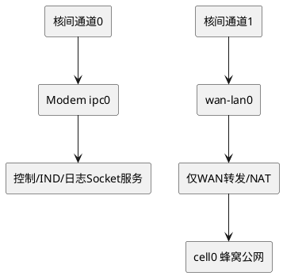

# Modem and MCU dual network domain communication design

> **Historical design, not current implementation baseline. ** Please read the [Unified Plan] (01-diagnostics-unified-design.md) and [Revised Flowchart] (03-modem-complete-mermaid-flows.md) first.
>
> Two business sockets are not equal to two netifs; TCPDump has been changed to MCU local capture. NAT/wan-lan0 is only an optional topology for Modem; upstream lwIP does not provide full product NAT by default. Hook will fall back if it returns NULL; the safety range must be independent of the variable netif configuration. The following black hole netif example cannot be used directly.


## 1. Demand

Modem and MCU communicate through inter-core links, and the upper layer hopes to continue to use Socket/lwIP API. At the same time, the system also needs to access the public network through Modem.

Must ensure:

- Inter-core control, IND, and log data only pass through the inter-core link;
- Inter-core messages are never sent from the public network card;
- Public network data can still pass through the Modem cellular link normally;
- Even if the IPC interface is disconnected, has an address conflict, or has an application binding error, the IPC traffic cannot be returned to the public network;
- Even if the two types of data share the same shared memory or the same physical bus, they must be logically isolated.

## 2. Overall conclusion

Establish two logical network interfaces on both sides of the MCU and Modem:

- `ipc0`: dedicated netif for inter-core communication;
- `wan0`: MCU public network data interface;
- There is also `cell0` on the Modem side: cellular public network outlet.


```plantuml
@startuml
hide stereotype
skinparam shadowing false
left to right direction

rectangle "MCU应用" as A
rectangle "MCU ipc0
172.31.255.2/30" as I1
rectangle "Modem ipc0
172.31.255.1/30" as I2
rectangle "MCU wan0
192.168.225.2/24" as W1
rectangle "Modem wan-lan0
192.168.225.1/24" as W2
rectangle "NAT/路由" as N
rectangle "Modem cell0
蜂窝公网" as C

A --> I1
I1 <--> I2 : IPC通道0
A --> W1
W1 <--> W2 : IPC通道1或PPP
W2 --> N
N --> C
@enduml
```


Even if the bottom layers of `ipc0` and `wan0` share the same shared memory, SPI, or inter-core message channel, the upper layer must be registered as two independent `struct netif`, and the bottom frame header uses `channel_id` for offloading.

## 3. Address and routing planning

Example address:

| side | interface | address | gateway | Purpose |
|---|---|---|---|---|
| MCU | `ipc0` | `172.31.255.2/30` | None | Intercore Socket |
| Modem | `ipc0` | `172.31.255.1/30` | None | internuclear services |
| MCU | `wan0` | `192.168.225.2/24` | `192.168.225.1` | Public network data |
| Modem | `wan-lan0` | `192.168.225.1/24` | None | MCU public network access |
| Modem | `cell0` | Carrier allocation | Carrier gateway | Cellular public network outlet |

The address is just an example and must be confirmed before mass production that it does not overlap with the cellular side, VPN, customer LAN or other interfaces of the device.

Key rules:

1. `ipc0` does not configure a default gateway;
2. Only `wan0` is the default netif for MCU;
3. Modem only forwards/NATs `wan-lan0 -> cell0`;
4. Modem does not forward or NAT `ipc0`;
5. The IPC service is only bound to `172.31.255.1` and cannot be bound to `INADDR_ANY`;
6. IPC clients only connect to fixed numeric addresses and do not go through DNS.

## 4. MCU side architecture


```plantuml
@startuml
hide stereotype
skinparam shadowing false

rectangle "MCU应用" as APP
rectangle "BSD Socket API" as API
rectangle "lwIP TCP/IP" as TCP
diamond "路由策略" as R
rectangle "ipc0" as IPC
rectangle "wan0 默认路由" as WAN
rectangle "核间通道0" as CH0
rectangle "核间通道1 / PPP" as CH1

APP --> API
API --> TCP
TCP --> R
R --> IPC : IPC目标地址
R --> WAN : 其他目标
IPC --> CH0
WAN --> CH1
@enduml
```


### 4.1 MCU Responsibilities

- Maintain two independent netifs `ipc0` and `wan0`;
- When the destination address belongs to the IPC subnet, `ipc0` is mandatory;
- For ordinary public network destination address, select `wan0`;
- It is forbidden for packets whose source address is the IPC address to be sent from `wan0`;
- Prevent forged IPC source address packets received from the WAN side from entering the machine;
- Count the traffic, errors and packet loss of the two channels respectively;
- Public network interface failure cannot affect the IPC interface;
- IPC interface failure cannot cause traffic to fall back to the WAN.

### 4.2 MCU initialization example


```c
static struct netif g_ipc_netif;
static struct netif g_wan_netif;

void network_init(void)
{
    ip4_addr_t ipc_ip;
    ip4_addr_t ipc_mask;
    ip4_addr_t no_gateway;

    IP4_ADDR(&ipc_ip,   172, 31, 255, 2);
    IP4_ADDR(&ipc_mask, 255, 255, 255, 252);
    ip4_addr_set_zero(&no_gateway);

    netif_add(&g_ipc_netif,
              &ipc_ip,
              &ipc_mask,
              &no_gateway,
              NULL,
              ipc_netif_init,
              tcpip_input);

    netif_set_up(&g_ipc_netif);
    netif_set_link_up(&g_ipc_netif);

    /* wan0按PPP、DHCP或静态地址方式初始化 */
    netif_add(&g_wan_netif,
              &wan_ip,
              &wan_mask,
              &wan_gateway,
              NULL,
              wan_netif_init,
              tcpip_input);

    netif_set_up(&g_wan_netif);
    netif_set_link_up(&g_wan_netif);

    /* 只有公网接口能成为默认路由 */
    netif_set_default(&g_wan_netif);
}
```


`lwipopts.h` requires at least:


```c
#define LWIP_SINGLE_NETIF  0
#define LWIP_SOCKET        1
#define LWIP_NETCONN       1
```


## 5. Modem side architecture





### 5.1 Modem responsibilities

- `ipc0` only carries Modem local services;
- The Socket service is bound to the determined address of `ipc0`;
- `wan-lan0` only carries MCU public network data;
- Only `wan-lan0 <-> cell0` forwarding is allowed;
- Reposting by `ipc0 <-> cell0` is expressly prohibited;
- Reposting by `ipc0 <-> wan-lan0` is expressly prohibited;
- IPC and WAN use separate receive queues or at least separate channel IDs;
- Public network congestion cannot block the control and log channels;
- IPC log high traffic cannot exhaust the WAN control queue.

### 5.2 Modem Socket service binding

Wrong way:


```c
server_addr.sin_addr.s_addr = PP_HTONL(INADDR_ANY);
```


It is possible to expose services to both IPC and WAN interfaces.

Correct way:


```c
ip4_addr_t ipc_server_ip;
IP4_ADDR(&ipc_server_ip, 172, 31, 255, 1);

server_addr.sin_family = AF_INET;
server_addr.sin_port = htons(MODEM_IPC_PORT);
server_addr.sin_addr.s_addr = ipc_server_ip.addr;

bind(server_fd,
     (struct sockaddr *)&server_addr,
     sizeof(server_addr));
```


## 6. The same physical inter-core link carries two logical netif

The underlying inter-core frame adds the minimum channel header:


```c
typedef enum {
    IPC_CHANNEL_LOCAL = 0,
    IPC_CHANNEL_WAN   = 1,
} ipc_channel_id_t;

typedef struct {
    uint16_t magic;
    uint8_t  channel_id;
    uint8_t  flags;
    uint16_t payload_len;
    uint16_t checksum;
} ipc_frame_header_t;
```


Receive offload:


```c
void ipc_rx_dispatch(const ipc_frame_header_t *header,
                     const void *payload)
{
    struct pbuf *p = build_pbuf(payload, header->payload_len);

    if (p == NULL) {
        stats.rx_no_memory++;
        return;
    }

    switch (header->channel_id) {
    case IPC_CHANNEL_LOCAL:
        g_ipc_netif.input(p, &g_ipc_netif);
        break;

    case IPC_CHANNEL_WAN:
        g_wan_netif.input(p, &g_wan_netif);
        break;

    default:
        pbuf_free(p);
        stats.rx_invalid_channel++;
        break;
    }
}
```


When sending, each netif uses different output functions or different state parameters:


```c
static err_t ipc_netif_output(struct netif *netif,
                              struct pbuf *p,
                              const ip4_addr_t *dest)
{
    if (!ip4_addr_net_eq(dest,
                         netif_ip4_addr(&g_ipc_netif),
                         netif_ip4_netmask(&g_ipc_netif))) {
        return ERR_RTE;
    }

    return ipc_channel_send(IPC_CHANNEL_LOCAL, p);
}

static err_t wan_netif_output(struct netif *netif,
                              struct pbuf *p,
                              const ip4_addr_t *dest)
{
    if (packet_has_ipc_source_or_destination(p, dest)) {
        stats.wan_ipc_leak_drop++;
        return ERR_RTE;
    }

    return ipc_channel_send(IPC_CHANNEL_WAN, p);
}
```


The channel head is not a safe boundary. If the Modem or MCU side may be compromised, channel authentication, integrity check and access control should also be added.

## 7. lwIP default routing behavior

lwIP's IPv4 routing will traverse the available netif, first looking for the interface whose destination address matches the interface address/mask; if there is no match, it will fall back to `netif_default`.

Therefore, when the interfaces are normal and the subnets do not overlap:

- `172.31.255.1` automatically matches `ipc0`;
- The ordinary public network address does not match the IPC subnet, and the default is `wan0`.

But the default behavior alone is not strict enough. If `ipc0` is down, the address is not configured, or initialization fails, the IPC destination address may not find the directly connected interface, and then fall back to the default WAN. In order to ensure that "never go through the public network", routing hooks and exit checks must be added.

## 8. Force source/destination routing policy

Enable Hook files in `lwipopts.h`:


```c
#define LWIP_HOOK_FILENAME "app/lwip_hooks.h"
```


`app/lwip_hooks.h`：


```c
#define LWIP_HOOK_IP4_ROUTE_SRC(src, dest) \
    app_ip4_route_src((src), (dest))

struct netif *app_ip4_route_src(const ip4_addr_t *src,
                                const ip4_addr_t *dest);
```


Strategy implementation:


```c
static bool addr_is_ipc(const ip4_addr_t *addr)
{
    return ip4_addr_net_eq(
        addr,
        netif_ip4_addr(&g_ipc_netif),
        netif_ip4_netmask(&g_ipc_netif));
}

struct netif *app_ip4_route_src(const ip4_addr_t *src,
                                const ip4_addr_t *dest)
{
    bool dest_is_ipc = addr_is_ipc(dest);
    bool src_is_any =
        (src == NULL) || ip4_addr_isany(src);
    bool src_is_ipc =
        !src_is_any && addr_is_ipc(src);

    if (dest_is_ipc) {
        /* WAN源地址不能进入IPC通道 */
        if (!src_is_any && !src_is_ipc) {
            return &g_drop_netif;
        }

        /*
         * 即使ipc0当前down，也返回ipc0并让驱动报错，
         * 不能返回NULL后回退到默认WAN。
         */
        return &g_ipc_netif;
    }

    /* IPC源地址禁止访问任何非IPC目的地址 */
    if (src_is_ipc) {
        return &g_drop_netif;
    }

    if (netif_is_up(&g_wan_netif) &&
        netif_is_link_up(&g_wan_netif)) {
        return &g_wan_netif;
    }

    return NULL;
}
```


`g_drop_netif` is a black hole interface with a fixed output of `ERR_RTE`, used to express "clear rejection". Because Hook returns `NULL`, it usually means continuing to use the lwIP default routing logic, but it does not mean that routing is prohibited.


```c
static err_t drop_output(struct netif *netif,
                         struct pbuf *p,
                         const ip4_addr_t *dest)
{
    LWIP_UNUSED_ARG(netif);
    LWIP_UNUSED_ARG(p);
    LWIP_UNUSED_ARG(dest);

    stats.policy_route_drop++;
    return ERR_RTE;
}
```


Different lwIP versions and migration layers may have different hook declaration locations. `ip4.c`, `opt.h` and existing Hook configurations should be checked according to the actual version of the project.

## 9. Socket binding rules

### 9.1 IPC client


```c
struct sockaddr_in local = {0};
struct sockaddr_in peer  = {0};

local.sin_family = AF_INET;
local.sin_port = 0;
local.sin_addr.s_addr = inet_addr("172.31.255.2");

bind(fd, (struct sockaddr *)&local, sizeof(local));

peer.sin_family = AF_INET;
peer.sin_port = htons(MODEM_IPC_PORT);
peer.sin_addr.s_addr = inet_addr("172.31.255.1");

connect(fd, (struct sockaddr *)&peer, sizeof(peer));
```


### 9.2 Public network client

The public network Socket can be bound to `INADDR_ANY`, and the source address is selected by the default WAN route; when security requirements are higher, the IP of `wan0` can be bound.

Don't assume that all lwIP ports support `SO_BINDTODEVICE` on Linux. The cross-platform design should focus on independent subnets, source address binding, routing hooks and output export checks.

## 10. Four-layer protection to prevent traffic cross-talk

| level | IPC protection | WAN protection |
|---|---|---|
| Application layer | IPC service binds IPC address | Public network applications use WAN address/DNS |
| routing layer | IPC purpose mandatory `ipc0` | Non-IPC traffic defaults to `wan0` |
| netif output layer | IPC interface rejects non-IPC purposes | WAN interface rejects IPC source/destination |
| underlying link | `IPC_CHANNEL_LOCAL` | `IPC_CHANNEL_WAN` |

Also check the receiving direction:

- `wan0` Receives a packet whose source address belongs to the IPC network segment: discard;
- `ipc0` Received packet whose source or destination address does not belong to the IPC network segment: discard;
- Channel ID does not match IP address domain: discard and count.

## 11. Forwarding configuration

### MCU

If the MCU is not a router:


```c
#define IP_FORWARD 0
```


In this way, the MCU only processes local Socket traffic and does not forward it between two netifs.

### Modem

If the Modem needs to forward the MCU's WAN traffic to the cellular interface, the Modem side can enable forwarding, but the matrix must be applied:

| Incoming interface | Outbound interface | result |
|---|---|---|
| `wan-lan0` | `cell0` | Allow and NAT |
| `cell0` | `wan-lan0` | Allow return traffic for established connections |
| `ipc0` | `cell0` | prohibited |
| `cell0` | `ipc0` | prohibited |
| `ipc0` | `wan-lan0` | prohibited |
| `wan-lan0` | `ipc0` | prohibited |

If the Modem side is not lwIP but Linux, the same logic should be implemented by independent interfaces, policy routing and firewalls.

## 12. Queue and resource isolation

Just two netifs are not enough. If all underlying data shares a queue, 1 Mbps logs may still block the public network or control data.

Recommended:

- IPC control/response: highest priority, small queue;
- IPC log: medium priority, bounded ring buffer;
- WAN data: normal priority, independent queue;
- Limit the log budget for each round of sending to prevent logs from occupying exclusive links;
- Reserve fixed descriptors and pbufs for control channels;
- The two netifs maintain statistics and flow control respectively.

Scheduling example:


```text
每轮：
1. 最多发送8个控制帧
2. 最多发送4个WAN帧
3. 最多发送2个日志帧
4. 若高优先级队列为空，可把剩余预算借给低优先级
```


The specific quota should be adjusted based on actual measurements of public network latency, log throughput, and inter-core link bandwidth.

## 13. Malfunctioning behavior

| Failure | Correct behavior |
|---|---|
| `ipc0` down | IPC Socket failed and cannot go to WAN |
| `wan0` down | Public network Socket fails, IPC continues to work |
| `cell0` disconnected | Modem local IPC service continues to work |
| Log queue full | Pause/discard logs without affecting control and WAN |
| WAN queue congestion | Does not occupy IPC control reserved resources |
| Channel ID error | discard and count |
| IPC address coming in from WAN | Discard and log leak alerts |
| WAN address comes in from IPC | Discard and log protocol errors |

## 14. Verification Checklist

1. When connecting to the IPC service, capture the underlying channel and confirm that there is only `IPC_CHANNEL_LOCAL`;
2. When accessing the public network, confirm that only the WAN channel and `cell0` have traffic;
3. After closing `ipc0`, access the IPC address and confirm that the returned routing error and no WAN packets are received;
4. Close `wan0` and confirm that the IPC Socket can still be connected;
5. Inject fake IPC source address packets into the WAN interface and confirm that they are discarded;
6. Inject the public network destination packet into the IPC interface and confirm that it is discarded;
7. Test public network latency and control response latency when generating 1 Mbps logs;
8. Check `netif_default == &g_wan_netif`;
9. Check that the IPC interface gateway is 0;
10. Check that the Modem does not have a NAT or forwarding path for `ipc0 -> cell0`.

## 15. Recommended landing sequence

1. First plan the IPC and WAN addresses into two non-overlapping subnets;
2. Split the underlying inter-core transmission into two logical channels;
3. Register `ipc0` and `wan0` respectively;
4. Only set `wan0` as the default netif;
5. The IPC address determined by IPC service binding;
6. Add `LWIP_HOOK_IP4_ROUTE_SRC` enforcement strategy;
7. Add cross-crossing checks to the output/input paths of the two netifs;
8. Separate control, logs and WAN queues;
9. Perform interface disconnection and forged packet tests.

## 16. Reference

- [lwIP IPv4 routing source code: ip4_route and ip4_route_src](https://github.com/lwip-tcpip/lwip/blob/master/src/core/ipv4/ip4.c)
- [lwIP official IPv4 API document](https://www.nongnu.org/lwip/2_1_x/group__ip4.html)
- [lwIP official project source code](https://github.com/lwip-tcpip/lwip)
