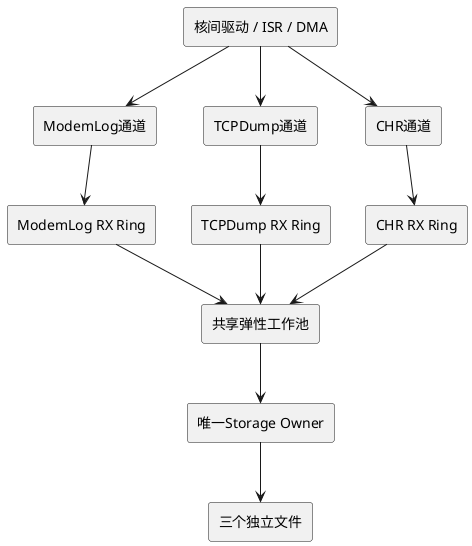
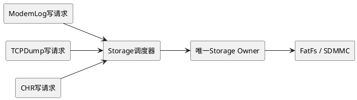
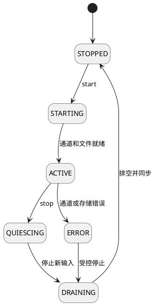

# ModemLog, TCPDump, CHR independent channel and flexible working pool design

> **Historical design, not current implementation baseline. ** Please read the [Unified Plan] (01-diagnostics-unified-design.md) and [Revised Flowchart] (03-modem-complete-mermaid-flows.md) first.
>
> Dynamic thread pooling is not currently recommended on this page. There is a stack reuse race condition when worker_release_slot is called before vTaskDelete(NULL) and must not be copied. Currently, it is a dual Socket Reactor plus a Storage Owner, and TCPDump uses the local private snapshot channel.

## 1. Conclusion

The three types of services go through independent bottom channels:

| business | channel | persistent buffering | Typical characteristics |
|---|---|---|---|
| ModemLog | Channel 0 | ModemLog RX Ring | Sustained, high throughput |
| TCPDump | Channel 1 | Packet Descriptor Ring | Continuously capture packets and allow statistical packet loss |
| CHR | Channel 2 | CHR Message Ring | Event/segment diagnostic data |

Threads cannot be the carrier of business continuity.

> Channels, Sockets, protocol status, sequence numbers, file offsets, and buffers belong to the persistent business context; dynamic threads are only temporary executors.

Recommended structure:

Three channels and business contexts exist for a long time; 0 to 2 processing workers are created on demand and exit after being idle; disk writing is completed by a serial Storage Owner.

## 2. Why can’t business threads directly own channels?

If each business thread owns a Socket, channel, protocol status, and file at the same time, the following will appear when the thread exits idle:

- The underlying data arrives but has no receiver;
- The Socket receiving window stops advancing;
- The channel callback references an expired task handle;
- Half packet parsing status is lost;
- File offset, PCAP header or CHR event status is lost;
- Unfinished DMA still refers to the recycled stack;
- The new thread cannot determine which sequence number to continue from;
- Mutex locks and resources cannot be released safely when a task is forcibly deleted.

Therefore, the "business life cycle" and "thread life cycle" must be separated.

## 3. Four-tier architecture

### 3.1 Persistent channel access layer

The underlying driver, ISR, DMA callback or IPC callback exists for a long time and is only responsible for:

1. Find the business based on the channel ID;
2. Write data to the bounded ring buffer of the business;
3. Update receiving serial number and statistics;
4. Mark the business as ready;
5. Return immediately.

It is prohibited to create/delete tasks, call FatFs, wait for Workers or perform complex parsing in callbacks.

~~~c
typedef enum {
DIAG_CHANNEL_MODEMLOG = 0,
DIAG_CHANNEL_TCPDUMP = 1,
DIAG_CHANNEL_CHR = 2,
DIAG_CHANNEL_COUNT
} diag_channel_id_t;
~~~

### 3.2 Persistent business context layer

Each business uses a static context:

~~~c
typedef enum {
SERVICE_STOPPED,
SERVICE_STARTING,
SERVICE_ACTIVE,
SERVICE_QUIESCING,
SERVICE_DRAINING,
SERVICE_ERROR
} service_state_t;

typedef struct {
diag_channel_id_t channel_id;

_Atomic service_state_t state;
_Atomic uint32_t generation;
_Atomic uint32_t scheduled;
_Atomic uint32_t processing;

uint32_t rx_sequence;
uint32_t committed_sequence;
uint64_t file_offset;

spsc_ring_t rx_ring;
protocol_parser_t parser;
service_stats_t stats;

int socket_fd;
FIL *file;
} diag_service_ctx_t;

static diag_service_ctx_t g_services[DIAG_CHANNEL_COUNT];
~~~

After the worker thread exits, the context is still saved:

- Channel and Socket status;
- Half packet parsing status;
- Ring buffer read and write position;
- Receipt, processing and submission sequence numbers;
- File handle and offset;
- flow control water level;
- generation and error statistics.

### 3.3 Elastic processing layer

Workers only process bounded data and do not hold Sockets, files, DMA, protocol status or locks for a long time.

Processing process:

1. Obtain `channel_id + generation` from the global ready queue;
2. Obtain serial execution rights for the business;
3. Work with a byte budget or time budget;
4. Submit the new state to the persistence context;
5. Release of executive powers;
6. Return to the thread pool to wait for other business.

### 3.4 Serial storage layer

If the three services write to the same SD card/FatFs, only one Storage Owner will be retained:

This avoids multi-threads blocking the SD card at the same time, FatFs reentrancy locks, DMA ownership confusion and file offset competition.

Storage Owner shall not exit when any business is ACTIVE, the write queue is not empty, or DMA is not completed.

## 4. Independent channel reception

~~~c
void diag_channel_rx(diag_channel_id_t channel,
const void *data,
uint32_t length)
{
diag_service_ctx_t *ctx = &g_services[channel];

if (atomic_load_explicit(&ctx->state,
memory_order_acquire)
!= SERVICE_ACTIVE) {
ctx->stats.rx_while_inactive++;
return;
}

uint32_t generation =
atomic_load_explicit(&ctx->generation,
memory_order_relaxed);

uint32_t accepted =
ring_write(&ctx->rx_ring, data, length);

ctx->stats.rx_bytes += accepted;

if (accepted != length) {
ctx->stats.dropped_bytes += length - accepted;
apply_channel_backpressure(ctx);
}

service_schedule(ctx, generation);
}
~~~

Each service must use an independent RX Ring and cannot share a data queue. Otherwise, ModemLog may occupy all the space, causing CHR and TCPDump to lose their ability to receive.

## 5. The same business must be executed serially

A shared thread pool can have multiple Workers, but the same type of business can only be processed by at most one Worker at the same time. It is equivalent to Java's SerialExecutor or strand.

~~~c
void service_schedule(diag_service_ctx_t *ctx,
uint32_t generation)
{
uint32_t expected = 0;

if (atomic_compare_exchange_strong(
&ctx->scheduled,
&expected,
1U)) {

ready_item_t item = {
.channel_id = ctx->channel_id,
.generation = generation,
};

ready_queue_push(&g_ready_queue, &item);
worker_pool_ensure_capacity();
}
}
~~~

Worker example:

~~~c
void elastic_worker(void *argument)
{
for (;;) {
ready_item_t item;

if (!ready_queue_pop(&g_ready_queue,
&item,
WORKER_IDLE_TIMEOUT)) {
if (worker_pool_can_shrink() &&
worker_has_no_resource()) {
worker_release_slot();
vTaskDelete(NULL);
}
continue;
}

diag_service_ctx_t *ctx =
&g_services[item.channel_id];

if (item.generation !=
atomic_load_explicit(&ctx->generation,
memory_order_acquire)) {
continue;
}

if (atomic_exchange(&ctx->processing, 1U) != 0U) {
continue;
}

process_service_budget(ctx,
MAX_BYTES_PER_RUN,
MAX_TIME_PER_RUN_MS);

atomic_store_explicit(&ctx->processing,
0U,
memory_order_release);

service_finish_or_reschedule(ctx,
item.generation);
}
}
~~~

## 6. Prevent lost wake-up

You cannot just execute `scheduled = 0` at the end of processing because new data might just arrive. Should be cleared and checked again:

~~~c
void service_finish_or_reschedule(
diag_service_ctx_t *ctx,
uint32_t generation)
{
if (!ring_empty(&ctx->rx_ring)) {
ready_queue_push_service(ctx, generation);
return;
}

atomic_store_explicit(&ctx->scheduled,
0U,
memory_order_release);

if (!ring_empty(&ctx->rx_ring)) {
service_schedule(ctx, generation);
}
}
~~~

In this way, even if the processing thread exits or is replaced, "there is data in the ring but no scheduling items" will not appear.

## 7. Generation ensures isolation of old and new sessions

Increment generation every time you start a business:

~~~c
uint32_t service_start(diag_service_ctx_t *ctx)
{
uint32_t generation =
atomic_fetch_add(&ctx->generation, 1U) + 1U;

reset_parser(&ctx->parser);
reset_ring(&ctx->rx_ring);
ctx->rx_sequence = 0;
ctx->committed_sequence = 0;
ctx->file_offset = 0;

open_service_file(ctx);
open_channel(ctx->channel_id);

atomic_store(&ctx->state, SERVICE_ACTIVE);
return generation;
}
~~~

Ready items, disk write requests and asynchronous callbacks all carry generation. When the business is quickly restarted after stopping, the data of the old generation cannot be written to the new file.

## 8. Three-channel scheduling and flow control

### 8.1 Independent water level

Independent settings for each channel:

| water level | behavior |
|---:|---|
| less than 70% | Normal processing |
| 70%～85% | Increase the scheduling priority of this business |
| 85%～95% | Request the channel to slow down |
| More than 95% | Implement business-specific discarding policies |

### 8.2 Different businesses adopt different strategies

- **ModemLog**: Prioritize PAUSE/RESUME, TCP backpressure or reduce log level;
- **TCPDump**: Packet loss is allowed, but packet capture drop statistics must be written;
- **CHR**: Give priority to retaining complete events, and limit log services if necessary;
- Control messages must have reserved descriptors and buffer resources.

### 8.3 Fair Scheduling

It is recommended to schedule according to "business priority + single-round budget" instead of letting a certain business be processed until it is completely empty:

| business | Example weight | single budget |
|---|---:|---:|
| CHR | 4 | 4～16 KB or 2 ms |
| ModemLog | 3 | 16～32 KB or 3 ms |
| TCPDump | 2 | 16～32 KB or 3 ms |

The actual weight should be adjusted based on the CHR importance, log rate, and packet capture allowable packet loss rate.

## 9. Elastic thread pool parameters

STM32 is typically single-core, and multiple CPU workers will not gain Java server-style parallelism benefits. The thread pool is mainly used for sharing stack resources and isolating blocking.

Recommended:

~~~text
Minimum Processing Worker: 0 or 1
Maximum Processing Workers: 2
Idle timeout: 2~5 seconds
Each processing budget: 8~32 KB or 1~5 ms
Static stack slots: 2
Storage Owner: maintained when any business is ACTIVE
Channel receiver: always present during session
~~~

If the three services are mainly to write disk directly after receiving, the most resource-saving solution is actually:

~~~text
Underlying callback/existing tcpip context: three channels for quick offloading
Independent RX Ring: 3
Storage Owner: 1
Flexible analysis Worker: 0~1
~~~

A second processing Worker is only needed when there is compression, filtering, PCAP encapsulation or complex CHR parsing.

## 10. Use fixed stack slots and infrequently use the system heap

Frequent `xTaskCreate()` / `vTaskDelete()` may cause heap fragmentation and unpredictable peak memory.

It is recommended to reserve two static execution slots:

~~~c
#define WORKER_SLOT_COUNT 2
#define WORKER_STACK_WORDS 512

typedef struct {
StaticTask_t tcb;
StackType_t stack[WORKER_STACK_WORDS];
_Atomic uint32_t in_use;
} worker_slot_t;

static worker_slot_t g_worker_slots[WORKER_SLOT_COUNT];
~~~

Use `xTaskCreateStatic()` to create a Worker. After the thread exits, the slot is returned to the pool and reused for the next business.

This will not return the stack to the general heap, but it will reduce the stack for each of the three businesses to the two largest stacks shared by the entire system and avoid fragmentation.

## 11. Worker safe exit conditions

Idle exit is allowed only if the following conditions are met simultaneously:

~~~text
ready queue is empty
There is currently no business being executed by the Worker.
Does not hold business lock
Does not own the Socket or underlying channel
does not own file handle
No outstanding DMA
No uncommitted buffers
The current number of workers is higher than the minimum value
~~~

Do not force removal of Workers asynchronously by the management thread. Let the worker exit on its own at a safe point.

In FreeRTOS, the kernel dynamic memory of a deleted task is reclaimed by the Idle task; the resources requested by the task code itself will not be automatically released. Therefore, when dynamically creating a task, you must ensure that the Idle task can run and release application resources before self-deletion.

## 12. Business life cycle

Correct startup sequence:

1. Initialize the persistence context;
2. Increment generation;
3. Open the output file;
4. Initialize RX Ring;
5. Register and open an independent channel for this business;
6. Set ACTIVE;
7. After receiving the data, create workers on demand.

Correct stopping sequence:

1. SET QUIESCING;
2. Notify the bottom layer to stop new data from the channel;
3. Wait for channel confirmation;
4. Drain the RX Ring and write queue;
5. Wait for DMA to complete;
6. `f_sync()` and close the file;
7. close channel;
8. set STOPPED;
9. Allow Workers and Storage Owners to exit after idle timeout.

You cannot delete the Worker first and then close the channel.

## 13. Continuity invariants

Implementation should ensure:

1. A channel belongs to only one service;
2. A business can process at most one Worker at the same time;
3. Worker threads do not own long-term resources;
4. The submission sequence number will be advanced only after the file is written successfully;
5. The business context can only be closed after the channel is stopped;
6. The file can be closed only after the data is drained;
7. All asynchronous tasks carry generation;
8. Thread switching does not change the business processing sequence;
9. When a channel is full, it cannot exhaust the reserved resources of other channels;
10. There is no outstanding DMA before the Storage Owner exits.

## 14. Recommended final configuration

> **Three independent underlying channels + three static business contexts and RX Ring + one serial Storage Owner + 0~2 shared flexible processing Workers. **

Threads can exit idle, but only from stateless workers. As long as any business is ACTIVE, its independent channel receiving entry, persistence context, and storage owner must continue to exist.

## 15. Reference

- [FreeRTOS Kernel task.h:xTaskCreateStatic and vTaskDelete](https://github.com/FreeRTOS/FreeRTOS-Kernel/blob/main/include/task.h)
- [FreeRTOS Kernel task implementation](https://github.com/FreeRTOS/FreeRTOS-Kernel/blob/main/tasks.c)
