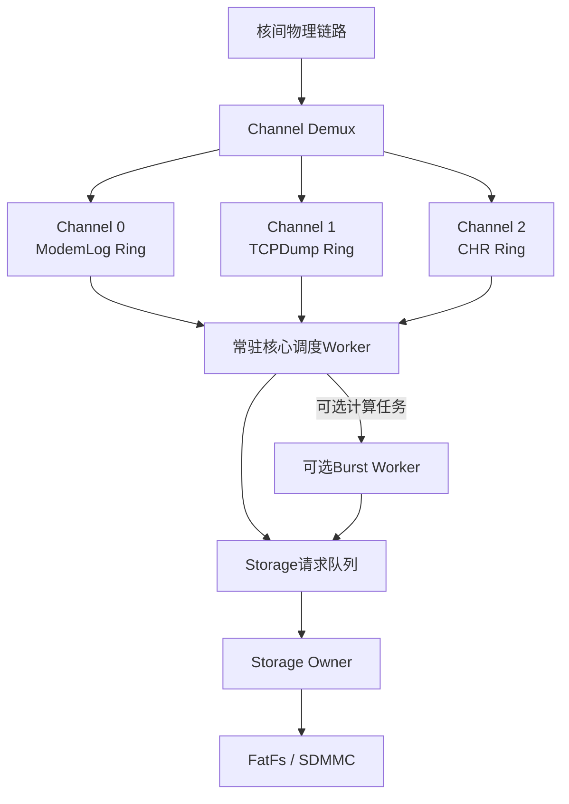
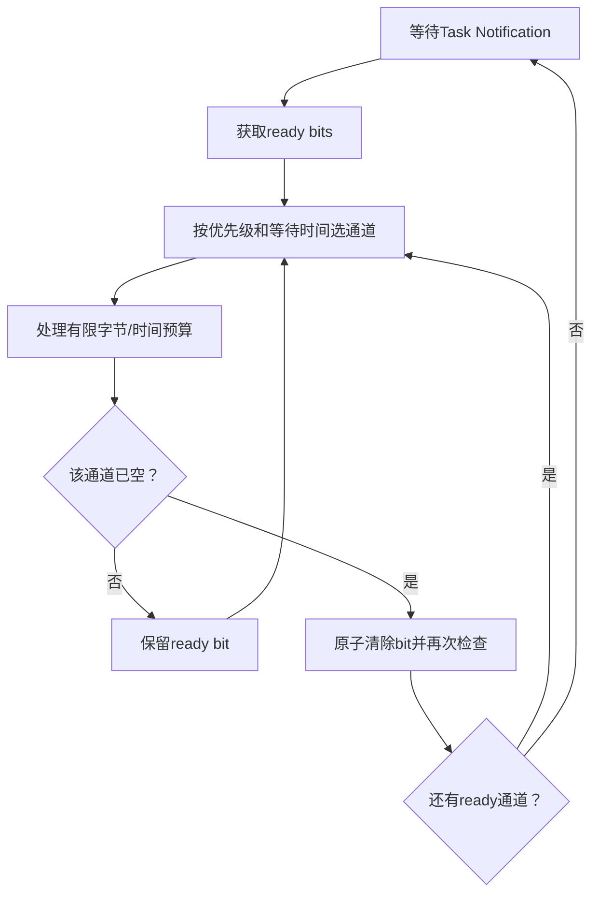
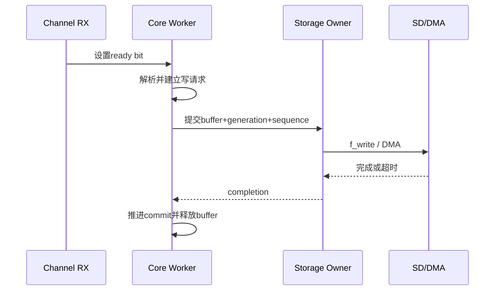
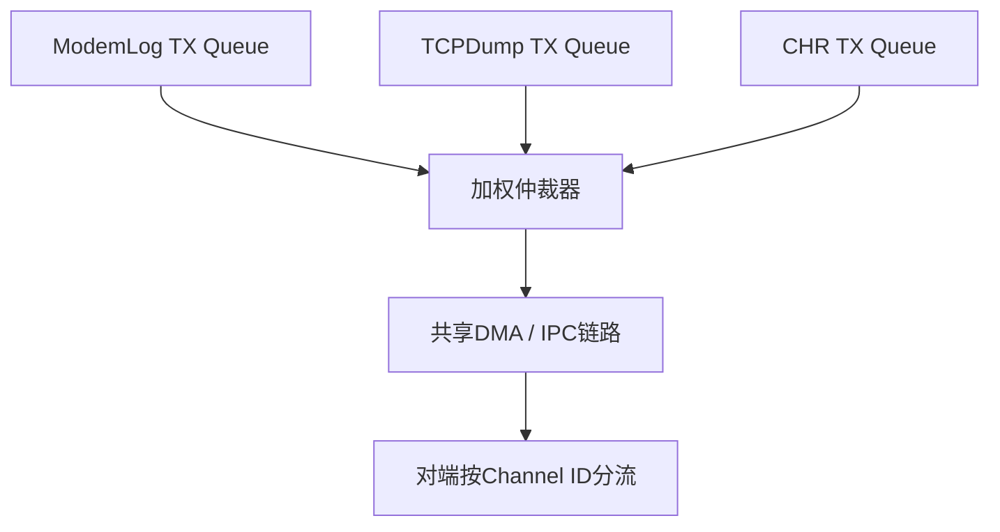
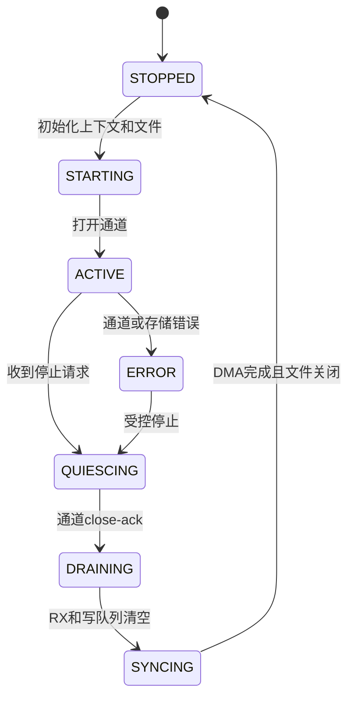
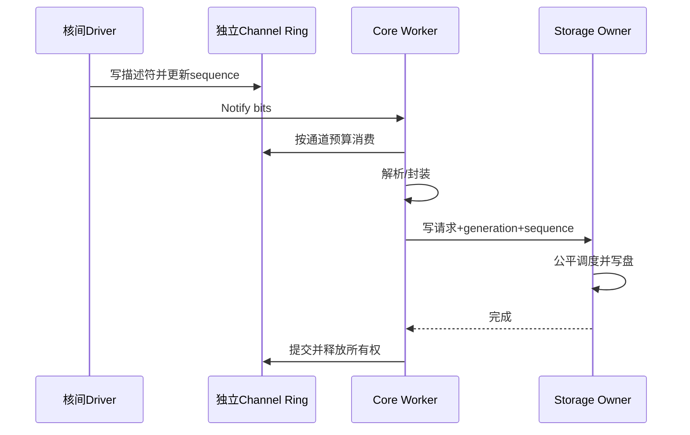

# ModemLog, TCPDump, CHR independent channel architecture review and revision

> **Historical design, not current implementation baseline. ** Please read the [Unified Plan] (01-diagnostics-unified-design.md) and [Revised Flowchart] (03-modem-complete-mermaid-flows.md) first.
>
> This page still contains a withdrawn suggestion: TCPDump cannot retain normal network packets through pbuf_ref by default until the SD is dropped; this will occupy RX resources and does not guarantee the stability of the content snapshot. The original three-core input/Core model is replaced by dual Socket Reactor and MCU local Capture Tap.

## 1. Review conclusion

The correct direction of the original design is:

- Three services use three independent underlying channels;
- Each business has an independent business context and RX buffer;
- Threads do not save long-term business state;
- FatFs is accessed serially by a single Storage Owner;
- Use generation to isolate old and new sessions.

However, the "Java-style dynamic thread pool" cannot be directly copied to STM32/FreeRTOS. The three businesses are all continuous streaming businesses. Frequent creation and deletion of tasks have little benefit, but increase the risks of stack reuse race conditions, heap fragmentation, lost wake-up, and resource cleanup.

The recommended revision is:

> **1 resident core scheduling Worker + 1 Storage Owner that exists by session + 0~1 optional burst computing Worker. **

The core worker consumes almost no CPU when blocking waiting for notifications. Optional burst workers only handle stateless, CPU-intensive tasks and do not own sockets, channels, files or DMA.

## 2. Problem priority

| level | design issues | risk | Correction |
|---|---|---|---|
| P0 | Worker releases its own static stack slot before self-deletion | New tasks may reuse stacks that are still executing | Fixed Worker will not be deleted; or the Supervisor will confirm the deletion and then recycle it. |
| P0 | SPSC assumptions are not clear | Multiple ISR/callback production breaks index | Each ring is strictly a single producer, or first aggregated to a single Dispatcher |
| P0 | The underlying channel and Worker life cycle may be coupled | After the Worker exits, no one receives the channel. | The channel entry and business context persist until the session is completely stopped. |
| P0 | There is a race condition in scheduled/processing under multiple workers | Lost wake-up, business is no longer scheduled permanently | Using a single core to schedule workers and atomic ready bitmaps |
| P0 | Storage write request lacks explicit buffer ownership | Buffer may be overwritten when DMA is not completed | The write request carries owner/generation/seq and is released only after completion. |
| P1 | Three logical channels may share a physical send queue | Head-of-line blocking still occurs | Channel independent credit/descriptor/queue, control resource reservation |
| P1 | The maximum number of dynamic thread pools is 2 but the same as the business requirements are serial | The second worker’s actual income is limited | The second worker only performs stateless transitions that can be parallelized |
| P1 | File object uses raw pointer | Life cycle and ownership are unclear | The FIL object belongs to the Storage Owner or is embedded in the persistence context |
| P1 | Stop process not waiting for callback in transit | Old data may still be received after closing | close-ack + inflight count + generation check |
| P1 | Ready Queue may be full | There is data but scheduling items are lost | Only use atomic ready bitmap for 3 types of business |
| P2 | weight fixed | The delay may not be satisfied when the throughput is high | Co-scheduling with byte budget and maximum wait time |
| P2 | Statistics are not sufficient to locate physical link contention | Logical isolation but unable to detect underlying congestion | Increased per-channel credits, DMA waits and physical queue delays |

## 3. Revised overall structure

### Thread configuration

| execution context | life cycle | Whether blocking is allowed | long term resources |
|---|---|---|---|
| Inter-core ISR/DMA callback | system level | Not allowed | channel hardware |
| Core Worker | Resident, blocking wait | Allowed for a short period of time | don't own file |
| Burst Worker | On demand, optional | Only waits are counted | Does not own long-term resources |
| Storage Owner | Exists when any business is ACTIVE | Allow blocking disk writes | FIL and SD DMA |

If the data does not require compression, filtering or complex PCAP/CHR parsing, the Burst Worker should be deleted and only the Core Worker and Storage Owner should be retained.

## 4. Why does resident blocking Worker save resources?

When a task is blocked on a notification, it does not consume CPU and only occupies a fixed TCB and stack. Frequent deletion can only try to recycle stack RAM, but it will introduce:

- Dynamic heap fragmentation;
- Delayed recycling of Idle tasks;
- Stack slot safe reuse protocol;
- Create a failed path;
- The task handle is left vacant;
- Callback and destruction race conditions.

Using a shared Core Worker has reduced the three stacks of "one thread per business" to one shared stack. There is usually no need to continue deleting it dynamically.

FreeRTOS description: After deleting a task, the memory dynamically allocated by the kernel is reclaimed by the Idle task, and the resources allocated by the task code will not be automatically released. Therefore, `vTaskDelete()` cannot be regarded as automatic resource management after the Java thread exits.

## 5. Three-channel reception and scheduling

When there are only three services, there is no need for dynamic Ready Queue. Just use a three-digit atomic ready bitmap:

~~~c
#define READY_MODEMLOG (1UL << 0)
#define READY_TCPDUMP   (1UL << 1)
#define READY_CHR       (1UL << 2)

static TaskHandle_t g_core_worker;

void channel_rx_isr(channel_id_t channel,
                    rx_descriptor_t *desc)
{
    service_ctx_t *ctx = &g_services[channel];

    if (atomic_load(&ctx->state) != SERVICE_ACTIVE) {
release_rx_descriptor(desc);
ctx->stats.rx_inactive_drop++;
return;
}

if (!rx_ring_push_from_isr(&ctx->rx_ring, desc)) {
apply_channel_overflow_policy(ctx, desc);
return;
}

atomic_fetch_or(&g_ready_bits, 1UL << channel);

    BaseType_t wake = pdFALSE;
    xTaskNotifyFromISR(g_core_worker,
                       1UL << channel,
                       eSetBits,
                       &wake);
    portYIELD_FROM_ISR(wake);
}
~~~

优点：

- 没有Ready Queue满的问题；
- 同一业务多次到达会合并成一个bit；
- 不需要为每个数据包创建调度项；
- Core Worker天然保证每业务串行；
- 内存固定。

## 6. Core Worker调度流程

伪代码：

~~~c
void core_worker_task(void *argument)
{
    uint32_t notified;

    for (;;) {
        xTaskNotifyWait(0U,
                        UINT32_MAX,
                        &notified,
                        portMAX_DELAY);

        atomic_fetch_or(&g_ready_bits, notified);

        while (atomic_load(&g_ready_bits) != 0U) {
            channel_id_t channel =
                scheduler_pick_channel(&g_services,
                                       atomic_load(&g_ready_bits));

            service_ctx_t *ctx = &g_services[channel];

            process_channel_budget(
                ctx,
                ctx->byte_budget,
ctx->time_budget_ms);

if (rx_ring_empty(&ctx->rx_ring)) {
atomic_fetch_and(&g_ready_bits,
~(1UL << channel));

                /* 防止清bit时新数据到达 */
                if (!rx_ring_empty(&ctx->rx_ring)) {
atomic_fetch_or(&g_ready_bits,
1UL << channel);
                }
            }
        }
    }
}
~~~

实际实现中，ready位图和环形缓冲区的内存序必须使用acquire/release语义，或者在Cortex-M上使用正确的临界区和 `__DMB()`。

## 7. SPSC使用条件

每个RX Ring只有在以下条件同时成立时才是SPSC：

- 生产者只有一个核间Dispatcher/回调上下文；
- 消费者只有Core Worker；
- Storage Owner不直接消费RX Ring；
- Burst Worker不直接推进RX读指针。

如果同一通道可能由DMA完成回调、Socket线程和错误恢复线程同时投递，它已经是多生产者，不能继续使用SPSC。

修正方式二选一：

1. 所有输入先进入唯一Channel Dispatcher，再写SPSC；
2. 使用固定描述符池和极短临界区实现MPSC队列。

推荐第一种，状态更容易验证。

## 8. 每通道缓冲模型

| 业务 | 推荐环类型 | 数据所有权 |
|---|---|---|
| ModemLog | 字节环或固定块环 | 写盘完成后释放 |
| TCPDump | 包描述符环 | pbuf/DMA引用计数归零后释放 |
| CHR | 消息描述符环 | 完整事件提交后释放 |

### TCPDump特别要求

TCPDump若直接引用lwIP `pbuf`，捕获入口必须增加引用，异步处理完成后再释放：

~~~c
pbuf_ref(p);

if (!tcpdump_ring_push(p)) {
    pbuf_free(p);
    tcpdump_stats.drop++;
}
~~~

不能把原始pbuf指针放入队列后立即释放，也不能让抓包路径长期阻塞lwIP的正常收包路径。

## 9. Storage请求所有权

Storage请求必须携带：

~~~c
typedef struct {
    channel_id_t channel;
    uint32_t generation;
    uint32_t sequence;

    const void *data;
    uint32_t length;

    buffer_owner_t owner;
    storage_completion_fn completion;
} storage_request_t;
~~~

处理顺序：

只有满足下面条件才能释放或复用缓冲：

~~~text
f_write返回FR_OK
并且written == requested_length
并且底层DMA已经真正完成
并且completion的generation仍匹配
~~~

如果写盘失败，不能推进committed sequence。

## 10. Storage Owner公平调度

单Storage Owner会形成共享瓶颈，但这比三个线程同时阻塞FatFs更可控。

建议为三种业务维护独立写队列，使用“优先级 + 老化 + 字节预算”：

| 业务 | 初始权重 | 单轮预算 | 超时保障 |
|---|---:|---:|---:|
| CHR | 4 | 4～16 KB | 最短 |
| ModemLog | 3 | 16～64 KB | 中 |
| TCPDump | 2 | 16～64 KB | 可允许丢包 |

任何业务等待超过最大时延后临时提升优先级，防止低权重业务永久饥饿。

不要每写一个小块就调用 `f_sync()`。同步周期应按业务可靠性要求统一控制；关键CHR事件可以请求一次显式barrier。

## 11. 物理链路上的真正隔离

“三个通道号”不等于已经隔离。如果三者共用一个物理DMA队列，ModemLog仍可能造成队头阻塞。

底层至少需要：

- 每通道独立RX credit；
- 每通道独立描述符配额；
- CHR/控制通道保留描述符；
- 每通道独立高低水位；
- 发送侧加权轮询；
- 大日志帧长度上限；
- 通道级暂停/恢复；
- 物理队列延迟统计。

CHR和控制业务应拥有不能被ModemLog借走的最小保留credit。

## 12. Burst Worker的使用边界

Burst Worker只能处理可独立并行的纯计算任务，例如：

- 数据压缩；
- 数据脱敏；
- 校验计算；
- 独立数据块格式转换。

它不能：

- 调用同一Socket的 `recv()`；
- 直接推进业务RX Ring；
- 持有FIL对象；
- 改变全局协议解析状态；
- 负责通道启停；
- 直接关闭业务会话。

如果Burst Worker输出可能乱序，必须在Core Worker按sequence重新提交。

## 13. 修正线程回收问题

原方案类似下面的代码不安全：

~~~c
worker_release_slot();
vTaskDelete(NULL);
~~~

`worker_release_slot()` 后，新任务可能复用当前任务仍在使用的静态栈。

推荐方案：

### 方案A：固定阻塞Worker，优先推荐

~~~c
for (;;) {
    xTaskNotifyWait(..., portMAX_DELAY);
    process_work();
}
~~~

任务不删除，空闲不占CPU。

### 方案B：只动态创建Burst Worker

Burst Worker使用动态任务内存，自身释放所有应用资源后调用 `vTaskDelete(NULL)`，由Idle任务回收内核分配；需要接受堆碎片风险。

### 方案C：静态栈槽由Supervisor回收

1. Worker进入RETIRING；
2. Worker不再接收任务；
3. Supervisor确认Worker已经从调度器删除；
4. Supervisor才把静态TCB/栈槽标记FREE；
5. 新任务才能复用。

该方案复杂，除非RAM压力非常高，否则不建议。

## 14. 生命周期与安全停止

停止时必须等待：

~~~text
底层不再产生新描述符
channel close-ack已收到
inflight_rx == 0
RX Ring为空
Storage Queue为空
inflight_write == 0
DMA完成
f_sync成功或明确失败
FIL已关闭
~~~

generation只能防止旧数据污染新会话，不能替代等待底层回调真正退出。

## 15. 三种业务端到端流程

## 16. 修订后的推荐参数

~~~text
通道数：3
RX Ring：每通道1个
Core Worker：1个，常驻阻塞
Burst Worker：0～1个，默认关闭
Storage Owner：1个，任一会话ACTIVE时存在
Ready机制：32位原子bitmap + Task Notification
任务创建：Core与Storage优先静态创建
处理预算：每通道1～5 ms或8～32 KB
文件写入：16～64 KB批量
通道隔离：独立credit、描述符配额和水位
~~~

## 17. 验证测试

1. 三通道同时满速输入，验证无跨通道数据；
2. ModemLog持续1 Mbps时检查CHR最大延迟；
3. TCPDump队列满时确认只增加TCPDump drop；
4. SD卡阻塞500 ms时检查三个RX Ring水位；
5. Storage超时后确认缓冲未提前释放；
6. 通道停止与DMA回调同时发生；
7. 业务快速停止/重启，验证generation；
8. 人工使Ready通知发生在清bit边界，验证无丢唤醒；
9. 关闭Burst Worker，验证核心路径完全工作；
10. 长时间运行检查栈水位、描述符泄漏和pbuf引用；
11. 物理IPC队列拥塞时验证CHR保留credit；
12. 断开某一通道，确认其他两通道不受影响。

## 18. 最终决策

最稳妥且资源消耗最低的实现不是三个会自然销毁的业务线程，而是：

> **Three independent data channels and persistence contexts are uniformly scheduled by a resident blocking Core Worker; all files are serially written by a Storage Owner; only CPU-intensive stateless calculations create Burst Workers on demand. **

This not only retains the resource sharing capabilities similar to dynamic thread pools, but does not tie business continuity, channel reception, and file ownership to short-lived threads.

## 19. Reference

- [FreeRTOS task.h: Static task creation and task deletion constraints] (https://github.com/FreeRTOS/FreeRTOS-Kernel/blob/main/include/task.h)
- [FreeRTOS Kernel task implementation](https://github.com/FreeRTOS/FreeRTOS-Kernel/blob/main/tasks.c)
