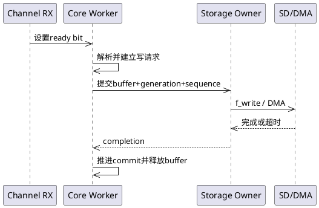
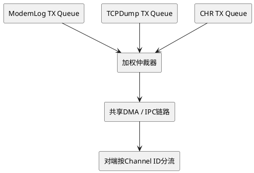
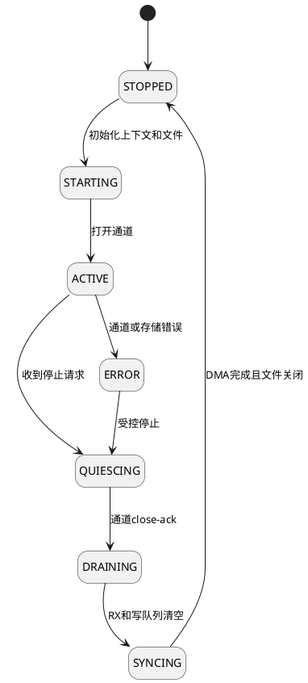
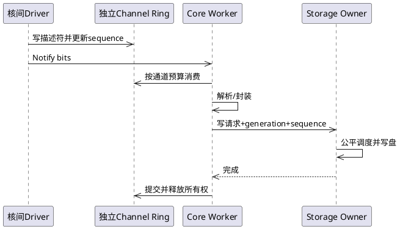

# ModemLog、TCPDump、CHR 独立通道架构审查与修订

> **历史设计，非当前实施基线。** 请先阅读[统一方案](01-diagnostics-unified-design.md)与[修订流程图](03-modem-complete-mermaid-flows.md)。
>
> 本页仍含已撤销建议：TCPDump不能默认通过pbuf_ref保留正常网络包直到SD落盘；这会占住RX资源且不保证内容快照稳定。原三核间输入/Core模型由双Socket Reactor与MCU本地Capture Tap取代。


## 1. 审查结论

原设计的正确方向是：

- 三种业务使用三个独立底层通道；
- 每种业务拥有独立业务上下文和RX缓冲区；
- 线程不保存长期业务状态；
- FatFs由单一Storage Owner串行访问；
- 使用generation隔离新旧会话。

但“Java式动态线程池”不能直接照搬到STM32/FreeRTOS。三种业务都是持续流式业务，频繁创建、删除任务收益很小，反而增加栈复用竞态、堆碎片、丢唤醒和资源清理风险。

推荐修订为：

> **1个常驻核心调度Worker + 1个按会话存在的Storage Owner + 0～1个可选突发计算Worker。**

核心Worker阻塞等待通知时几乎不消耗CPU。可选突发Worker只处理无状态、CPU密集型任务，不拥有Socket、通道、文件或DMA。

## 2. 问题优先级

| 级别 | 设计问题 | 风险 | 修正 |
|---|---|---|---|
| P0 | Worker在自删除前释放自己的静态栈槽 | 新任务可能复用仍在执行的栈 | 固定Worker不删除；或由Supervisor确认删除完成后回收 |
| P0 | SPSC假设未明确 | 多ISR/回调生产会破坏索引 | 每环严格单生产者，或先汇聚到唯一Dispatcher |
| P0 | 底层通道和Worker生命周期可能耦合 | Worker退出后通道无人接收 | 通道入口和业务上下文常驻到会话完全停止 |
| P0 | 多Worker下scheduled/processing存在竞态 | 丢唤醒、业务永久不再调度 | 使用单核心调度Worker和原子ready位图 |
| P0 | Storage写请求缺少明确缓冲所有权 | DMA未完成时缓冲可能被覆盖 | 写请求携带owner/generation/seq，完成后才释放 |
| P1 | 三个逻辑通道可能共用一个物理发送队列 | 仍会发生队头阻塞 | 通道独立credit/描述符/队列，控制资源保留 |
| P1 | 动态线程池最大2个但同业务要求串行 | 第二Worker实际收益有限 | 第二Worker仅执行可并行的无状态转换 |
| P1 | File对象使用裸指针 | 生命周期和归属不清楚 | FIL对象归Storage Owner或嵌入持久上下文 |
| P1 | 停止流程未等待在途回调 | 关闭后仍可能收到旧数据 | close-ack + inflight计数 + generation检查 |
| P1 | Ready Queue可能满 | 有数据但调度项丢失 | 仅3种业务时使用原子ready位图 |
| P2 | 权重固定 | 高吞吐时可能不满足时延 | 使用字节预算和最大等待时间共同调度 |
| P2 | 统计不足以定位物理链路争用 | 逻辑隔离但无法发现底层拥塞 | 增加每通道credit、DMA等待和物理队列延迟 |

## 3. 修订后的总体架构

```plantuml
@startuml
hide stereotype
skinparam shadowing false

rectangle "核间物理链路" as PHY
rectangle "Channel Demux" as DEMUX
rectangle "Channel 0
ModemLog Ring" as M
rectangle "Channel 1
TCPDump Ring" as T
rectangle "Channel 2
CHR Ring" as C
rectangle "常驻核心调度Worker" as CORE
rectangle "可选Burst Worker" as BURST
rectangle "Storage请求队列" as SQ
rectangle "Storage Owner" as STORE
rectangle "FatFs / SDMMC" as DISK

PHY --> DEMUX
DEMUX --> M
DEMUX --> T
DEMUX --> C
M --> CORE
T --> CORE
C --> CORE
CORE --> BURST : 可选计算任务
CORE --> SQ
BURST --> SQ
SQ --> STORE
STORE --> DISK
@enduml
```

### 线程配置

| 执行上下文 | 生命周期 | 是否允许阻塞 | 长期资源 |
|---|---|---|---|
| 核间ISR/DMA回调 | 系统级 | 不允许 | 通道硬件 |
| Core Worker | 常驻、阻塞等待 | 短时允许 | 不拥有文件 |
| Burst Worker | 按需，可选 | 仅计算等待 | 不拥有长期资源 |
| Storage Owner | 任一业务ACTIVE时存在 | 允许阻塞写盘 | FIL和SD DMA |

如果数据无需压缩、过滤或复杂PCAP/CHR解析，应删除Burst Worker，只保留Core Worker和Storage Owner。

## 4. 为什么常驻阻塞Worker更省资源

任务阻塞在通知上时不消耗CPU，只占固定TCB和栈。频繁删除只能尝试回收栈RAM，但会引入：

- 动态堆碎片；
- Idle任务延迟回收；
- 栈槽安全复用协议；
- 创建失败路径；
- 任务句柄悬空；
- 回调与销毁竞态。

使用一个共享Core Worker，已经把“每业务一个线程”的三份栈缩减为一份共享栈。通常没有继续动态删除它的必要。

FreeRTOS说明：删除任务后，内核动态分配的内存由Idle任务回收，任务代码自行分配的资源不会自动释放。因此不能把 `vTaskDelete()` 当作Java线程退出后的自动资源管理。

## 5. 三通道接收与调度

仅有三种业务时，不需要动态Ready Queue。使用三位原子ready bitmap即可：

~~~c
#define READY_MODEMLOG  (1UL << 0)
#define READY_TCPDUMP   (1UL << 1)
#define READY_CHR       (1UL << 2)

static TaskHandle_t g_core_worker;

void channel_rx_isr(channel_id_t channel,
                    rx_descriptor_t *desc)
{
    service_ctx_t *ctx = &g_services[channel];

    if (atomic_load(&ctx->state) != SERVICE_ACTIVE) {
        release_rx_descriptor(desc);
        ctx->stats.rx_inactive_drop++;
        return;
    }

    if (!rx_ring_push_from_isr(&ctx->rx_ring, desc)) {
        apply_channel_overflow_policy(ctx, desc);
        return;
    }

    atomic_fetch_or(&g_ready_bits, 1UL << channel);

    BaseType_t wake = pdFALSE;
    xTaskNotifyFromISR(g_core_worker,
                       1UL << channel,
                       eSetBits,
                       &wake);
    portYIELD_FROM_ISR(wake);
}
~~~

优点：

- 没有Ready Queue满的问题；
- 同一业务多次到达会合并成一个bit；
- 不需要为每个数据包创建调度项；
- Core Worker天然保证每业务串行；
- 内存固定。

## 6. Core Worker调度流程

```plantuml
@startuml
hide stereotype
skinparam shadowing false

rectangle "等待Task Notification" as WAIT
rectangle "获取ready bits" as SNAP
rectangle "按优先级和等待时间选通道" as PICK
rectangle "处理有限字节/时间预算" as RUN
diamond "该通道已空？" as EMPTY
rectangle "保留ready bit" as AGAIN
rectangle "原子清除bit并再次检查" as CLEAR
diamond "还有ready通道？" as MORE

WAIT --> SNAP
SNAP --> PICK
PICK --> RUN
RUN --> EMPTY
EMPTY --> AGAIN : 否
EMPTY --> CLEAR : 是
AGAIN --> PICK
CLEAR --> MORE
MORE --> PICK : 是
MORE --> WAIT : 否
@enduml
```

伪代码：

~~~c
void core_worker_task(void *argument)
{
    uint32_t notified;

    for (;;) {
        xTaskNotifyWait(0U,
                        UINT32_MAX,
                        &notified,
                        portMAX_DELAY);

        atomic_fetch_or(&g_ready_bits, notified);

        while (atomic_load(&g_ready_bits) != 0U) {
            channel_id_t channel =
                scheduler_pick_channel(&g_services,
                                       atomic_load(&g_ready_bits));

            service_ctx_t *ctx = &g_services[channel];

            process_channel_budget(
                ctx,
                ctx->byte_budget,
                ctx->time_budget_ms);

            if (rx_ring_empty(&ctx->rx_ring)) {
                atomic_fetch_and(&g_ready_bits,
                                 ~(1UL << channel));

                /* 防止清bit时新数据到达 */
                if (!rx_ring_empty(&ctx->rx_ring)) {
                    atomic_fetch_or(&g_ready_bits,
                                    1UL << channel);
                }
            }
        }
    }
}
~~~

实际实现中，ready位图和环形缓冲区的内存序必须使用acquire/release语义，或者在Cortex-M上使用正确的临界区和 `__DMB()`。

## 7. SPSC使用条件

每个RX Ring只有在以下条件同时成立时才是SPSC：

- 生产者只有一个核间Dispatcher/回调上下文；
- 消费者只有Core Worker；
- Storage Owner不直接消费RX Ring；
- Burst Worker不直接推进RX读指针。

如果同一通道可能由DMA完成回调、Socket线程和错误恢复线程同时投递，它已经是多生产者，不能继续使用SPSC。

修正方式二选一：

1. 所有输入先进入唯一Channel Dispatcher，再写SPSC；
2. 使用固定描述符池和极短临界区实现MPSC队列。

推荐第一种，状态更容易验证。

## 8. 每通道缓冲模型

| 业务 | 推荐环类型 | 数据所有权 |
|---|---|---|
| ModemLog | 字节环或固定块环 | 写盘完成后释放 |
| TCPDump | 包描述符环 | pbuf/DMA引用计数归零后释放 |
| CHR | 消息描述符环 | 完整事件提交后释放 |

### TCPDump特别要求

TCPDump若直接引用lwIP `pbuf`，捕获入口必须增加引用，异步处理完成后再释放：

~~~c
pbuf_ref(p);

if (!tcpdump_ring_push(p)) {
    pbuf_free(p);
    tcpdump_stats.drop++;
}
~~~

不能把原始pbuf指针放入队列后立即释放，也不能让抓包路径长期阻塞lwIP的正常收包路径。

## 9. Storage请求所有权

Storage请求必须携带：

~~~c
typedef struct {
    channel_id_t channel;
    uint32_t generation;
    uint32_t sequence;

    const void *data;
    uint32_t length;

    buffer_owner_t owner;
    storage_completion_fn completion;
} storage_request_t;
~~~

处理顺序：



只有满足下面条件才能释放或复用缓冲：

~~~text
f_write返回FR_OK
并且written == requested_length
并且底层DMA已经真正完成
并且completion的generation仍匹配
~~~

如果写盘失败，不能推进committed sequence。

## 10. Storage Owner公平调度

单Storage Owner会形成共享瓶颈，但这比三个线程同时阻塞FatFs更可控。

建议为三种业务维护独立写队列，使用“优先级 + 老化 + 字节预算”：

| 业务 | 初始权重 | 单轮预算 | 超时保障 |
|---|---:|---:|---:|
| CHR | 4 | 4～16 KB | 最短 |
| ModemLog | 3 | 16～64 KB | 中 |
| TCPDump | 2 | 16～64 KB | 可允许丢包 |

任何业务等待超过最大时延后临时提升优先级，防止低权重业务永久饥饿。

不要每写一个小块就调用 `f_sync()`。同步周期应按业务可靠性要求统一控制；关键CHR事件可以请求一次显式barrier。

## 11. 物理链路上的真正隔离

“三个通道号”不等于已经隔离。如果三者共用一个物理DMA队列，ModemLog仍可能造成队头阻塞。

底层至少需要：

- 每通道独立RX credit；
- 每通道独立描述符配额；
- CHR/控制通道保留描述符；
- 每通道独立高低水位；
- 发送侧加权轮询；
- 大日志帧长度上限；
- 通道级暂停/恢复；
- 物理队列延迟统计。



CHR和控制业务应拥有不能被ModemLog借走的最小保留credit。

## 12. Burst Worker的使用边界

Burst Worker只能处理可独立并行的纯计算任务，例如：

- 数据压缩；
- 数据脱敏；
- 校验计算；
- 独立数据块格式转换。

它不能：

- 调用同一Socket的 `recv()`；
- 直接推进业务RX Ring；
- 持有FIL对象；
- 改变全局协议解析状态；
- 负责通道启停；
- 直接关闭业务会话。

如果Burst Worker输出可能乱序，必须在Core Worker按sequence重新提交。

## 13. 修正线程回收问题

原方案类似下面的代码不安全：

~~~c
worker_release_slot();
vTaskDelete(NULL);
~~~

`worker_release_slot()` 后，新任务可能复用当前任务仍在使用的静态栈。

推荐方案：

### 方案A：固定阻塞Worker，优先推荐

~~~c
for (;;) {
    xTaskNotifyWait(..., portMAX_DELAY);
    process_work();
}
~~~

任务不删除，空闲不占CPU。

### 方案B：只动态创建Burst Worker

Burst Worker使用动态任务内存，自身释放所有应用资源后调用 `vTaskDelete(NULL)`，由Idle任务回收内核分配；需要接受堆碎片风险。

### 方案C：静态栈槽由Supervisor回收

1. Worker进入RETIRING；
2. Worker不再接收任务；
3. Supervisor确认Worker已经从调度器删除；
4. Supervisor才把静态TCB/栈槽标记FREE；
5. 新任务才能复用。

该方案复杂，除非RAM压力非常高，否则不建议。

## 14. 生命周期与安全停止



停止时必须等待：

~~~text
底层不再产生新描述符
channel close-ack已收到
inflight_rx == 0
RX Ring为空
Storage Queue为空
inflight_write == 0
DMA完成
f_sync成功或明确失败
FIL已关闭
~~~

generation只能防止旧数据污染新会话，不能替代等待底层回调真正退出。

## 15. 三种业务端到端流程



## 16. 修订后的推荐参数

~~~text
通道数：3
RX Ring：每通道1个
Core Worker：1个，常驻阻塞
Burst Worker：0～1个，默认关闭
Storage Owner：1个，任一会话ACTIVE时存在
Ready机制：32位原子bitmap + Task Notification
任务创建：Core与Storage优先静态创建
处理预算：每通道1～5 ms或8～32 KB
文件写入：16～64 KB批量
通道隔离：独立credit、描述符配额和水位
~~~

## 17. 验证测试

1. 三通道同时满速输入，验证无跨通道数据；
2. ModemLog持续1 Mbps时检查CHR最大延迟；
3. TCPDump队列满时确认只增加TCPDump drop；
4. SD卡阻塞500 ms时检查三个RX Ring水位；
5. Storage超时后确认缓冲未提前释放；
6. 通道停止与DMA回调同时发生；
7. 业务快速停止/重启，验证generation；
8. 人工使Ready通知发生在清bit边界，验证无丢唤醒；
9. 关闭Burst Worker，验证核心路径完全工作；
10. 长时间运行检查栈水位、描述符泄漏和pbuf引用；
11. 物理IPC队列拥塞时验证CHR保留credit；
12. 断开某一通道，确认其他两通道不受影响。

## 18. 最终决策

最稳妥且资源消耗最低的实现不是三个会自然销毁的业务线程，而是：

> **三个独立数据通道与持久上下文，统一由一个常驻阻塞Core Worker调度；所有文件由一个Storage Owner串行写入；只有CPU密集型无状态计算才按需创建Burst Worker。**

这样既保留类似动态线程池的资源共享能力，又不会把业务连续性、通道接收和文件所有权绑定到短生命周期线程。

## 19. 参考

- [FreeRTOS task.h：静态任务创建与任务删除约束](https://github.com/FreeRTOS/FreeRTOS-Kernel/blob/main/include/task.h)
- [FreeRTOS Kernel任务实现](https://github.com/FreeRTOS/FreeRTOS-Kernel/blob/main/tasks.c)
