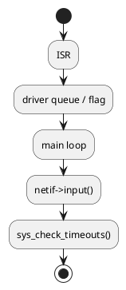
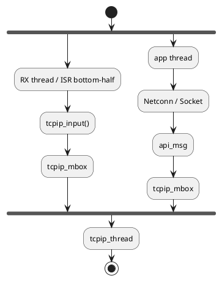
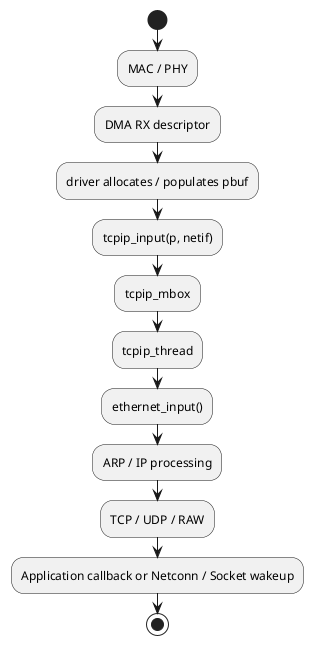
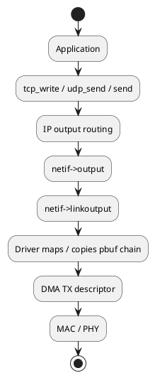
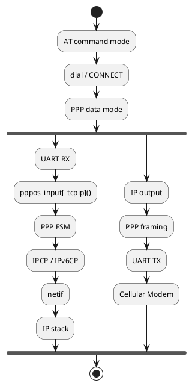

# lwIP TCP/IP Stack Architecture & Engineering Guide

This document is a modularized engineering summary based on the technical reference document `lwIP_TCPIP_DeepWiki_Technical_Summary_2026-08-21.docx`. It comprehensively details the execution models, core data structures, RX/TX call graphs, API selection criteria, RTOS porting methodology, and production debugging practices for lwIP. The primary source is DeepWiki's indexed snapshot of `lwip-tcpip/lwip`; production systems must strictly reference the project-pinned lwIP release, `lwipopts.h`, and platform BSP port layer.

## 1. Quick Reference & Architectural Overview

lwIP (Lightweight IP) is purpose-built for resource-constrained microcontrollers (MCUs), real-time operating systems (RTOS), and bare-metal environments. It provides a configurable and modular suite of network protocols, including IPv4/IPv6, TCP, UDP, RAW, ARP, DHCP, DNS, and PPP. It completely decouples protocol logic from underlying link-layer hardware drivers (Ethernet MAC, Wi‑Fi, PPP) through `struct netif` and the `pbuf` memory abstraction.

| Dimension | Core Concepts | Engineering Significance |
|---|---|---|
| Execution Environment | Bare-metal vs. RTOS | Governed by `NO_SYS` to determine threading model |
| Protocol Suite | IPv4/IPv6, TCP, UDP, RAW | Tailorable at compile-time to match feature budgets |
| Programming Interfaces | Raw API, Netconn API, BSD Sockets | Explicit trade-offs between performance, RAM, and ease of use |
| Driver Boundaries | `netif` abstraction + `pbuf` buffers | Adaptable to Ethernet, Wi‑Fi, and PPPoS interfaces |
| Configuration | `lwipopts.h` | Centralized compile-time control over features and memory pools |

## 2. Two Core Threading Models

### NO_SYS=1: Bare-Metal / Main Loop Execution



In bare-metal mode, the primary super-loop polls hardware interfaces, passes received packets into the stack via `netif->input()`, and continuously advances software timers via `sys_check_timeouts()`. The event-driven Raw API is the primary application interface. Interrupt Service Routines (ISRs) must only perform rapid DMA buffer swapping, flag setting, or ring-buffer staging; complex protocol parsing inside ISRs is strictly forbidden.

### NO_SYS=0: RTOS / Multi-Threaded Model



In multi-threaded mode, `tcpip_thread` serves as the single serialized core execution context of the protocol stack. Raw API functions must execute exclusively within this core context. External application threads must enter the stack via `tcpip_callback()`, thread-safe messaging mailboxes (`api_msg`), or properly configured core locking primitives (`LOCK_TCPIP_CORE()`).

## 3. Initialization & Configuration Workflow

### Bare-Metal Initialization Sequence

```c
platform_init();
lwip_init();
netif_add(...);
netif_set_default(&netif);
netif_set_up(&netif);

for (;;) {
    ethernetif_poll();
    sys_check_timeouts();
}
```

### RTOS Initialization Sequence

```c
os_network_driver_init();
tcpip_init(callback, arg);
netif_add(...);             /* or netifapi_netif_add */
netif_set_default(&netif);
netif_set_up(&netif);
dhcp_start(&netif);         /* or configure static IP addresses */
```

Configuration guidelines: First choose the `NO_SYS` setting, then decide whether to activate `LWIP_NETCONN` or `LWIP_SOCKET`. Finally, tune `PBUF_POOL_SIZE`, `MEMP_NUM_TCP_PCB`, `MEMP_NUM_TCP_SEG`, `TCP_WND`, and `TCP_SND_BUF` according to peak packet volume, bandwidth-delay products, and concurrent socket connections.

`MEM_SIZE` specifies only the lwIP heap budget and does not account for the total memory footprint of the stack. If the `memp` pool or `pbuf` pool is depleted, allocation errors (`ERR_MEM`) will occur even if ample contiguous heap memory remains free.

## 4. tcpip_thread, Mailboxes, and Timers

| Component / Function | Role & Responsibility |
|---|---|
| `tcpip_thread` | Core message-processing loop of the entire protocol stack |
| `tcpip_mbox` | Inter-thread mailbox delivering API calls, incoming RX pbufs, and timer callbacks |
| `tcpip_input()` | Thread-safe entry point for hardware drivers to dispatch received packets to the core thread |
| `tcpip_callback()` | Safely schedules arbitrary user callbacks inside the core protocol execution context |
| `sys_check_timeouts()` | Drives scheduled state machines for TCP retransmissions, ARP expiry, DHCP renewals, and DNS caches |

Timer starvation causes subtle, severe malfunctions: initial connections succeed, but retransmissions stall, DHCP leases expire, or DNS lookups hang. In RTOS deployments, `tcpip_thread` must be assigned a sufficiently high priority and adequate stack depth to prevent application threads from starving the core stack.

## 5. Memory Subsystem: pbuf, mem, and memp

| Subsystem | Managed Entities | Typical Engineering Hazards |
|---|---|---|
| `pbuf` | Network packet payloads and protocol headers | Reference-count leaks, chained list traversal, DMA/Cache incoherency |
| `memp` | Fixed-size memory pools (PCBs, SEGs) | Selective exhaustion of TCP PCB or TCP Segment pools |
| `mem` | Variable-size heap allocations | Heap fragmentation, allocation latency, concurrent access hazards |

- `PBUF_RAM`: Allocated from heap memory; ideal for dynamically constructed, writable transmit buffers.
- `PBUF_POOL`: Allocated from fixed-size pool slabs; optimal for fast DMA RX descriptor ring buffers.
- `PBUF_ROM` / `PBUF_REF`: Zero-copy descriptors referencing external const flash or static RAM; requires strict lifecycle guarantees.

In zero-copy DMA architectures, developers must clearly define pbuf ownership, DMA transfer completion events, cache invalidation/clean boundaries, and explicit deallocation responsibilities.

## 6. netif Driver Boundaries & Abstractions

The `struct netif` instance represents an individual network interface, encapsulating IP addresses, netmasks, gateways, MAC hardware addresses, MTU, status flags, and platform-specific driver pointers.

- `netif->input`: Dispatches L2/L3 packets to upper layers; in RTOS systems, typically points to `tcpip_input`.
- `netif->output`: Handles IPv4 packet transmission; on Ethernet networks, wired to `etharp_output`.
- `netif->linkoutput`: The lowest-level link transmitter, handing pbuf chains directly to hardware MAC/DMA or PPP drivers.
- `netif_set_up()`: Toggles administrative software state.
- `netif_set_link_up()`: Reflects physical PHY link-carrier detection.

Administrative status (`netif_is_up`) and physical carrier status (`netif_is_link_up`) must not be conflated. DHCP state machines, IPv6 Neighbor Discovery, and socket reconnections depend heavily on synchronized physical link events.

## 7. RX and TX Data Paths

### Ethernet RX Data Path



### Ethernet TX Data Path



When diagnosing packet loss or throughput bottlenecks, systematically trace the pipeline: `Driver / PHY / DMA -> tcpip_input -> Ethernet / IP -> TCP / UDP -> Application Callback`. If no packets arrive, inspect hardware clocks, DMA descriptors, CRC errors, and ring buffer overruns. If packets arrive at the driver but the stack does not reply, inspect netif flags, hardware checksum offloading, ARP tables, and memory pool quotas.

## 8. Network Layer & Addressing Configuration

Ethernet frames are demultiplexed by EtherType into IPv4, IPv6, and ARP:
- **ARP**: Resolves IPv4 addresses to hardware MAC addresses with cache timeouts.
- **IPv6**: Relies on Neighbor Discovery (ND) protocol and Stateless Address Autoconfiguration (SLAAC).
- **ICMP / ICMPv6**: Generates error responses, Echo replies, and neighbor solicitation.

DHCP, AutoIP, ACD (Address Conflict Detection), and DNS rely on synchronized netif lifecycles and software timers. A reliable initialization sequence follows: `Physical Link Up -> netif_set_up() -> dhcp_start() -> Address Acquisition Callback -> DNS resolution & Socket operations`.

## 9. Transport Layer: TCP, UDP, and RAW

- **TCP**: Manages connection state machines via Protocol Control Blocks (PCBs), tracking sequence numbers, sliding windows, congestion windows, retransmission timers, and unsent/unacked queues. `tcp_write()` enqueues payload data into the transmit queue; transmission over the wire is triggered by `tcp_output()`.
- **Raw Callbacks**: Execute within the `tcpip_thread` context and must never block. When receiving data, the application must free consumed pbufs via `pbuf_free()` and acknowledge consumed window capacity via `tcp_recved()`. Insufficient `MEMP_NUM_TCP_SEG` will cause `tcp_write()` to fail with `ERR_MEM` even when heap space is available.
- **UDP**: Connectionless transport offering minimal latency and negligible RAM footprint, requiring application-level sequencing and retransmissions.
- **RAW PCB**: Direct interface to IP protocol numbers; distinct from POSIX BSD raw sockets.

## 10. API Selection Trade-Offs

| API Style | Execution Context | Resource Footprint | Best-Suited Applications |
|---|---|---|---|
| Raw API | Callback & event-driven; strictly inside core context | Minimal (lowest RAM & CPU) | Bare-metal, ultra-low memory, maximum throughput |
| Netconn API | Blocking; thread-safe wrapper | Moderate | Internal RTOS services, worker threads |
| BSD Sockets | Standard POSIX / BSD socket semantics | Highest | Porting legacy open-source networking software |

Socket APIs layer on top of Netconn, introducing extra file descriptors, event queues, synchronization semaphores, and memory wrappers. Selecting an API is fundamentally a trade-off between architectural flexibility, real-time determinism, and RAM budgets.

## 11. altcp, TLS, and PPPoS

- **altcp (Application Layer TCP)**: Provides an abstraction layer chaining custom protocol filters onto Raw TCP connections, allowing drop-in insertion of TLS (via mbedTLS) or SOCKS proxies without rewriting application callbacks.
- **TLS Considerations**: Enabling TLS requires strict provisioning for mbedTLS dynamic heap, X.509 certificate buffers, hardware entropy generators (TRNG), and peak handshake RAM.
- **PPPoS (PPP over Serial)**: Essential for cellular modem data planes:
  1. AT command mode dials and negotiates the carrier connection.
  2. Transition to PPP data mode routes the raw UART byte stream to `pppos_input()`.
  3. The PPP finite state machine completes LCP/PAP/CHAP and IPCP/IPv6CP negotiation, registering a fully functional `netif` with lwIP.



AT control commands and PPP frame data must be managed by an explicit, deterministic state machine; sending AT strings and PPP frames concurrently to the same parser causes immediate link failure.

## 12. RTOS Porting Checklist

When configuring `NO_SYS=0`, verify the `sys_arch` abstraction and driver integration:

- `sys_thread_new`: Ensure adequate task stack depth, correct priority ordering, and proper task names.
- `sys_mbox_*`: Validate blocking and timeout semantics (`SYS_ARCH_TIMEOUT`).
- `sys_sem_*`: Confirm semaphore wait timeout units match milliseconds.
- `sys_mutex_*`: Ensure support for priority inheritance where available.
- `sys_now`: Monotonically increasing millisecond timebase handling 32-bit integer wraparound safely.
- `SYS_ARCH_PROTECT`: Lightweight critical sections that disable interrupts only for brief instruction sequences.

Common porting defects include mismatched timeout return codes, `tcpip_thread` priority assigned below application threads, RX tasks directly invoking Raw APIs without core locking, DMA and D-Cache incoherency, and exhausted descriptor rings.

## 13. Production Debugging & Diagnostic Matrix

Robust embedded troubleshooting cross-references four complementary sources of evidence:

| Tool / Technique | Diagnostic Capabilities |
|---|---|
| `LWIP_DEBUG` | Trace execution flow through protocol layers; identifies drop locations |
| `LWIP_STATS` | Real-time counters for heap, pool allocations, buffer exhaustion, and error drops |
| PCAP Packet Capture | Wire-level packet timing, window updates, retransmissions, and flag sequences |
| MAC / DMA Hardware Counters | Hardware CRC failures, FIFO overruns, ring buffer starvation, and bus errors |
| `test/unit` | Regression validation for customized protocol behaviors |
| `test/fuzz` | Fuzzing interfaces with malformed packets to verify crash resilience |

## 14. Troubleshooting Reference Checklist

| Symptom | Primary Diagnostic Checklist |
|---|---|
| IP assigned but cannot ping gateway | Verify PHY link flag, ARP/ND resolution, subnet netmask, hardware checksum offload, and DMA descriptor status. |
| Ping succeeds but TCP connections timeout | Inspect SYN / SYN-ACK exchange, firewall routing, `tcpip_thread` responsiveness, and `MEMP_NUM_TCP_PCB` limits. |
| Intermittent `ERR_MEM` during transmission | Check `MEMP_NUM_TCP_SEG` and `PBUF_POOL_SIZE`. Do not simply expand `MEM_SIZE` blindly. |
| High-throughput packet drops | Increase DMA RX descriptor count and pbuf pool depth; check D-Cache flush timing and task preemption latencies. |
| Socket calls hang indefinitely | Audit mailbox / semaphore timeout parameters, task stack overflows, and core locking deadlocks. |
| DHCP address acquisition fails | Verify link-up event timing, software timer callbacks, broadcast reception in MAC filters, and UDP checksums. |
| PPP connects but traffic fails | Check IPCP negotiated DNS/gateway, default route assignment, UART byte drops, and MTU/MRU mismatch. |
| System halts after running bare-metal | Verify `sys_check_timeouts()` is invoked periodically, ISR does not re-enter core logic, and pbufs are freed. |

## 15. Source Code Reading Roadmap

1. `src/core/init.c`, `src/include/lwip/opt.h`, and `lwipopts.h`: Establish configuration boundaries and features.
2. `src/api/tcpip.c`, `src/core/timeouts.c`, `src/include/lwip/sys.h`: Understand the core execution thread and software timers.
3. `pbuf.c`, `mem.c`, `memp.c`: Master buffer lifecycles, memory pools, and zero-copy semantics.
4. `netif.c`, `netif.h`, and `ethernetif.c`: Clarify network interface driver abstractions and link hooks.
5. `ethernet.c`, `etharp.c`, `ip4.c`, `ip6.c`: Trace L2/L3 packet demultiplexing.
6. `tcp.c`, `tcp_in.c`, `tcp_out.c`, `udp.c`: Examine transport state machines, congestion windows, and timers.
7. `api_lib.c`, `api_msg.c`, `sockets.c`: Learn how event-driven core callbacks map to thread-safe blocking sockets.
8. `sys_arch.c`, `arch/cc.h`, and BSP DMA drivers: Inspect the boundary between hardware, RTOS primitives, and the stack.

## References

- Engineering Reference: `lwIP_TCPIP_DeepWiki_Technical_Summary_2026-08-21.docx`
- Upstream Repository: [lwip-tcpip/lwip](https://github.com/lwip-tcpip/lwip)
- DeepWiki Documentation: [DeepWiki lwIP](https://deepwiki.com/lwip-tcpip/lwip)
