# Research report on resource-constrained embedded system architecture design and RTOS core mechanism

> Designed for embedded systems with several KB to tens of KB SRAM, tens of KB to hundreds of KB Flash, low frequency MCU, and no MMU/optional FPU.
>
> This article focuses on: **determinism, static memory, task model, ISR/critical section, lock-free communication, watchdog, low power consumption, RTOS tailoring and engineering verification**.
>
> **Note:** The Flash/RAM/performance numbers in this article are within the range of typical experience. Actual results must be based on the target MCU, compiler, optimization level, RTOS version and link map file.

---

## 1. Background and core conclusions

In scenarios such as industrial control, edge sensor nodes, and vehicle-mounted MCUs, systems are usually subject to strict physical resource boundary constraints:

- SRAM: several KB to tens of KB;
- Flash: tens of KB to hundreds of KB;
- CPU: tens of MHz;
- Common Cortex-M0+/M3/M4 or small RISC-V;
- Usually there is no MMU, and some models have no FPU;
- DMA, CPU and peripherals share bus bandwidth;
- Long battery life products require deep low power consumption and Tickless Idle.

In this environment, the "flexibility first" design assumptions in general-purpose operating systems often break down. The first goal of system design is not average throughput, but:

1. **Time certainty**: The WCET (Worst-Case Execution Time) of the critical path can be estimated;
2. **Space Determinism**: RAM/Flash usage is basically determined at compile time;
3. **Fault controllability**: Stack overflow, deadlock, priority inversion, and communication congestion can be detected or isolated;
4. **Scheduling Controllability**: Reduce unnecessary tasks, context switches and blocking;
5. **Software and hardware collaboration**: unified design of interrupts, DMA, low power consumption, watchdog and RTOS scheduling.

---

## 2. Physical characteristics and core design constraints

| Hardware physical dimensions | Typical specifications/features | Software architecture constraints and bottlenecks |
|---|---|---|
| SRAM | 1.2 KB ~ 64 KB; low latency; no MMU/virtual address mapping | Tasks share a flat address space with the kernel; a single out of bounds can break the entire system |
| Flash | 16 KB ~ 512 KB; erased by sector; erase life and read latency limited | Strictly control code size, `.rodata`, logs, format strings and dependent libraries |
| CPU | 16~80 MHz; single launch/simplified pipeline; common Cortex-M / RISC-V | Floating point simulation, complex protocol parsing and high-frequency context switching will significantly erode computing power |
| bus | AHB/APB and other shared buses; DMA competes with CPU for bandwidth | DMA burst may increase CPU fetch/data access jitter |
| Power consumption | Active/Sleep/Stop/Standby | Tickless idle, wake-up latency, and clock recovery time must be incorporated into the real-time model |

### 2.1 The core of real-time performance is not “average fast”

Real-time systems first care about whether the worst-case scenario is acceptable. Therefore, focus should be placed on:

- WCET;
- ISR maximum execution time;
- Maximum off interruption time;
- Maximum lock waiting time;
- Maximum task wake-up delay;
- Maximum DMA bus occupancy;
- Worst Flash/EEPROM/SD write stall;
- Worst-case wake-up clock stabilization time.

---

## 3. Typical architectural problems and failure mechanisms

### 3.1 Dynamic memory allocation: fragmentation and unpredictable delays

General `malloc()` / `free()` There are two types of risks in miniature real-time systems:

1. **Time Uncertainty**: Free linked list search and merging may cause allocation delays to change with the system state;
2. **External fragmentation**: After a long period of alternating application/release of objects of different sizes, even if the total remaining memory is acceptable, a large enough contiguous block may not be found.

Therefore, for long-term running systems that require determinism, it is recommended:

- One-time allocation during startup phase;
- Use fixed block memory pool;
- Or use fully static memory directly.

### 3.2 Stack Overflow: "Silent Destruction" in Flat Address Spaces

MCUs such as Cortex-M often use stacks that grow toward lower addresses. The following behaviors can easily amplify stack pressure:

- Large local arrays;
- Deep function nesting;
- recursion;
- printf/floating point formatting;
- Large structures are passed by value;
- Break nesting.

In a flat address space without an MMU, stack out-of-bounds may break:

- adjacency task stack;
- TCB;
- `.bss/.data`;
- RTOS kernel objects;
- Peripheral control structure.

In the end, HardFault often appears long after the actual source of the fault, so stack monitoring must be proactively performed.

### 3.3 Priority inversion

Typical unbounded priority inversion:

1. Low-priority task L holds mutually exclusive resources;
2. High-priority task H waits for the resource;
3. Medium priority task M continues to preempt L;
4. H is indirectly blocked by M for a long time.

Solution principles:

- Mutex priority uses implementations that support **Priority Inheritance**;
- The critical section should be as short as possible;
- High-priority tasks avoid relying on large critical sections of low-priority tasks;
- A better solution is to reduce shared mutable state and use messaging or a single resource owner instead.

### 3.4 Deadlock and lock sequence

When multiple tasks acquire multiple resources at the same time, a unified lock sequence must be defined, for example:


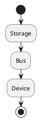


Prohibited:


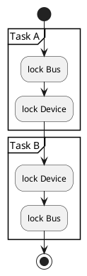


More recommended:

- Single Owner Task;
- Asynchronous request queue;
- State machine drives resource access;
- Reduce cross-layer locks.

### 3.5 Context switch oscillation

Too many tasks not only consume the stack, but also increase:

- Register save/restore;
- Ready queue maintenance;
- Cache/pipeline disturbance (more noticeable on higher-end MCUs);
- FPU context saving cost;
- Scheduler critical section overhead.

Resource-constrained systems should generally prioritize "few tasks + event-driven" rather than "one thread per module".

---

## 4. ISR, critical section and dual-stack mechanism

### 4.1 ISR design principles

Only do the most necessary things in the interrupt handler:

- Read/clear interrupt status;
- Move the minimum amount of data;
- Update atomic status;
- Delivery notifications/events;
- Exit now.

Execution in an ISR should be avoided:

- Complete analysis of the protocol;
- File system operations;
- blocking wait;
- Massive log formatting;
- long loop;
- Dynamic memory allocation.

Recommended model:

```plantuml
@startuml
hide stereotype
skinparam shadowing false
left to right direction

rectangle "Hardware IRQ" as irq
rectangle "Top-Half ISR\n(Fast Sampling / Clear IRQ Flags)" as topHalf
diamond "Lightweight IPC Decoupling\n(Ring Buffer / Task Notification)" as ipc
rectangle "Bottom-Half Worker Task / State Machine\n(Full Protocol Parsing / State Transition)" as bottomHalf
rectangle "Business Logic Execution" as biz

irq --> topHalf
topHalf --> ipc
ipc --> bottomHalf
bottomHalf --> biz
@enduml
```

### 4.2 The length of the critical section determines the lower limit of interrupt response

If business code turns off/masks interrupts via `CPSID`, `PRIMASK` or `BASEPRI`, then:

```text
Maximum interrupt disable time ~= Worst-case interrupt latency achievable by the system
```

Therefore it should be:

- Maximum duration of critical section;
- ISR maximum duration;
- maximum nesting depth;

Measured as a formal performance metric.

### 4.3 Cortex-M MSP/PSP

In a typical design:

- Thread Mode tasks run using PSP;
- Exception / Interrupt uses MSP;
- The RTOS task stack and interrupt stack are planned separately.

Even if each task stack is adequate, an MSP that is too small may still be overwhelmed by deeply nested ISRs, so the system interrupt stack must be evaluated individually.

---

## 5. Watchdog and low power consumption common anti-patterns

### 5.1 Wrong dog feeding position

Not recommended:

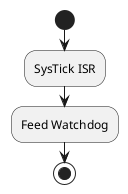

It is also not recommended to simply:

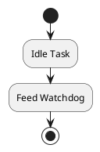

The reason is that the business thread may be deadlocked, but SysTick or Idle still continues to run, and the watchdog will be refreshed with "false health".

### 5.2 Tickless Idle competition window

Typical Tickless process:

```plantuml
@startuml
hide stereotype
skinparam shadowing false

rectangle "Enter Idle Task" as start
rectangle "Calculate Next Task Wakeup Time\n(Next Wakeup Tick)" as calc
diamond "Sleep Duration\n> Minimum Threshold?" as checkMin
rectangle "Standard Light Sleep WFI\nKeep SysTick Running" as normalIdle
rectangle "Configure Low-Power Timer (LPTIM)" as cfgTimer
rectangle "Stop / Mask Standard SysTick" as stopTick
diamond "Atomic Check: Any New Interrupt/Task\nBecame Ready During Setup?" as raceCheck
rectangle "Abort Sleep Immediately\nRestore SysTick Scheduling" as abortSleep
rectangle "Execute WFI / WFE (Deep Sleep)" as enterWFI
rectangle "Hardware Interrupt Wakeup" as wakeup
rectangle "Compensate OS Ticks from LPTIM Count" as compTime
rectangle "Restore OS Scheduler & Peripheral Clocks" as resumeOS

start --> calc
calc --> checkMin
checkMin --> normalIdle : No
checkMin --> cfgTimer : Yes
cfgTimer --> stopTick
stopTick --> raceCheck
raceCheck --> abortSleep : Task Ready
raceCheck --> enterWFI : Safe
enterWFI --> wakeup
wakeup --> compTime
compTime --> resumeOS
@enduml
```

If an asynchronous event occurs between "computation complete" and the actual execution of `WFI`, and a high-priority task is ready, you need to ensure that the kernel does not enter deep sleep by mistake.

Therefore, the low-power entrance must have:

- Atomic check;
- Interrupt status confirmation;
- Allow platform Hooks to confirm again before sleeping;
- Correct sleep abort path.

---

## 6. Lightweight embedded software architecture pattern

### 6.1 Strict layering + zero-cost abstraction

Recommended layering:

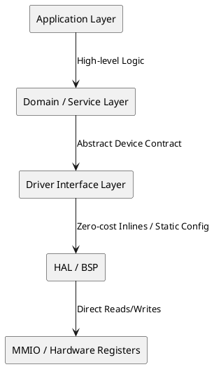

For extreme resource MCUs, deep runtime dynamic dispatch should be avoided as much as possible. Can use:

- `static inline`;
- macro encapsulation;
- Compile time configuration;
- C++ templates/CRTP (if the project allows it and can control code bloat);
- Flat C API.

The goal is to have the abstraction removed at compile time so that the final instructions are close to direct register operations.

### 6.2 Active Object + Hierarchical State Machine (HSM)

Architecture comparison:

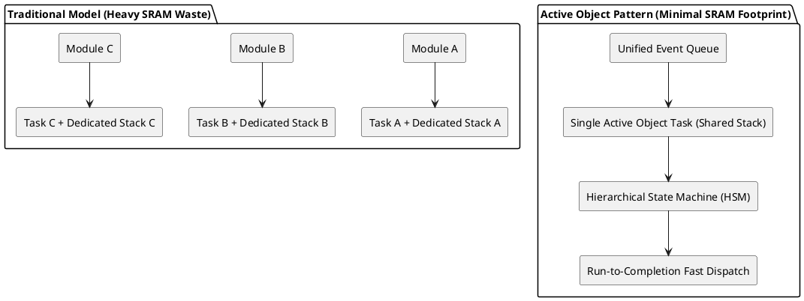

Core principles:

- A small number of RTOS tasks;
- Multiple business state machines share limited threads;
- Each event processing must be completed quickly;
- Disable permanent blocking inside the state machine;
- Delay operation is converted into Timer Event;
- I/O is converted to an asynchronous completion event.

This design can significantly reduce the SRAM cost of "one private stack per functional module".

---

## 7. SPSC lock-free ring buffer

In high-frequency UART / ADC / SPI DMA data paths, the single producer single consumer (SPSC) model is well suited for Ring Buffer.

### 7.1 Basic structure

```c
typedef struct {
    uint8_t data[SIZE];
    volatile uint32_t head;
    volatile uint32_t tail;
} ring_buffer_t;
```

Among them:

- Producer only writes `head`;
- Consumer only writes `tail`;
- `SIZE` Try to choose `2^N`.

Index wraparound can be done using:

```c
next = (index + 1U) & (SIZE - 1U);
```

Avoid runtime division/modulo overhead.

### 7.2 Memory order

The key principles are:

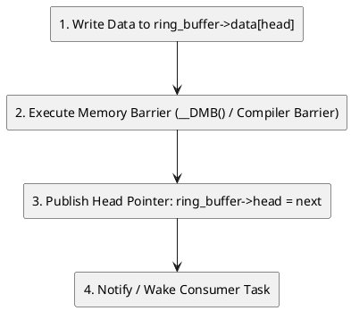


In the ARM CMSIS environment, appropriate memory barriers (such as `__DMB()`) can be used according to the target architecture and shared object semantics to prevent consumers from observing index updates before seeing the corresponding data.

> Note: The need for hardware memory barriers, compiler barriers, or C11/C++ atomic semantics should be determined based on the MCU memory model, cache structures, DMA visibility, and compiler optimizations.

---

## 8. IPC mechanism selection

| mechanism | RAM/control block cost | Relative cost | Recommended scenarios |
|---|---:|---|---|
| Queue | Higher: Control block + data buffer | Higher, involves copying and waiting for linked lists | Multiple producers/multiple consumers, data that really needs to be queued |
| Binary Semaphore | medium | medium | Universal synchronization, resource competition |
| Task Notification | Very low, the state is usually embedded in the TCB | very low | Point-to-point wake-up, counting, 32-bit event/value transfer |

### 8.1 Task Notification Priority Principle

If the communication relationship is:


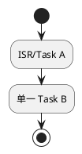


And just:

- awaken;
- event bit;
- count;
- small integer value;

Prioritize Task Notification instead of creating additional Queue/Semaphore.

---

## 9. Selection of mainstream RTOS under extreme resources

| Dimensions | FreeRTOS | RT-Thread Nano | Zephyr |
|---|---|---|---|
| Core features | Small core, mature, high degree of freedom in cutting | For micro MCU, the structure is straightforward | Complete ecology and powerful configuration system |
| static memory | Native support | Native support | Strong compile-time declaration capability |
| driver model | No mandatory unified driver framework | Nano can be minimalist | Devicetree + Unified Device Model |
| Build configuration | `FreeRTOSConfig.h` | `rtconfig.h` | Kconfig+CMake+West |
| Extreme resource adaptation | Excellent | Excellent | Good, but more complex to crop |

### 9.1 FreeRTOS tailoring recommendations


```c
#define configSUPPORT_DYNAMIC_ALLOCATION 0
#define configSUPPORT_STATIC_ALLOCATION  1
```


Further assessments include:


```c
#define configMAX_PRIORITIES      4   /* 或实际所需最小值 */
#define configUSE_TIMERS          0   /* 若项目不需要软件定时器 */
#define configMAX_TASK_NAME_LEN   4   /* 量产版可进一步压缩 */
```


At the same time, focus on checking:

- Whether Event Groups are required;
- Whether Queue Sets are required;
- Whether Recursive Mutex is required;
- Whether Runtime Stats are required;
- Whether the Trace/Debug function is only enabled in the debug version.

### 9.2 RT-Thread Nano cutting suggestions

Follow `rtconfig.h`:

- Only enable scheduling/synchronization capabilities that are actually needed;
- Evaluable off `RT_USING_DEVICE`;
- Close unnecessary software timers, message queues, etc.;
- Zoom out `RT_NAME_MAX`;
- The driver layer should be as static as possible.

### 9.3 Zephyr cropping suggestions

Typical directions:


```text
CONFIG_MINIMAL_LIBC=y
CONFIG_LOG=n
CONFIG_ASSERT=n
CONFIG_TIMESLICING=n
```


Also via the `prj.conf`/Kconfig pair:

- network stack;
- file system;
- Shell;
- Logging;
- Device Drivers;
- Bluetooth/USB;

Closed item by item based on actual needs.

---

## 10. Fully static memory architecture

Recommended principles:


```text
启动后不再向通用堆申请长期对象
```


Static objects include:

- TCB;
- Task Stack;
- Ring Buffer;
- Queue Storage;
- Driver Context;
- Protocol Context;
- State Machine Context;
- Watchdog State.

FreeRTOS example:


```c
static StaticTask_t worker_tcb;
static StackType_t worker_stack[WORKER_STACK_WORDS];

TaskHandle_t worker = xTaskCreateStatic(
    worker_entry,
    "wrk",
    WORKER_STACK_WORDS,
    NULL,
    WORKER_PRIORITY,
    worker_stack,
    &worker_tcb
);
```


### 10.1 Why staticization is important

Staticization can turn "random OOMs in the field" into "SRAM overruns visible during the link phase".

Therefore, the `.map` file should become the official product of the firmware CI and continue to be tracked:


```text
.text
.rodata
.data
.bss
stack reserve
heap reserve
```


---

## 11. Stack depth calculation and defense

The task stack can be roughly decomposed into:


```text
S_total =
    S_call_chain
  + S_local_vars
  + S_context
  + S_rtos_overhead
  + S_margin
```


Where safety margins should be determined by actual risks and test coverage, not fixed pats on the head.

### 11.1 Compile-time analysis

GCC:


```bash
gcc -fstack-usage ...
```


A `.su` file will be generated, which can be combined with the call graph script to calculate the maximum call chain stack consumption.

### 11.2 Runtime High Water Mark

Common practices:

1. During initialization, fill the entire task stack with patterns such as `0xA5`;
2. The system experiences peak loads;
3. Scan uncovered areas;
4. Get the historical maximum usage depth.

### 11.3 MPU Guard Region

If the MCU has an MPU, a Guard Region can be deployed at the boundary of the task stack so that the MemManage Fault will be triggered immediately when the stack crosses the boundary, instead of silently destroying adjacent RAM.

---

## 12. Bit mask watchdog cooperation mechanism

### 12.1 Architecture

```plantuml
@startuml
hide stereotype
skinparam shadowing false

package "Task Heartbeats (Independent Bits)" as TASKS {
  rectangle "Task A (Business Loop)" as tA
  database "Heartbeat Bitmap Register" as reg
  rectangle "Task B (Protocol Worker)" as tB
  rectangle "Task C (Sensor Sampler)" as tC
}
rectangle "Watchdog Supervisor Task" as supervisor
diamond "All Critical Task Bits\nHealthy & Present?" as check
rectangle "Feed Hardware Watchdog" as feed
rectangle "Atomic Clear Heartbeat Bitmap" as clear
rectangle "Next Supervision Period" as nextPeriod
rectangle "Refuse to Feed Watchdog" as refuse
rectangle "Preserve Minimal Crash Context to Backup RAM" as faultSave
rectangle "Hardware Watchdog Timeout -> Chip Reset" as hwReset

tA --> reg : Atomic set BIT0
tB --> reg : Atomic set BIT1
tC --> reg : Atomic set BIT2
reg --> supervisor
supervisor --> check
check --> feed : Yes (All Healthy)
feed --> clear
clear --> nextPeriod
check --> refuse : No (Deadlock / Starvation)
refuse --> faultSave
faultSave --> hwReset
@enduml
```


### 12.2 Principles

- Only the Supervisor can directly feed the hardware dog;
- Each core task has an independent heartbeat bit;
- heartbeat must represent "the completion of a valid business closed loop" rather than "the thread has been scheduled";
- Supervisor period is slightly shorter than hardware WDG timeout;
- Refuse to feed the dog if any key bit is missing;
- If the hardware allows, the minimum fault context can be saved to the Backup Register / Retention RAM before reset.

### 12.3 Window watchdog

If the chip supports Window Watchdog, you can further detect:

- Feeding the dog too late;
- Feeding your dog too early;

Thus, physical constraints are imposed on the upper and lower time bounds at the same time.

---

## 13. Compilation and link optimization

### 13.1 Section Granularity + Dead Code Elimination

Compile:


```bash
-ffunction-sections
-fdata-sections
```


Links:


```bash
-Wl,--gc-sections
```


Make unreferenced functions/data ejectable by the linker.

### 13.2 LTO


```bash
-flto
```


Can be executed cross-compilation unit scope:

- inline;
- constant propagation;
- Dead code elimination;
- Partially duplicated logic is merged.

The final binary and real-time testing must be the criterion, rather than the default assumption that LTO is necessarily better.

### 13.3 Data structure layout

Suggestions:

- Try to sort by member alignment requirements;
- Pay attention to structure padding;
- Maintain natural alignment for frequently accessed structures;
- Only protocol frames are considered `__attribute__((packed))`;
- Platforms such as the Cortex-M0 are especially aware of the risk of unaligned access.

---

## 14. Recommended system-level lightweight architecture

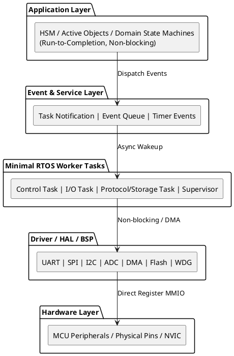


### Recommended thread roles

Rather than creating a large number of tasks first, an extreme resource system can be designed starting from the following minimal model:

| role | Responsibilities |
|---|---|
| Control/Event Task | Core business state machine, control logic |
| IO/Protocol Task | Peripheral data consumption, protocol analysis |
| Storage/Background Task | Non-real-time storage and maintenance tasks, optional |
| Supervisor | Watchdog, health check; can be merged with controlled background roles when the scale is small |

The final number of threads is subject to real-time constraints and stack budget.

---

## 15. Project implementation checklist

### memory

- [ ] The production path has no long-term universal heap allocation;
- [ ] Each task has a static stack budget;
- [ ] CI save `.map` file;
- [ ] Statistics `.text/.rodata/.data/.bss`;
- [ ] Turn on stack watermark/overflow detection;
- [ ] Configure stack guard when MPU is present.

### Scheduling

- [ ] There is a clear rationale for the number of tasks;
- [ ] Each priority has a scheduling basis;
- [ ] There is no highest priority thread in an infinite loop;
- [ ] Mutex priority inheritance strategy is clear;
- [ ] Unify the lock order for multiple locks.

### ISR

- [ ] ISR non-blocking API;
- [ ] ISR without complex protocol parsing;
- [ ] The longest time ISR can take is measurable;
- [ ] High frequency data priority DMA + Ring Buffer;
- [ ] ISR-to-task communication uses a lightweight notification mechanism.

### Low power consumption

- [ ] Tickless entrance has race treatment;
- [ ] Wake-up clock stabilization time is factored into the response budget;
- [ ] Peripheral/DMA sleep status is clear;
- [ ] There is a final pending-event check before deep sleep.

### Reliability

- [ ] Do not feed the dog unconditionally in SysTick/Idle;
- [ ] Core business tasks participate in watchdog heartbeat;
- [ ] The reset reason can be persisted;
- [ ] HardFault/MemManage captures minimal context;
- [ ] Live logs will not back down the live path.

---

## 16. Systematic design criteria

### 16.1 Certainty over flexibility

In a KB-level SRAM environment, it is preferable to move resource boundaries forward to the compilation/linking stage rather than leaving the risk to runtime.

### 16.2 Task merging is better than fine-grained concurrency

Threads are not module boundaries. There can be many modules, but RTOS tasks should be as few as possible and keep business decoupled through event-driven, HSM and Active Object.

### 16.3 Lightweight communication primitives

Priority suggestions:

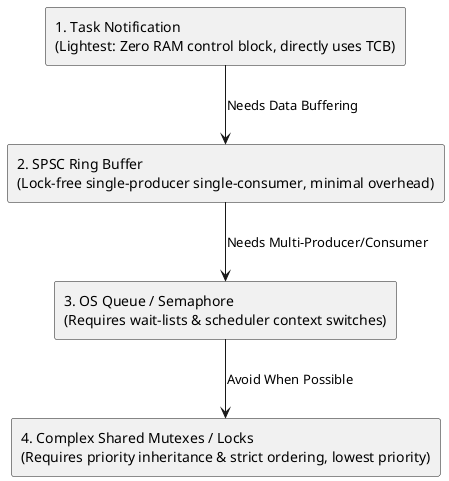

The premise is that the communication semantics do match, and correctness cannot be sacrificed for the sake of "lightweight".

### 16.4 Defensive monitoring must cover the entire system

The reliability system includes at least:

```text
Stack Analysis
+ High Water Mark
+ Watchdog Supervisor
+ Fault Handler
+ Reset Reason
+ Minimal Crash Context
```

### 16.5 All optimizations must be measurable

The final basis for judgment is not "theoretically lighter", but:

- `.map`;
- `.su`;
- WCET measured by GPIO/Trace;
- IRQ latency;
- Context Switch cycle;
- RAM peak;
- long soak test;
- Fault injection testing.

---

## 17. Recommended verification process

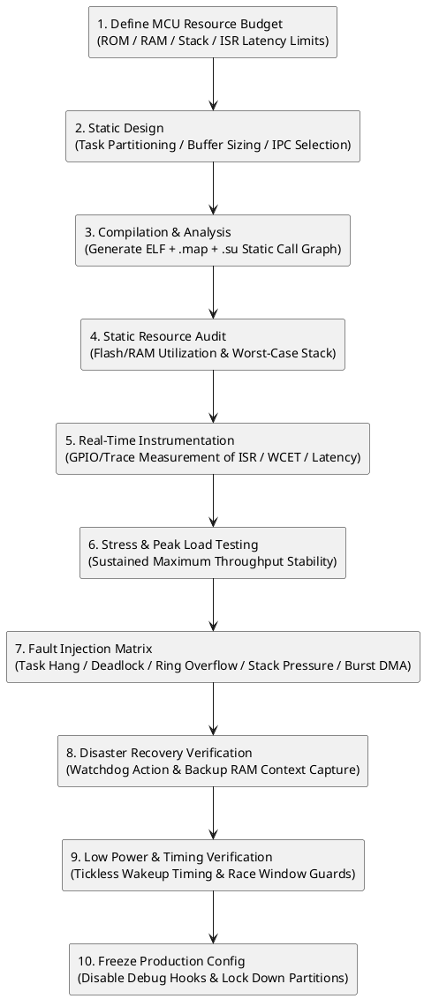


---

## Summary

The core of resource-constrained embedded systems is not to simply "cut down the RTOS", but to establish a complete set of deterministic design methods from hardware constraints to software architecture:

> **Static memory + few tasks + event-driven + short ISR + lightweight IPC + testable WCET + global health monitoring + compile-time resource convergence. **

If the system can do:

- The resource is visible during the link period;
- Scheduling paths are interpretable;
- Lock wait has an upper bound;
- The ISR is short enough;
- The stack depth is measurable;
- Watchdogs reflect true business health;
- Low power consumption enters/exits race-free state;

Then even running on extremely small SRAM and low-clocked MCUs, you can achieve better long-term reliability than a "feature-rich but unpredictable behavior" design.