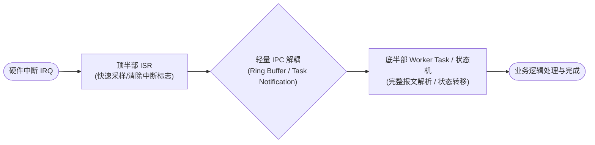
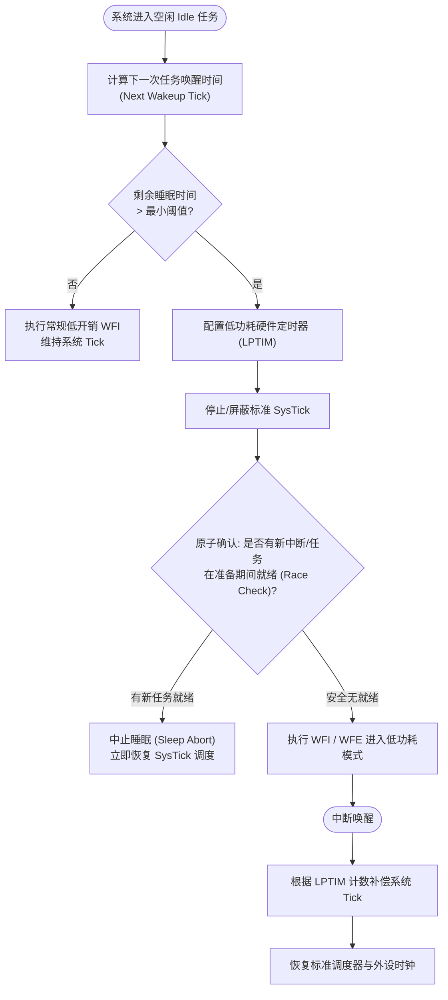
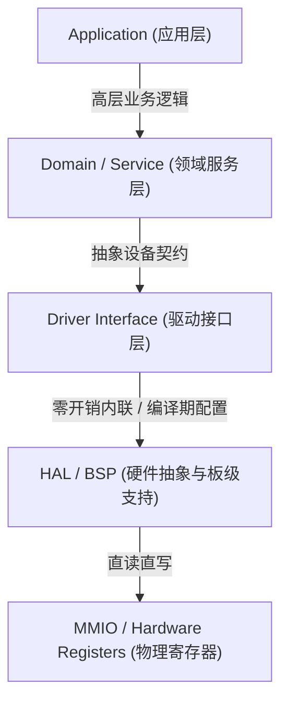
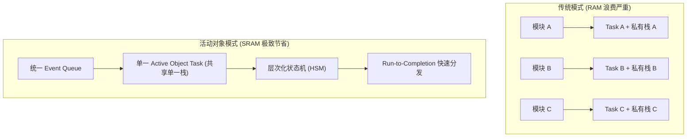
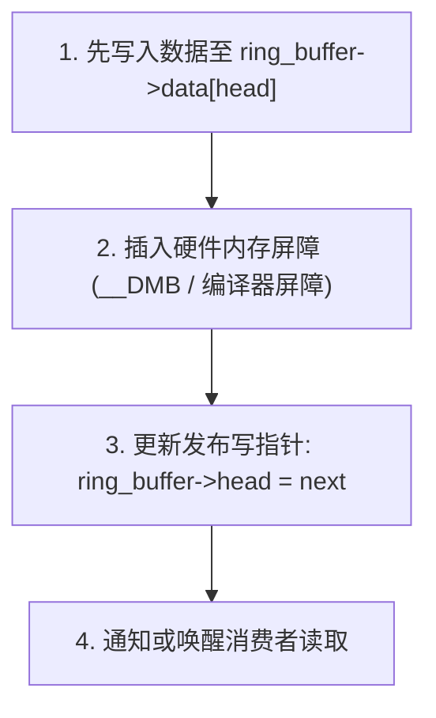
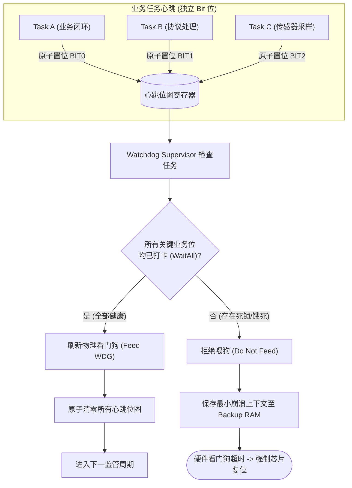
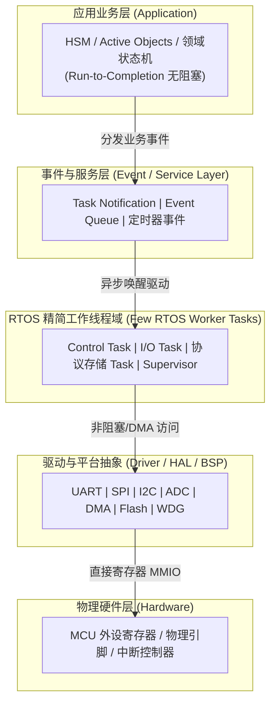
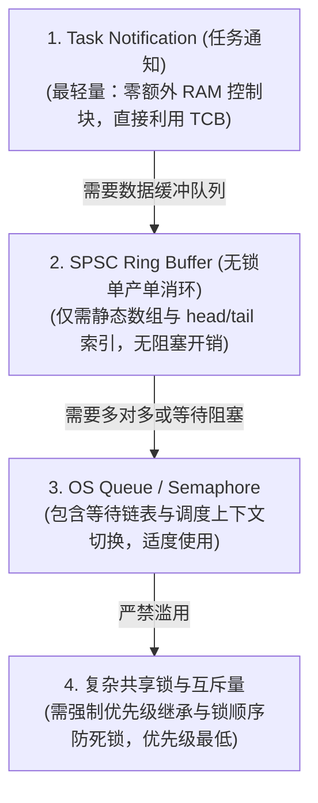
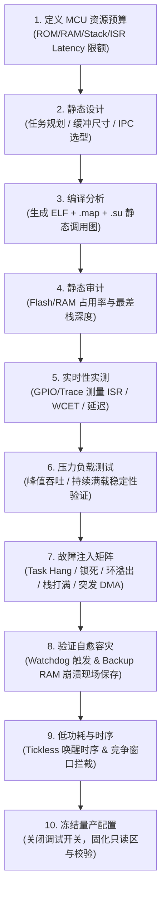

# 资源受限嵌入式系统架构设计与 RTOS 核心机制研究报告

> 面向数 KB～数十 KB SRAM、数十 KB～数百 KB Flash、低主频 MCU、无 MMU/可选 FPU 的嵌入式系统设计。
>
> 本文重点关注：**确定性、静态内存、任务模型、ISR/临界区、无锁通信、看门狗、低功耗、RTOS 裁剪与工程化验证**。
>
> **说明：** 文中的 Flash/RAM/性能数字属于典型经验范围，实际结果必须以目标 MCU、编译器、优化级别、RTOS 版本和链接 Map 文件为准。

---

## 1. 背景与核心结论

在工业控制、边缘传感节点、车载 MCU 等场景中，系统通常受到严格物理资源边界约束：

- SRAM：数 KB～数十 KB；
- Flash：数十 KB～数百 KB；
- CPU：数十 MHz；
- 常见 Cortex-M0+/M3/M4 或小型 RISC-V；
- 通常无 MMU，部分型号无 FPU；
- DMA、CPU 与外设共享总线带宽；
- 长续航产品需要深度低功耗与 Tickless Idle。

在这种环境中，通用操作系统中的“灵活性优先”设计假设往往失效。系统设计的第一目标不是平均吞吐量，而是：

1. **时间确定性**：关键路径的 WCET（Worst-Case Execution Time）可估计；
2. **空间确定性**：RAM/Flash 使用在编译期基本确定；
3. **故障可控性**：栈溢出、死锁、优先级反转、通信拥塞可以检测或隔离；
4. **调度可控性**：减少不必要的任务、上下文切换和阻塞；
5. **软硬件协同**：中断、DMA、低功耗、看门狗和 RTOS 调度统一设计。

---

## 2. 物理特征与核心设计约束

| 硬件物理维度 | 典型规格 / 特征 | 软件架构约束与瓶颈 |
|---|---|---|
| SRAM | 1.2 KB～64 KB；低延迟；无 MMU/虚拟地址映射 | 任务与内核共享平坦地址空间；单次越界可能破坏整个系统 |
| Flash | 16 KB～512 KB；按扇区擦除；擦写寿命与读取延迟受限 | 严格控制代码体积、`.rodata`、日志、格式化字符串和依赖库 |
| CPU | 16～80 MHz；单发射/简化流水线；常见 Cortex-M / RISC-V | 浮点模拟、复杂协议解析和高频上下文切换会明显侵蚀算力 |
| 总线 | AHB/APB 等共享总线；DMA 与 CPU 竞争带宽 | DMA burst 可能增加 CPU 取指/数据访问抖动 |
| 功耗 | Active / Sleep / Stop / Standby | Tickless Idle、唤醒延迟、时钟恢复时间必须纳入实时模型 |

### 2.1 实时性的核心不是“平均快”

实时系统首先关心 **最坏情况是否可接受**。因此，应重点关注：

- WCET；
- ISR 最长执行时间；
- 最长关中断时间；
- 最大锁等待时间；
- 最大任务唤醒延迟；
- 最大 DMA 总线占用；
- 最坏 Flash/EEPROM/SD 写停顿；
- 最坏唤醒时钟稳定时间。

---

## 3. 典型架构问题与失效机理

### 3.1 动态内存分配：碎片化与不可预测延迟

通用 `malloc()` / `free()` 在微型实时系统中存在两类风险：

1. **时间不确定性**：空闲链表搜索与合并可能导致分配延迟随系统状态变化；
2. **外部碎片化**：长期交替申请/释放不同大小对象后，即使剩余总内存尚可，也可能找不到足够大的连续块。

因此，对于长期运行且要求确定性的系统，推荐：

- 启动阶段一次性分配；
- 使用固定块内存池；
- 或直接采用全静态内存。

### 3.2 栈溢出：平坦地址空间中的“静默破坏”

Cortex-M 等 MCU 常采用向低地址增长的栈。以下行为很容易放大栈压力：

- 大型局部数组；
- 深层函数嵌套；
- 递归；
- printf/浮点格式化；
- 大型结构体按值传递；
- 中断嵌套。

在无 MMU 的平坦地址空间中，栈越界可能破坏：

- 邻接任务栈；
- TCB；
- `.bss/.data`；
- RTOS 内核对象；
- 外设控制结构体。

最终 HardFault 往往出现在真正故障源之后很久，因此必须主动做栈监测。

### 3.3 优先级反转

典型无界优先级反转：

1. 低优先级任务 L 持有互斥资源；
2. 高优先级任务 H 等待该资源；
3. 中优先级任务 M 持续抢占 L；
4. H 间接被 M 长时间阻塞。

解决原则：

- 互斥量优先使用支持 **Priority Inheritance** 的实现；
- 临界区尽量短；
- 高优先级任务避免依赖低优先级任务的大型临界区；
- 更优方案是减少共享可变状态，改用消息传递或单一资源 Owner。

### 3.4 死锁与锁顺序

多个任务同时获取多个资源时，必须定义统一锁顺序，例如：

```text
Storage -> Bus -> Device
```

禁止出现：

```text
Task A: lock Bus -> lock Device
Task B: lock Device -> lock Bus
```

更推荐：

- 单一 Owner Task；
- 异步请求队列；
- 状态机驱动资源访问；
- 减少跨层锁。

### 3.5 上下文切换震荡

任务过多不仅消耗栈，还会增加：

- 寄存器保存/恢复；
- 就绪队列维护；
- Cache/流水线扰动（在更高端 MCU 上更明显）；
- FPU 上下文保存成本；
- 调度器临界区开销。

资源受限系统通常应优先考虑“少任务 + 事件驱动”，而非“一个模块一个线程”。

---

## 4. ISR、临界区与双栈机制

### 4.1 ISR 设计原则

中断处理程序中只做最必要的事情：

- 读取/清除中断状态；
- 搬运最少量数据；
- 更新原子状态；
- 投递通知/事件；
- 立即退出。

应避免在 ISR 中执行：

- 协议完整解析；
- 文件系统操作；
- 阻塞等待；
- 大量日志格式化；
- 长循环；
- 动态内存申请。

推荐模型：



### 4.2 临界区长度决定中断响应下限

如果业务代码通过 `CPSID`、`PRIMASK` 或 `BASEPRI` 关闭/屏蔽中断，则：

```text
最大关中断时间 ~= 系统可实现的最差中断响应下限
```

因此应将：

- 临界区最大时长；
- ISR 最大时长；
- 最大嵌套深度；

作为正式的性能指标进行测量。

### 4.3 Cortex-M 的 MSP / PSP

典型设计中：

- Thread Mode 任务运行使用 PSP；
- Exception / Interrupt 使用 MSP；
- RTOS 任务栈与中断栈分别规划。

即使每个任务栈都足够，MSP 过小仍可能被深度嵌套 ISR 压垮，因此必须单独评估系统中断栈。

---

## 5. 看门狗与低功耗常见反模式

### 5.1 错误的喂狗位置

不推荐：

```text
SysTick ISR -> Feed Watchdog
```

也不推荐简单地：

```text
Idle Task -> Feed Watchdog
```

原因是业务线程可能已经死锁，但 SysTick 或 Idle 仍然继续运行，看门狗会被“假健康”地刷新。

### 5.2 Tickless Idle 的竞争窗口

典型 Tickless 流程：



在“计算完成”和真正执行 `WFI` 之间若发生异步事件，并使高优先级任务就绪，就需要确保内核不会错误进入深睡眠。

因此低功耗入口必须具备：

- 原子检查；
- 中断状态确认；
- 允许平台 Hook 在睡眠前再次确认；
- 正确的 sleep abort 路径。

---

## 6. 轻量级嵌入式软件架构模式

### 6.1 严格分层 + 零成本抽象

推荐分层：



对极限资源 MCU，应尽量避免深层运行时动态派发。可以采用：

- `static inline`；
- 宏封装；
- 编译期配置；
- C++ 模板/CRTP（若项目允许且能控制代码膨胀）；
- 扁平 C API。

目标是让抽象在编译期被消除，使最终指令接近直接寄存器操作。

### 6.2 活动对象（Active Object）+ 层次化状态机（HSM）

架构对比：



核心原则：

- 少量 RTOS 任务；
- 多个业务状态机共享有限线程；
- 每次事件处理必须快速完成；
- 禁止状态机内部永久阻塞；
- 延时操作转换为 Timer Event；
- I/O 转换为异步完成事件。

这种设计可以显著减少“每个功能模块一个私有栈”的 SRAM 成本。

---

## 7. SPSC 无锁环形缓冲区

高频 UART / ADC / SPI DMA 数据通路中，单生产者单消费者（SPSC）模型非常适合 Ring Buffer。

### 7.1 基本结构

```c
typedef struct {
    uint8_t data[SIZE];
    volatile uint32_t head;
    volatile uint32_t tail;
} ring_buffer_t;
```

其中：

- Producer 只写 `head`；
- Consumer 只写 `tail`；
- `SIZE` 尽量选 `2^N`。

索引回绕可以使用：

```c
next = (index + 1U) & (SIZE - 1U);
```

避免运行时除法/取模开销。

### 7.2 内存顺序

关键原则是：



在 ARM CMSIS 环境可以根据目标架构和共享对象语义使用适当的内存屏障（例如 `__DMB()`），避免消费者先观察到索引更新、却尚未看到对应数据。

> 注意：是否需要硬件内存屏障、编译器屏障或 C11/C++ 原子语义，应根据 MCU 内存模型、缓存结构、DMA 可见性以及编译器优化共同判断。

---

## 8. IPC 机制选择

| 机制 | RAM/控制块成本 | 相对开销 | 推荐场景 |
|---|---:|---|---|
| Queue | 较高：控制块 + 数据缓冲 | 较高，涉及复制与等待链表 | 多生产者/多消费者、真正需要排队的数据 |
| Binary Semaphore | 中等 | 中等 | 通用同步、资源竞争 |
| Task Notification | 很低，状态通常嵌入 TCB | 很低 | 点对点唤醒、计数、32-bit 事件/值传递 |

### 8.1 Task Notification 优先原则

如果通信关系是：

```text
ISR/Task A  --->  单一 Task B
```

且只需：

- 唤醒；
- 事件位；
- 计数；
- 小型整数值；

优先考虑 Task Notification，而不是额外创建 Queue/Semaphore。

---

## 9. 主流 RTOS 在极限资源下的选型

| 维度 | FreeRTOS | RT-Thread Nano | Zephyr |
|---|---|---|---|
| 核心特点 | 内核小、成熟、裁剪自由度高 | 面向微型 MCU，结构直接 | 生态完整、配置体系强大 |
| 静态内存 | 原生支持 | 原生支持 | 编译期声明能力强 |
| 驱动模型 | 无强制统一驱动框架 | Nano 可极简 | Devicetree + 统一设备模型 |
| 构建配置 | `FreeRTOSConfig.h` | `rtconfig.h` | Kconfig + CMake + West |
| 极限资源适配 | 极佳 | 极佳 | 良好，但裁剪复杂度更高 |

### 9.1 FreeRTOS 裁剪建议

```c
#define configSUPPORT_DYNAMIC_ALLOCATION 0
#define configSUPPORT_STATIC_ALLOCATION  1
```

进一步可评估：

```c
#define configMAX_PRIORITIES      4   /* 或实际所需最小值 */
#define configUSE_TIMERS          0   /* 若项目不需要软件定时器 */
#define configMAX_TASK_NAME_LEN   4   /* 量产版可进一步压缩 */
```

同时重点检查：

- 是否需要 Event Groups；
- 是否需要 Queue Sets；
- 是否需要 Recursive Mutex；
- 是否需要 Runtime Stats；
- Trace / Debug 功能是否只在调试版本开启。

### 9.2 RT-Thread Nano 裁剪建议

关注 `rtconfig.h`：

- 仅开启实际需要的调度/同步能力；
- 可评估关闭 `RT_USING_DEVICE`；
- 关闭不需要的软件定时器、消息队列等；
- 缩小 `RT_NAME_MAX`；
- 驱动层尽量静态化。

### 9.3 Zephyr 裁剪建议

典型方向：

```text
CONFIG_MINIMAL_LIBC=y
CONFIG_LOG=n
CONFIG_ASSERT=n
CONFIG_TIMESLICING=n
```

同时通过 `prj.conf` / Kconfig 对：

- 网络栈；
- 文件系统；
- Shell；
- Logging；
- Device Drivers；
- Bluetooth / USB；

按实际需求逐项关闭。

---

## 10. 全静态内存架构

推荐原则：

```text
启动后不再向通用堆申请长期对象
```

静态化对象包括：

- TCB；
- Task Stack；
- Ring Buffer；
- Queue Storage；
- Driver Context；
- Protocol Context；
- State Machine Context；
- Watchdog State。

FreeRTOS 示例：

```c
static StaticTask_t worker_tcb;
static StackType_t worker_stack[WORKER_STACK_WORDS];

TaskHandle_t worker = xTaskCreateStatic(
    worker_entry,
    "wrk",
    WORKER_STACK_WORDS,
    NULL,
    WORKER_PRIORITY,
    worker_stack,
    &worker_tcb
);
```

### 10.1 为什么静态化重要

静态化可以把“现场随机 OOM”转变为“链接阶段可见的 SRAM 超限”。

因此 `.map` 文件应成为固件 CI 的正式产物，并持续追踪：

```text
.text
.rodata
.data
.bss
stack reserve
heap reserve
```

---

## 11. 栈深度核算与防御

任务栈可以粗略分解为：

```text
S_total =
    S_call_chain
  + S_local_vars
  + S_context
  + S_rtos_overhead
  + S_margin
```

其中安全余量应由实际风险和测试覆盖决定，而不是固定拍脑袋。

### 11.1 编译期分析

GCC：

```bash
gcc -fstack-usage ...
```

会生成 `.su` 文件，可结合调用图脚本计算最大调用链栈消耗。

### 11.2 运行时 High Water Mark

常见做法：

1. 初始化时用 `0xA5` 等模式填充整个任务栈；
2. 系统经历峰值负载；
3. 扫描未被覆盖区域；
4. 得到历史最大使用深度。

### 11.3 MPU Guard Region

若 MCU 带 MPU，可在任务栈边界布置 Guard Region，使栈越界立即触发 MemManage Fault，而不是静默破坏邻接 RAM。

---

## 12. 位掩码看门狗协同机制

### 12.1 架构



### 12.2 原则

- 只有 Supervisor 可以直接喂硬件狗；
- 每个核心任务拥有独立 heartbeat bit；
- heartbeat 必须代表“完成了一次有效业务闭环”，而不是“线程被调度过”；
- Supervisor 周期略短于硬件 WDG 超时；
- 缺任意关键 bit 就拒绝喂狗；
- 复位前若硬件允许，可保存最小故障上下文到 Backup Register / Retention RAM。

### 12.3 窗口看门狗

如果芯片支持 Window Watchdog，可进一步检测：

- 喂狗过晚；
- 喂狗过早；

从而对时间上界与下界同时进行物理约束。

---

## 13. 编译与链接优化

### 13.1 Section 粒度 + Dead Code Elimination

编译：

```bash
-ffunction-sections
-fdata-sections
```

链接：

```bash
-Wl,--gc-sections
```

让未引用函数/数据可被链接器剔除。

### 13.2 LTO

```bash
-flto
```

可以在跨编译单元范围执行：

- 内联；
- 常量传播；
- 死代码消除；
- 部分重复逻辑合并。

必须以最终二进制和实时性测试为准，而不是默认认为 LTO 一定更优。

### 13.3 数据结构布局

建议：

- 尽量按成员对齐需求排序；
- 关注结构体 padding；
- 对频繁访问结构体保持自然对齐；
- 协议帧才考虑 `__attribute__((packed))`；
- Cortex-M0 等平台尤其注意非对齐访问风险。

---

## 14. 推荐的系统级轻量架构



### 推荐线程角色

极限资源系统可从以下最小模型开始设计，而不是先创建大量任务：

| 角色 | 职责 |
|---|---|
| Control / Event Task | 核心业务状态机、控制逻辑 |
| IO / Protocol Task | 外设数据消费、协议解析 |
| Storage / Background Task | 非实时存储、维护类任务，可选 |
| Supervisor | 看门狗、健康检查；规模很小时可与受控后台角色合并 |

最终线程数以实时约束和栈预算为准。

---

## 15. 工程落地检查清单

### 内存

- [ ] 量产路径无长期通用堆分配；
- [ ] 每个任务都有静态栈预算；
- [ ] CI 保存 `.map` 文件；
- [ ] 统计 `.text/.rodata/.data/.bss`；
- [ ] 开启栈水印/溢出检测；
- [ ] 有 MPU 时配置栈 Guard。

### 调度

- [ ] 任务数量有明确理由；
- [ ] 每个优先级均有调度依据；
- [ ] 不存在无限循环的最高优先级线程；
- [ ] 互斥量优先级继承策略明确；
- [ ] 多锁统一锁顺序。

### ISR

- [ ] ISR 无阻塞 API；
- [ ] ISR 无复杂协议解析；
- [ ] ISR 最长耗时可测；
- [ ] 高频数据优先 DMA + Ring Buffer；
- [ ] ISR 到任务的通信使用轻量通知机制。

### 低功耗

- [ ] Tickless 入口有 race 处理；
- [ ] 唤醒时钟稳定时间已计入响应预算；
- [ ] 外设/DMA 睡眠状态明确；
- [ ] 深睡眠前存在最终 pending-event 检查。

### 可靠性

- [ ] 不在 SysTick/Idle 中无条件喂狗；
- [ ] 核心业务任务参与 watchdog heartbeat；
- [ ] 复位原因可持久化；
- [ ] HardFault/MemManage 捕获最小上下文；
- [ ] 现场日志不会反向拖垮实时路径。

---

## 16. 体系化设计准则

### 16.1 确定性高于灵活性

在 KB 级 SRAM 环境中，优先把资源边界前移到编译/链接阶段，而不是把风险留到运行时。

### 16.2 任务合并优于细粒度并发

线程不是模块边界。模块可以很多，但 RTOS 任务应尽可能少，并通过事件驱动、HSM 和 Active Object 保持业务解耦。

### 16.3 通信原语轻量化

优先级建议：



前提是通信语义确实匹配，不能为了“轻量”而牺牲正确性。

### 16.4 防御性监控必须覆盖整个系统

可靠性体系至少包含：

```text
Stack Analysis
+ High Water Mark
+ Watchdog Supervisor
+ Fault Handler
+ Reset Reason
+ Minimal Crash Context
```

### 16.5 所有优化必须可测量

最终判断依据不是“理论上更轻”，而是：

- `.map`；
- `.su`；
- GPIO/Trace 测得的 WCET；
- IRQ latency；
- Context Switch 周期；
- RAM 峰值；
- 长时间 soak test；
- 故障注入测试。

---

## 17. 推荐验证流程



---

## 总结

资源受限嵌入式系统的核心不是简单地“把 RTOS 裁小”，而是建立一套从硬件约束到软件架构的完整确定性设计方法：

> **静态内存 + 少任务 + 事件驱动 + 短 ISR + 轻量 IPC + 可测 WCET + 全局健康监控 + 编译期资源收敛。**

如果系统能够做到：

- 资源在链接期可见；
- 调度路径可解释；
- 锁等待有上界；
- ISR 足够短；
- 栈深度可测；
- 看门狗反映真实业务健康；
- 低功耗进入/退出无竞态；

那么即使运行在极小 SRAM 和低主频 MCU 上，也可以获得比“功能丰富但行为不可预测”的设计更高的长期可靠性。