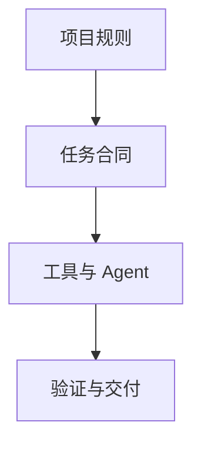

# OpenCode 与 Codex 高阶工程开发实战

> 面向真实代码仓库的工程化手册。重点不是“如何让 AI 写几行代码”，而是如何把 AI Coding Agent 纳入可审计、可验证、可回滚的软件工程流程。
>
> 整理日期：2026-09-28  
> 资料来源：资料库中的 OpenCode / Oh My OpenAgent / Agent 架构文档，以及 OpenAI Codex 官方文档。

## 1. 先给结论

OpenCode 与 Codex 都应被当作“受约束的软件工程师”，而不是聊天机器人。

稳定的工作闭环是：

```text
需求与验收标准
      ↓
读取项目规则与 Issue
      ↓
只读探索 / 复现问题
      ↓
形成计划、边界与风险
      ↓
小步修改
      ↓
构建、测试、静态检查
      ↓
审查 diff 与运行证据
      ↓
提交、PR、回滚或发布
```

最重要的工程原则：

1. 先定义完成条件，再开始修改。
2. 先读 `AGENTS.md`、项目文档和关联 Issue。
3. 复杂任务先 Plan，确认后再 Build。
4. 并行适合只读调查；共享文件写入必须串行或隔离 worktree。
5. 任何“已验证”都必须对应真实命令、测试输出或可复现证据。
6. 默认最小权限；需要更高权限时按任务临时放开。
7. AI 生成的代码、文档、CI 和配置都必须进入同一套 Review 流程。

## 2. OpenCode 与 Codex 的定位

| 维度 | OpenCode | Codex |
| --- | --- | --- |
| 核心定位 | 开源、可深度配置的 AI Coding Agent | OpenAI 的工程开发 Agent |
| 常用入口 | TUI、CLI、IDE、Desktop | CLI、IDE、Desktop、Cloud |
| 项目规则 | `AGENTS.md`、`opencode.json/jsonc` | `AGENTS.md`、`.codex/config.toml`、`~/.codex/config.toml` |
| 扩展方式 | Agents、Commands、Skills、MCP、Custom Tools、Plugins | Skills、Plugins、MCP、Subagents、`codex exec` |
| 适合场景 | 本地深度定制、嵌入式/C/C++、自定义 Agent 工程 | 本地开发、代码审查、云端并行、GitHub/CI 工作流 |
| 共同基础 | 明确上下文、限制范围、权限控制、真实验证、Git 回滚 | 明确上下文、限制范围、权限控制、真实验证、Git 回滚 |

不要把两者当成互斥工具。推荐组合：

- OpenCode：本地项目长期工作台、复杂工程配置、Custom Tools、嵌入式项目。
- Codex：跨设备接续、PR Review、Cloud 任务、Skills/Plugins、GitHub 协作。
- Git：两者之间的事实边界，所有重要任务都以 diff、commit 和测试结果交接。

## 3. 共同的工程控制面

### 3.1 四层上下文



| 层 | 内容 | 典型文件/入口 |
| --- | --- | --- |
| 项目规则 | 架构、目录、构建、测试、禁区 | `AGENTS.md`、`DESIGN.md` |
| 任务合同 | 目标、范围、约束、验收、回滚 | Issue、Plan、任务 Prompt |
| 工具与 Agent | 命令、Skill、MCP、子 Agent、脚本 | `.agents/`、`.codex/`、`.opencode/` |
| 验证与交付 | 测试、日志、diff、PR、发布 | CI、Review、Release |

### 3.2 AGENTS.md 的职责

`AGENTS.md` 是项目级“工程合同”，不应写成泛泛的提示词。建议包含：

- 项目入口与目录地图；
- 本地开发、构建、测试命令；
- 代码风格与语言版本；
- 不可修改的目录、API 和兼容性约束；
- 错误处理、日志、并发、资源管理规则；
- 数据库、凭据、部署和生产环境边界；
- 提交前必须执行的检查；
- 出现失败时如何报告证据。

建议模板：

```md
# Project Instructions

## Goal
一句话说明项目职责。

## Scope
允许修改的目录；明确禁止扩大的范围。

## Commands
- Install:
- Dev:
- Test:
- Lint:
- Build:

## Constraints
- 不改变公开 API
- 不新增未经批准的依赖
- 不提交密钥或生产凭据
- 不修改无关文件

## Verification
报告实际执行的命令、结果、未执行项目和剩余风险。
```

Codex 会在任务开始前按全局到项目目录建立指令链；OpenCode 也把 `AGENTS.md` 作为项目协作入口。两者都应避免在不同层级写互相矛盾的规则。

## 4. OpenCode 高阶能力

### 4.1 Plan / Build

推荐流程：

```text
Plan：理解代码、找调用链、提出方案
  ↓
人工确认：范围、风险、迁移与回滚
  ↓
Build：修改实现、补测试、运行验证
  ↓
Review：检查 diff、边界和回归
```

小型、局部、低风险修改可以直接 Build；以下情况必须先 Plan：

- 跨模块改动；
- 公共 API 或协议变化；
- 数据库、认证、部署、支付、网络和并发；
- 需要迁移、回滚或兼容旧版本；
- 需求描述模糊或验收标准缺失。

### 4.2 Agents、Commands、Skills、Custom Tools、Plugins

它们不是同一个概念：

| 能力 | 解决的问题 | 适用方式 |
| --- | --- | --- |
| Agent | “谁来负责这类任务” | 架构分析、代码探索、测试、Review |
| Command | “重复动作如何一条命令执行” | `/review`、`/release-check` |
| Skill | “复杂工作方法如何复用” | 设计、迁移、安全审查、文档发布 |
| Custom Tool | “项目有哪些确定性工具能力” | map 分析、pcap 解析、固件信息 |
| Plugin | “如何监听/扩展 Agent 生命周期” | Hook、日志、通知、自动化 |
| MCP | “如何连接外部上下文和工具” | GitHub、数据库、文档、浏览器 |

高阶设计原则：把“需要推理的工作流”放进 Skill，把“必须确定执行的动作”放进脚本或 Custom Tool；不要让 Agent 每次重新发明解析器、发布器或校验器。

### 4.3 MCP 的工程边界

MCP 可以连接 GitHub、数据库、文档系统、浏览器和内部 API，但每个 MCP 都会增加工具定义、权限和上下文成本。

建议：

- 默认只启用当前任务需要的 MCP；
- 对写入型 MCP 单独审查权限；
- API Key、Token、数据库凭据只从环境变量或安全凭据系统注入；
- 对外部 MCP 按第三方代码处理；
- 为每个 MCP 写清楚允许动作、禁止动作、数据范围和失败回退；
- 大型工具集采用按任务启用，避免污染上下文。

### 4.4 OpenCode 工程目录建议

```text
project/
├── AGENTS.md
├── DESIGN.md
├── opencode.jsonc
├── .opencode/
│   ├── agents/
│   ├── commands/
│   ├── skills/
│   ├── tools/
│   └── plugins/
├── .github/workflows/
├── scripts/
├── src/
└── tests/
```

嵌入式项目可优先沉淀：

```text
firmware_size
map_analyzer
stack_usage
symbol_lookup
pcap_summary
log_parser
register_decoder
board_config_lookup
```

## 5. Codex 高阶能力

### 5.1 CLI 工程闭环

Codex CLI 适合在仓库根目录完成：

```bash
codex
```

常用工作面：

| 目标 | 入口 |
| --- | --- |
| 初始化项目规则 | `/init` |
| 查看当前会话配置 | `/status` |
| 调整权限 | `/permissions` |
| 切换模型/推理强度 | `/model` |
| 规划任务 | `/plan` |
| 审查工作树 | `/review` |
| 非交互自动化 | `codex exec` |
| 接入外部工具 | `codex mcp` |
| 恢复历史会话 | `codex resume` |
| 将工作交给 Cloud | `codex cloud` |

命令名称和参数会随版本变化；仓库文档应链接官方 CLI Reference，不要长期复制可能过时的完整参数表。

### 5.2 Codex 配置分层

推荐边界：

- `~/.codex/config.toml`：个人默认配置；
- 项目 `.codex/config.toml`：仓库级配置，仅在信任项目后使用；
- 命令行覆盖：一次性实验；
- `AGENTS.md`：项目行为、代码和验证规则；
- Skill：可复用的专业工作流；
- MCP/Plugin：外部工具和上下文连接。

权限有两个独立维度：

1. Approval：何时需要用户批准命令。
2. Sandbox：Agent 能读写哪些目录、是否可访问网络。

建议默认保持收紧，只对可信仓库和明确任务临时放宽。

### 5.3 Skills 与 Plugins

Skill 是可复用的工作包，通常包含：

```text
SKILL.md 指令
references/ 参考资料
scripts/ 确定性脚本
assets/ 模板或资源
```

Skill 设计要求：

- 描述清楚触发条件；
- 先给最小必要上下文；
- 将稳定规则与高频变化事实分开；
- 外部平台的当前行为采用 retrieval-first；
- 脚本只负责确定性动作；
- 结果必须包含验证和失败状态；
- 不把秘密、个人凭据或生产配置打包进去。

Plugin 更适合分发 Skills、MCP 和连接器。对你的项目，建议把通用 Skill 放在 `aihome-skills`，把 Agent 编排与项目集成规范放在 `aihome-agent`，具体项目只保留项目约束和少量专用规则。

### 5.4 Subagents 与并行协作

适合并行的任务：

- 搜索不同模块的调用链；
- 分析不同测试失败；
- 查询不同官方文档；
- 对独立目录进行只读审查。

不适合直接并行的任务：

- 同时修改同一文件；
- 同时迁移同一个数据库；
- 多个 Agent 共同决定一个未经确认的公共 API；
- 并行执行生产部署。

推荐分工：

```text
主 Agent：维护目标、范围、任务清单与最终整合
  ├─ Explorer：代码地图与调用链
  ├─ Researcher：官方文档与兼容性证据
  ├─ Implementer：按计划修改
  ├─ Tester：执行测试与故障注入
  └─ Reviewer：独立检查 diff、风险和回归
```

并行写入时使用独立 worktree；最终由主 Agent 串行合并和验证。

## 6. Prompt 工程：从“帮我改”到任务合同

推荐结构：

```text
目标：
范围：
现状/复现步骤：
约束：
参考文件：
实施方式：
验证命令：
输出格式：
```

通用模板：

```text
目标：修复/实现……

范围：只允许修改 src/ 和 tests/；不要改公共 API。

现状/复现：
1. …
2. …
3. …

约束：
- 不新增依赖
- 保持兼容
- 失败时保留原行为
- 不修改无关文件

实施：
1. 先只读定位根因；
2. 先给出计划，暂不修改；
3. 计划确认后实现；
4. 添加回归测试；
5. 执行真实检查。

验证：
- npm run lint
- npm test
- npm run build

输出：
修改文件、根因、测试结果、未执行命令、剩余风险。
```

低质量 Prompt：

```text
帮我把项目重构一下。
```

高质量 Prompt：

```text
先只读分析当前行情数据刷新链路。
目标：解决日线数据停留在旧交易日的问题。
范围：仅允许修改数据源适配、缓存和图表加载模块。
约束：TradingView 数据源优先；保留现有 API；失败时读本地库兜底；不要改 UI 布局。
验证：给出数据源选择、缓存命中、超时和回退的测试方案，确认后再修改。
```

## 7. 工程实战工作流

### 7.1 新功能

1. 读取 `AGENTS.md`、README、架构文档和关联 Issue。
2. 建立代码地图：入口、数据流、依赖、测试位置。
3. 写出验收标准和不在范围内的事项。
4. Plan：给出最小改动方案、风险和回滚。
5. Build：先实现主路径，再补错误路径和测试。
6. 执行真实构建、测试、静态检查。
7. 审查 diff，确认没有无关格式化和依赖升级。
8. 提交并在 PR 中记录证据。

### 7.2 Bug 修复

```text
复现 → 定位 → 假设 → 最小修复 → 回归测试 → 再现确认
```

必须把复现步骤交给 Agent；只给“有 Bug”会导致大量猜测。修复报告至少包含：

- 根因；
- 影响范围；
- 修改文件；
- 新增或调整的测试；
- 实际命令与结果；
- 未覆盖的边界。

### 7.3 大型重构

拆成里程碑：

```text
M0 代码地图与依赖冻结
M1 接口/Schema 与兼容策略
M2 旧实现与新实现并存
M3 数据或配置迁移
M4 测试、观测和回滚
M5 删除旧路径
```

任何“删除旧实现”的任务，都必须先证明新路径已被真实流量或完整测试覆盖。

### 7.4 CI/CD 与发布

Agent 可以生成 CI，但不能把“工作流文件存在”当成“发布可靠”。至少检查：

- Job 权限最小化；
- 第三方 Action 固定版本或 commit SHA；
- secrets 不写入日志和 artifact；
- 并发取消和重复发布策略；
- 环境保护与人工批准；
- 构建产物可追溯；
- 失败可重试、可回滚；
- 线上变更前有 dry-run 或 staging。

### 7.5 文档与知识库

文档任务也应有工程边界：

- 先确定目标读者和使用场景；
- 保留命令、版本和前置条件；
- 区分已验证、建议、推测；
- 链接官方文档而不是复制易变内容；
- 为每个文档提供验证日期；
- 代码示例必须与当前仓库一致。

## 8. 面向你的项目的推荐落地

| 项目类型 | 推荐工具组合 | 首要沉淀 |
| --- | --- | --- |
| `system-design-notes` | Codex/OpenCode + content rules + diagram Skill | Markdown front matter、内容校验、PlantUML/Mermaid 检查 |
| StockAnalysis / TradingView | Codex + Browser/MCP + CI | 数据源契约、回退策略、API 限流、生产验证 |
| RT-Thread / RIL / modem | OpenCode + Custom Tools + clangd | 编译、map/pcap/log 分析、线程与资源约束 |
| HomeTutor 多仓 | Codex Subagents + contract fixtures | Schema、模拟器、跨仓依赖、集成证据 |
| `aihome-skills` | Codex Skills + CI lint | front matter、触发条件、provenance、版本审计 |
| `aihome-agent` | Codex/OpenCode + GitHub | Agent 路由、任务合同、权限和交付模板 |

推荐统一的仓库交付报告：

```md
## 完成报告

- 目标：
- 实际修改：
- Skills used：
- 真实执行命令：
- 测试结果：
- 未执行项目：
- 风险与回滚：
- Commit / PR：
```

## 9. 常见失败模式

| 失败模式 | 根因 | 修复 |
| --- | --- | --- |
| AI 改了很多无关文件 | Scope 不清 | 明确允许目录和禁止事项 |
| 说“测试通过”但没有输出 | 没有真实验证约束 | 要求报告命令、退出码和摘要 |
| MCP 越开越多 | 把工具数量当能力 | 按任务启用，按权限隔离 |
| 多 Agent 互相覆盖 | 共享工作区写入 | 只读并行，写入使用 worktree |
| 使用过时平台 API | 把旧文档当事实 | 当前官方文档 + 小型 PoC |
| Agent 无限循环 | 没有停止条件 | 设定里程碑、预算、最大重试和升级条件 |
| 文档与代码脱节 | 没有把文档纳入 CI | 链接、示例、命令和 front matter 校验 |
| 直接开放生产权限 | 信任边界不清 | 默认 sandbox/approval，生产单独审批 |

## 10. 最小可执行标准

一个任务只有同时满足以下条件，才算完成：

- 目标和范围明确；
- 关联项目规则已读取；
- 代码变更可解释；
- 至少有一项真实验证；
- 关键路径有回归测试或明确说明原因；
- diff 无无关改动；
- 没有泄露密钥和扩大权限；
- 交付报告记录了结果与剩余风险。

## 11. 官方参考与延伸阅读

### OpenCode

- [OpenCode 官方文档](https://opencode.ai/docs)
- [Config](https://opencode.ai/docs/config)
- [Agents](https://opencode.ai/docs/agents)
- [Commands](https://opencode.ai/docs/commands)
- [Skills](https://opencode.ai/docs/skills)
- [Tools](https://opencode.ai/docs/tools)
- [Custom Tools](https://opencode.ai/docs/custom-tools)
- [MCP Servers](https://opencode.ai/docs/mcp-servers)
- [Plugins](https://opencode.ai/docs/plugins)
- [CLI](https://opencode.ai/docs/cli)

### Codex

- [Codex CLI](https://developers.openai.com/codex/cli)
- [Codex 工作流与 Prompt](https://learn.chatgpt.com/docs/prompting)
- [Codex Best Practices](https://learn.chatgpt.com/guides/best-practices)
- [AGENTS.md](https://learn.chatgpt.com/docs/agent-configuration/agents-md)
- [Skills](https://learn.chatgpt.com/docs/build-skills)
- [MCP](https://learn.chatgpt.com/docs/extend/mcp?surface=cli)
- [Subagents](https://learn.chatgpt.com/docs/agent-configuration/subagents)
- [Configuration Reference](https://learn.chatgpt.com/docs/config-file/config-reference)

> 平台命令和配置可能随版本演进。涉及当前行为时，以官方文档和当前 CLI `--help` 输出为准。
