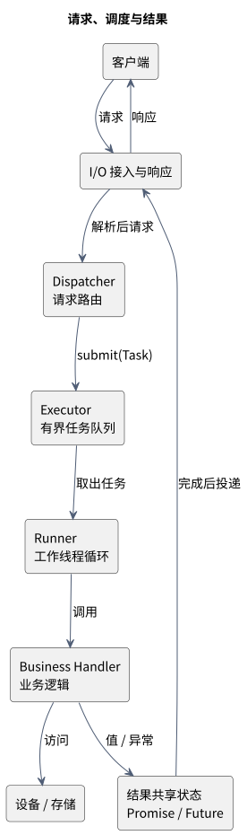
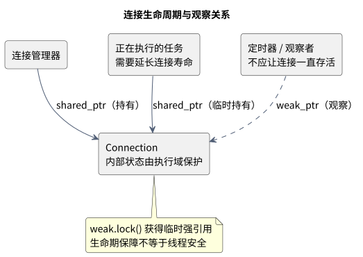
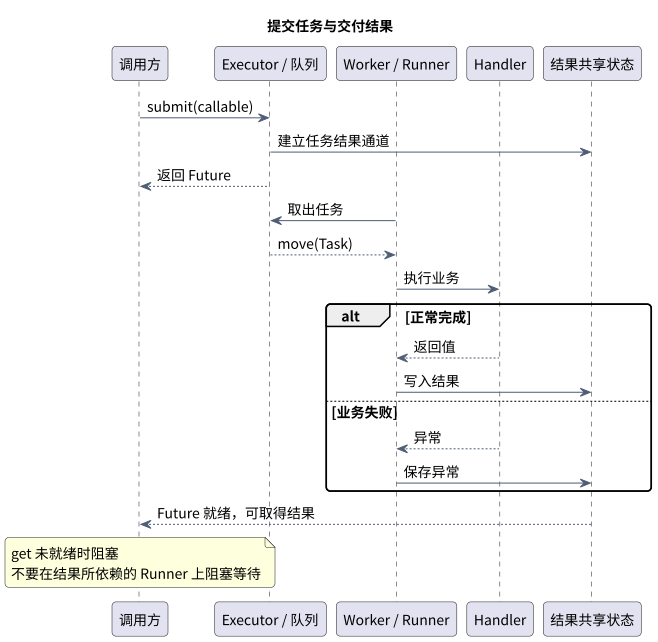
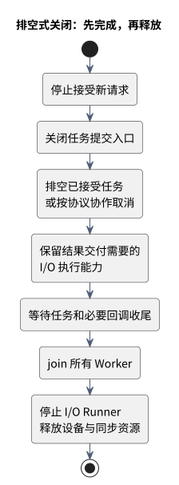

# C++ System Architecture in Practice

> C++20 baseline; C++23 facilities are labeled. Sources checked on 2026-09-30. This is a condensed English companion; the Chinese edition contains the full walkthrough. The gateway and thread-pool implementation are original teaching examples. Java comparisons explain roles, not identical semantics.

## 1. The architecture spine

A device gateway accepts requests, parses messages, selects a business handler, submits work to an executor, runs the task, delivers a value or error, and eventually shuts down.

Four independent contracts matter: **ownership**, **execution location**, **result delivery**, and **termination**.



| Role | Responsibility | Typical C++ mechanisms | Java comparison |
| --- | --- | --- | --- |
| I/O layer | Connections, reads, writes, timers | Asio / Reactor, completion handlers | Netty EventLoop |
| Data model | Requests, responses, protocol states | Values, move semantics, variant | DTO, record, sealed types |
| Business handler | The work to perform | Interfaces, templates, callables | Service / Callable |
| Executor | Where and how work is submitted | Queue, execution context | ExecutorService |
| Runner | Drives execution | Worker loop, io_context.run() | Worker / event-loop thread |
| Synchronization | Protects invariants and waits for conditions | Mutex, RAII lock, CV, atomics | Lock, Condition, Atomic* |
| Result channel | Produces and consumes completion | Promise, Future, packaged_task | Future / CompletableFuture |
| Lifecycle | Owns resources and coordinates shutdown | Smart pointers, RAII, join | close / shutdown, reference ownership |

Handler and Runner are framework-dependent roles, not a standardized pair of C++ classes. Distinguish business handlers from completion handlers.

## 2. Ownership before pointer selection

| Situation | Prefer | Contract |
| --- | --- | --- |
| Small request or configuration | Value | Avoid unnecessary heap ownership |
| Temporary non-null access | T& / const T& | Borrow; do not retain beyond lifetime |
| Nullable borrowed access | T* | Optional observer, not implicit deletion responsibility |
| One module owns a device | unique_ptr<T> | Move-only ownership transfer |
| Several operations must keep a connection alive | shared_ptr<T> | Shared lifetime, not automatic object synchronization |
| Observer or timer must not extend lifetime | weak_ptr<T> | Lock temporarily before access |
| Temporary byte/string view | span / string_view | Does not own or extend backing storage |

Start with values and unique_ptr; use shared_ptr when shared lifetime is a real requirement. Java reference assignment normally creates another alias, not a unique ownership transfer. Shared ownership via reference counting also differs from reachability-based GC: strong cycles can leak, and the last release determines the destruction thread.

Distinct shared_ptr instances can share a control block under the library's rules; concurrently updating one shared_ptr variable still needs synchronization or atomic<shared_ptr<T>>. The pointee's mutable state needs its own synchronization or execution-domain rule. Do not call shared_from_this() in a constructor or create a separate owning control block from the same this pointer.

RAII also handles locks, file descriptors, rollback guards and completion obligations. Java's corresponding explicit resource pattern is AutoCloseable / try-with-resources, not waiting for GC to close a resource.



Sources: [shared_ptr standard draft](https://eel.is/c++draft/util.smartptr.shared), [Java resource management](https://docs.oracle.com/javase/tutorial/essential/exceptions/tryResourceClose.html).

## 3. Templates and polymorphism

Templates preserve the callable and return types of submit(F&&). Forwarding, decay and invoke_result express storage and result-type contracts. C++20 requires can constrain accepted tasks. Templates differ from Java's common erased generics and carry compilation and code-size costs.

Choose virtual interfaces for runtime-replaceable devices, template policies for compile-time choices, type erasure for heterogeneous work queues, variant for a closed protocol-event set, and PImpl for implementation isolation. CRTP is useful for shared compile-time behavior; it is not a universal replacement for virtual dispatch.

std::function requires a copyable target. A lambda owning a unique_ptr is normally move-only. C++23 move_only_function or the C++20 packaged_task approach in this guide can preserve that ownership.

## 4. Future is a result, not a scheduler

Promise writes a value or exception; Future waits and consumes it; shared_future supports shared observation; packaged_task associates a callable with a result state. None of these automatically creates a worker thread. std::async does not establish your application's bounded-pool policy.

Ordinary get() can block. Do not block an I/O runner waiting for a completion that runner must deliver. Do not fill a small pool with parent tasks waiting for queued children. A wait_for timeout does not cancel the underlying operation. Ordinary Future is retrieved and consumed once; result, error and cancellation paths need exactly one completion winner.

C++20 std::future has neither a general then() chain nor native co_await integration. Java CompletableFuture and framework futures such as Seastar provide different composition/scheduling contracts.



Sources: [Promise](https://eel.is/c++draft/futures.promise), [Future](https://eel.is/c++draft/futures.unique.future), [CompletableFuture](https://docs.oracle.com/en/java/javase/21/docs/api/java.base/java/util/concurrent/CompletableFuture.html).

## 5. Mutex, condition variables and execution domains

Protect queue capacity, queue contents and shutdown state as one invariant. A separate atomic flag does not make those compound decisions atomic.

Use lock_guard for short updates, unique_lock for condition-variable waits, scoped_lock when acquiring multiple mutexes, and atomics for appropriately designed independent state/protocols. CV waits must use a predicate such as closing || !queue.empty(); a notification is not a stored queue item. Pop work under the lock, release it, then call user code. Wake workers and join them before destroying synchronization objects.

I/O runners should execute short callbacks; CPU workers handle computation; a device runner can serialize commands. A strand serializes associated work but need not pin it to one physical thread. Coroutines express suspension/resumption; a framework supplies scheduling, and borrowed objects still need valid lifetimes.

Sources: [CV](https://eel.is/c++draft/thread.condition.condvar), [Asio threads](https://www.boost.org/doc/libs/latest/doc/html/boost_asio/overview/core/threads.html).

## 6. Runnable bounded thread pool

[Complete C++20 source](https://github.com/luckyJimLu/system-design-notes/blob/main/content/33.%20Cpp%20System%20Architecture/examples/bounded_thread_pool.cpp).

```bash
bash scripts/check-cpp-examples.sh
```

The pool combines templated submit, packaged_task, Future, move-only ownership, mutex, CV, fixed workers, a bounded waiting queue, rejection and draining shutdown. Tests cover normal return, unique_ptr capture, exception delivery, rejection after close, queue saturation and draining. The saturation check coordinates with Promise rather than timing guesses.

Teaching boundaries: no-argument callables; one external lifecycle coordinator; no concurrent shutdown calls; no shutdown/destruction from a pool task; accepted tasks must eventually finish. submit may race with the shutdown-state change. There is no forceful interruption, deadline cancellation, priority scheduler, telemetry, work stealing or production isolation. Tasks returning references leave lifetime responsibility with the caller.

## 7. Shutdown and cancellation



Define admission, backpressure, queued-task expiration, cooperative cancellation and one-shot completion. Stop accepting work, close submission, drain or cancel accepted tasks, keep result-delivery execution available, wait for necessary callbacks, join workers, then release resources. Derive the final ordering from dependencies.

jthread automates stop request and join, not forceful termination. A plain condition_variable wait does not automatically wake merely because a stop token is requested. A shared_ptr keeps completion state alive but does not choose the winner between timeout and actual completion.

## 8. Real projects to study

| Project | Architecture lesson | C++ focus | Reading |
| --- | --- | --- | --- |
| Muduo | I/O-loop ownership and connection lifetime | RAII, callbacks, weak/strong ownership | [Author](https://www.chenshuo.com/book/), [Channel.cc](https://github.com/chenshuo/muduo/blob/master/muduo/net/Channel.cc) |
| Boost.Asio | Async completion separated from execution threads | Templates, handlers, executors, move captures | [Async design](https://www.boost.org/doc/libs/latest/doc/html/boost_asio/overview/core/async.html), [thread_pool](https://www.boost.org/doc/libs/latest/doc/html/boost_asio/reference/thread_pool.html) |
| Apache bRPC | RPC completion responsibility and M:N concurrency | ClosureGuard RAII, explicit asynchronous handoff | [Server](https://brpc.apache.org/docs/server/basics/), [bthread](https://brpc.apache.org/docs/bthread/bthread/) |
| RocksDB | Embedded storage and replaceable strategies | Virtual interfaces, non-owning Slice | [Overview](https://github.com/facebook/rocksdb/wiki/RocksDB-Overview), [Slice](https://github.com/facebook/rocksdb/blob/main/include/rocksdb/slice.h) |
| Seastar / ScyllaDB | Sharding and explicit cross-core messages | Framework futures, C++20 coroutines, RAII admission units | [Tutorial](https://docs.seastar.io/master/tutorial.html) |
| ROS 2 | Message topology and ownership affect copying | Typed messages, unique_ptr move, shared immutable data | [Current demo](https://github.com/ros2/demos/blob/rolling/intra_process_demo/src/two_node_pipeline/two_node_pipeline.cpp), [Historical design](https://design.ros2.org/articles/intraprocess_communications.html) |
| LLVM | Extensible passes and analysis-invalidation contracts | CRTP mixins, concept-based polymorphism | [Pass tutorial](https://llvm.org/docs/WritingAnLLVMNewPMPass.html) |

ROS 2 zero-copy behavior depends on process boundaries, ownership demands, subscriptions and configuration; it is not universal. LLVM's concept-based polymorphism does not by itself imply a C++20 concept declaration. Current mixin names can differ from older tutorials. Linux server libraries are not automatically portable to resource-constrained RTOS targets.

## 9. Review checklist

Identify every owner, borrowed buffer lifetime, mutation domain, task/queue limit, lock held across user code, blocking wait, completion winner, accepted-task outcome, shutdown dependency and destruction thread. Only then investigate lock-free queues, pools, work stealing or complex templates, measuring throughput, tail latency, queue delay, copies, memory and shutdown time.
