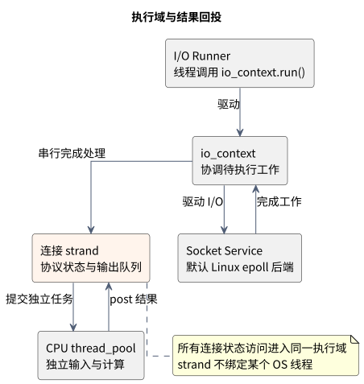
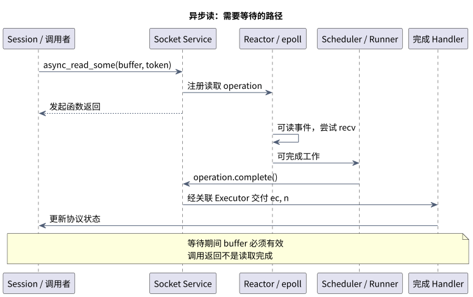
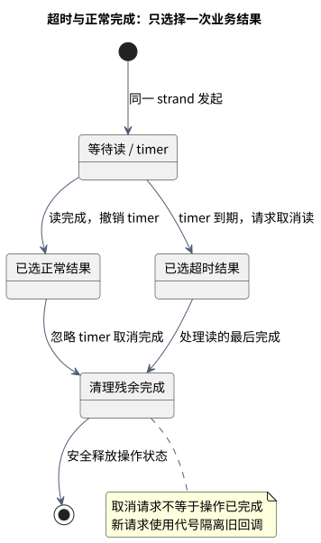

# Boost.Asio Deep Dive

This English companion summarizes the full [Chinese walkthrough](https://github.com/luckyJimLu/system-design-notes/blob/main/content/34.%20Boost%20Asio%20Deep%20Dive/index.zh.md). Teaching baseline: **C++20 and Boost 1.83.0**, with Asio source pinned to `f2fbbd824c1fafa67c1b9c7ee6e4d2649b343a46` (`boost-1.83.0`). This is a reproducible baseline, not a claim about the latest release or a production version recommendation. Sources checked on 2026-09-30. Internal tracing covers the default Linux epoll path; other backends differ.

Previous chapter: [C++ System Architecture](#/chapter/content-cpp-system-architecture-practice), also available [on GitHub](../33.%20Cpp%20System%20Architecture/index.en.md).

## 1. Why Asio

[Boost.Asio](https://www.boost.org/doc/libs/1_83_0/doc/html/boost_asio.html) provides portable asynchronous networking and execution facilities. It is a useful foundation for gateways, proxies and serial-device services; application code still defines framing, quotas, business logic and shutdown. It is not a complete RPC or service-governance framework.

Its central architectural lesson is separating an asynchronous operation's implementation from the caller's composition mechanism.

| Role | Asio counterpart | Contract |
| --- | --- | --- |
| Execution context | io_context, thread_pool | Coordinate work; not an admission policy |
| Executor | Object executor, strand executor | Specify where work may execute |
| Runner | Thread calling run() | Drive processing; not one thread per connection |
| Async operation | async_read_some, async_wait | Deliver completion; not own buffer storage |
| Completion handler | Callback or coroutine adapter | Consume operation results |
| Completion token | Lambda, use_future, use_awaitable | Select API/composition form |

Business handlers are application logic invoked after completion; they are not synonymous with Asio completion handlers. Runner is an architectural role, not a required Asio base class.



The diagram uses Chinese labels, shared with the full article. CPU offloading is an application design choice: submit independent input, then post the result back to the connection's strand before accessing connection state.

## 2. Follow an asynchronous read through the source



The diagram shows the path that needs to wait. A speculative nonblocking read may complete without first waiting in epoll. Under the selected version's default async_read_some contract, even immediate completion does not invoke the user handler inside the initiating function. Do not generalize this to arbitrary executors, custom operations or newer immediate-completion adaptations.

| Source entry | What to inspect |
| --- | --- |
| [basic_stream_socket.hpp](https://github.com/boostorg/asio/blob/f2fbbd824c1fafa67c1b9c7ee6e4d2649b343a46/include/boost/asio/basic_stream_socket.hpp) | async_read_some forwards buffers, token and completion signature through async_initiate |
| [reactive_socket_service_base.hpp](https://github.com/boostorg/asio/blob/f2fbbd824c1fafa67c1b9c7ee6e4d2649b343a46/include/boost/asio/detail/reactive_socket_service_base.hpp) | async_receive creates the operation and installs supported cancellation |
| [epoll_reactor.ipp](https://github.com/boostorg/asio/blob/f2fbbd824c1fafa67c1b9c7ee6e4d2649b343a46/include/boost/asio/detail/impl/epoll_reactor.ipp) | start_op may try perform immediately; readiness later advances queued operations |
| [reactive_socket_recv_op.hpp](https://github.com/boostorg/asio/blob/f2fbbd824c1fafa67c1b9c7ee6e4d2649b343a46/include/boost/asio/detail/reactive_socket_recv_op.hpp) | do_perform attempts recv; do_complete prepares the handler and releases operation storage |
| [scheduler.ipp](https://github.com/boostorg/asio/blob/f2fbbd824c1fafa67c1b9c7ee6e4d2649b343a46/include/boost/asio/detail/impl/scheduler.ipp) | do_run_one drives reactor tasks or completes operations outside the queue lock |
| [handler_work.hpp](https://github.com/boostorg/asio/blob/f2fbbd824c1fafa67c1b9c7ee6e4d2649b343a46/include/boost/asio/detail/handler_work.hpp) | The associated executor participates in final delivery |

Readiness says an I/O attempt can progress; recv determines the actual result. The public API exposes completion semantics even when this Linux backend uses readiness. Windows IOCP and optional backends require their own tracing. Context destruction can clean pending state without calling every user handler, so graceful shutdown must explicitly keep completion processing alive.

## 3. Templates and completion tokens

| Token | Result interface | Initiation |
| --- | --- | --- |
| Ordinary callback | Handler receives completion arguments | Eager |
| use_future | std::future | Eager; consuming it may block |
| use_awaitable | asio::awaitable | Operation starts when awaited |

[async_result.hpp](https://github.com/boostorg/asio/blob/f2fbbd824c1fafa67c1b9c7ee6e4d2649b343a46/include/boost/asio/async_result.hpp) and [Completion Tokens](https://www.boost.org/doc/libs/1_83_0/doc/html/boost_asio/overview/model/completion_tokens.html) explain how the completion signature and token produce a concrete handler and return interface. Templates retain concrete callable types; this is not a runtime virtual-interface switch.

Future does not drive io_context. Blocking the only runner on a result that needs that runner can deadlock. Standard future also lacks CompletableFuture's general composition API. [use_future](https://www.boost.org/doc/libs/1_83_0/doc/html/boost_asio/overview/composition/futures.html) translates conventional error_code failures into future exceptions.

Our small async_square adapter computes in thread_pool and posts completion to the associated executor, holding its work guard during the transfer. It supports callback, future and awaitable forms. It intentionally omits cancellation, full allocator propagation, admission control and allocation-failure recovery. A production operation needs those contracts and exactly-once completion; study [async_compose](https://www.boost.org/doc/libs/1_83_0/doc/html/boost_asio/reference/async_compose.html).

## 4. Executors and strands

io_context needs user-owned runners. Multiple runners can execute different handlers concurrently. thread_pool manages its own workers.

- post prevents inline invocation on the submitting call stack; another runner may still execute concurrently before submission returns.
- dispatch may invoke immediately when executor conditions permit, introducing reentrancy.
- defer expresses continuation-oriented scheduling, not a deadline or guaranteed priority.
- A strand prevents concurrent execution of its handlers, not migration between OS threads.

Every access to protected connection state must use the same strand, including timers, close requests and CPU-result delivery. Binding only final callbacks does not make arbitrary external socket calls safe. A strand also does not impose application ordering on completions of independent I/O operations.

References: [thread model](https://www.boost.org/doc/libs/1_83_0/doc/html/boost_asio/overview/core/threads.html), [strands](https://www.boost.org/doc/libs/1_83_0/doc/html/boost_asio/overview/core/strands.html), [post](https://www.boost.org/doc/libs/1_83_0/doc/html/boost_asio/reference/post.html), [dispatch](https://www.boost.org/doc/libs/1_83_0/doc/html/boost_asio/reference/dispatch.html).

## 5. Ownership and coroutine frames

| Situation | Ownership choice |
| --- | --- |
| One coroutine owns a socket | Pass by value and move into the coroutine |
| Independent CPU input | Value or unique_ptr transfer |
| Several callbacks need a live session | Capture shared_ptr; separately serialize state |
| Optional observer | weak_ptr, lock at use time |
| buffer / span / string_view | Borrowed memory must remain valid through completion |
| Coroutine local array / unique_ptr | Stored with the coroutine frame across suspension |

Copying asio::buffer does not copy its underlying bytes. Coroutine references can still dangle, and temporary capturing coroutine lambdas can outlive their closure. The examples use named coroutine functions and owned parameters. shared_ptr ensures lifetime, not object synchronization or destruction on a particular thread.

co_await suspends the coroutine rather than blocking the runner. It does not offload CPU work automatically. co_spawn connects the coroutine to an executor and a completion token; observe errors unless the coroutine explicitly handles them itself. redirect_error lets code branch on EOF or cancellation instead of throwing for those outcomes.

References: [buffers](https://www.boost.org/doc/libs/1_83_0/doc/html/boost_asio/overview/core/buffers.html), [C++20 coroutines](https://www.boost.org/doc/libs/1_83_0/doc/html/boost_asio/overview/composition/cpp20_coroutines.html).

## 6. Framing, single write chains and backpressure

TCP is a byte stream. async_read_some can return only part of a logical message. Applications define framing and validate declared lengths before allocation.

[async_write](https://www.boost.org/doc/libs/1_83_0/doc/html/boost_asio/reference/async_write/overload1.html) composes lower-level writes. Do not overlap it with another write on the same stream. A strand alone does not establish this: another serialized handler can initiate a second write before the first asynchronous write finishes. Maintain one write chain consuming an output queue.

Explicitly bound connection counts, frame sizes, queued CPU input and pending output bytes. Choose rejection, pausing, degradation or disconnect policies. Limiting worker threads does not bound queued memory; Asio post/thread_pool do not automatically implement the previous chapter's bounded admission protocol.

## 7. Cancellation, timeout races and shutdown



State is accessed through one strand. Read success cancels the timer; timeout requests read cancellation. Both paths still process residual completion and use request identifiers to prevent an old callback affecting a new request.

Cancellation is a request with an operation-specific side-effect contract. A cancellation signal has one slot, not a broadcast subscription list for parallel operations. terminal/partial/total specify guarantees, not force levels. Unsupported cancellation requests need not cancel anything; emitting before initiation does not create a persistent cancellation flag. See [per-operation cancellation](https://www.boost.org/doc/libs/1_83_0/doc/html/boost_asio/overview/core/cancellation.html).

A teaching drain protocol stops admission, marks sessions closing, finishes or cancels accepted work, continues I/O runners for completion delivery, waits for CPU result transfers, releases artificial work guards when appropriate, joins runners and finally destroys contexts. Do not block the only required completion runner while joining CPU work.

io_context.stop() asks event processing to stop; it does not drain handlers or cancel sockets. work_guard.reset() removes an artificial work hold; genuine outstanding work remains. Restarting after stop requires restart(), which must not race with active run-family calls. See [stop](https://www.boost.org/doc/libs/1_83_0/doc/html/boost_asio/reference/io_context/stop.html), [restart](https://www.boost.org/doc/libs/1_83_0/doc/html/boost_asio/reference/io_context/restart.html), [work guard](https://www.boost.org/doc/libs/1_83_0/doc/html/boost_asio/reference/executor_work_guard.html).

## 8. Runnable examples and validation

| File under examples/ | Purpose |
| --- | --- |
| [asio_contracts.cpp](https://github.com/luckyJimLu/system-design-notes/blob/main/content/34.%20Boost%20Asio%20Deep%20Dive/examples/asio_contracts.cpp) | Three token forms, coroutine-owned unique_ptr, associated executor, work guard, two-runner strand counter, cancellation, future error conversion, stop/restart and shared ownership |
| [coroutine_echo.cpp](https://github.com/luckyJimLu/system-design-notes/blob/main/content/34.%20Boost%20Asio%20Deep%20Dive/examples/coroutine_echo.cpp) | Socket ownership, frame-local buffer, one write chain per session, natural drain |
| [check_echo.py](https://github.com/luckyJimLu/system-design-notes/blob/main/content/34.%20Boost%20Asio%20Deep%20Dive/examples/check_echo.py) | Real loopback TCP: binary data, fragmented sends, 256 KiB stream, concurrent sessions, empty stream and EOF |

On Ubuntu 24.04, from the repository root:

```bash
sudo apt-get update
sudo apt-get install -y --no-install-recommends libboost1.83-dev
bash scripts/check-cpp-examples.sh
```

Compilation uses C++20, pthread and strict warnings; version assertions enforce the teaching baseline. Tests have timeouts and run in Pages CI alongside the existing bounded pool example.

Echo listens only on loopback and accepts a finite session count. One I/O runner makes its completion counters safe; changing to multiple runners requires synchronization and a fresh contract review. The server has no TLS, message framing, idle deadline or production global flow control. A client that never closes can keep it running. Test timeouts detect hangs; they are not the server's cancellation mechanism.

## 9. Java comparison and further experiments

| Asio | Java analogy | Difference to retain |
| --- | --- | --- |
| io_context runners | Netty EventLoop | Shared runners need not pin a connection to one thread |
| strand | Serial execution domain | Serial execution does not imply fixed thread affinity |
| thread_pool / post | ExecutorService | Admission and rejection still need design |
| use_future | Future | Not the full CompletableFuture composition model |
| awaitable / co_spawn | Structured asynchronous flow | C++ frame ownership and executor-aware resumption matter |
| shared_ptr capture | Strong references | Reference counting does not collect strong cycles |
| buffer view | Some ByteBuffer / ByteBuf uses | Ownership and reference-count protocols are not equivalent |

References: [Netty EventLoop](https://netty.io/4.1/api/io/netty/channel/EventLoop.html), [CompletableFuture](https://docs.oracle.com/en/java/javase/21/docs/api/java.base/java/util/concurrent/CompletableFuture.html).

Next experiments: print handler thread IDs, enable BOOST_ASIO_ENABLE_HANDLER_TRACKING, and compare speculative reads with the readiness path. Production validation should add slow peers, disconnects during CPU work, cancellation races, output limits and shutdown deadlines. Those are proposed tests, not checks already executed by this chapter.

All diagrams have committed PlantUML sources and SVG images. Pages CI force-renders the diagrams, validates content, compiles and runs examples, checks TypeScript and builds before publishing. When upgrading Boost, update the pinned source links, dependency, version assertions and documented contracts together.
