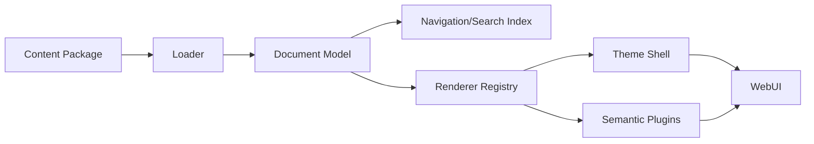
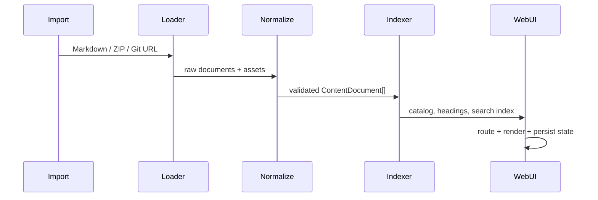

# System Design Notes 内容驱动渲染架构

## 结论

可以，而且这是 `system-design-notes` 最合适的演进方向：将“内容”和“WebUI 渲染”拆成两个独立层。导入新的 Markdown、Markdown + front matter、图片和可选的结构化配置后，系统自动完成目录、路由、语言切换、搜索索引、代码块、图表和交互组件渲染；不再为每一批新内容重新编写页面。

建议采用 **Content Package + Intermediate Document Model + Renderer Registry**，而不是让内容直接包含任意 React/JSX。MDX 可以作为高级扩展，但默认内容格式应保持安全、可移植、可被 AI 和脚本稳定生成的 Markdown + front matter。

## 研究依据与方案比较

| 方案 | 优点 | 风险/限制 | 对本项目的结论 |
|---|---|---|---|
| Markdown + `react-markdown` | 简单、安全、迁移成本最低 | 复杂交互需要额外语法 | 作为默认基础格式 |
| MDX | Markdown 中可直接使用 React 组件，扩展能力强 | 内容变成可执行代码；导入远程内容有安全风险；构建链更复杂 | 作为受信任内容的可选高级模式 |
| Markdoc | 自定义 tag、schema 校验、renderer 解耦，适合复杂文档站 | 需要引入新的 AST/编译链 | 最适合未来的“语义组件”扩展方向 |
| Docusaurus | 文档站能力成熟，MDX、版本、导航和主题完整 | 迁移当前定制 UI 成本较高，运行时自由度下降 | 借鉴其内容组织，不立即替换现有壳层 |
| Astro Content Collections | 内容 schema 和类型校验优秀，静态站性能好 | 当前 React/Vite 应用迁移成本较大 | 借鉴 schema/构建校验思想 |

MDX 官方定位是“Markdown 中嵌入 JSX/组件”，Docusaurus 已将其用于文档与 React 组件渲染；Markdoc 则强调自定义标签、验证和替换 renderer。这说明“内容描述 + 组件渲染器”是成熟模式，但本项目应先从安全的 Markdown 和受控语义块开始。[1][2][3]

## 目标架构



### 1. 内容层

内容层只负责知识，不负责页面布局。建议支持：

```text
content/
  01-scaling/
    index.zh.md
    index.en.md
    images/
  02-rate-limiter/
    index.zh.md
    index.en.md
  manifest.yaml                 # 可选；没有时由目录推导
```

每个文档使用 front matter 描述元数据：

```yaml
---
id: rate-limiter
title: 速率限制器
titleEn: Rate Limiter
order: 4
group: 基础组件
tags: [限流, 分布式系统]
status: published
lang: zh
aliases: [rate-limit]
---
```

正文仍然是普通 Markdown。图片路径相对当前内容文件解析，避免把资源路径硬编码到 React 组件中。

### 2. 标准化文档模型

Loader 将本地 Markdown、远程 GitHub 内容、未来的 Google Drive 导出文件统一转换为模型：

```ts
export interface ContentDocument {
  id: string;
  locale: 'zh' | 'en';
  title: string;
  slug: string;
  group?: string;
  order?: number;
  tags: string[];
  markdown: string;
  source: { type: 'local' | 'github' | 'drive'; uri: string };
  assets: Record<string, string>;
  headings: Array<{ id: string; text: string; level: number }>;
  updatedAt?: string;
}
```

应用层只依赖 `ContentDocument[]`，不再依赖 `ALL_CHAPTERS` 这种手写数据集合。这样同一个渲染内核可以接入不同内容源。

### 3. 渲染层

建立组件注册表，将 Markdown 节点或语义块映射到稳定组件：

```ts
export interface RendererPlugin {
  name: string;
  version: string;
  register(registry: RendererRegistry): void;
}

registry.registerBlock('callout', CalloutBlock);
registry.registerBlock('diagram', DiagramBlock);
registry.registerBlock('comparison', ComparisonBlock);
registry.registerBlock('checklist', ChecklistBlock);
```

第一阶段只需要覆盖：标题、段落、列表、表格、代码、图片、引用、Mermaid、提示框和折叠块。`ChapterViewer` 负责“文档容器”，具体内容由 renderer 输出；`Sidebar`、`Navbar`、`TableOfContents` 只消费模型和索引。

### 4. WebUI 壳层

当前 UI 中以下能力应保留为独立壳层能力：

- 主题、响应式布局、导航栏、侧边栏和移动端抽屉。
- 书签、完成状态、字体大小和本地持久化。
- 搜索框、目录、阅读进度和图片灯箱。
- 路由与语言切换。

壳层不应知道某一章节的具体标题、图片或 Markdown 内容。它只接受 `ContentCatalog` 和当前 `ContentDocument`。

## 导入后的自动渲染流程



导入接口建议提供三种模式：

1. **目录扫描**：扫描 `content/`，按文件名和 front matter 自动生成导航。
2. **内容包导入**：导入 ZIP，校验 manifest、Markdown、图片和重复 ID。
3. **远程源同步**：从 GitHub 仓库或指定目录拉取，转换后生成本地缓存/构建产物。

导入必须先校验再发布。错误应显示为文档级诊断，例如“缺少 id”“order 重复”“图片不存在”“不支持的 block 类型”，不能让单个错误导致整个站点白屏。

## 推荐的仓库改造结构

```text
src/
  content/
    types.ts
    loader.ts
    markdown.ts
    catalog.ts
    validators.ts
  renderers/
    registry.ts
    markdownRenderer.tsx
    blocks/
      CalloutBlock.tsx
      DiagramBlock.tsx
      ComparisonBlock.tsx
  data/
    content.generated.ts       # 构建时生成，禁止手工编辑
  components/
    ContentShell.tsx
    ChapterViewer.tsx
```

迁移时先让 `chaptersData.ts` 适配为 `ContentDocument[]`，验证行为不变后，再把现有章节逐步移动到 `content/`。这样可以保持现有 URL hash、书签 key 和中英文内容兼容。

## 关键设计决策

### Markdown、语义块还是 MDX？

默认选择 Markdown + 受控语义块，例如 fenced block：

````md
```callout type="warning" title="注意"
强一致性会增加写入延迟。
```
````

这种格式比任意 JSX 更适合从 AI、GitHub、资料库和批量文件导入。只在明确可信、需要复杂交互的内容中开放 MDX，并限制可导入组件白名单；不要对外部 Markdown 开启任意 HTML/脚本执行。

### 构建时还是运行时？

首版采用“开发时热加载 + 生产构建时预处理”：开发时修改内容立即刷新；生产环境生成静态文档模型、目录和搜索索引。未来需要用户上传内容时，再增加服务器端/Worker 导入 API。这样兼顾速度、安全和 Cloudflare Pages 的部署方式。

### JSON 是否替代 Markdown？

不建议。Markdown 适合人和 AI 编写，JSON 适合内部标准模型和特殊页面。二者应通过 Loader 连接，而不是要求作者直接维护复杂 JSON。

## 分阶段实施计划

| 阶段 | 交付物 | 验收标准 |
|---|---|---|
| P0 | `ContentDocument`、front matter 解析、目录扫描 | 新增一个 Markdown 文件即可出现在侧边栏 |
| P1 | 内容目录、语言配对、自动 headings/search | 不修改 `App.tsx` 就能新增章节 |
| P2 | Renderer Registry 与 callout/diagram/table blocks | 新增组件只需注册插件 |
| P3 | ZIP/GitHub 导入、校验报告、资源路径重写 | 非法内容可定位，合法包一键发布 |
| P4 | 版本、草稿、增量构建、内容源适配器 | 内容更新不影响 UI 代码和用户阅读状态 |

建议第一批只实现 P0 + P1，不立即引入 Docusaurus 或 MDX。它们能快速验证架构收益，同时保留当前 React/Vite 资产；当语义块数量和内容源增加后，再评估 Markdoc 或 MDX 作为插件，而非更换整个 WebUI。

## 风险与治理

- **安全**：默认关闭 raw HTML 和任意脚本；远程内容必须经过 sanitize 与 schema 校验。
- **兼容性**：保留旧的 `chapter-*` ID 和 hash 路由，给标题 slug 增加稳定 ID。
- **内容质量**：导入时检查 front matter、重复链接、孤立图片、目录层级和语言缺失。
- **插件失控**：插件有名称、版本、能力声明和白名单，渲染异常时回退到错误块，不阻塞整页。
- **搜索一致性**：搜索索引从标准模型生成，不能从渲染后的 HTML 反向抓取。

## 最终建议

`system-design-notes` 应定位为一个 **Content Runtime / Knowledge UI Shell**：内容仓库负责知识资产，渲染仓库负责通用 WebUI，插件负责语义交互。短期不需要从头构建新的 WebUI，也不需要迁移到重型文档框架；先抽离数据模型和 Loader，就能让“导入内容即生成页面”成为默认工作流。

## Sources

1. [MDX — Markdown for the component era](https://mdxjs.com/)
2. [Docusaurus — MDX and React](https://docusaurus.io/docs/markdown-features/react)
3. [Markdoc — Tags and extensible documentation](https://markdoc.dev/)
4. [Next.js — MDX guide](https://nextjs.org/docs/pages/guides/mdx)
5. [Astro — Content collections](https://docs.astro.build/en/guides/content-collections/)
