# Modem diagnostic system Mermaid flow chart

This page is consistent with [Unified Design Baseline] (01-diagnostics-unified-design.md) and [C++ Implementation Architecture] (02-cpp-architecture-and-interactions.md): ModemLog and CHR each have a Socket; TCPDump captures packets in the local bypass of the MCU and is no longer used as the third Socket of the Modem. Illustrations express recommended designs and do not imply that the driver implementation has been verified. Figures 10 to 12 supplement C++ modules and interactions.

## 1. Overall data path: dual Socket and local snapshot

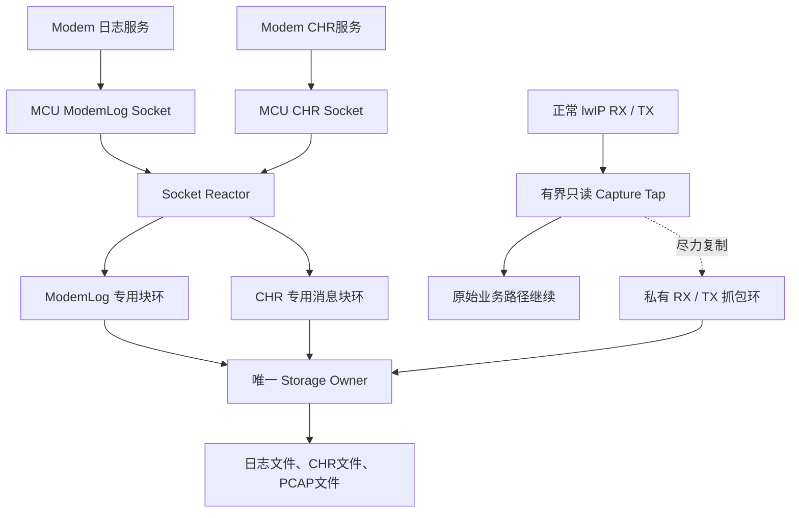

## 2. Socket Reactor fair reception

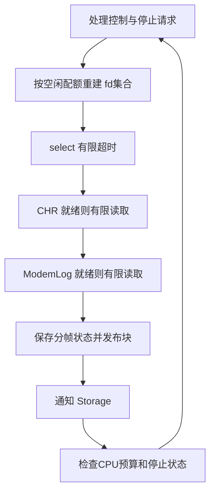

## 3. Capture Tap failure release process

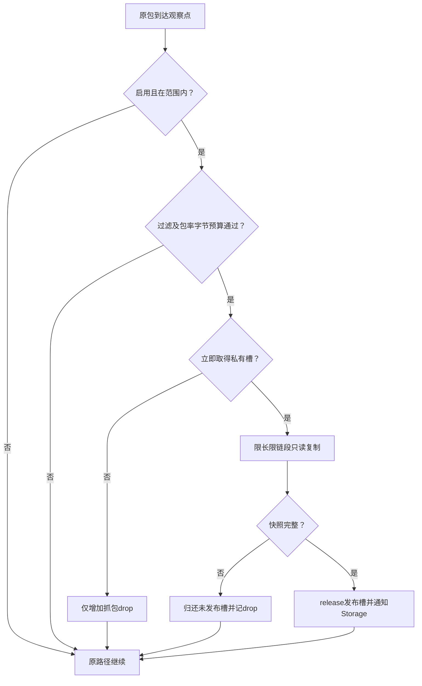

## 4. Slot ownership status

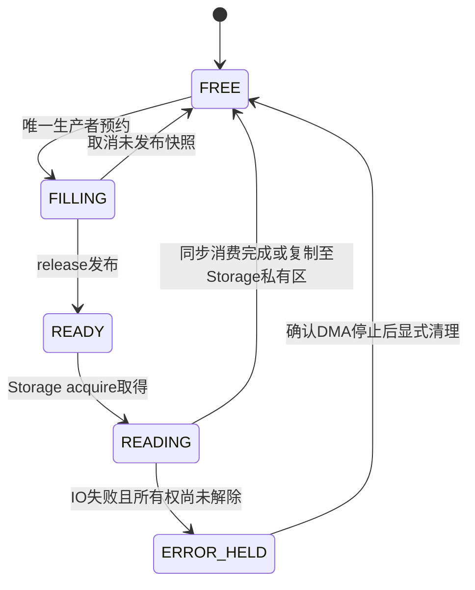

## 5. Routing boundary between public network and core

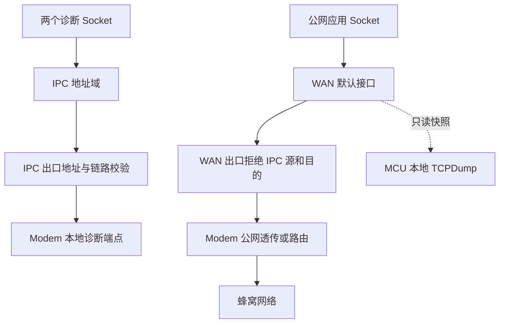

## 6. Specify business to stop safely

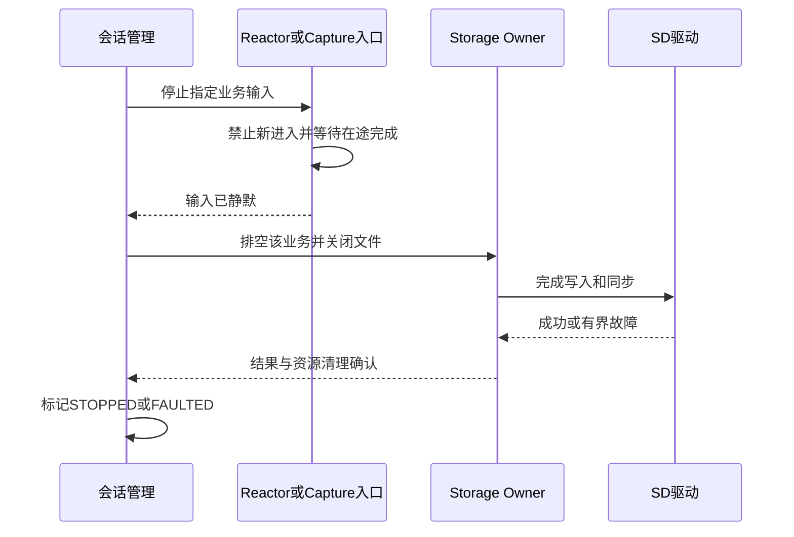

## 7. Timing of RX and TX normal messages and packet capture copies

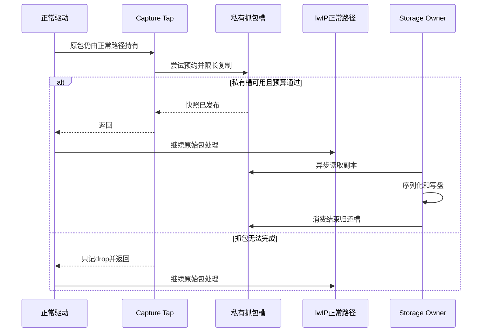

## 8. Business retreat when storage is overloaded

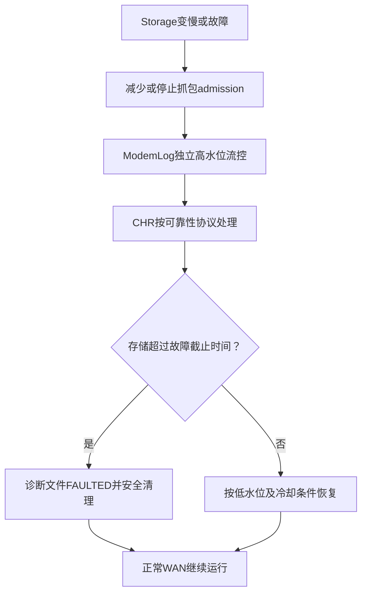

## 9. Session state instead of thread life cycle

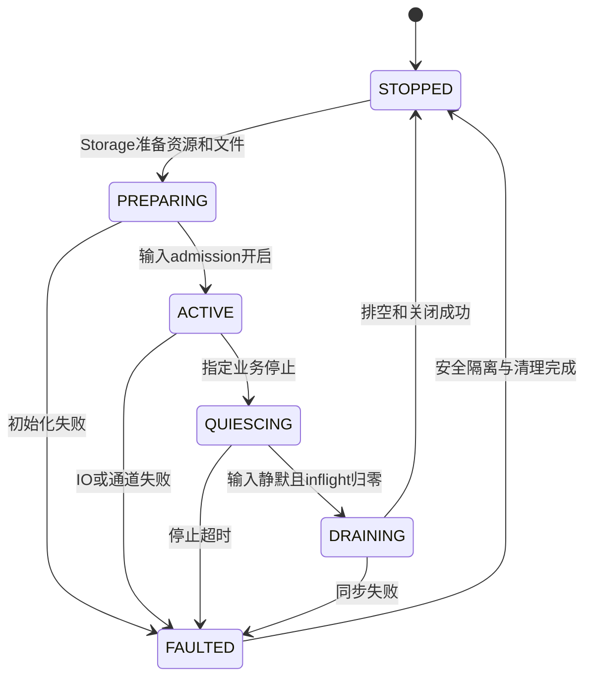

## key reading constraints

- If the packet capture fails, only the copy will be lost and the original packet will continue; this is not a zero CPU overhead guarantee.
- The two application tasks are Socket Reactor and Storage Owner, which do not include existing lwIP/driver/RTOS tasks.
- Capture RX/TX may be concurrent; use independent private slots and non-spin try-guard, do not hold normal network pbuf for a long time.
- Storage consumes and manages FIL in a single way. When the original buffer can be reused and when it is persisted are different events.
- The RX/TX interface layer, offload, PCAP LinkType and actual calling context are subject to [main scheme] (01-diagnostics-unified-design.md).

## 10. C++ modules and execution context

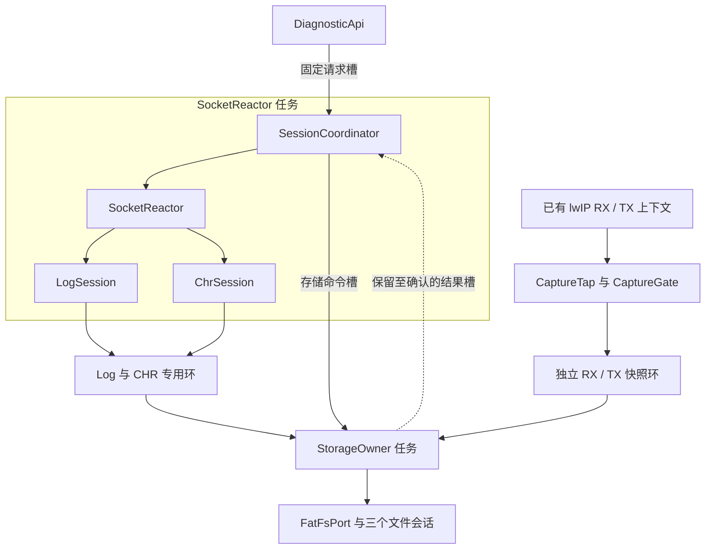

## 11. C++ starts interaction asynchronously

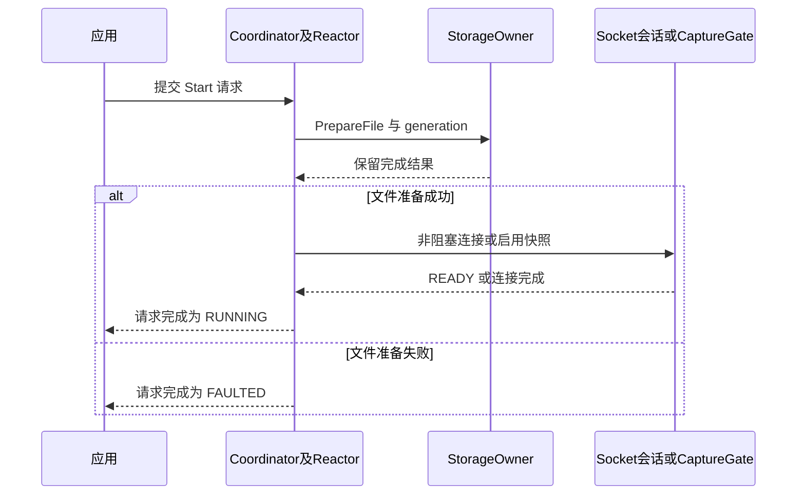

## 12. CHR persistence confirmation interaction

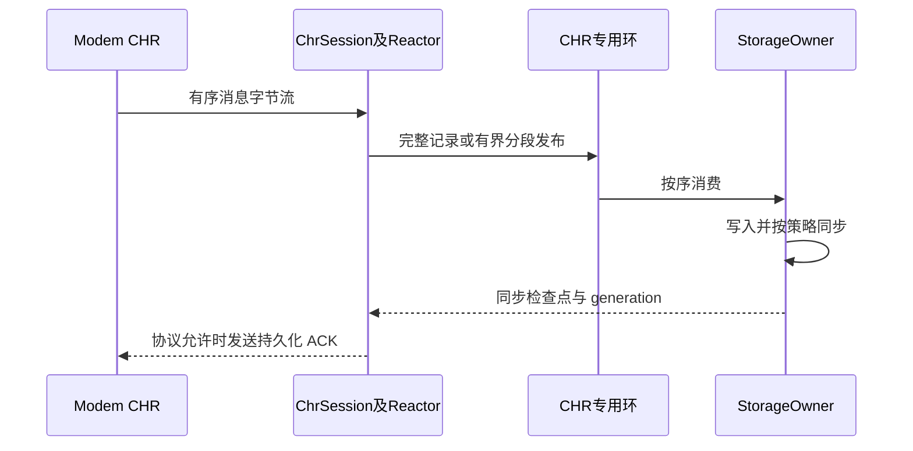

