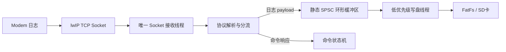
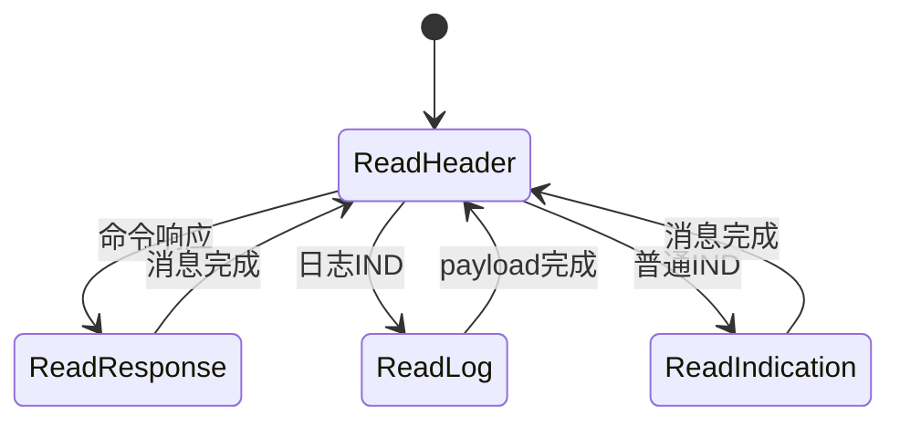
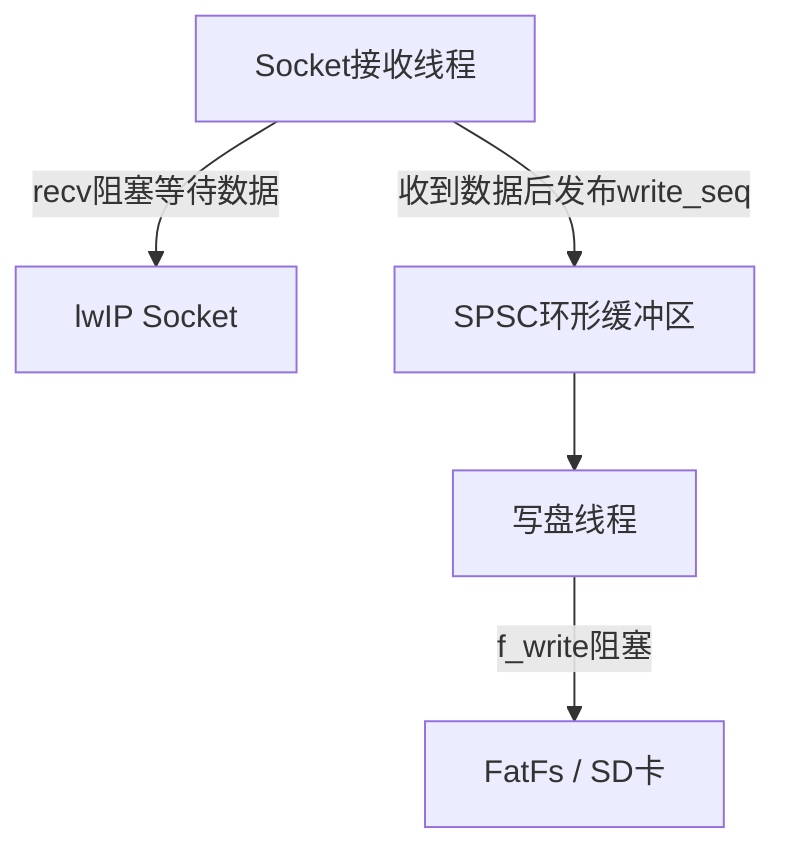

# STM32 + lwIP Modem 高速日志低资源写盘设计

> **历史设计，非当前实施基线。** 请先阅读[统一方案](diagnostics-unified-design.md)与[修订流程图](modem-complete-mermaid-flows.md)。
>
> 本页只覆盖早期单Socket模型。volatile/DMB不是通用C并发方案；环满不能与recv返回0混同；f_write、DMA缓冲复用与f_sync持久化检查点不是同一事件。以下代码仅供历史追溯。


## 1. 问题背景

系统运行在 STM32 上，应用通过 lwIP Socket 与 Modem 通信。除普通命令响应外，Modem 会主动发送日志 IND，持续速率约为 **1 Mbps**。这些数据需要可靠写入文件，而系统的 RAM、线程和 CPU 资源有限。

> 必须首先确认单位：
>
> - **1 Mbps（Mbit/s）≈ 125 KB/s**
> - **1 MB/s ≈ 8 Mbps**
>
> 两者所需缓冲区相差约 8 倍。

## 2. 设计目标

- Socket 接收路径不能被文件系统长时间阻塞。
- 不为数据块动态申请和释放内存。
- 不为每个缓冲块创建锁、信号量或状态机。
- 同一个 Socket 始终只有一个线程调用 `recv()`。
- 写盘尽量使用连续、对齐的大块写入。
- 缓冲区满、存储异常和日志丢失必须可观测。
- 在线程数量与可靠性之间取得最小可行平衡。

## 3. 推荐架构

采用：

1. **唯一 Socket 接收线程**：复用现有通信接收线程。
2. **一个低优先级写盘线程**：也可以复用系统已有的存储工作线程。
3. **静态 SPSC 环形缓冲区**：单生产者、单消费者，无动态内存。
4. **Task Notification**：只通知“有数据”，不通过消息队列复制日志。
5. **批量写盘**：使用 FatFs 将连续数据直接写入存储。



这只需要一个额外执行上下文。如果系统已有统一存储线程，则不需要新增线程。

## 4. 为什么不建议在 Socket 线程直接写文件

下面这种单线程实现占用资源最少，但不够可靠：

```c
recv(sock, buffer, sizeof(buffer), 0);
f_write(&file, buffer, size, &written);
```

`f_write()` 可能因为以下原因阻塞几十到几百毫秒：

- SD 卡内部擦除或垃圾回收；
- FAT 表更新；
- 文件扩展和跨簇写入；
- 存储 DMA 等待；
- `f_sync()` 刷盘。

写盘阻塞期间不能继续调用 `recv()`。TCP最终会通过接收窗口形成背压，但 lwIP 和 Modem 的缓存都有限，过长停顿可能导致超时、Modem端溢出或日志中断。

因此需要用一个**有界静态缓冲区**解耦接收和写盘。

## 5. 最省资源的数据结构

### 5.1 首选：SPSC 字节环形缓冲区

如果日志使用独立 Socket，或者协议解析后进入连续日志 payload 阶段，推荐使用字节环形缓冲区。它不需要每块长度字段，`recv()` 可以直接写入空闲区域，`f_write()` 可以直接读取连续区域，不发生二次复制。

```c
#include <stdatomic.h>
#include <stdint.h>

#define LOG_RING_SIZE  (64U * 1024U)   /* 必须是2的幂 */
#define LOG_RING_MASK  (LOG_RING_SIZE - 1U)

typedef struct {
    _Alignas(32) uint8_t data[LOG_RING_SIZE];
    _Atomic uint32_t write_seq;  /* 仅生产者写 */
    _Atomic uint32_t read_seq;   /* 仅消费者写 */
} log_ring_t;

static log_ring_t g_log_ring;
```

索引使用单调递增序号，只有访问数组时才取模：

```c
used = write_seq - read_seq;
free = LOG_RING_SIZE - used;

write_pos = write_seq & LOG_RING_MASK;
read_pos  = read_seq  & LOG_RING_MASK;
```

无须维护 `READING/WRITING/DONE` 等块状态：

- 生产者写完数据后，以 release 语义更新 `write_seq`；
- 消费者读取 `write_seq` 时使用 acquire 语义；
- 消费者写盘完成后，以 release 语义更新 `read_seq`；
- 生产者读取 `read_seq` 时使用 acquire 语义。

### 5.2 备选：固定块环形缓冲区

如果日志消息必须保持帧边界，或协议解析结果需要携带实际长度，可以使用固定块：

```c
#define LOG_BLOCK_SIZE   4096U
#define LOG_BLOCK_COUNT  16U

typedef struct {
    uint16_t len;
    uint8_t data[LOG_BLOCK_SIZE];
} log_block_t;

typedef struct {
    log_block_t blocks[LOG_BLOCK_COUNT];
    _Atomic uint32_t write_seq;
    _Atomic uint32_t read_seq;
} log_block_ring_t;
```

固定块方案更容易实现，但每块多一个长度字段，而且跨块批量写入通常需要多次 `f_write()`。

## 6. 字节环形缓冲区核心代码

### 6.1 生产者：Socket 接收线程

```c
static int log_ring_recv(int sock, log_ring_t *ring)
{
    uint32_t write_seq =
        atomic_load_explicit(&ring->write_seq, memory_order_relaxed);
    uint32_t read_seq =
        atomic_load_explicit(&ring->read_seq, memory_order_acquire);

    uint32_t used = write_seq - read_seq;
    uint32_t free_size = LOG_RING_SIZE - used;

    if (free_size == 0U) {
        return 0;
    }

    uint32_t pos = write_seq & LOG_RING_MASK;
    uint32_t contiguous = LOG_RING_SIZE - pos;

    if (contiguous > free_size) {
        contiguous = free_size;
    }

    int received = recv(sock, &ring->data[pos], contiguous, 0);

    if (received > 0) {
        atomic_store_explicit(
            &ring->write_seq,
            write_seq + (uint32_t)received,
            memory_order_release);

        xTaskNotifyGive(log_writer_task_handle);
    }

    return received;
}
```

### 6.2 消费者：写盘线程

```c
static FRESULT log_ring_flush_once(FIL *file, log_ring_t *ring)
{
    uint32_t read_seq =
        atomic_load_explicit(&ring->read_seq, memory_order_relaxed);
    uint32_t write_seq =
        atomic_load_explicit(&ring->write_seq, memory_order_acquire);

    uint32_t used = write_seq - read_seq;

    if (used == 0U) {
        return FR_OK;
    }

    uint32_t pos = read_seq & LOG_RING_MASK;
    uint32_t contiguous = LOG_RING_SIZE - pos;

    if (contiguous > used) {
        contiguous = used;
    }

    UINT written = 0;
    FRESULT result =
        f_write(file, &ring->data[pos], contiguous, &written);

    if ((result == FR_OK) && (written > 0U)) {
        atomic_store_explicit(
            &ring->read_seq,
            read_seq + written,
            memory_order_release);
    }

    if ((result == FR_OK) && (written != contiguous)) {
        return FR_DISK_ERR;
    }

    return result;
}
```

### 6.3 写盘线程

```c
void log_writer_task(void *argument)
{
    TickType_t last_sync = xTaskGetTickCount();

    while (logging_enabled ||
           atomic_load(&g_log_ring.read_seq) !=
           atomic_load(&g_log_ring.write_seq)) {

        ulTaskNotifyTake(pdTRUE, pdMS_TO_TICKS(100));

        while (atomic_load(&g_log_ring.read_seq) !=
               atomic_load(&g_log_ring.write_seq)) {

            FRESULT result =
                log_ring_flush_once(&log_file, &g_log_ring);

            if (result != FR_OK) {
                log_storage_error_count++;
                handle_storage_error(result);
                break;
            }
        }

        if ((xTaskGetTickCount() - last_sync) >=
            pdMS_TO_TICKS(2000)) {
            f_sync(&log_file);
            last_sync = xTaskGetTickCount();
        }
    }

    f_sync(&log_file);
}
```

## 7. 原子操作与锁

在严格 SPSC 模型中，不需要互斥锁，也不需要锁住整个缓冲区：

- `write_seq` 只有接收线程修改；
- `read_seq` 只有写盘线程修改；
- 两侧只读取对方发布的序号。

优先使用 C11 acquire/release 原子操作。对于不方便使用 C11 atomics 的单核 STM32：

- 保证序号是 32 位对齐访问；
- 发布索引前执行 `__DMB()`；
- 或用极短临界区保护索引读写；
- 不要在临界区内调用 `recv()` 或 `f_write()`。

仅使用 `volatile` 不能完整表达跨线程的内存顺序。

## 8. 同一个 Socket 的协议分流

同一个 Socket 不能由两个线程同时调用 `recv()`：

- 一个线程等待命令响应；
- 另一个线程读取日志 IND。

否则两个线程可能抢到对方的数据，而且 TCP 是字节流，一次 `recv()` 不对应一条完整消息。

必须使用唯一接收线程和增量解析状态机：



解析时必须处理：

- 半个协议头；
- 一个 `recv()` 中包含多条消息；
- 消息跨越多个 `recv()`；
- 日志 payload 跨环形缓冲区尾部；
- 命令响应与日志 IND 交错。

如果 Modem 能提供独立日志 Socket，应优先将控制和日志分离。

## 9. 缓冲区容量计算

基本公式：

[
BufferSize \ge DataRate \times MaxStorageStall + BurstMargin
]

建议根据实际测得的“存储最大停顿时间”选择容量，而不是只看平均写速率。

| 输入速率 | 最大写盘停顿 | 理论最低缓冲 | 建议容量 |
|---|---:|---:|---:|
| 1 Mbit/s ≈ 125 KB/s | 100 ms | 12.5 KB | 32 KB |
| 1 Mbit/s ≈ 125 KB/s | 300 ms | 37.5 KB | 64 KB |
| 1 Mbit/s ≈ 125 KB/s | 500 ms | 62.5 KB | 128 KB |
| 1 MB/s | 100 ms | 100 KB | 128 KB |
| 1 MB/s | 300 ms | 300 KB | 512 KB |

如果 RAM 非常紧张，应首先测量 SD 卡最坏延迟，并考虑降低 Modem 日志等级，而不是盲目压缩缓冲区。

## 10. 缓冲区满时的策略

### TCP

优先级从高到低：

1. 使用 Modem 协议提供的 PAUSE/RESUME 流控；
2. 环形缓冲区接近满时暂停读取，让 TCP 接收窗口产生背压；
3. 设置最大等待时间，超时后记录丢失计数；
4. 必要时降低日志等级或停止抓取。

注意：暂停 `recv()` 只能把压力转移到 lwIP 和 Modem，不能创造无限缓存。

### UDP

UDP没有可靠背压。缓冲区满时必须明确选择：

- 丢弃新数据并记录 `dropped_bytes`；
- 或覆盖最旧数据以保留最新日志。

默认建议丢弃新数据并在文件中写入 gap 记录，便于离线分析发现缺口。

## 11. FatFs 与存储优化

- 日志缓冲区全部静态分配；
- 写入地址按 DMA/Cache 要求对齐；
- 写入粒度至少 4 KB，推荐 16～64 KB；
- 抓取开始前创建文件并尽可能预分配连续空间；
- 若启用 `FF_USE_EXPAND`，可使用 `f_expand()`；
- 不要每个数据块调用 `f_sync()`；
- 建议每 1～5 秒或停止日志时同步一次；
- 文件按 32 MB、64 MB 或 128 MB 滚动；
- 文件系统操作只由一个线程执行，避免 FatFs 重入锁；
- 使用 SDMMC + DMA 时，注意 D-Cache clean/invalidate；
- 统计短写、写盘错误、最大写延迟和缓冲区高水位。

## 12. 推荐初始配置

对于真正的 **1 Mbit/s（125 KB/s）**：

```text
环形缓冲区：64 KB
Socket接收线程：复用现有线程
写盘线程：1个，低优先级
写盘线程栈：1～2 KB，按实际栈水位校准
通知：FreeRTOS Task Notification
写入粒度：尽可能连续写入，目标16～32 KB
f_sync周期：2秒
文件滚动：64 MB
满缓冲策略：优先Modem流控，其次TCP背压
```

如果实测存在 500 ms 以上存储停顿，将缓冲区提高到 128 KB，或更换延迟更稳定的存储介质。

## 13. 必须监控的指标

```c
typedef struct {
    uint64_t received_bytes;
    uint64_t written_bytes;
    uint64_t dropped_bytes;
    uint32_t overflow_count;
    uint32_t socket_error_count;
    uint32_t storage_error_count;
    uint32_t short_write_count;
    uint32_t max_ring_used;
    uint32_t max_write_latency_ms;
} modem_log_stats_t;
```

建议通过调试命令周期性输出：

- 当前/最大缓冲区占用；
- 总接收与总写入字节数；
- 丢失字节数；
- 最大单次写盘延迟；
- Socket、文件系统和 SD 卡错误；
- 写盘线程最小剩余栈空间。

## 14. 验证方案

至少进行以下测试：

1. 连续抓取 30 分钟、2 小时和 24 小时；
2. 人工制造 100 ms、300 ms、500 ms 写盘停顿；
3. 检查 TCP 窗口收缩后 Modem 是否能正常恢复；
4. 制造文件系统短写和磁盘满；
5. 日志与命令响应高频交错；
6. 环形缓冲区指针跨越尾部；
7. 文件滚动期间日志持续输入；
8. 断电重启后检查文件可恢复范围；
9. 校验接收字节数、写入字节数和文件长度；
10. 监控 CPU 占用、线程栈高水位和环形缓冲区高水位。

## 15. Socket 与文件写入同时可能阻塞的处理

### 15.1 核心原则

Socket 的 `recv()` 和 FatFs 的 `f_write()` 都可能阻塞。设计目标不是强行消除所有阻塞，而是：

> **让两个阻塞发生在不同线程，并给每个可能永久等待的路径设置超时、统计和恢复策略。**

| 线程 | 允许阻塞的位置 | 阻塞期间另一线程 |
|---|---|---|
| Socket接收线程 | `recv()`、等待缓冲区空间 | 写盘线程继续清空缓冲区 |
| 写盘线程 | 等待任务通知、`f_write()`、`f_sync()` | Socket线程继续接收数据 |



两个线程之间不能持有公共大锁，文件系统驱动也不能在写盘期间长时间关闭中断。

### 15.2 Socket 使用阻塞模式，但设置接收超时

没有数据时，阻塞式 `recv()` 会让任务休眠，比非阻塞轮询更节省 CPU。建议使用阻塞 Socket 配合有限接收超时：

```c
struct timeval timeout = {
    .tv_sec  = 0,
    .tv_usec = 200 * 1000,
};

setsockopt(sock,
           SOL_SOCKET,
           SO_RCVTIMEO,
           &timeout,
           sizeof(timeout));
```

接收循环：

```c
int ret = recv(sock, buffer, size, 0);

if (ret > 0) {
    process_received_data(buffer, (uint32_t)ret);
} else if (ret == 0) {
    handle_socket_closed();
} else if ((errno == EWOULDBLOCK) ||
           (errno == EAGAIN)) {
    check_stop_request();
    check_modem_state();
} else {
    handle_socket_error(errno);
}
```

持续有日志数据时，`recv()` 通常立即返回。设置超时主要用于退出、重连、状态检查和故障恢复。

如果系统使用 `send()` 向 Modem 发送控制命令，也应设置 `SO_SNDTIMEO`，避免远端停止读取后发送线程永久阻塞。

### 15.3 直接接收到环形缓冲区时的所有权

生产者可以先定位空闲区域，再直接把该地址传给 `recv()`。即使 `recv()` 阻塞也不会破坏所有权，因为新数据尚未通过 `write_seq` 发布：

```c
uint8_t *destination = &ring->data[write_pos];

/* 可能阻塞，但该区域尚未对消费者可见 */
int received = recv(sock,
                    destination,
                    contiguous_free,
                    0);

if (received > 0) {
    /* recv完成后才把所有权发布给消费者 */
    atomic_store_explicit(
        &ring->write_seq,
        write_seq + (uint32_t)received,
        memory_order_release);

    xTaskNotifyGive(log_writer_task_handle);
}
```

写盘线程只处理已发布到 `write_seq` 之前的数据。

### 15.4 写盘完成前不能归还缓冲区

`f_write()` 返回成功且实际写入长度正确后，消费者才能推进 `read_seq`：

```c
UINT written = 0;
FRESULT result = f_write(file,
                         &ring->data[read_pos],
                         contiguous_used,
                         &written);

if ((result == FR_OK) &&
    (written == contiguous_used)) {
    atomic_store_explicit(
        &ring->read_seq,
        read_seq + written,
        memory_order_release);
}
```

如果底层 `disk_write()` 使用 DMA，它必须等待 DMA 完成后才能返回。下面这种实现是错误的：

```c
HAL_SD_WriteBlocks_DMA(...);
return RES_OK;  /* 错误：DMA可能仍在读取环形缓冲区 */
```

否则 `f_write()` 返回后，Socket线程可能覆盖仍被 DMA 使用的区域。

资源最少且安全的实现，是让 `disk_write()` 同步等待 DMA 完成：

```c
DRESULT disk_write(...)
{
    HAL_SD_WriteBlocks_DMA(...);

    if (xSemaphoreTake(sd_done_sem,
                       pdMS_TO_TICKS(500))
        != pdTRUE) {
        sd_timeout_count++;
        abort_sd_transfer();
        reset_sd_controller();
        return RES_ERROR;
    }

    return RES_OK;
}
```

如果未来改成完全异步写盘，必须增加 `IN_FLIGHT` 所有权状态或独立 DMA 缓冲区，资源消耗和实现复杂度都会增加。

### 15.5 环形缓冲区满时

缓冲区满表示存储在某段时间内跟不上日志输入。建议按水位分级处理：

| 缓冲区占用 | 动作 |
|---:|---|
| 小于75% | 正常接收与写盘 |
| 75%以上 | 立即唤醒写盘线程，减少调度延迟 |
| 90%以上 | 如果支持，通知Modem暂停或降低日志等级 |
| 100% | 暂停 `recv()`，利用TCP窗口背压 |
| 超过最大允许时间 | 停止抓取或按策略丢弃，并记录缺口 |

```c
while (log_ring_free(&ring) == 0U) {
    if (wait_for_ring_space(pdMS_TO_TICKS(200))
        == WAIT_TIMEOUT) {

        request_modem_log_pause_if_supported();

        if (storage_failed_too_long()) {
            stop_log_capture();
            break;
        }
    }
}
```

如果日志和命令响应共用同一 Socket，停止 `recv()` 也会阻塞命令响应。此时应优先：

1. 为日志使用独立 Socket；
2. 使用 Modem 的 PAUSE/RESUME 流控；
3. 降低日志等级；
4. 为控制消息预留独立处理能力。

### 15.6 线程优先级

推荐相对优先级：

```text
Modem Socket RX：高
Log Writer：比RX低一级
普通后台任务：低于Writer
Idle：最低
```

写盘线程不能设置得过低，否则可能长期得不到调度，最终把环形缓冲区填满。

### 15.7 每个阻塞点都应有边界

| 阻塞操作 | 推荐处理 |
|---|---|
| `recv()` | 100～500 ms超时 |
| `send()` | 100～500 ms超时 |
| 等待环形空间 | 每100～200 ms检查一次，并设置累计上限 |
| SD DMA完成等待 | 根据实测设置，例如500 ms |
| `f_write()` | 由底层 `disk_write()` 保证硬件超时 |
| `f_sync()` | 底层磁盘操作同样必须有超时 |
| 等待任务通知 | 可以长等待，但退出流程必须主动唤醒 |

最终约束是：

> **Socket可以阻塞，文件写入也可以阻塞，但不能在同一个线程中相互串联；写盘真正完成前不能归还缓冲区；所有网络与硬件永久等待风险都必须有超时和恢复路径。**

## 16. 最终结论

资源最少且具备工程可靠性的方案是：

> **唯一 Socket 接收者 + 静态无锁 SPSC 环形缓冲区 + 一个可复用的低优先级存储工作线程 + 批量 FatFs 写入。**

若日志是独立连续字节流，优先使用字节环形缓冲区；若必须保持消息边界，则使用固定块环形缓冲区。不要让多个线程同时读取同一个 Socket，也不要在 Socket 接收路径直接执行可能长时间阻塞的文件系统操作。
