# Modem 系统完整 Mermaid 流程图

本文统一描述 MCU、Modem、lwIP双网络域、三种独立诊断通道、动态处理、存储所有权、路由选择和安全停机流程。

## 1. Modem 与 MCU 双网络域

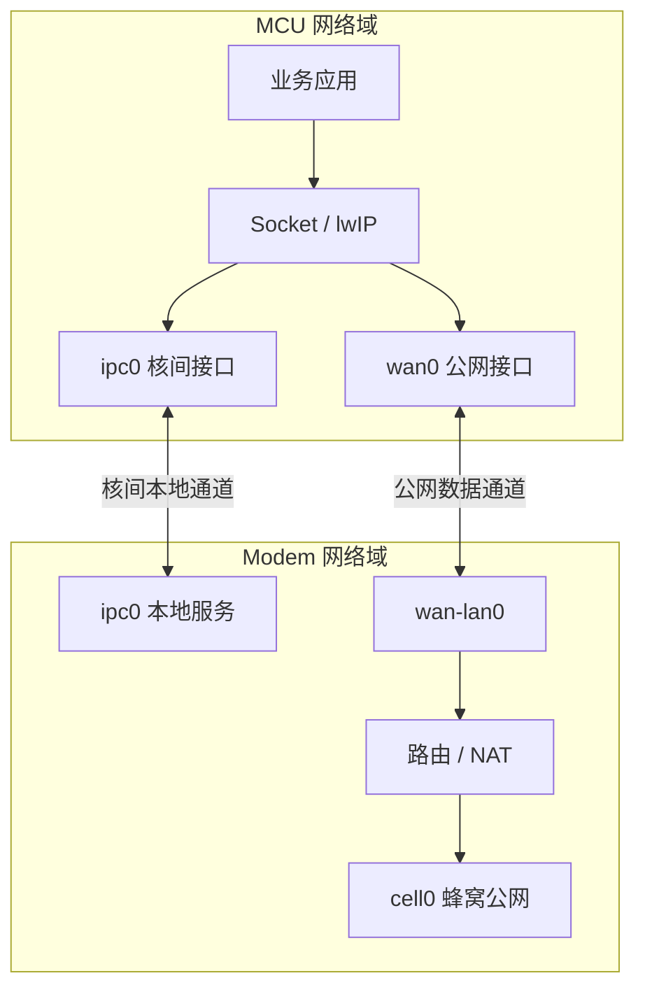

关键约束：

- `ipc0`没有默认网关；
- 只有`wan0`是MCU默认路由；
- IPC服务绑定确定的IPC地址，不能绑定`INADDR_ANY`；
- Modem只允许`wan-lan0`与`cell0`之间进行受控转发/NAT；
- IPC接口故障时必须失败，不能回退到公网接口。

## 2. MCU的lwIP路由选择

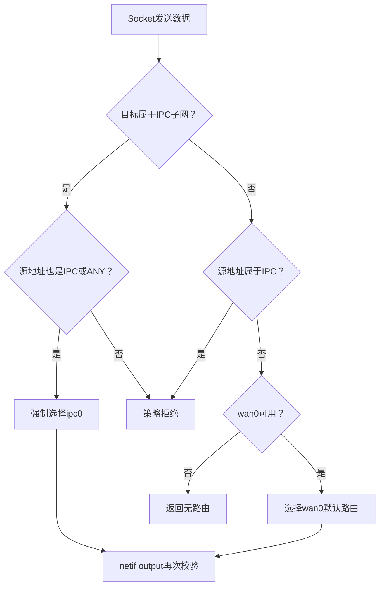

## 3. 三业务独立通道数据流

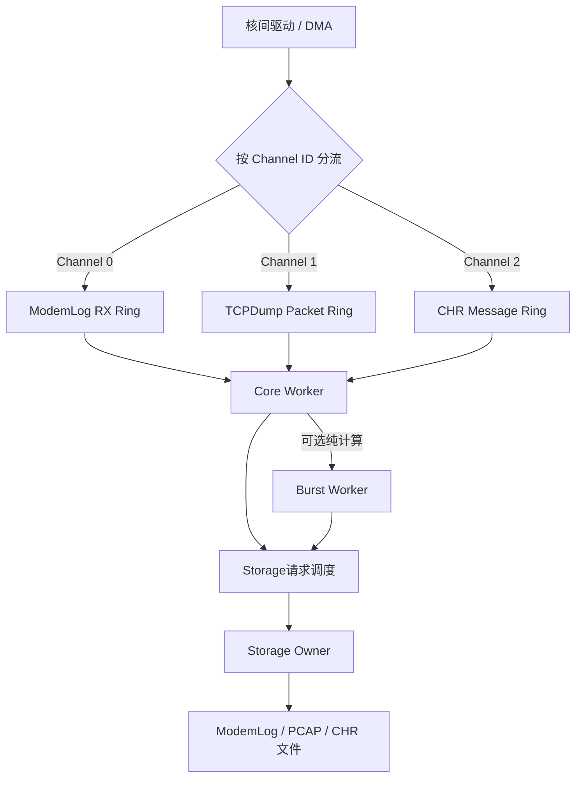

三种业务必须具备独立：

- 通道ID；
- RX Ring；
- credit和描述符配额；
- 高低水位；
- 丢弃或暂停策略；
- 统计信息。

## 4. 核间接收和调度

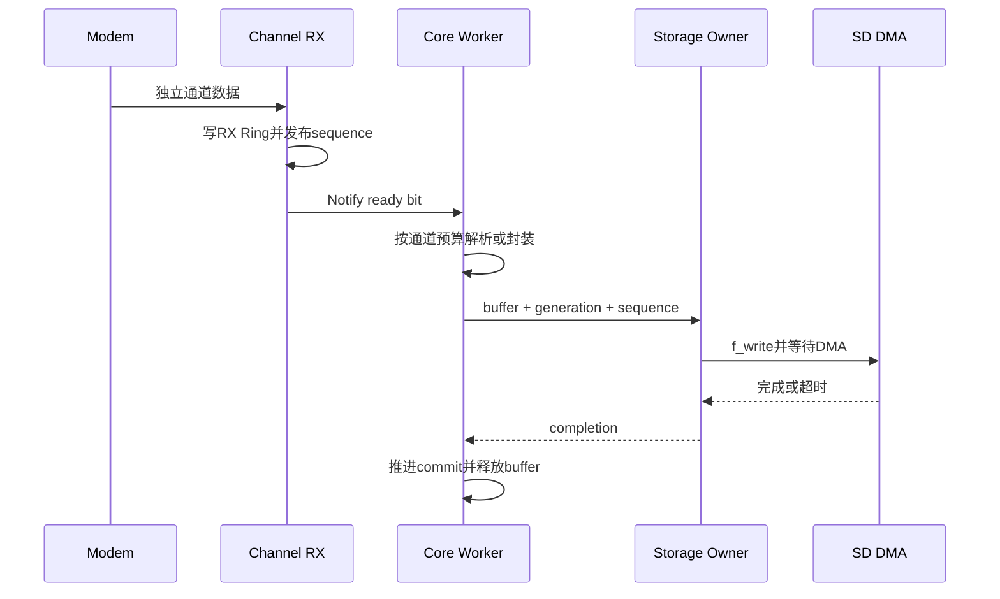

## 5. Core Worker公平调度

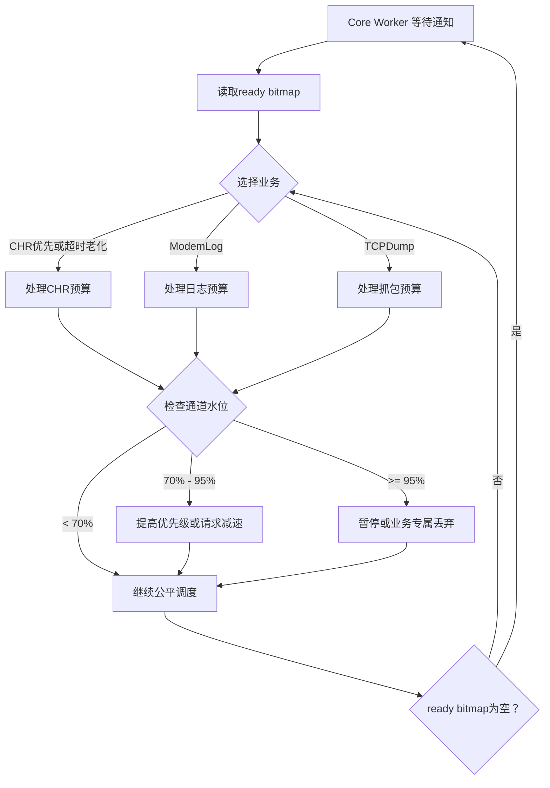

## 6. 物理IPC链路仲裁

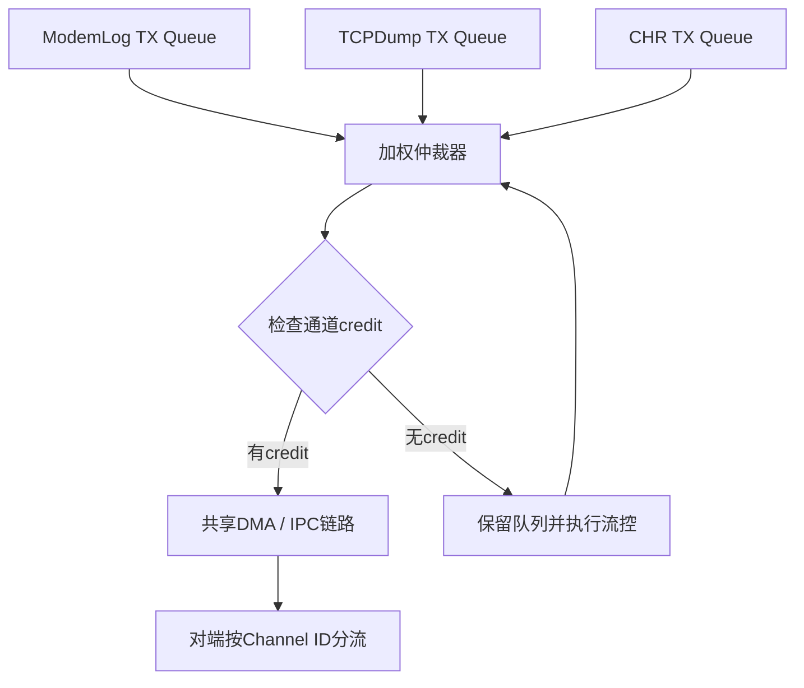

独立逻辑通道必须继续落实到物理层描述符和credit，否则大流量ModemLog仍会造成队头阻塞。

## 7. Socket与文件阻塞隔离

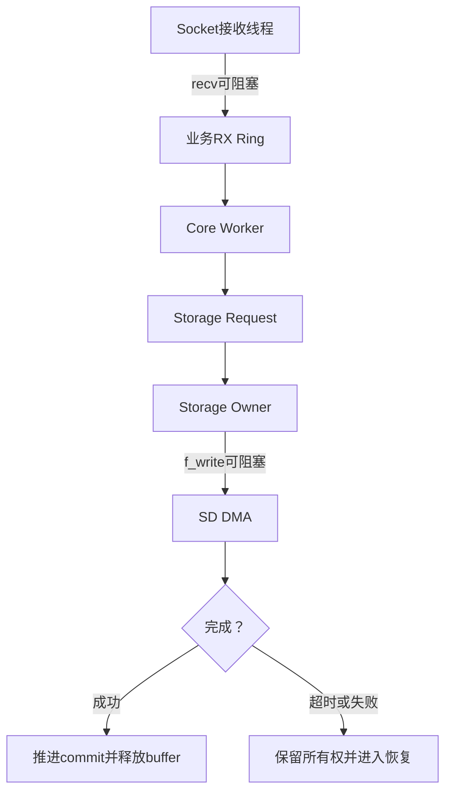

`recv()`和`f_write()`可以阻塞，但必须位于不同执行上下文，且所有永久等待风险必须有超时。

## 8. 业务安全停止

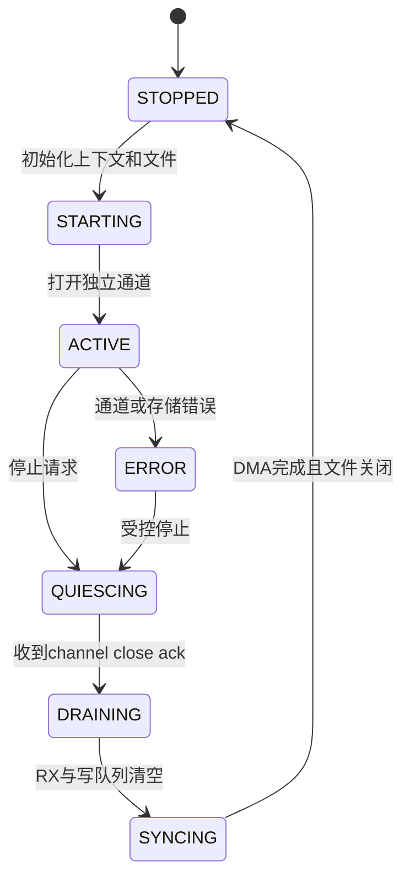

## 9. 安全停止时序

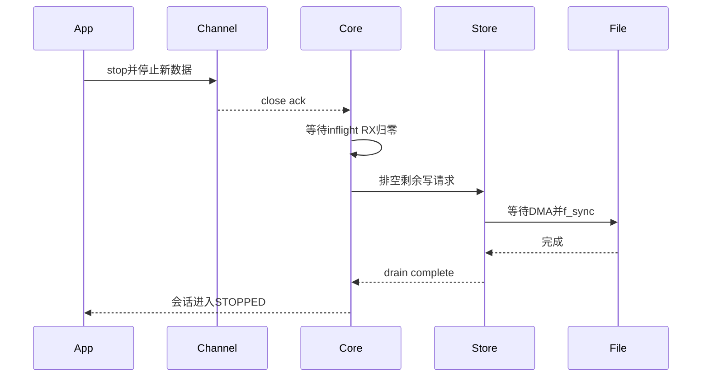

## 10. 线程生命周期

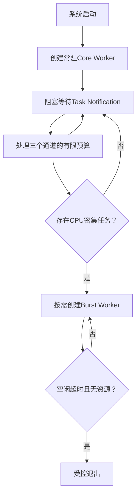

常驻Core Worker已经实现三种业务共享一份栈。不要删除它。只有不拥有Socket、通道、文件、DMA和协议状态的Burst Worker可以受控退出。

## 11. 最终架构

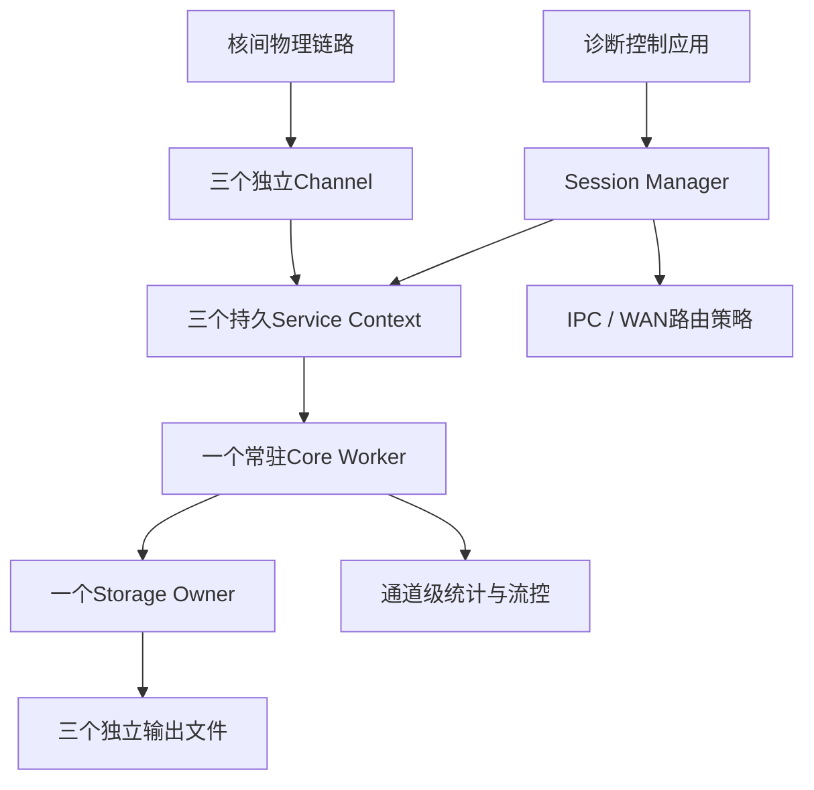

最终原则：

> 三个独立通道和持久业务上下文保证连续性；Core Worker负责公平串行调度；Storage Owner保证文件和DMA所有权；线程变化不能影响通道、协议和文件状态。
