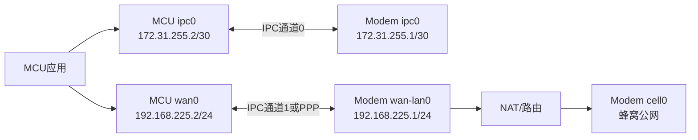
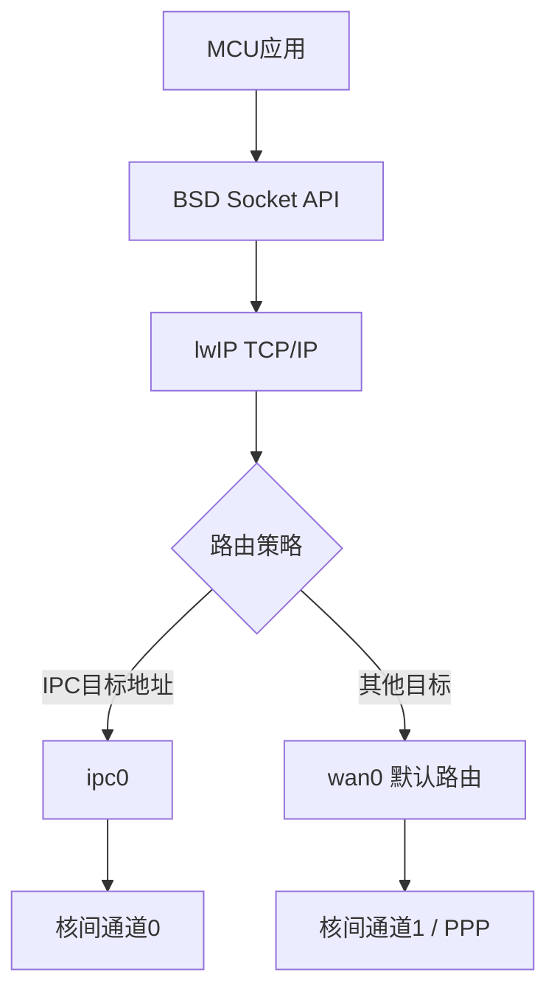
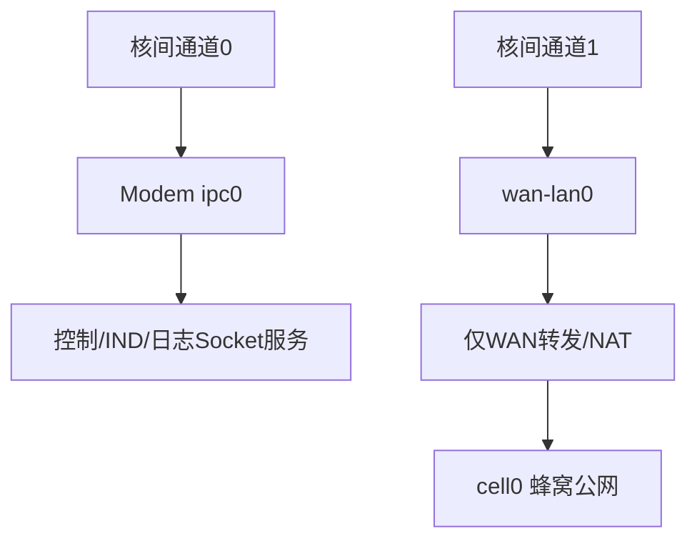

# Modem 与 MCU 双网络域通信设计

## 1. 需求

Modem 与 MCU 之间通过核间链路通信，上层希望继续使用 Socket/lwIP API。同时系统还需要通过 Modem 访问公网。

必须保证：

- 核间控制、IND、日志数据只经过核间链路；
- 核间报文绝不从公网网卡发出；
- 公网数据仍能正常经过 Modem 蜂窝链路；
- 即使 IPC 接口掉线、地址冲突或应用绑定错误，也不能把 IPC 流量回退到公网；
- 两类数据即使共用同一片共享内存或同一物理总线，也必须逻辑隔离。

## 2. 总体结论

在 MCU 和 Modem 两侧都建立两个逻辑网络接口：

- `ipc0`：核间通信专用 netif；
- `wan0`：MCU 公网数据接口；
- Modem侧另外有 `cell0`：蜂窝公网出口。



即使 `ipc0` 和 `wan0` 底层共用同一共享内存、SPI或核间消息通道，上层也要注册为两个独立 `struct netif`，底层帧头使用 `channel_id` 分流。

## 3. 地址与路由规划

示例地址：

| 侧 | 接口 | 地址 | 网关 | 用途 |
|---|---|---|---|---|
| MCU | `ipc0` | `172.31.255.2/30` | 无 | 核间Socket |
| Modem | `ipc0` | `172.31.255.1/30` | 无 | 核间服务 |
| MCU | `wan0` | `192.168.225.2/24` | `192.168.225.1` | 公网数据 |
| Modem | `wan-lan0` | `192.168.225.1/24` | 无 | MCU公网接入 |
| Modem | `cell0` | 运营商分配 | 运营商网关 | 蜂窝公网出口 |

地址只是示例，量产前必须确认不会与蜂窝侧、VPN、客户局域网或设备其他接口重叠。

关键规则：

1. `ipc0` 不配置默认网关；
2. 只有 `wan0` 是 MCU 的默认 netif；
3. Modem 只对 `wan-lan0 -> cell0` 做转发/NAT；
4. Modem 不转发、不NAT `ipc0`；
5. IPC服务只绑定 `172.31.255.1`，不能绑定 `INADDR_ANY`；
6. IPC客户端只连接固定数字地址，不经过DNS。

## 4. MCU侧架构



### 4.1 MCU职责

- 维护 `ipc0` 与 `wan0` 两个独立 netif；
- 目的地址属于IPC子网时强制选择 `ipc0`；
- 普通公网目的地址选择 `wan0`；
- 禁止源地址为IPC地址的报文从 `wan0` 发出；
- 禁止WAN侧收到的伪造IPC源地址报文进入本机；
- 分别统计两个通道的流量、错误和丢包；
- 公网接口故障不能影响IPC接口；
- IPC接口故障不能导致流量回退WAN。

### 4.2 MCU初始化示例

```c
static struct netif g_ipc_netif;
static struct netif g_wan_netif;

void network_init(void)
{
    ip4_addr_t ipc_ip;
    ip4_addr_t ipc_mask;
    ip4_addr_t no_gateway;

    IP4_ADDR(&ipc_ip,   172, 31, 255, 2);
    IP4_ADDR(&ipc_mask, 255, 255, 255, 252);
    ip4_addr_set_zero(&no_gateway);

    netif_add(&g_ipc_netif,
              &ipc_ip,
              &ipc_mask,
              &no_gateway,
              NULL,
              ipc_netif_init,
              tcpip_input);

    netif_set_up(&g_ipc_netif);
    netif_set_link_up(&g_ipc_netif);

    /* wan0按PPP、DHCP或静态地址方式初始化 */
    netif_add(&g_wan_netif,
              &wan_ip,
              &wan_mask,
              &wan_gateway,
              NULL,
              wan_netif_init,
              tcpip_input);

    netif_set_up(&g_wan_netif);
    netif_set_link_up(&g_wan_netif);

    /* 只有公网接口能成为默认路由 */
    netif_set_default(&g_wan_netif);
}
```

`lwipopts.h` 至少需要：

```c
#define LWIP_SINGLE_NETIF  0
#define LWIP_SOCKET        1
#define LWIP_NETCONN       1
```

## 5. Modem侧架构



### 5.1 Modem职责

- `ipc0` 只承载Modem本地服务；
- Socket服务绑定 `ipc0` 的确定地址；
- `wan-lan0` 只承载MCU公网数据；
- 只允许 `wan-lan0 <-> cell0` 转发；
- 明确禁止 `ipc0 <-> cell0` 转发；
- 明确禁止 `ipc0 <-> wan-lan0` 转发；
- IPC和WAN使用独立接收队列或至少独立通道ID；
- 公网拥塞不能堵塞控制和日志通道；
- IPC日志高流量不能耗尽WAN控制队列。

### 5.2 Modem Socket服务绑定

错误方式：

```c
server_addr.sin_addr.s_addr = PP_HTONL(INADDR_ANY);
```

它可能让服务同时暴露在IPC和WAN接口。

正确方式：

```c
ip4_addr_t ipc_server_ip;
IP4_ADDR(&ipc_server_ip, 172, 31, 255, 1);

server_addr.sin_family = AF_INET;
server_addr.sin_port = htons(MODEM_IPC_PORT);
server_addr.sin_addr.s_addr = ipc_server_ip.addr;

bind(server_fd,
     (struct sockaddr *)&server_addr,
     sizeof(server_addr));
```

## 6. 同一物理核间链路承载两个逻辑netif

底层核间帧增加最小通道头：

```c
typedef enum {
    IPC_CHANNEL_LOCAL = 0,
    IPC_CHANNEL_WAN   = 1,
} ipc_channel_id_t;

typedef struct {
    uint16_t magic;
    uint8_t  channel_id;
    uint8_t  flags;
    uint16_t payload_len;
    uint16_t checksum;
} ipc_frame_header_t;
```

接收分流：

```c
void ipc_rx_dispatch(const ipc_frame_header_t *header,
                     const void *payload)
{
    struct pbuf *p = build_pbuf(payload, header->payload_len);

    if (p == NULL) {
        stats.rx_no_memory++;
        return;
    }

    switch (header->channel_id) {
    case IPC_CHANNEL_LOCAL:
        g_ipc_netif.input(p, &g_ipc_netif);
        break;

    case IPC_CHANNEL_WAN:
        g_wan_netif.input(p, &g_wan_netif);
        break;

    default:
        pbuf_free(p);
        stats.rx_invalid_channel++;
        break;
    }
}
```

发送时，每个netif使用不同output函数或不同state参数：

```c
static err_t ipc_netif_output(struct netif *netif,
                              struct pbuf *p,
                              const ip4_addr_t *dest)
{
    if (!ip4_addr_net_eq(dest,
                         netif_ip4_addr(&g_ipc_netif),
                         netif_ip4_netmask(&g_ipc_netif))) {
        return ERR_RTE;
    }

    return ipc_channel_send(IPC_CHANNEL_LOCAL, p);
}

static err_t wan_netif_output(struct netif *netif,
                              struct pbuf *p,
                              const ip4_addr_t *dest)
{
    if (packet_has_ipc_source_or_destination(p, dest)) {
        stats.wan_ipc_leak_drop++;
        return ERR_RTE;
    }

    return ipc_channel_send(IPC_CHANNEL_WAN, p);
}
```

通道头不是安全边界。如果Modem或MCU一侧可能被攻破，还应增加通道鉴权、完整性校验和访问控制。

## 7. lwIP默认路由行为

lwIP的IPv4路由会遍历可用netif，先查找目的地址与接口地址/掩码匹配的接口；没有匹配时才回退到 `netif_default`。

因此在接口均正常、子网不重叠时：

- `172.31.255.1` 自动匹配 `ipc0`；
- 普通公网地址不匹配IPC子网，最终走默认 `wan0`。

但仅靠默认行为不够严格。若 `ipc0` down、地址未配置或初始化失败，IPC目的地址可能找不到直连接口，然后回退默认WAN。为了保证“绝不走公网”，必须增加路由Hook和出口检查。

## 8. 强制源/目的路由策略

在 `lwipopts.h` 中启用Hook文件：

```c
#define LWIP_HOOK_FILENAME "app/lwip_hooks.h"
```

`app/lwip_hooks.h`：

```c
#define LWIP_HOOK_IP4_ROUTE_SRC(src, dest) \
    app_ip4_route_src((src), (dest))

struct netif *app_ip4_route_src(const ip4_addr_t *src,
                                const ip4_addr_t *dest);
```

策略实现：

```c
static bool addr_is_ipc(const ip4_addr_t *addr)
{
    return ip4_addr_net_eq(
        addr,
        netif_ip4_addr(&g_ipc_netif),
        netif_ip4_netmask(&g_ipc_netif));
}

struct netif *app_ip4_route_src(const ip4_addr_t *src,
                                const ip4_addr_t *dest)
{
    bool dest_is_ipc = addr_is_ipc(dest);
    bool src_is_any =
        (src == NULL) || ip4_addr_isany(src);
    bool src_is_ipc =
        !src_is_any && addr_is_ipc(src);

    if (dest_is_ipc) {
        /* WAN源地址不能进入IPC通道 */
        if (!src_is_any && !src_is_ipc) {
            return &g_drop_netif;
        }

        /*
         * 即使ipc0当前down，也返回ipc0并让驱动报错，
         * 不能返回NULL后回退到默认WAN。
         */
        return &g_ipc_netif;
    }

    /* IPC源地址禁止访问任何非IPC目的地址 */
    if (src_is_ipc) {
        return &g_drop_netif;
    }

    if (netif_is_up(&g_wan_netif) &&
        netif_is_link_up(&g_wan_netif)) {
        return &g_wan_netif;
    }

    return NULL;
}
```

`g_drop_netif` 是一个output固定返回 `ERR_RTE` 的黑洞接口，用来表达“明确拒绝”。因为Hook返回 `NULL` 通常表示继续使用lwIP默认路由逻辑，不能代表禁止路由。

```c
static err_t drop_output(struct netif *netif,
                         struct pbuf *p,
                         const ip4_addr_t *dest)
{
    LWIP_UNUSED_ARG(netif);
    LWIP_UNUSED_ARG(p);
    LWIP_UNUSED_ARG(dest);

    stats.policy_route_drop++;
    return ERR_RTE;
}
```

不同lwIP版本和移植层对Hook声明位置可能不同，应根据项目实际版本检查 `ip4.c`、`opt.h` 与现有Hook配置。

## 9. Socket绑定规则

### 9.1 IPC客户端

```c
struct sockaddr_in local = {0};
struct sockaddr_in peer  = {0};

local.sin_family = AF_INET;
local.sin_port = 0;
local.sin_addr.s_addr = inet_addr("172.31.255.2");

bind(fd, (struct sockaddr *)&local, sizeof(local));

peer.sin_family = AF_INET;
peer.sin_port = htons(MODEM_IPC_PORT);
peer.sin_addr.s_addr = inet_addr("172.31.255.1");

connect(fd, (struct sockaddr *)&peer, sizeof(peer));
```

### 9.2 公网客户端

公网Socket可以绑定 `INADDR_ANY`，由默认WAN路由选择源地址；对安全要求更高时绑定 `wan0` 的IP。

不要假设所有lwIP移植都支持Linux的 `SO_BINDTODEVICE`。跨平台设计应以独立子网、源地址绑定、路由Hook和output出口检查为主。

## 10. 防止流量串线的四层保护

| 层次 | IPC保护 | WAN保护 |
|---|---|---|
| 应用层 | IPC服务绑定IPC地址 | 公网应用使用WAN地址/DNS |
| 路由层 | IPC目的强制 `ipc0` | 非IPC流量默认 `wan0` |
| netif输出层 | IPC接口拒绝非IPC目的 | WAN接口拒绝IPC源/目的 |
| 底层链路 | `IPC_CHANNEL_LOCAL` | `IPC_CHANNEL_WAN` |

接收方向也要检查：

- `wan0` 收到源地址属于IPC网段的包：丢弃；
- `ipc0` 收到源或目的地址不属于IPC网段的包：丢弃；
- 通道ID与IP地址域不匹配：丢弃并计数。

## 11. 转发配置

### MCU

如果MCU不是路由器：

```c
#define IP_FORWARD 0
```

这样MCU只处理本机Socket流量，不在两个netif之间转发。

### Modem

如果Modem需要将MCU的WAN流量转发到蜂窝接口，Modem侧可以启用转发，但必须应用矩阵：

| 入接口 | 出接口 | 结果 |
|---|---|---|
| `wan-lan0` | `cell0` | 允许并NAT |
| `cell0` | `wan-lan0` | 允许已建立连接的返回流量 |
| `ipc0` | `cell0` | 禁止 |
| `cell0` | `ipc0` | 禁止 |
| `ipc0` | `wan-lan0` | 禁止 |
| `wan-lan0` | `ipc0` | 禁止 |

如果Modem侧不是lwIP而是Linux，同样的逻辑应由独立接口、策略路由和防火墙实现。

## 12. 队列与资源隔离

仅有两个netif还不够。如果底层所有数据共用一个队列，1 Mbps日志仍可能堵塞公网或控制数据。

推荐：

- IPC控制/响应：最高优先级，小队列；
- IPC日志：中优先级，有界环形缓冲；
- WAN数据：普通优先级，独立队列；
- 每轮发送限制日志预算，避免日志独占链路；
- 为控制通道保留固定描述符和pbuf；
- 两个netif分别维护统计和流控。

调度示例：

```text
每轮：
1. 最多发送8个控制帧
2. 最多发送4个WAN帧
3. 最多发送2个日志帧
4. 若高优先级队列为空，可把剩余预算借给低优先级
```

具体配额应按公网时延、日志吞吐量和核间链路带宽实测调整。

## 13. 故障行为

| 故障 | 正确行为 |
|---|---|
| `ipc0` down | IPC Socket失败，不得走WAN |
| `wan0` down | 公网Socket失败，IPC继续工作 |
| `cell0`断网 | Modem本地IPC服务继续工作 |
| 日志队列满 | 暂停/丢弃日志，不影响控制与WAN |
| WAN队列拥塞 | 不占用IPC控制保留资源 |
| 通道ID错误 | 丢弃并计数 |
| IPC地址从WAN进入 | 丢弃并记录泄漏告警 |
| WAN地址从IPC进入 | 丢弃并记录协议错误 |

## 14. 验证清单

1. 连接IPC服务时抓取底层通道，确认只有 `IPC_CHANNEL_LOCAL`；
2. 访问公网时确认只有WAN通道和 `cell0` 有流量；
3. 关闭 `ipc0` 后访问IPC地址，确认返回路由错误且WAN无报文；
4. 关闭 `wan0` 后确认IPC Socket仍可连接；
5. 向WAN接口注入伪造IPC源地址包，确认被丢弃；
6. 向IPC接口注入公网目的包，确认被丢弃；
7. 产生1 Mbps日志时测试公网时延和控制响应时延；
8. 检查 `netif_default == &g_wan_netif`；
9. 检查IPC接口网关为0；
10. 检查Modem不存在 `ipc0 -> cell0` 的NAT或转发路径。

## 15. 推荐落地顺序

1. 先将IPC和WAN地址规划为两个不重叠子网；
2. 将底层核间传输拆成两个逻辑通道；
3. 分别注册 `ipc0` 和 `wan0`；
4. 只把 `wan0` 设置为默认netif；
5. IPC服务绑定确定的IPC地址；
6. 加入 `LWIP_HOOK_IP4_ROUTE_SRC` 强制策略；
7. 在两个netif的output/input路径增加反串线检查；
8. 分离控制、日志和WAN队列；
9. 执行接口掉线及伪造报文测试。

## 16. 参考

- [lwIP IPv4路由源码：ip4_route与ip4_route_src](https://github.com/lwip-tcpip/lwip/blob/master/src/core/ipv4/ip4.c)
- [lwIP官方IPv4 API文档](https://www.nongnu.org/lwip/2_1_x/group__ip4.html)
- [lwIP官方项目源码](https://github.com/lwip-tcpip/lwip)
